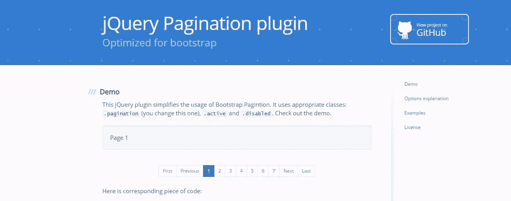
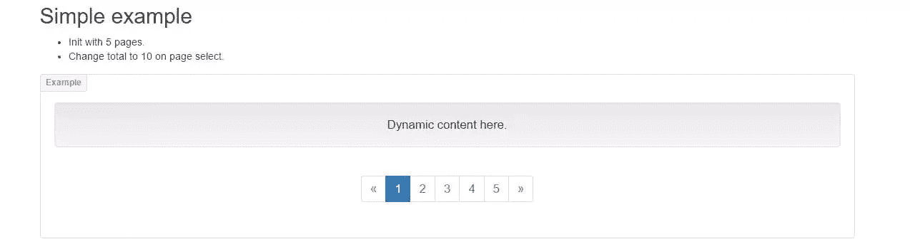
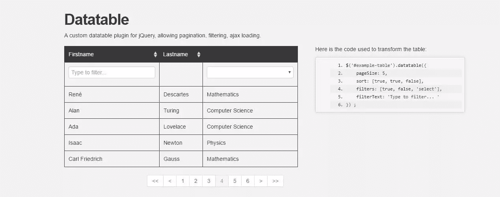
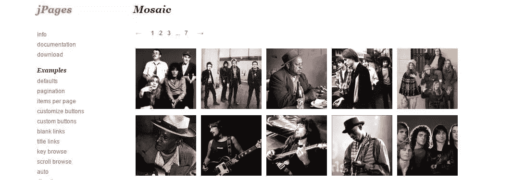
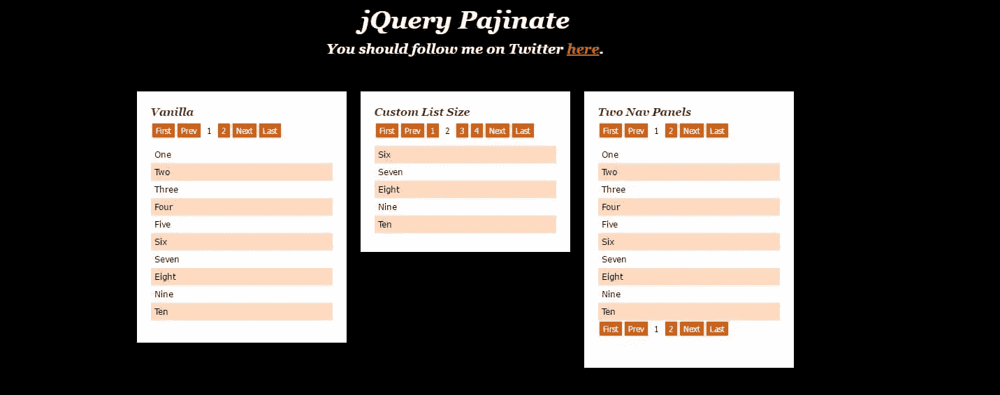

# jQuery 分页插件

> 原文：<https://www.sitepoint.com/jquery-pagination-plugins/>

这篇受欢迎的文章于 2017 年 2 月更新，以反映 jQuery 分页插件的当前状态。

呈现一个冗长、笨拙的结果列表通常不是展示信息的好方法。这就是为什么分页，特别是对于较长的内容，是非常重要的。

服务器端分页通常用于获取分页内容，显示一组分成页面的结果(通常带有唯一的 URL)。虽然这样做很好，但是客户端分页是另一种解决方案。让我们来看看一些基于 jQuery 的插件，您可以利用它们来创建分页结果。

## TWBS jQuery 分页



这个插件有助于为你的站点创建简单、有效和有用的分页。你所需要做的就是指定一个元素(最好是一个`ul`或`div`)，插件会处理剩下的事情。TWBS 需要 jQuery、插件本身以及可选的引导 CSS。

当您已经准备好数据，并且只是使用分页器来切换视图中的内容时，您可能会发现这很有用。您可以挂钩到`onPageClick`事件并确定加载哪个页面(或者可选地运行一个 Ajax 调用从您的数据库中提取结果)。无论哪种方式，这个插件都很简单，易于使用，并提供了几个配置选项来满足您的需求。

这个插件看起来很坚固，并且已经在几个版本中进行了[维护和更新(现在升级到版本 1.4.1)。这是一个很好的库，看起来将来会继续维护和扩展。](https://github.com/esimakin/twbs-pagination/releases)

*   [GitHub](https://github.com/esimakin/twbs-pagination)
*   [网站/文件](http://esimakin.github.io/twbs-pagination/)
*   [密码笔](http://codepen.io/SitePoint/pen/WprNwa)

## JQuery BootPag



jQuery Bootpag 允许您创建一个简单的分页控件。该插件有几个选项，例如控制下一个/上一个标签的能力和应用于控制器的各种类(例如在第一个、最后一个和后续页面元素上)

要启动并运行，您需要 jQuery、Bootstrap JS 和这个插件的 JS 文件。除非您打算自己设计样式，否则您可能还需要引导 CSS 文件。一旦你有了这些，你就可以监听在页面间导航时触发的`page`事件。

事件处理被请求的页面和事件本身。在这里，您可以获取内容或更改 DOM。另一个有用的元素是可以设置的`href`属性。设置这个属性可以让你添加一个锚链接到页面的 URL(例如`href: "#result-page-{{number}}"`)，这个链接将插件的内部页码添加到 URL。您可以随意命名，但是它对于创建数据集和维护状态非常有用。

您可能会发现这很有用，因为您可以检查您的 URL 是否包含特定的页面，然后将 Bootpag 初始化到该页面，而不是默认加载第一个页面；例如，如果有人直接导航到结果的第 7 页，则加载该页。

该插件自 2015 年年中以来一直没有更新，目前版本为 1.0.7。但是，它的工作方式与您预期的一样，并且提供了足够的选项，让您可以根据需要对其进行定制。

*   [GitHub](https://github.com/botmonster/jquery-bootpag)
*   [网站/文件](http://botmonster.com/jquery-bootpag/#.WKqanfl96Uk)
*   [密码笔](http://codepen.io/SitePoint/pen/jBWOMX)

## jQuery 数据表



jQuery Datatable(不要与几乎同名的 [DataTables](https://datatables.net/) 插件混淆)与我们看到的其他插件有些不同。这个插件为你的数据集创建一个分页的表格。您不仅可以在分页数据中导航，还可以根据字段进行筛选和排序。

要启动并运行，您需要将`datatable`和`datatable.jquery` JS 文件添加到您的项目中(目前似乎没有针对这些文件的实时 CDN)。这两者和 jQuery 都是启动和运行所必需的。

你还需要一个用于造型的自举或者你自己来设计。一个好的起点是我们的 CodePen，您可以从那里开始。

Datatable 提供了一系列选项，您可以根据需要进行调整。[文档](http://holt59.github.io/datatable/)很好地概述了只需调整设置就能完成的任务。

Datatable 的亮点在于其强大的高级配置，例如调整哪些列是可筛选的(以及如何筛选)。您可以使用`filters`选项来确定哪些列可以过滤以及如何过滤(文本输入、选择元素、正则表达式模式等)。

插件获取的数据直接来自表格。但是，您可以指定一个值/对象数组来填充该表。如果您要动态填充列表，这样就不会从 DOM 中收集值，这会很有帮助。还可以设置表的 Ajax 部分，使其指向一个特定的端点，并不断获取新信息(完美地确保表保持一致的状态)。

`onChange`事件也是有用的，它让你知道你要移动到哪个页面，以及你从哪里来。该插件处理表中数据的更新，但是您可以使用它来运行额外的功能或执行一些逻辑。

总的来说，Datatable 提供了一组相当强大的选项来帮助您显示、排序和分页数据集。插件库看起来会定期更新(当前版本是 v2.0)。提交的数量很大，从表面上看，每个版本都有所改进。

*   [网站](http://holt59.github.io/datatable/)
*   [GitHub](https://github.com/Holt59/datatable)
*   [密码笔](http://codepen.io/SitePoint/pen/vxLYyJ)

## jPages 插件



jPages 是一个不同风格的分页控件插件。

jPages 同时支持 [Animate.css](https://daneden.github.io/animate.css/) 和[惰性加载](http://www.appelsiini.net/projects/lazyload)。因为这是一个旧的插件，你需要测试每个插件的最新版本，看看它们是否还能工作。为了节省你的时间，[马赛克演示页面](http://luis-almeida.github.io/jPages/mosaic.html)内部链接到这个[版本的 Animate.css](http://luis-almeida.github.io/jPages/css/animate.css) ，而[惰性加载演示页面](http://luis-almeida.github.io/jPages/lazyload.html)链接到这个[版本的 lazyload.js](http://luis-almeida.github.io/jPages/js/jquery.lazyload.js)

考虑到它是一个较老的插件，jPages 的[文档相当不错。这些文档概述了您可以调整的各种属性以及要挂钩的事件。您可以调整设置，例如通过滚动](http://luis-almeida.github.io/jPages/documentation.html)控制分页的[，以及调整按钮](http://luis-almeida.github.io/jPages/scrollbrowse.html)的[文本组件，等等。](http://luis-almeida.github.io/jPages/customizebuttons.html)

要启动并运行一个基本示例，首先要包含 jPages JS 文件，然后创建一个基本的 HTML 结构，顶部是导航栏，后面是包含数据的辅助容器。这个插件查找 holder 元素，然后查找相邻的兄弟容器。

```
<div class="holder"></div>
<ul id="itemContainer">
    <li>...</li>
    <li>...</li>
    <li>...</li>
    <li>...</li>
    <li>...</li>
</ul> 
```

现在，您需要调用`jPages`函数进行设置，为分页控件及其关联的数据容器添加一个选择器。

```
//find the `.holder' class and the 'itemContainer' element with our data
$("div.holder").jPages({
   containerID : "itemContainer"
 }); 
```

作为一个较老的插件，它在 GitHub 上不可用。该插件的网站展示了几个例子，并概述了所有的属性/事件，你可以挂钩。如果你正在寻找一个最新的插件，那么这很可能不是它。这个插件擅长于创建可定制的分页块。有了这个插件，你可以创建表格，图库，甚至一个基本的滑块。

*   [网站](http://luis-almeida.github.io/jPages/)
*   [演示 1](http://luis-almeida.github.io/jPages/mosaic.html)
*   [演示 2](http://luis-almeida.github.io/jPages/table.html)

## jquery 分页



jQuery Pajinate 是一个较老的，但是仍然很强大的分页插件，您可以在您的站点中使用它。它的唯一目的是在一个容器中获取一长串元素，并将它们分布在几个“页面”上。它不同于我们的一些其他插件，因为它直接对内容进行排序/分页，而不需要你做任何调整。这可能是有益的，但也意味着如果不符合您的需求，您将需要对它进行更多的定制。

**注意**:作为一个较老的图书馆，有一些问题:

*   演示可能会抛出一个不安全的脚本错误。这是因为演示页面通过 HTTP 而不是 HTTPS 请求资源。当脚本加载时，它工作得很好(只是要注意警告)。
*   您需要坚持使用 jQuery 1xx 或 2xx，因为 jQuery 的 3xx 分支已经删除了库所依赖的功能。前两个中的任何一个都可以。

您需要从 GitHub 页面下载 jQuery Pajinate 脚本，并将其包含在您的项目中(和 jQuery 一起)。一旦有了这两个元素，就可以通过调用`pajinate()`方法来设置分页器。

默认情况下，插件会寻找某些元素来初始化。Pajinate 将试图找到一个元素，在那里它将附加它的导航元素，默认情况下寻找`page_navigation`元素。它还期望找到另一个包含内容的元素，默认情况下是寻找`content`元素。这些可以在调用`pajinate`时作为属性进行更改和设置。

下面是标记应该如何显示的一个基本示例

```
<div id="page_container">
    <div class="page_navigation"></div>        
    <ul class="content">
        <li> <p>One</p> </li>
        <li> <p>Two</p> </li>
        <li> <p>Three</p> </li>
        <li> <p>Four</p> </li>
        <li> <p>Five</p> </li>
        <li> <p>Six</p> </li>
        <li> <p>Seven</p> </li>
        <li> <p>Eight</p> </li>
    </ul>    
</div> 
```

以及相应的 JS

```
$('#page_container9').pajinate({
  num_page_links_to_display : 3,
  items_per_page : 6,
  wrap_around: true,
  show_first_last: false
}); 
```

您还可以设置其他几个有用的属性，例如要显示的项数和控件的标签。GitHub 页面底部的文档概述了您可以调整的属性。

总体来说是一个比较老的插件，已经好几年没有更新了(从 2013 年开始)。它在旧版本的 jQuery 上工作得很好，正因为如此，它应该用于遗留的站点构建(您知道您将停留在旧版本的 jQuery 上，但是您仍然需要添加某些功能)。

*   [GitHub / Docs](https://github.com/wesnolte/Pajinate)
*   [演示](https://dl.dropboxusercontent.com/u/4151695/html/pajinate/examples/example1.html)

*本文由 [Dominic Myers](http://dominicmyers.brandyourself.com/) 进行同行评审。感谢 SitePoint 的所有同行评审员使 SitePoint 的内容尽可能做到最好！*

## 分享这篇文章