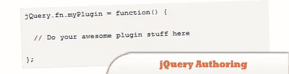
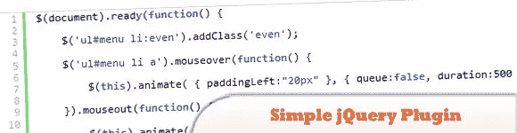
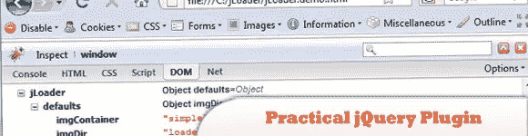
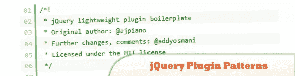
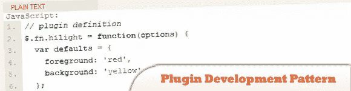

# 5 大 jQuery 插件创作指南

> 原文：<https://www.sitepoint.com/jquery-plugin-authoring-guides/>

jQuery 插件的开发在过去的几年里飞速发展。为什么不参与进来，创建自己的 jQuery 插件呢？在这篇文章中，我们分享了我们认为的**五大插件创作指南**以及其他。尽情享受吧！

## 1.插件/创作

这篇文章将概述基础知识、最佳实践和开始编写插件时要注意的常见陷阱。

  
[源+演示](http://docs.jquery.com/Plugins/Authoring)

## 2.一个非常简单的 jQuery 插件教程

你对我们的 JS 文件不满意吗，你总是觉得它很乱？在本教程中，学习如何编写一个 jQuery 插件来整理 JavaScript 文件。

  
[源+演示](http://www.queness.com/post/112/a-really-simple-jquery-plugin-tutorial)

## 3.创建实用 jQuery 插件的权威指南

了解如何从头开始一步一步地构建自己的 jQuery 插件；jQuery 让这项任务变得异常简单，它为我们提供了一种简单的方法来打包我们的脚本并公开它们的功能，并鼓励使用可伸缩和可重用的面向对象技术。

  
[来源](http://net.tutsplus.com/tutorials/javascript-ajax/the-definitive-guide-to-creating-a-practical-jquery-plugin/) [演示](http://d2o0t5hpnwv4c1.cloudfront.net/169_jQueryPlugin/jLoader%20Article%20-%20Source%20Files/jLoader/jLoader.demo.html)

## 4.基本 jQuery 插件模式

这种模式非常适合插件开发新手或者只想实现简单功能(比如实用插件)的开发人员。

  
[源+演示](http://coding.smashingmagazine.com/2011/10/11/essential-jquery-plugin-patterns/)

## 5.插件开发模式

这篇文章旨在分享我发现对插件创作特别有用的模式。

  
[源+演示](http://www.learningjquery.com/2007/10/a-plugin-development-pattern)

## 分享这篇文章