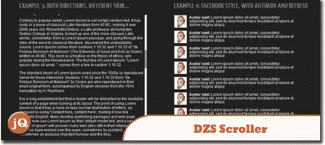
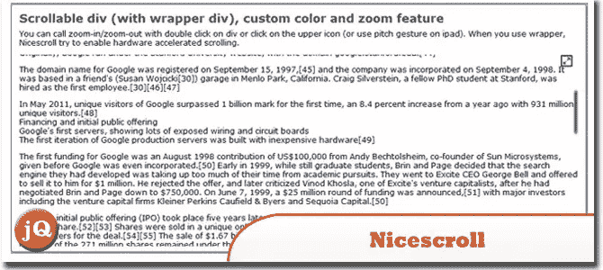
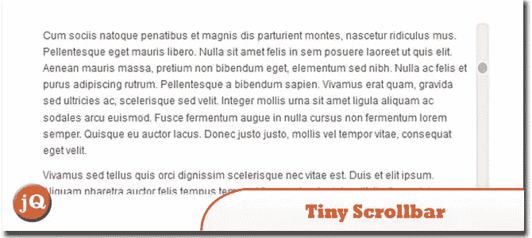
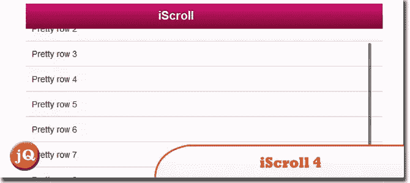
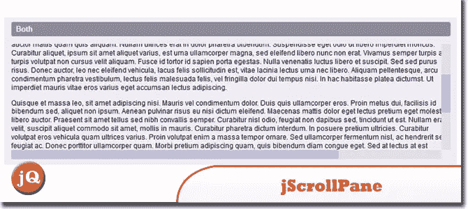

# 5 移动设备的 jQuery 滚动条

> 原文：<https://www.sitepoint.com/jquery-scrollbar-mobile-devices/>

自定义滚动条一直很受欢迎，正因为如此，我们在 jQuery 中为您提供了一系列时尚、灵活且易于使用的滚动条，这些滚动条在所有现代浏览器和移动设备上都能一致工作。玩得开心！

**相关帖子:**

*   [**10 jQuery 自定义滚动条插件**](http://www.jquery4u.com/plugins/10-jquery-custom-scrollbar-plugins/)
*   [**jQuery 检查是否存在垂直滚动**](http://www.jquery4u.com/snippets/jquery-check-vertical-scroll-present/)

## 1.DZS 滚动条 jQuery 滚动条做对了

DZS Scroller jQuery 是你网站的终极滚动条，如果包含的 3 个皮肤不够用，你可以通过 CSS 很容易地定制它。适用于 iPhone/iPad。
 
[来源](http://codecanyon.net/item/dzs-scroller-jquery-scrollbar-done-right/293380) [演示](http://codecanyon.net/item/dzs-scroller-jquery-scrollbar-done-right/full_screen_preview/293380)

## 2.尼斯卷轴

一个 jQuery(从 1.5 开始)插件，用于非常类似 iOS/mobile 风格的漂亮滚动条。它支持 div、IFrames 和文档页面(正文)滚动条。
 
[来源](http://areaaperta.com/nicescroll/) [演示](http://areaaperta.com/nicescroll/demo.html)

## 3.微小滚动条

是一个动态的轻量级工具，它为 web 设计者提供了一种增强网站用户界面的强大方法。iPhone，iPad，安卓支持！
 
[源+演示](http://baijs.nl/tinyscrollbar/)

## 4.iScroll 4

对原始 iScroll 代码的完全重写。脚本开发之所以开始，是因为 mobile webkit(在 iPhone、iPad、Android 上)不提供在固定宽度/高度元素内滚动内容的原生方式。
 
[来源](http://cubiq.org/iscroll-4) [演示](http://lab.cubiq.org/iscroll/examples/simple/)

## 5.jScrollPane

由于为浏览器实现的普通滚动条在 iPad 上不工作，我们可以使用 jQuery 插件 JScrollPane 来实现它。
 
[来源](http://www.mindfiresolutions.com/Using-jQuery-Plugin-to-implement-scrollbar-in-iPad-1126.php) [演示](http://jscrollpane.kelvinluck.com/basic.html)

## 分享这篇文章