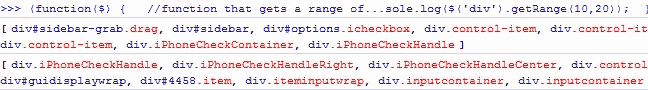

# jQuery 选择特定类的前 x 个项目

> 原文：<https://www.sitepoint.com/jquery-select-items-specific-class/>

我写了一个小的 **jQuery 函数调用。getRange()，它根据 jQuery 选择器返回特定数量的 DOM 元素**(即基于指定类或 id 的元素)。它使用 jQuery.get()函数，基本上是该函数的扩展，但允许返回一系列元素。

首先，你应该知道像这样得到第一个和最后一个元素:

```
var firstSpan = $('span.class:first'),
    lastSpan = $('span.class:last');
```

要获取与指定类匹配的所有元素，如下所示:

```
var allSpans = $('span.class').get();
```

或者像这样的第 n 个元素:

```
var firstSpan = $('span.class').get(0),
    secondSpan = $('span.class').get(1);
    //etc...
```

但是如何得到前 10 个元素或 10-20 个元素呢？

最好是这样:

```
var mySpans = $('span.class').get(0,10);
```

不幸的是。get()函数不允许传递一个范围，而只允许传递一个索引。

所以这里是我使用 jQuery 的尝试。get()函数来包含一系列元素。

 `(function($)
{
//根据 jQuery 选择器
//返回 dom 元素数组的函数
$ . fn . getrange = function(start，end)
{
var elems =[]；
for(var I = start；i < =结束；i++){ elems . push(this . get(I))；}返回 elems};//测试 console.log($('div ')。getRange(1，10))；console.log($('div ')。getRange(10，20))；})(jQuery)；[/js]输出:

它以这种方式工作，但我认为这不是一个最佳的解决方案，所以有人知道更好的方法来实现这一点吗？` 

## `分享这篇文章`