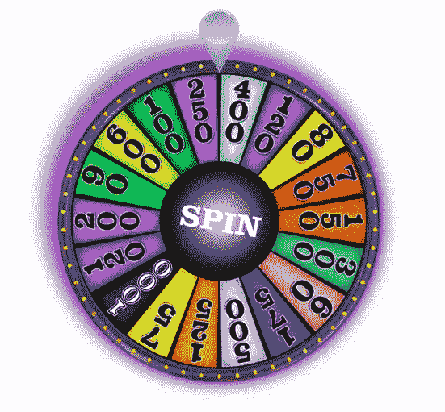

# jQuery 幸运之轮演示

> 原文：<https://www.sitepoint.com/jquery-wheel-fortune-demo/>

只是幸运之轮的一个快速演示。随机旋转动画幸运轮与赢/输实现。

**注意:**为了更好地测试下面的演示，请在 [jsfiddle](https://jsfiddle.net/jquery4u/sNYYD/show/) 中打开它。

[https://jsfiddle.net/jquery4u/sNYYD/show/](https://jsfiddle.net/jquery4u/sNYYD/show/)

## 要求:

*   [jQuery](https://jquery.com)
*   [Transit.js](https://ricostacruz.com/jquery.transit/)

[演示](https://jsfiddle.net/jquery4u/sNYYD/show/) [代码](https://jsfiddle.net/jquery4u/sNYYD/)

## 代码 jQuery

```
window.WHEELOFFORTUNE = {

    cache: {},

    init: function () {
        console.log('controller init...');

        var _this = this;
        this.cache.wheel = $('.wheel');
        this.cache.wheelMarker = $('.marker');
        this.cache.wheelSpinBtn = $('.wheel'); //im using the wheel as the spin button but simply change this to a button if you want.

        //mapping is backwards as wheel spins clockwise //1=win
        this.cache.wheelMapping = [400, 120, 80, 750, 150, 300, 60, 175, 500, 125, 75, 1000, 120, 200, 90, 600, 100, 250].reverse();

        this.cache.wheelSpinBtn.on('click', function (e) {
            e.preventDefault();
            if (!$(this).hasClass('disabled')) _this.spin();
        });

        //reset wheel
        this.resetSpin();

        //setup prize events
        this.prizeEvents();
    },

    spin: function () {
        console.log('spinning wheel');

        var _this = this;

        // reset wheel
        this.resetSpin();

        //disable spin button while in progress
        this.cache.wheelSpinBtn.addClass('disabled');

        /*
            Wheel has 10 sections.
            Each section is 360/10 = 36deg.
        */
        var deg = 1500 + Math.round(Math.random() * 1500),
            duration = 6000; //optimal 6 secs

        _this.cache.wheelPos = deg;

        //transition queuing
        //ff bug with easeOutBack
        this.cache.wheel.transition({
            rotate: '0deg'
        }, 0)
            .transition({
            rotate: deg + 'deg'
        }, duration, 'easeOutCubic');

        //move marker
        _this.cache.wheelMarker.transition({
            rotate: '-20deg'
        }, 0, 'snap');

        //just before wheel finish
        setTimeout(function () {
            //reset marker
            _this.cache.wheelMarker.transition({
                rotate: '0deg'
            }, 300, 'easeOutQuad');
        }, duration - 500);

        //wheel finish
        setTimeout(function () {
            // did it win??!?!?!
            var spin = _this.cache.wheelPos,
                degrees = spin % 360,
                percent = (degrees / 360) * 100,
                segment = Math.ceil((percent / 6)),  //divided by number of segments
                win = _this.cache.wheelMapping[segment - 1]; //zero based array

            console.log('spin = ' + spin);
            console.log('degrees = ' + degrees);
            console.log('percent = ' + percent);
            console.log('segment = ' + segment);
            console.log('win = ' + win);

            //display dialog with slight delay to realise win or not.
            setTimeout(function () {
                alert('you won '+win+'!');
            }, 700);

            //re-enable wheel spin
            _this.cache.wheelSpinBtn.removeClass('disabled');

        }, duration);

    },

    resetSpin: function () {
        this.cache.wheel.transition({
            rotate: '0deg'
        }, 0);
        this.cache.wheelPos = 0;
    }

}

window.WHEELOFFORTUNE.init();
```

## 代码–CSS

```
.wheel-wrap {
    position: relative;
    width: 550px;
    height: 550px;
    overflow: hidden;
    margin: 0 auto;
    z-index: 1;
}
.marker {
    top: 10px;
    left: 250px;
    z-index: 2;
    position: absolute;
}
.wheel {
    top: 90px;
    left: 75px;
    width: 550px;
    z-index: 1;
}
```

## 代码–HTML

```
 
     
```

[](https://jsfiddle.net/jquery4u/sNYYD/show/)

## 分享这篇文章