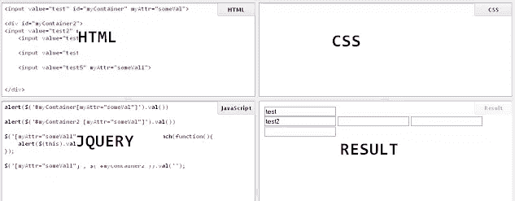

# 免费 jQuery 在线编辑器

> 原文：<https://www.sitepoint.com/js-fiddle-online-editor-jquery/>

我偶然发现了一个很酷的在线 jQuery 编码编辑器。它叫 JSFiddle，你可以在分屏窗口中输入你的 html、css 和 JavaScript/jQuery 代码，它会给你结果。

这对于那些使用新系统(不在他们自己的系统上)并且只想测试一些代码的人来说非常方便。在不同版本的 jQuery 包和资源之间测试代码也非常方便。

除了 jQuery，它还支持 Mootools、Prototype、YUI、Glow、DOJO 和其他一些工具。

[JS 拨弄示例](https://jsfiddle.net/mqrMk/1/)

## 分享这篇文章