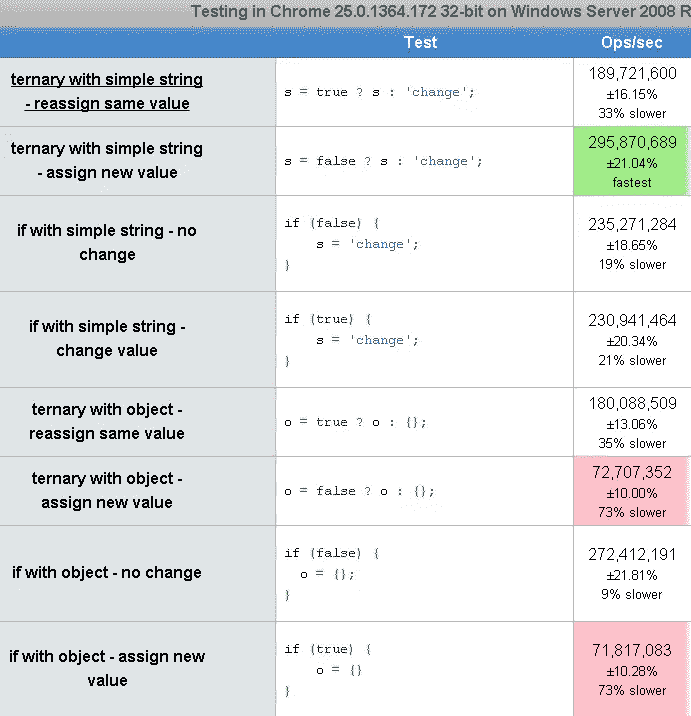
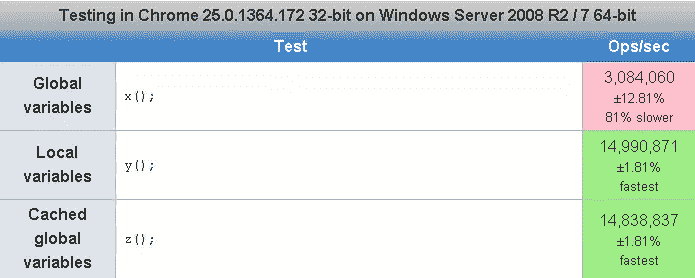
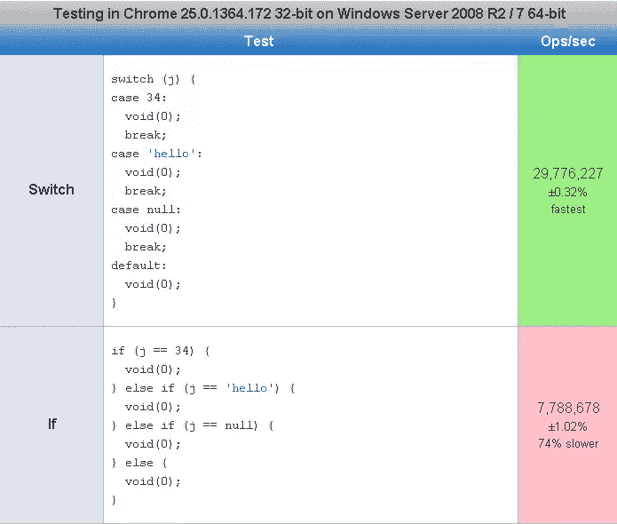
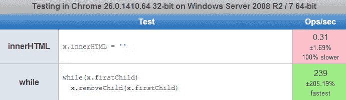

# 最佳 jsperf(2000-2013)——第 3/3 部分

> 原文：<https://www.sitepoint.com/jsperf3/>

jsperf 的第 3 部分。尽情享受吧！

*   [第 1 部分——jQuery 选择器、JavaScript 字符串、JavaScript DOM 缓存/DOM 遍历](http://www.jquery4u.com/testing/jsperf1/)
*   [第二部分——jQuery Each/Loops、jQuery AJAX、jQuery Animation/CSS、JavaScript 模板](http://www.jquery4u.com/testing/jsperf2/)
*   [第 3 部分–各种速度测试(其他测试中最好的！)](http://www.jquery4u.com/testing/jsperf3/)

## 杂项速度测试

### jQuery 链接

测试链接 jQuery 函数调用是否明显快于单独调用。链接对代码性能影响不大
[](http://jsperf.com/jquery-chaining)

### 三元运算符

检查哪个更快，将相同的值/对象重新分配给一个变量，或者用 if 改变它的值。参见 [JavaScript 速记技巧](http://www.jquery4u.com/javascript/shorthand-javascript-techniques/)来提高你的速记知识。
T3

### 全局变量与局部变量

不使用全局变量的另一个原因。
[](http://jsperf.com/global/2)

### 未定义 Try/Catch 错误检查

### If 与开关的关系

比较 if 和 switch 语句。切换更快？
[](http://jsperf.com/ifswitch/4)

### 进一步了解 jQuery $。空()

[
](http://jsperf.com/jqempty)

```
//Empty function from jQuery 1.9
    empty: function() {
        var elem,
            i = 0;

        for ( ; (elem = this[i]) != null; i++ ) {
            // Remove element nodes and prevent memory leaks
            if ( elem.nodeType === 1 ) {
                jQuery.cleanData( getAll( elem, false ) );
            }

            // Remove any remaining nodes
            while ( elem.firstChild ) {
                elem.removeChild( elem.firstChild );
            }

            // If this is a select, ensure that it displays empty (#12336)
            // Support: IE<9
            if ( elem.options && jQuery.nodeName( elem, "select" ) ) {
                elem.options.length = 0;
            }
        }

        return this;
    },
```

## 其他有趣的 jsperfs

*   史上最慢的东西对史上最快的东西 http://jsperf.com/o
*   获得时间戳 http://jsperf.com/currts 的两种方法
*   很好的概述了$的速度。map()函数 http://jsperf.com/map/2
*   好好看看 http://jsperf.com/md5-shootout 不同的 MD5 安全加密方法
*   数字格式 1，000，000 http://jsperf.com/number-format
*   切片 vs 子串 vs 子串——几乎相同的 http://jsperf.com/slice-vs-substring-vs-substr

## 分享这篇文章