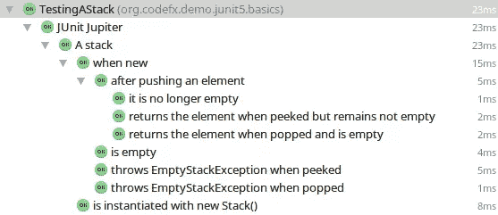

# JUnit 5 国情咨文

> 原文：<https://www.sitepoint.com/junit-5-state-of-the-union/>

JUnit 5 已经开发了大约 14 个月，原型已经有一年了。是时候总结一下到目前为止发生的事情，项目的进展情况，以及它的发展方向了。

所有技术细节都基于当前的 JUnit 版本， [milestone 2](https://github.com/junit-team/junit5/releases/tag/r5.0.0-M2) 。你会在官方用户指南中找到更多信息，有单独版本的[里程碑 2](http://junit.org/junit5/docs/5.0.0-M2/user-guide/) 和[最新版本](http://junit.org/junit5/docs/snapshot/user-guide/)，或者在[我的博客](http://blog.codefx.org)上，我在那里写了[一个关于 JUnit 5](http://blog.codefx.org/tag/junit-5/) 的系列文章，每当有新的里程碑发布时我都会更新。

## 《太空堡垒 JUnit》前情提要

为什么选择 JUnit 5？为什么不是 4.13，这个一直在酝酿中的版本呢？两个半原因…

### 再见，朱尼特 4 号

JUnit 的成功部分来自其强大的工具支持，为此工具创建者甚至使用反射(下至私有字段)来访问 API 不会提供的信息。这将工具绑定到实现细节上，反过来使得 JUnit 的维护者很难改进它——没有人喜欢破坏下游项目。这是 JUnit 的进步基本停滞的一个重要原因。

然后还有[跑者](https://github.com/junit-team/junit4/wiki/test-runners)和[规则](https://github.com/junit-team/junit4/wiki/Rules)。它们是为了扩展 JUnit 而创建的，在这方面做得很好——不错，但并不出色。运行者是一个重量级的概念，人们必须管理整个测试生命周期。但更糟糕的是，你一次只能用一个跑步者——这是一个非常严格的限制。这就是 4.7 引入规则的原因。虽然简单得多，而且大部分都是可组合的，但它们还有其他缺点——也就是说，它们仅限于某些类型的行为，这可以最好地概括为之前/之后。

最后也是最不重要的是 Java 版本。现在每个人都想玩 lambdas，让 JUnit 4 要求 Java 8 会很难被接受。

### 你好，JUnit 5

因此在 2015 年，一个团队围绕着完全重写的想法成立了。起初这个项目被命名为“JUnit Lambda ”,在“T2”进行了一次成功的众筹活动,“T3”筹集到了足够的资金和雇主赞助，可以全职工作六个月。研讨会、原型、alpha 版本和两个里程碑接踵而至，自今年早些时候以来，该项目被称为 *JUnit 5* 。到目前为止，资金已经用完了，它的开发就像许多其他伟大的开源项目一样:由敬业的人们在一天的第一个和最后一个小时的空闲时间里完成。

该团队目前正在完成第三个里程碑，并计划在考虑发布候选之前再完成至少两个里程碑。但是我们会回来的。让我们先看看目前我们手里有什么。

## 它看起来像什么？

我不打算详细介绍新的 API，而是让您想象一个完整的 JUnit 4 测试，其中包含 API 提供的所有花招。以下是 JUnit 5 与此相比的不同之处:

*   测试类和方法可以是包可见的。
*   [接口默认方法](http://blog.codefx.org/java/everything-about-default-methods/)可以是测试方法。
*   `@Test`不再带参数。预期的异常和超时是通过断言实现的。
*   您可以使用`@TestFactory`带注释的方法在运行时动态地创建测试(稍后会详细介绍)。
*   生命周期注解有了新的名字:
    `@Before`变成了`@BeforeEach``@BeforeClass`现在是`@BeforeAll`；同样适用于`@After...`。
*   `@Ignore`改为`@Disabled`。
*   在断言中，失败消息排在最后，可以延迟创建。
*   一个新的断言`assertAll`执行给定的检查并总是报告所有结果，即使一些断言失败。
*   `@Nested`可用于在内部类中运行测试。
*   给测试分配人类可读的名称。
*   运行器和规则消失了，取而代之的是一个新的扩展机制，它与本机 API 无缝集成(稍后将详细介绍)。
*   测试可以有参数，其中实例是由扩展创建的(同样，稍后)。

总而言之，这是一个测试类可能的样子:

```
@DisplayName("Some example test cases")
class ExampleTests {

    @BeforeAll
    static void initAll() { }

    @BeforeEach
    void init() { }

    @Test
    @DisplayName("Custom test name containing spaces")
    void succeedingTest() { }

    @Test
    void groupedAssertions() {
        // In a grouped assertion all assertions are executed, and any
        // failures will be reported together.
        assertAll("address",
            () -> assertEquals("John", address.getFirstName()),
            () -> assertEquals("User", address.getLastName())
        );
    }

    @Test
    @DisplayName("😱")
    @Disabled("for demonstration purposes")
    void skippedTest() {
        // not executed
    }

    @Test
    @CoolInstanceProvider
    void testWithParameters(MyCoolClass coolInstance) {
        // do something with 'coolInstance'
    }

    @TestFactory
    Collection<DynamicTest> dynamicTestsFromCollection() {
        return Arrays.asList(
            dynamicTest("1st dynamic test", () -> assertTrue(true)),
            dynamicTest("2nd dynamic test", () -> assertEquals(4, 2 * 2))
        );
    }

    @AfterEach
    void tearDown() { }

    @AfterAll
    static void tearDownAll() { }

    @DisplayName("Some nested test cases")
    class NestedTest {

        @Test
        @DisplayName("╯°□°）╯")
        void failingTest() {
            fail("a failing test");
        }

    }
} 
```

至于`@Nested`和`@DisplayName`，这是运行[一个 IntelliJ 2016.2 中 JUnit 团队写的例子](http://junit.org/junit5/docs/5.0.0-M2/user-guide/#writing-tests-nested)的样子:



不错吧？更多信息请看用户指南或我的[帖子，内容涵盖基础知识](http://blog.codefx.org/libraries/junit-5-basics/)。

## 怎么用？

要开始编写测试，你所要做的就是在你的项目中包含 API 工件
`org.junit.jupiter:junit-jupiter-api:5.0.0-M2`。不幸的是，运行测试有点复杂…

### 5 月

对于任何严肃的测试框架来说，本机 IDE 支持都是必不可少的。JUnit 5 还没有发布，但考虑到它甚至还没有正式发布，这是可以理解的。

*   **IntelliJ** ，[自 2016.2](https://blog.jetbrains.com/idea/2016/08/using-junit-5-in-intellij-idea) 起，内置支持功能运行良好。
*   Eclipse 团队开始着手于此——参见 JUnit 的中的[和 Eclipse 的](https://github.com/junit-team/junit5/issues/217) bug 追踪器中的[中的相应问题。](https://bugs.eclipse.org/bugs/show_bug.cgi?id=488566)
*   **NetBeans** 没有支持，我甚至[都找不到问题](https://netbeans.org/bugzilla/buglist.cgi?no_redirect=1&quicksearch=junit+5)。

### 构建工具

原生构建工具支持呢？JUnit 团队实现了[一个 Maven Surefire 提供程序和一个 Gradle 插件](http://junit.org/junit5/docs/5.0.0-M2/user-guide/#build-support)，但这些只是概念证明。为了完全集成和测试它们，团队希望各自的项目接管这些代码库。

*   对于 Maven 来说，这个过程是由 T2 在 Apache 许可下重新许可源代码开始的。[阿帕奇 JIRA 的一个问题](https://issues.apache.org/jira/browse/SUREFIRE-1206)追踪进度。
*   我在 JUnit 项目上没有看到任何与 Gradle 相关的活动，也没有[发现与 JUnit 5 相关的问题。](https://issues.gradle.org/issues/?jql=text%20~%20junit%20ORDER%20BY%20updated%20DESC)

### 后退

这种情况有点令人不满意，但幸运的是还有其他选择。一种是简单地将所有 JUnit 5 测试打包到一个 JUnit 4 测试套件中，并依赖 JUnit 4 支持:

```
@RunWith(JUnitPlatform.class)
@SelectPackages({ "my.test.package" })
public class JUnit5TestSuite { } 
```

有关设置详情，请参见[用户指南](http://junit.org/junit5/docs/5.0.0-M2/user-guide/#running-tests-junit-platform-runner)。

另一个选择是控制台启动器。同样，[查看用户指南](http://junit.org/junit5/docs/5.0.0-M2/user-guide/#running-tests-console-launcher)开始使用，如果遇到问题，查看[我的 JUnit 设置帖子](http://blog.codefx.org/libraries/junit-5-setup/#Command-Line-For-The-Win)。完成后，您可以运行如下测试:

```
junit-platform-console -p -p target/classes/:target/test-classes -a 
```


## 外层空间

现在您已经知道如何编写和运行 JUnit 5 测试，让我们超越基础知识，看一看更多的高级主题。

### 动态测试

动态测试是 JUnit 5 中的新概念。它们允许在运行时轻松创建测试，工具会将这些测试识别为完整的测试用例。

一个例子很好地解释了这一点。假设您有一个方法`testPoint(Point p)`，它在给定点上断言一些东西，并且您想要对许多点运行那个测试。你可以写一个简单的循环:

```
@Test
void testPoints() {
    getTestPoints().forEach(this::testPoint);
} 
```

这有一个很大的缺点，虽然从概念上来说，这是许多测试，但对 JUnit 来说，这只是一个测试。第一个不良后果是，一旦第一个测试失败，所有其他测试都不会执行。另一个问题是，工具，尤其是 ide，会将此报告为单个测试，这也是不理想的。

JUnit 5 给了我们一条出路。测试代码可以包装到运行时创建的`DynamicTest`实例中。返回它们的方法可以用新的`@TestFactory`注释进行注释，JUnit 将调用它们，将创建的测试插入到测试计划中，并执行它们。

```
@TestFactory
Stream<DynamicText> testingPoints() {
    return getTestPoints()
        .stream()
        .map(p -> dynamicTest("Testing " + p, () -> pointTest(p)));
} 
```

干净利落。如果你真的想，你可以使用动态测试来用 lambda 表达式编写测试

### 扩展模型

我已经提到了 JUnit 4 的运行程序和规则。它们不见了，取而代之的是扩展点，第三方代码可以与之交互。这就是工作原理。

#### 扩展点

对于测试生命周期中的大多数步骤，都存在一个扩展点:

*   测试实例后处理器
*   在所有回调之前
*   测试和容器执行条件
*   每次回电前
*   参数分辨率
*   测试执行前
*   测试执行后
*   异常处理
*   每次回调后
*   毕竟回调

对于这些扩展点中的每一个都存在一个接口，由于这些点非常集中，所以接口非常简单。这是每次回调前的一个问题:

```
public interface BeforeEachCallback extends Extension {

    void beforeEach(TestExtensionContext context) throws Exception;

} 
```

我已经指出测试可以有参数。因为 JUnit 不知道如何创建`MyCoolClass`的实例，所以扩展必须提供它们。这里是扩展点:

```
public interface ParameterResolver extends Extension {

    boolean supports(
            ParameterContext parameterContext, ExtensionContext extensionContext)
            throws ParameterResolutionException;

    Object resolve(
            ParameterContext parameterContext, ExtensionContext extensionContext)
            throws ParameterResolutionException;

} 
```

对于每个参数，JUnit 将在每个注册的扩展上调用`support`，如果其中没有一个返回`true`则抛出异常，否则请求一个扩展解析参数。

作为概念的证明，该团队编写了一个 Mockito 扩展，它模仿用`@Mock`标记的参数。它可以按如下方式使用:

```
void myCoolClassTest(@Mock MyCoolClass instance) {
    // ...
} 
```

#### 编写扩展

要创建一个扩展，您只需实现与您想要交互的扩展点相对应的接口，并向 JUnit 注册您的类。在测试执行过程中，JUnit 将在每个扩展点暂停，将所有相关信息收集到一个`ExtensionContext`实例中，并调用在该点注册的所有扩展。

扩展上下文提供了对许多有趣事物的访问，例如测试类或方法如 [`AnnotatedElement` s](http://docs.oracle.com/javase/8/docs/api/java/lang/reflect/AnnotatedElement.html) ，所以扩展可以反映它们。然后就是`ExtensionStore`。因为 JUnit 对跟踪扩展实例不感兴趣，所以不能保证它们的生命周期。因此，扩展类应该是无状态的，可以使用存储来保存信息。另一个有趣的方面是`TestReporter`，它允许扩展(和测试)以一种外部工具可以轻松获取的方式发布消息。

总而言之，简单报告测试运行时间的基准扩展如下所示:

```
class SimpleBenchmarkExtension
        implements BeforeTestExecutionCallback, AfterTestExecutionCallback {

    // we need a namespace to access the store and a key to persist information
    private static final Namespace NAMESPACE = Namespace
            .create("com", "sitepoint", "SimpleBenchmarkExtension");
    private static final String LAUNCH_TIME_KEY = "LaunchTime";

    @Override
    public void beforeTestExecution(TestExtensionContext context) {
        storeNowAsLaunchTime(context);
    }

    @Override
    public void afterTestExecution(TestExtensionContext context) {
        long launchTime = loadLaunchTime(context);
        long elapsedTime = currentTimeMillis() - launchTime;
        report(context, elapsedTime);
    }

    private static void storeNowAsLaunchTime(ExtensionContext context) {
        context.getStore(NAMESPACE).put(LAUNCH_TIME_KEY, currentTimeMillis());
    }

    private static long loadLaunchTime(ExtensionContext context) {
        return context.getStore(NAMESPACE).get(LAUNCH_TIME_KEY, long.class);
    }

    private static void report(ExtensionContext context, long elapsedTime) {
        String message = String
                .format("Test '%s' took %d ms.", context.getDisplayName(), elapsedTime);
        // 'publishReportEntry' pipes key-value pairs into the test reporter
        context.publishReportEntry(singletonMap("Benchmark", message));
    }

} 
```

#### 注册扩展

我解释了如何注册扩展。但是这里藏着一个很酷的功能！阅读[我关于扩展](http://blog.codefx.org/design/architecture/junit-5-extension-model/#Custom-Annotations)的帖子，了解如何让你的扩展看起来如下:

```
@Benchmark
@Test
void test() {
    // ...
} 
```

### 体系结构

快速进入架构，这真的很有趣。为了将测试人员、扩展开发人员和工具的关注点分开，并允许其他测试框架从 JUnit 强大的工具支持中受益(嗯，现在还没有，但将来会有), JUnit 5 分为三个子项目:

*   JUnit Jupiter 提供了我们到目前为止讨论过的 API 和一个发现并运行测试的引擎。
*   **JUnit Vintage** 对 JUnit 3/4 进行了调整，使其能够在 JUnit 5 的新架构中运行，这意味着它还提供了一个引擎。
*   JUnit 平台是奇迹发生的地方。它为指导测试执行的工具提供了一个 API，当它被调用时，它定位测试引擎(就像上面的两个)，将指令转发给它们，并让它们做自己的事情。

首先，这使得在相同的机制中运行 JUnit 3、4 和 5 测试变得容易。但是包含引擎 API 的平台和引擎实现之间的分离也允许将各种测试框架集成到 JUnit 机制中。假设存在一个 TestNG 引擎，结果是这样的:


这是一件大事！创建一个新的测试框架是一场艰苦的战斗，因为采用依赖于工具支持，而工具支持依赖于采用。现在框架可以打破这种恶性循环了！他们可以实现 JUnit 引擎，并从第一天起就获得许多工具的全面支持。

这可能会产生新一代的测试框架！

## 从这里开始的路

JUnit 的状态非常好，已经可以用来替代 vanilla JUnit 4。但是，根据帕累托原则，在它准备好满足所有用例之前，还有一些工作要做。

### 正在进行的讨论

很多很有意思的话题都在讨论！

#### JUnit 4 兼容性

为现有的 JUnit 4 规则创建适配器不是很好吗？这使得将测试迁移到 JUnit Jupiter 的 API(而不是仅仅在 JUnit 5 中运行它们)变得更加容易。问题 [#433](https://github.com/junit-team/junit5/issues/433) 正是在探索这一点。但是代码并不是一个项目能产生的唯一好东西。第 [#169](https://github.com/junit-team/junit5/issues/169) 和 [#292](https://github.com/junit-team/junit5/issues/292) 期旨在提供一个良好的 4 到 5 点的迁移指南。

#### 扩展模型

我个人认为动态测试缺少了一些东西。扩展能和这个功能交互就太好了！一种方法是扩展点，第三方库可以将动态创建的测试注入到扩展点中。例如，他们可以想出有趣的 API 来参数化测试。空谈不值钱。尽管如此，我还是创建了[一个问题](https://github.com/junit-team/junit5/issues/371)和[一个该特性的原型实现](https://github.com/junit-team/junit5/pull/530)。我希望它将在里程碑 4 的开发过程中得到研究。

另一个细节是，虽然测试工厂方法是整个生命周期的一部分，但是它们创建的动态测试不是。这意味着回调或参数解析之前和之后对动态测试不起作用。这是由[跟踪的一个问题](https://github.com/junit-team/junit5/issues/378)，我相信在发布之前会找到解决方案。

目前也无法与木星的线程模型进行交互。对于希望将测试推到其他线程上的扩展来说，这是一个问题，例如，为了确保 Swing 或 JavaFX 测试分别在事件分派线程或应用程序线程上运行。有几个问题解决这个问题: [#16](https://github.com/junit-team/junit5/issues/16) ， [#20](https://github.com/junit-team/junit5/issues/20_) ， [#157](https://github.com/junit-team/junit5/issues/157)

其他有趣的话题:

*   扩展点…
    *   发现后编辑测试计划， [#276](https://github.com/junit-team/junit5/issues/276)
    *   要更改测试结果， [#542](https://github.com/junit-team/junit5/issues/542)
*   全球扩展注册管理机构， [#448](https://github.com/junit-team/junit5/issues/448)
*   字段扩展， [#497](https://github.com/junit-team/junit5/issues/497)
*   用于编程扩展管理的 API， [#506](https://github.com/junit-team/junit5/issues/506)

#### 场景测试

一个很大的话题是场景测试，这是 JUnit 对在公共状态下有序操作的测试的命名法(由 [#48](https://github.com/junit-team/junit5/issues/48) 跟踪)。TestNG 已经提供了这一点，这也是人们离开 JUnit 的一个重要原因。嗯*是*的一个原因。

假设我们有一个封装了 REST API 的类。对于场景测试，我们可以让第一个测试创建一个实例，第二个测试初始化它，第三个测试登录一个用户，等等。这种状态从一次测试到另一次测试都保持不变，而那些人正在以一种为下一次测试做准备的方式改变它。

#### 其他人

这里有几个其他有趣的想法:

*   启动器检测引擎能力的机制， [#90](https://github.com/junit-team/junit5/issues/90)
*   对开发人员编写的测试代码进行健全性检查
*   控制台启动器上的许多改进，[搜索过滤器](https://github.com/junit-team/junit5/issues?utf8=%E2%9C%93&q=is%3Aissue%20is%3Aopen%20consolelauncher)
*   更灵活的线程模型，例如并行测试、[搜索过滤器](https://github.com/junit-team/junit5/issues?utf8=%E2%9C%93&q=is%3Aopen%20is%3Aissue%20label%3Aconcurrency%20)

### 更多里程碑

那么接下来几个月的计划是什么？在接下来几周的某个时候，milestone 3 将会发布，它主要关注与 JUnit 4 的互操作性和一个改进的工具 API。之后，又安排了两个里程碑，第四个关注参数化测试、增强的动态测试和文档，第五个关注场景测试、重复测试和用户定义线程中的测试执行。

## 摘要

我们快速浏览了一下将要编写测试的 API，发现它与 JUnit 4 相似，但包含了许多深思熟虑的附加内容。最值得注意的是对嵌套测试的内置支持、人类可读的显示名称和动态创建的测试。扩展模型非常有前途，将 JUnit 5 分为 Jupiter、Vintage 和 Platform 的架构非常棒，一旦其他测试框架实现了一个引擎，就为它们提供了完整的工具支持。

在软件方面，我们回顾了 JUnit 5 背后的历史，并花了一些时间讨论了工具支持的当前状态，除了 IntelliJ 之外，它仍然缺乏。我们最后看了一些正在进行的讨论和未来的发展，我认为这是令人兴奋的，因为它们是有希望的。我迫不及待地想看到 JUnit 5 GA 的发布——希望在 2017 年的某个时候。

## 分享这篇文章