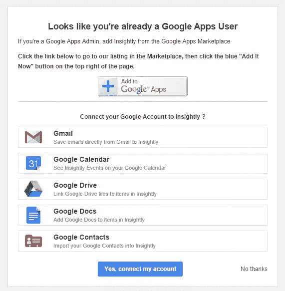
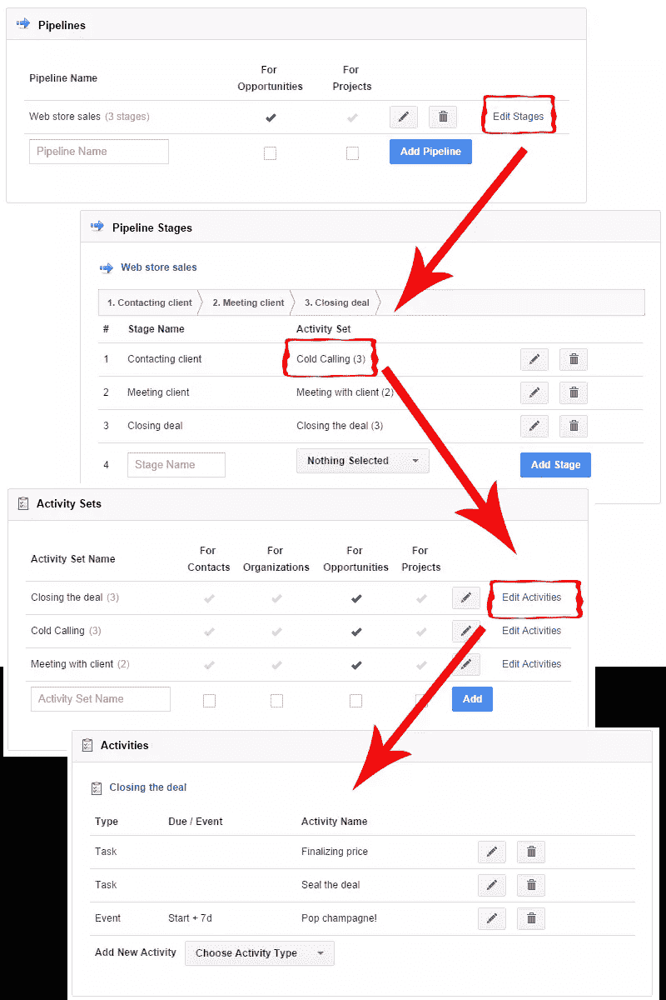
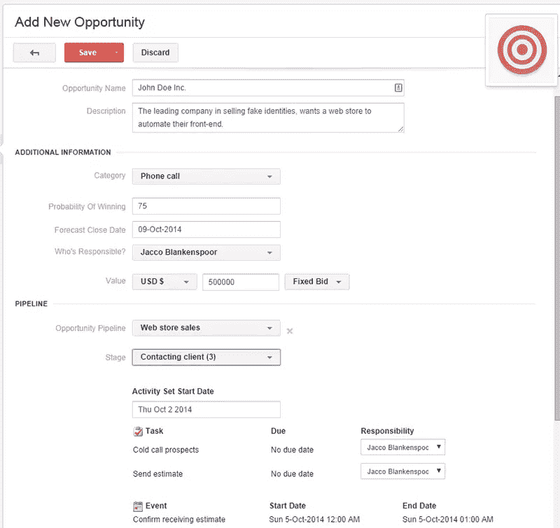
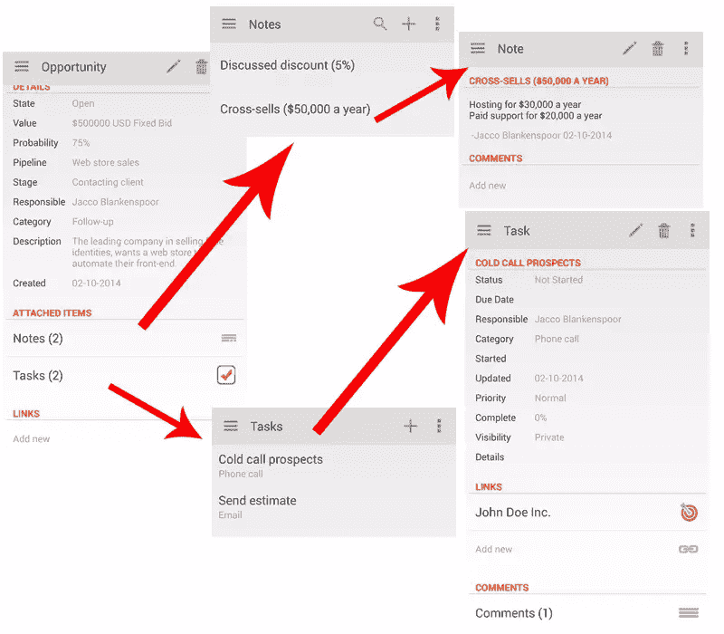
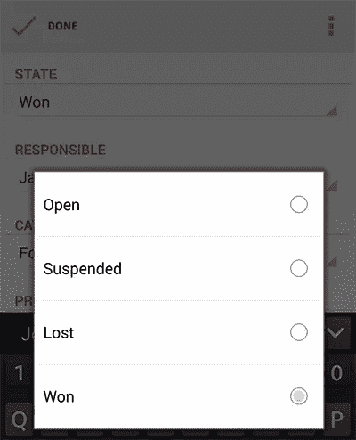
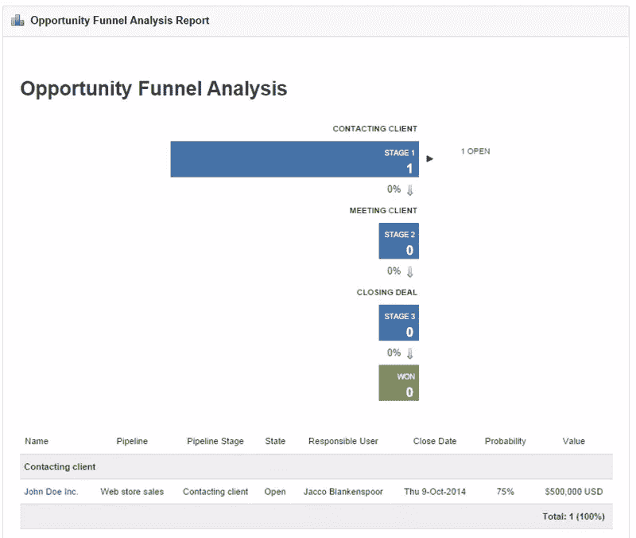
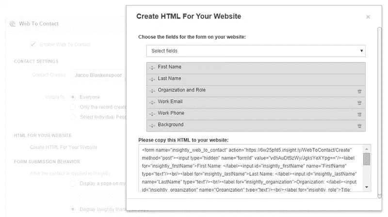
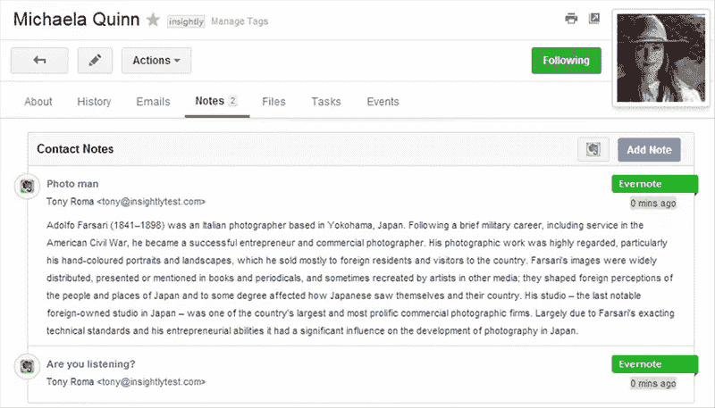
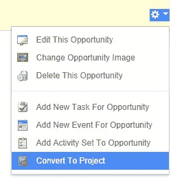
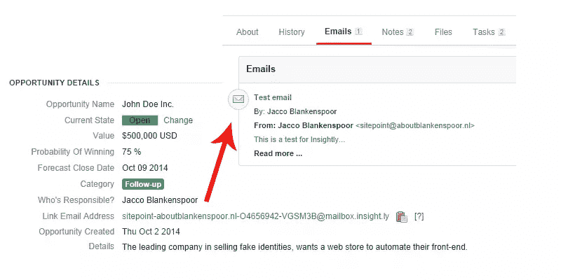

# 保持你的销售漏斗不漏，即使在移动中

> 原文：<https://www.sitepoint.com/keep-sales-funnel-from-leaking-even-move/>

*本文由 [Insightly](https://www.insightly.com/) 赞助。感谢您对使 SitePoint 成为可能的赞助商的支持。*

经营企业时，客户关系管理(CRM)至关重要。对于大量的客户，您需要能够适当地跟踪销售报价、项目等的通信。

当你从事销售工作时，当一个潜在的客户向你伸出手时，你可能正在行动。当与潜在客户一起工作时，你要让他们尽可能“热情”;你不想浪费任何时间先回到办公室浏览你的谈话记录或引语。向移动 CRM 问好。使用合适的工具管理联系人时，您可以通过手机或平板电脑完成所有操作。

在本文中，我将看看移动 CRM 如何让您的业务受益，特别是看一下 [Insightly 的](https://www.insightly.com/)工具。他们为[提供免费计划和 14 天免费试用他们的高级计划](https://www.insightly.com/pricing/)，所以你可以马上亲自试用。

## 你为什么需要移动 CRM？

想象一下:你在路上，一个你已经谈判了几个月的潜在客户打来电话。他们想要完成你产品的交易，但是他们想要一个你提供给他们的各种选择的快速纲要，只是为了确定。

你知道你和他们约定了一定的折扣，但是你忘记了具体的金额。你还向他们推销你的产品，但你不确定是哪一种。你所知道的是，你已经把它全部存储在潜在客户的文件中了。但是你的办公室在几英里之外，客户想马上关门。你突然想起你最近在手机上安装了一个 CRM 应用。

你告诉潜在客户你会在五分钟后给他回电话，然后打开应用程序。你检查潜在客户的文件，查看折扣和交叉销售的详细信息，然后给他们回电。你把你的客户放在电话的扬声器上，快速而平静地向他讲述所有的细节。

客户对你的专业精神印象深刻，并愉快地同意购买你的初始产品以及交叉销售产品。你感谢你的客户与你做生意，在 CRM 应用程序中将他们的状态从“开放”变为“赢得”，然后满意地开车回家。因为你不需要在办公室浪费任何时间，所以你可以放松一下，带着你的配偶去吃饭庆祝一下。

很明显，移动 CRM 可以给你和你的企业带来好处。让我们看看它是如何工作的。

## 如何设置移动 CRM

当您开始使用 Insightly 时，为您的公司设置移动 CRM 很容易。如上所述，他们提供免费计划和付费计划的免费试用。免费计划仅限于三个用户和 2500 条记录，没有定制品牌，谷歌日历和联系人同步或 MailChimp 集成。

如果你已经在使用谷歌应用程序，我建议你考虑付费计划，因为集成选项非常有用。

所有计划都提供诸如联系人、项目、线索和任务管理等功能，所有功能都包括自动备份，比像样的加密和无限支持更好。

当然，还有一款适用于 iOs 系统和安卓系统的手机应用程序。对于这篇文章，我使用的是 Galaxy Note 3 上的 Android 应用程序。

### 报名

首先，你需要[注册一个免费账户或 14 天免费试用](https://www.insightly.com/pricing/)。输入一些关于您和您的企业的详细信息后，点击“下一步”按钮。如果您的帐户也用于 Google Apps，您可以选择立即将您的 Google 帐户连接到 Insightly，包括免费和付费计划。最好早点做出选择，因为一旦你决定了，你就不能轻易改变选择。如果你需要一些建议，Insightly 的服务台有[详细的利弊纲要](http://help.insightly.com/en/should-i-sign-up-for-a-standard-account-or-insightly-for-google-apps/)。

您的连接选项有:

*   **添加到 Google Apps** :这允许您使用 Gmail 小工具，通过下拉菜单轻松地将电子邮件对话添加到 Insightly。
*   **是的，连接我的帐户**:这给你自动同步与谷歌驱动，并在付费计划也联系和日历同步。
*   **不，谢谢**:这跳过了 Google Apps 的整合，但是之后你将不能改变它，就像之前提到的。

### 明智地设置

注册后，您需要配置一些参数以便以后使用。在您进入新的潜在客户之前，您需要设置:

*   **类别**:联系人的类型，如电话或电子邮件。
*   **管道**:你的销售漏斗，由不同的阶段组成
*   **阶段**:你的销售过程中的步骤，比如预热销售线索、讨论价格。
*   **活动集**:一个阶段内的一组活动，如电话拜访或会面。
*   **活动**:特定的任务或事件。

这可能看起来工作量很大，但是它有助于你以后保持事情有条理。所以一定要花时间来设置这些。

让我们看看它在我的演示设置中是什么样子。你可以选择右上角的“系统设置”来添加这些值。

一旦这些都设置好并完成(我的例子比真正的管道简单一点)，你就可以创建一个新的前景，称为“机会”。

### 走向移动

现在，让我们让它变得真正有趣，并深入移动应用程序，看看它是如何工作的。

如你所见，所有潜在客户的详细信息都在那里，还有我在应用程序中做的一些附加注释。从应用程序中添加“讨论折扣”或“讨论交叉销售”等注释非常容易。您还可以关闭已执行的任务，或者添加注释。还可以在应用程序中更改机会细节，如出价金额或完成交易的概率。

也许你可以改变的最有趣和最有价值的细节是状态，当你把你的领先从“开放”变成“赢得”时，之后就是晚餐时间了！

## 高级功能

Insightly 具有所有计划中都包含的一系列高级功能。我将强调几个。

### 详细报告

Insightly 让您跟踪您的销售漏斗，并在所有阶段提供报告。我觉得印象特别深刻的一份报告是“机会漏斗分析”。该报告基于我之前配置的值(参见“Insightly 设置”)。您输入的漏斗阶段会直观地显示出来，包括每个阶段的潜在客户数量。

### 基于 Web 的联系人表单

网络联系是一个容易被忽视的功能，但实际上它非常强大。它允许您设置一个基于 web 的表单来捕获您网站上的联系信息，并立即导入 Insightly 作为联系人。它甚至会为您生成所需的 HTML 代码。您还可以设置选定的用户来接收这些联系人，以便进行适当的跟进。

### Evernote 集成

我个人非常喜欢 Evernote，经常用它来组织我的想法、研究或产品链接。Insightly 允许你链接你的 Evernote 账户，这样你就可以用一种非常方便的方式导入你的 Evernote 项目。只需选择您想要连接到联系人的项目，它们就会与您的常规笔记一起显示。

### 项目管理

Insightly 不仅非常适合管理潜在客户，也非常适合管理您的现有客户。使用与“机会”部分相同的基本原则，您可以为客户及其项目建立管道、任务和注释。您可以为管理项目建立详细的渠道，或者对现有客户使用您的潜在客户销售漏斗。

对于后者，您只需要选择一个简单的复选框来启用它，这是一个巨大的时间节省。它还允许统一报告。为了更加方便，您可以简单地将“机会”更改为“项目”,并保留其所有联系历史和客户信息。

### 直接电子邮件地址

Insightly 为您的普通账户提供一个唯一的电子邮件地址，并为每个客户/潜在客户提供另一个电子邮件地址。您发送到此电子邮件地址的所有内容都与 Insightly 连接，因此您可以使用它来转发邮件或作为抄送/密件抄送地址。你也可以把它给你的客户，让他们知道他们的电子邮件被妥善保存。结合自动备份，这是一个万无一失的方式，永远不会失去你的对话历史。

## 结论

Insightly 是一个非常通用的系统，用于管理您的潜在客户和现有客户。它的移动 CRM 应用程序允许移动员工在移动中访问所有重要的客户数据，并让总部了解他们所有的活动。

它还拥有比大多数 CRM 工具更多的功能和集成，即使是在它的免费计划中。但是付费计划的定价是非常公平的，从每月 $ 7 起(按年支付)。

有关 Insightly 的更多信息，请查看他们的[资源页面](https://www.insightly.com/resources/)，其中包括一份 PDF 格式的“入门”指南。

*您使用过客户关系管理系统吗？在旅途中管理客户，你有什么高招？*

## 分享这篇文章