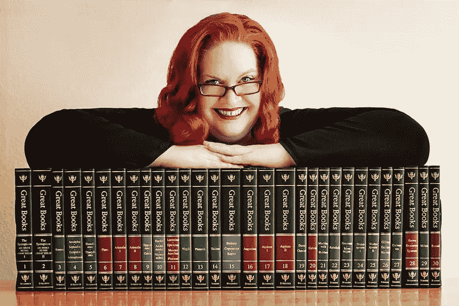
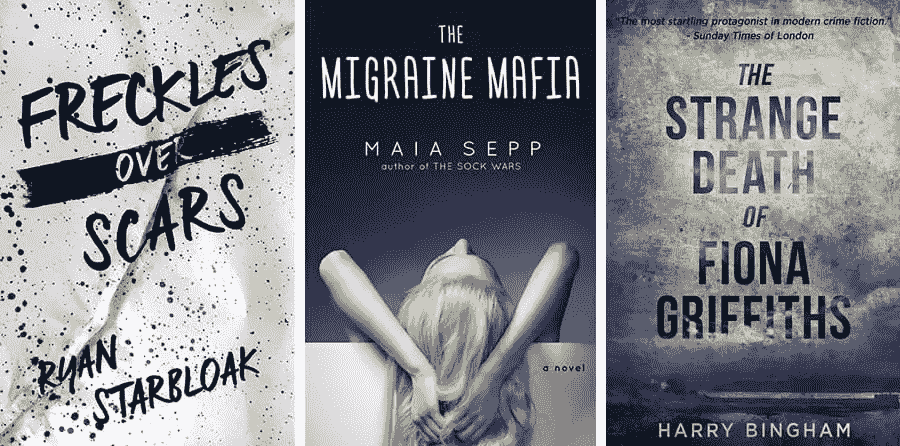
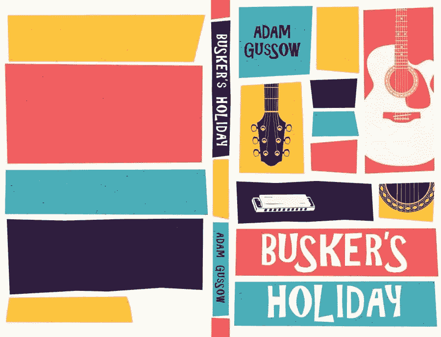
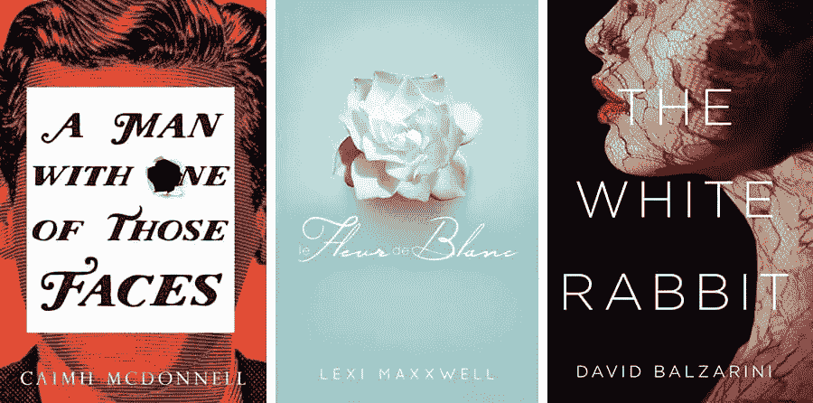
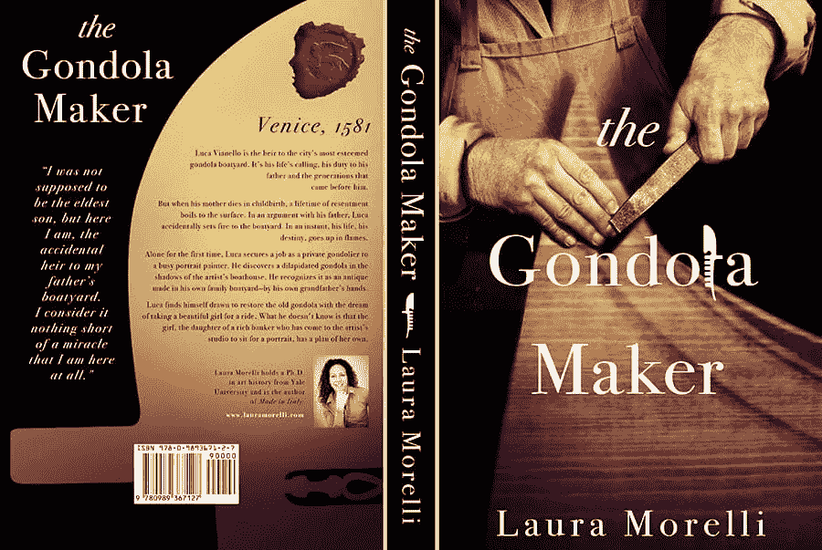
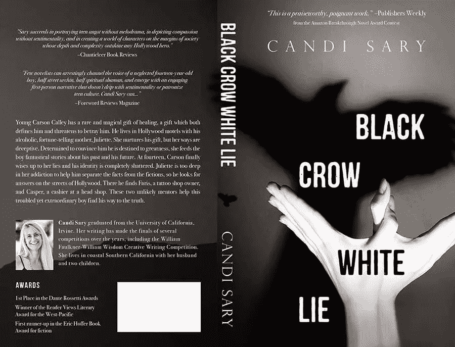

# 凯丽·埃利斯分享她对书籍封面设计的热情

> 原文：<https://www.sitepoint.com/kerry-ellis-book-cover-design/>

这篇文章之前发表在 [99designs 博客](https://99designs.com/blog/portraits/kerry-ellis-book-cover-design/)上。有兴趣出版自己的书吗？试试他们的[书籍封面设计](https://99designs.com/book-cover-design)服务吧！

我们不是每天都告诉你要根据封面来判断一本书，但在凯丽·埃利斯(又名[卢埃林](https://99designs.com/profiles/llywellyn))的案例中，我们*鼓励你这样做。*

六年多来，Kerry 一直是 99designs 的多产书籍封面设计师。虽然她可能很谦虚，但她的作品范围很广，从索尔·巴斯风格到凯尔特古典风格都有。

我们最近和凯瑞聊了聊，以了解是什么让她如此有创造力，她从哪里找到每一期封面的灵感，以及她现在在读谁的书。

### **姓名:**凯瑞艾利斯
**99 图案手柄:** [卢埃林](https://99designs.com/profiles/llywellyn)
**地点:**美国
**特产:**书籍封面

向我们介绍一下你自己。

我的童年是在美国四处迁移中度过的，直到高中，这让我在年轻时就有了游牧旅行的癖好。这导致了我在大学期间在爱尔兰的一个留学项目，这使我与一位教授联系起来，当我们回到校园时，这位教授不知不觉地让我走上了成为一名编辑的道路。我在各种出版领域做了十多年的编辑，我热爱这份工作。

你已经成为 99designs 的会员很久了(六年了！).能不能谈一点自己的经历？

天哪，真的有那么久了吗？我开始像大多数人一样对 Illustrator 一知半解:认为我可以很容易地通过创造标志赚些外快。我是说，一个商标能有多难，对吧？

我做得很糟糕。可能比一些人更好，但我的第一次 99 设计竞赛让我明白我需要做多少学习。所以有很长一段时间我一点都不活跃。

在 NASA 获得了更多的布局设计实践经验后，我回到了 99designs 平台，发现了图书封面类别。作为一个狂热的读者和全职编辑，我被这个类别深深吸引。这时候我才真正找到了自己的小众，开始在平台上有了不错的进步。

你最喜欢自由职业的哪一点？

选择我想从事的工作的自由。因为我有一份全职工作，所以在选择晚上和周末的工作时，我有难以置信的自由。因为这是一天工作之外的工作，它必须是我真正喜欢做的工作。自由职业让我可以做到这一点。

你显然是个藏书家。你最喜欢设计书籍封面的哪一点？

那些故事！有如此无尽的故事供应，我喜欢通过它们发现新的世界和角色，然后试图将它们带入生活。

你认为设计书籍封面时最大的挑战是什么？

将作者用几百页纸讲述的内容浓缩成一幅图像。当你没有整篇手稿要读的时候，这就更有挑战性了。鉴于只有一个简短的摘要，你必须依靠作者来确定他们的工作中真正最重要的是什么。

通常，他们花了太多的时间在自己的文字上，他们可能会忽略一些微妙的主题和意象，而这些主题和意象可能会被一个有着新眼光的设计师发现并运用。当你写对了的时候，写正义是如此的具有挑战性和令人难以置信的回报。

你的风格会随着你拍摄的每一张封面而改变。你如何决定每个特定的“外观”？

是吗？有趣，因为我感觉我总是在做同样的事情:极简主义和网格！

有时作者心中有一个特定的风格，这将使我走上一条图像挖掘的道路。其他时候，一个特定的单词或短语会在我的脑海中产生一幅画面，我开始寻找符合该画面但在观看时也会引发本能反应的库存照片或旧画。我发现的任何能产生火花的东西最终都会推动封面的风格。

当然，我做这些都是考虑到了类型。每个流派都有自己的外观和感觉，但我并不总是喜欢按照这些规则来玩(这可能是我在一些流派中表现如此糟糕的原因)。举例来说，如果一本书是一部震撼人心的惊悚/推理小说，我不太可能在封面上使用褶边字体。

然而，如果可以避免的话，我也不想使用陈词滥调的深蓝色-大衬线字体风格(我不能总是避免，但我会从左场开始，直到作者把我踢出去！).

有没有你喜欢与之共事的作家？或者某个你特别引以为豪的项目？

不少！但我会把它放在几个重要的个人里程碑上。

第一次是三部曲的竞赛。这些书是神秘的，始终以凯尔特神话为主题。如果你不能从我令人难以置信的威尔士用户名看出，快速看一下我的书架就会告诉你我对神话和所有凯尔特事物有多着迷。所以那场比赛对我个人来说是激动人心的。

即使我失败了，我也必须试一试，因为这个主题离我的心如此之近，如此之近。它最终成为我赢得的第一个封面大奖！我欣喜若狂，继续跟踪书籍的出版，因为我真的想读它们。(第一本书终于出来了！)

接下来是给我足够勇气要求白金晋升的比赛:*贡多拉制造商*。那是一场令人生畏的比赛——有大量优秀的人才和参赛作品。我个人喜欢读历史小说，这是最初吸引我的原因，但我最近也去了威尼斯，在那里拍了很多照片(我觉得这是我迄今为止最好的摄影作品)。

我注意到没有一个条目实际上代表了一个贡多拉制造商。现在，很多时候对于书籍封面来说，显而易见的东西也是最愚蠢的东西，但我仍然想给作者一些不同于《平底船》和《没有制造者》的东西。

那张合成照片是我迄今为止拼凑的最大的一张(那是我赢了):一张照片中的手和木头文件，另一张照片中的围裙，还有一张照片中的卷袖子，还有我自己的一张照片中的吊篮本身。然后是蜡封、有翼狮子、船头叉子——所有这些我都求助于公共领域的图片，因为需要购买的股票开始增加了。

结果比我想象的要好。作者很喜欢。她寄给我几本，我都送给了朋友和家人，只有一本除外——我自己的纪念品。就是这个封面让我觉得我其实很擅长这个，应该继续下去。

你通常从哪里获得灵感？

艺术和摄影是我背景的一大部分。我喜欢现代艺术博物馆和古代大师的经典肖像画。艺术史是我从未错过的大学课程之一，它让我踏上了参观世界各地每个城市的艺术博物馆的旅程。

大约 8 年前，我开始钻研摄影，并立即爱上了阿尔弗雷德·斯蒂格里茨和乔治·胡瑞尔(我是一个经典电影迷，这可能不会有什么坏处)。旧的染料和蓝染料让我看起来像蝴蝶。

还有复古海报。阿尔丰斯·穆夏是第一个把我带入那个世界的人，我非常喜欢它。

当我墨守成规，需要别人提醒我有多少伟大的艺术在等待被重新发现、重新利用和介绍给全新的观众时，这些就是我的必做之事。

你现在在读什么？你有最喜欢的书吗？

我现在正在看几本书:*《漫长的火星》、《第十一站》、《卡拉马佐夫兄弟》、《往事追忆》*(我发誓有一天会看完……)。我也刚买了 6 本托马斯·哈代的书，因为在我学习文学的这些年里，不知何故我完全没有读过他的书。

史上最受欢迎的书更难。我有很多，每一个都有不同的原因。《指环王》三部曲，因为这是我父亲给我的奇幻小说入门书(他给了我他的《霍比特人*的精装本，在我读完之后，他在那个星期给我买了三部曲，让我大吃一惊)。*

摩根·卢埃林的《格兰尼亚》，因为她将我对凯尔特神话和历史小说的热爱融合到一个强大的女人身上，否则我永远不会知道这个女人的存在。我是如此着迷，以至于当我去爱尔兰留学时，我写信给摩根·卢埃林，问她我是否能见她。令我惊讶的是，她回答并同意了。不幸的是，她的日程安排最终没有允许，但我在看到真正的塔拉胸针后立即从都柏林打电话给她，并与她进行了最精彩的交谈。

还有特里·普拉切特的《魔法的颜色》。因为它向我介绍了他的作品和磁盘世界。一次让我如此悲伤的旅行已经结束，但我永远感激曾经经历和阅读。

### 在她的作品集里可以看到更多凯丽·埃利斯的作品。

## 分享这篇文章