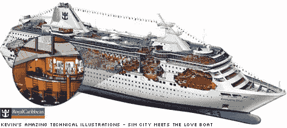
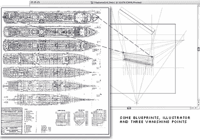

# 凯文·赫尔西的插画大师班

> 原文：<https://www.sitepoint.com/kevin-hulseys-illustrator-master-classes/>

这已经有一段时间了，但如果你甚至怀疑 Illustrator 的能力，这是一个很好的复习。在重新熟悉了凯文·赫尔西令人惊叹的技术插图后，我仍然不完全确定我是否想:

a)启动 Illustrator，在灵感的模糊中开始绘画，或者:
b)永久卸载它，永远不要让它的名字再从我的嘴里冒出来。

正如你所看到的，完成的作品是非凡的，如果没有其他原因，只是为了完成它们所需要的纯粹的血腥——他的[“海洋皇后”图下面的](http://www.khulsey.com/empress_large.html)用了 960 个小时，或者说在同一个作品上用了 120 个 8 小时。细节的程度真的令人麻木，从沙拉吧的[绿色沙拉](http://www.khulsey.com/empress_det6.html)到鸡尾酒吧的[饮料瓶](http://www.khulsey.com/empress_det3.html)到健身房的[自由重量](http://www.khulsey.com/empress_det8.html)。这家伙是个固执的人。

最棒的是，凯文在隐藏自己的秘密时没有炫耀，而是花了相当多的时间来展示他是如何得到结果的。从一套详细的蓝图开始，凯文创建了三个消失点，他需要这些消失点来赋予飞船空间维度，然后开始逐渐将 2D 计划扭曲成 3D 形式。

虽然这很可能是“大画面”，但这不是“大画面”思考者的工作——凯文显然对小事情一丝不苟。

有趣的是，Kevin 选择不在 Illustrator 中为他的插图着色，而是将他的艺术线条导出到 Photoshop 中。我个人喜欢用 Fireworks 作插图的原因之一是，我从来没有对 Illustrator 中的着色工具百分百满意。你当然可以得到任何效果，但这花了太长时间。不过，我必须承认，你不可能用焰火来表现这种尺寸和细节。

尽管如此，想想你用一张蓝图、一个插图画家和三个消失点能完成什么，还是令人惊叹。

## 分享这篇文章