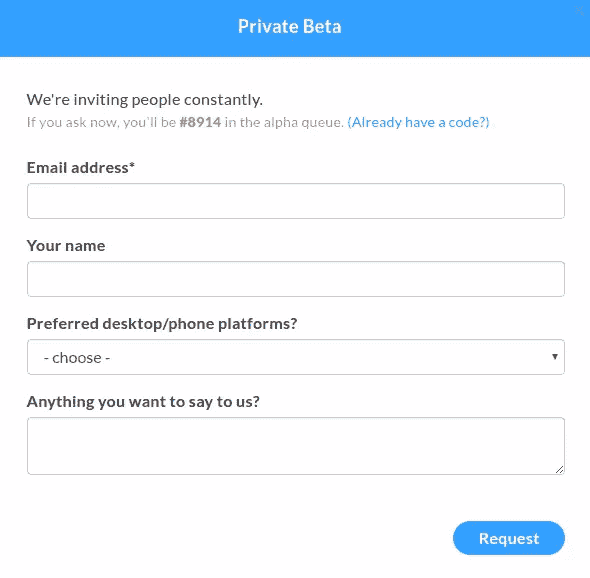
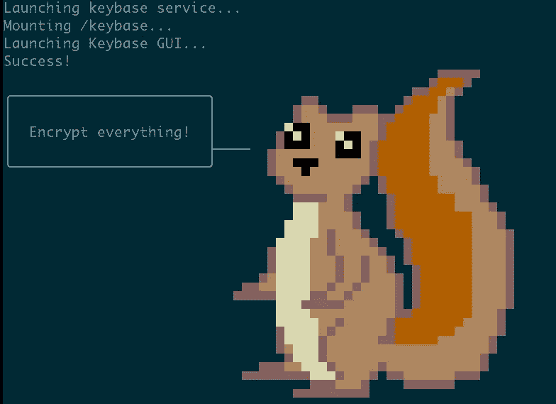
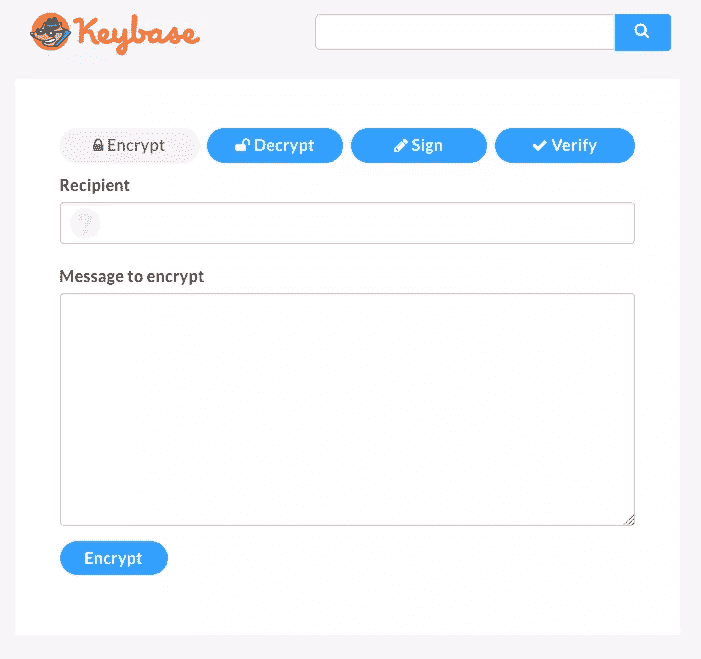
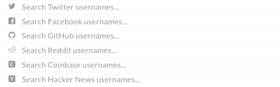
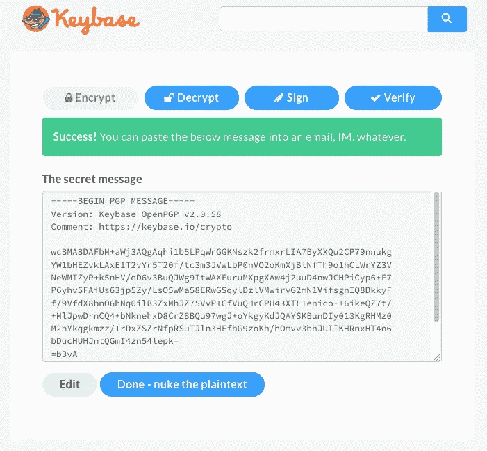
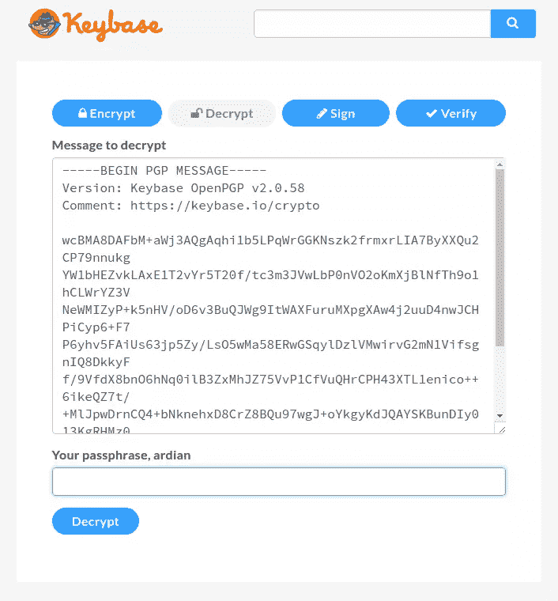
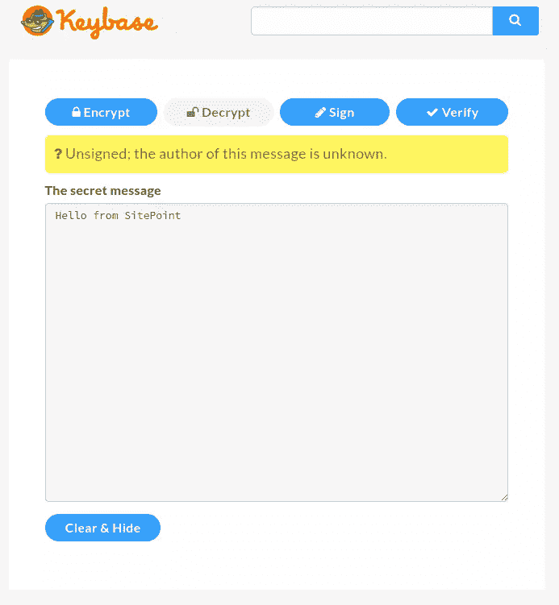
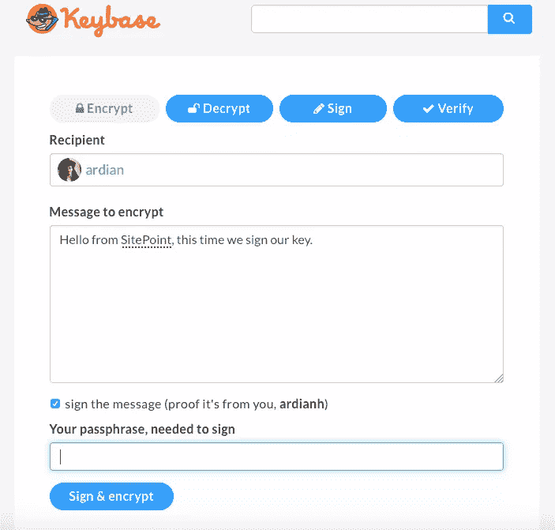
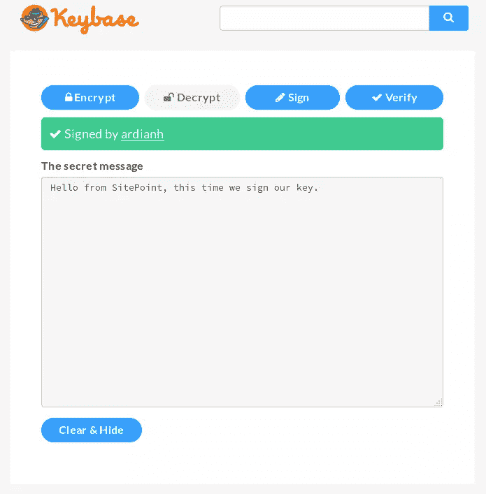

# 密钥库:发送、接收和共享加密信息

> 原文：<https://www.sitepoint.com/keybase-sending-receiving-and-sharing-encrypted-messages/>


[图像通过 Keybase.io](https://keybase.img/walkthrough/footprints_transp.png)

鉴于对数据安全性的日益关注，人们对数据加密的选择也越来越感兴趣。但是加密并不新鲜。回顾历史，我们可以发现最著名的加密机器之一是第二次世界大战中使用的 [Enigma](https://en.wikipedia.org/wiki/Enigma_machine) 。再往前追溯，我们发现了朱利叶斯·凯撒用来加密信息的[凯撒密码](https://en.wikipedia.org/wiki/Caesar_cipher)。

从本质上讲，加密就是将一条消息隐藏在另一条通常包含乱码的消息中。今天，在我们的数字世界中，你可以看到加密被应用在许多不同的领域，比如我们的浏览器、文件系统、电子邮件等。

加密在开始时可能有点困难，特别是对于非技术人员。但是加密信息是每个人都关心的问题，不仅仅是技术相关领域的人。(以调查记者为例，数据保护对他们来说至关重要。)

在本文中，我将回顾一个使加密变得简单的工具，并演示如何发送加密的文本消息。

### 介绍键盘

Keybase 是一个开源的加密平台，作为一个社交网络。它试图让加密变得更容易，打破技术壁垒，并为其添加社会因素。您可以使用社交媒体用户名开始加密。

在 Keybase 上，你可以像在 Twitter 上一样查找和关注人们。Keybase 还将你的身份映射到你的公钥:你可以将你的其他社交账户如 Reddit、GitHub、Twitter 链接到你的 Keybase 档案。

Keybase 通过基于 web 的客户端提供加密，但也为所有主要操作系统提供本地命令行客户端。

## 获取和设置帐户

在撰写本文时，Keybase 仍处于 alpha 阶段，您需要一个邀请才能在那里获得一个帐户。(我确实收到了邀请，如果你感兴趣，可以在 Twitter 上给我发消息。)你也可以通过表格报名，但是要排队，所以可能需要等一段时间。

快速提示:你可能会发现很多人在 Twitter 上发送邀请。



### 设置您的个人资料

一旦你在 Keybase 上有了一个帐户，你应该创建你的个人资料。然后前往[下载页面](https://keybase.io/download)。Keybase 支持所有三个主要的操作系统，也有源代码。遵循您的操作系统的安装说明。

完成后，您可以运行 Keybase:

`run_keybase`



耶，我们抓到一只松鼠。这证实了我们已经准备好加密密钥库。

### 验证您的个人资料

Keybase 还试图通过将您的帐户链接到您的 Keybase 个人资料来建立这个“信任之网”平台。由于 Keybase 也提供了一个命令行应用程序，我稍后将使用它来验证我的个人资料，但您也可以使用 web 版本。

## 使用密钥库加密

Keybase 的关键部分是加密。您可以通过 [Keybase web 平台](https://keybase.io/encrypt)加密您的信息:



如果是第一次加密信息，并且没有 <abbr title="pretty good privacy">PGP</abbr> 密钥，Keybase 可以为你生成密钥。

点击**添加一个 PGP 键**。

要生成密钥，我们需要使用 Keybase 提供的开源应用程序:

```
 keybase pgp gen    # if you need a PGP key
keybase pgp select # if you already have one in GPG
keybase pgp import # to pull from stdin or a file 
```

您可以轻松地生成或导入一个密钥。

如果你选择了生成一个密匙，它会要求你提供一个公开的名字和电子邮件地址。输入您的信息后，它会询问您是否想要将加密密钥的副本推送到 keybase.io 服务器。这部分是可选的，但是如果你想给你的消息签名(证明消息是你发的)或者直接从 web 应用程序解密，你必须添加它。

首先，我们需要添加加密消息的收件人。下面是 Keybase 的一个特点。在传统的 PGP 加密中，你必须寻找这个人的密钥，这取决于这个人在哪里共享他们的密钥(个人网站、电子邮件、公共密钥库等)。)，然后下载这个人的密钥。Keybase 提供了一个非常好的搜索选项，可以在 Keybase 的数据库中查找这个人的钥匙。



让我们加密这条消息:“你好，来自 SitePoint”。

这可能需要几秒钟，它将输出加密文本:

```
-----BEGIN PGP MESSAGE-----
Version: Keybase OpenPGP v2.0.58
Comment: https://keybase.io/crypto

wcBMA8DAFbM+aWj3AQgAqhi1b5LPqWrGGKNszk2frmxrLIA7ByXXQu2CP79nnukg
YW1bHEZvkLAxE1T2vYr5T20f/tc3m3JVwLbP0nVO2oKmXjBlNfTh9o1hCLWrYZ3V
NeWMIZyP+k5nHV/oD6v3BuQJWg9ItWAXFuruMXpgXAw4j2uuD4nwJCHPiCyp6+F7
P6yhv5FAiUs63jp5Zy/LsO5wMa58ERwGSqylDzlVMwirvG2mN1VifsgnIQ8DkkyF
f/9VfdX8bnO6hNq0ilB3ZxMhJZ75VvP1CfVuQHrCPH43XTL1enico++6ikeQZ7t/
+MlJpwDrnCQ4+bNknehxD8CrZ8BQu97wgJ+oYkgyKdJQAYSKBunDIy013KgRHMz0
M2hYkqgkmzz/1rDxZSZrNfpRSuTJln3HFfhG9zoKh/hOmvv3bhJUIIKHRnxHT4n6
bDucHUHJntQGmI4zn54lepk=
=b3yA
-----END PGP MESSAGE----- 
```



这条消息现在可以通过电子邮件或任何其他通信平台发送，唯一可以看到(解密)它的人是收件人。即使其他人可以访问我们的电子邮件，他们也无法阅读或理解此邮件。

## 用密钥库解密

点击**解密**按钮，粘贴您的加密信息。您还需要键入您的密钥库密码。点击**解密**。



解密该消息可能需要几秒钟，它将输出原始文本**“Hello from site point”**。



您可能会注意到，在秘密消息的上方，有一个问号，抱怨消息的作者未知。这意味着作者没有用他们的密钥签署消息，因此我们不知道发送者。如果你想证明你的身份，你应该在你的钥匙上签名。这一次，除了添加我们的消息之外，我们还需要输入我们的 Keybase 密码来签署我们的消息(这只有在您已经将私钥添加到 keybase.io 服务器的情况下才有效)。



```
-----BEGIN PGP MESSAGE-----
Version: Keybase OpenPGP v2.0.58
Comment: https://keybase.io/crypto

wcBMA8DAFbM+aWj3AQf/aW1VBnvBnxqd0KpIbU9aNcU0Ywz1RvUNaPoutYnrB6JA
CGb85UERiY4GGUFcmlJY6IfJBouBumbVh//3SzzsnnEq/Tq0F3yj0hHu2afx+fxC
lV9P1VketP+XRXCu4vY8SImdcfuIHtYEPFRHiUraNyHn0ZWeN1JfkwePYB3ntgEb
⋮
ohoRqrf7ydFf9ximOcCm4caQO8vBlf/mSj9V2fHRt+1C9o21himN2V2Xl3OvqcrZ
KP3EX/MCu+dAxXG6r3K2gCiL7MD9Ie5ziyWkUb8uDE8jeh7LWWEw9PjBlnZaIrI8
yJbpRhdB49qgvo35d7BhXu1fuZgJlY36DYLbm7nHOg==
=jIRP
-----END PGP MESSAGE----- 
```

它看起来几乎一样。现在让我们解密这条消息:

注意:我在这里使用两个账户。

现在让我们来看看我们的解密文本:



现在我们可以看到我们的消息由用户`ardianh`签名。

## 键盘命令行应用程序

现在让我们试试 Keybase 命令行应用程序。在系统上安装了 Keybase 应用程序后，您可以运行`run_keybase`来验证它是否已安装。

您的第一步是使用`keybase login`登录 Keybase:

```
 1\. [computer]    macbook-pro
2\. [computer]    ubuntu-digitalocean-vps
3\. [paper key]    crunch lyrics
4\. I don't have access to any of these devices. 
```

输入您的密钥库用户名或电子邮件地址。然后，您必须提供您的设备。如果您已经通过另一台机器登录并且可以访问该机器，则可以使用该机器来执行资源调配。另一种选择是使用纸质密钥(最初在 keybase.io 注册时获得)。如果您无法访问这两个密码，您仍然可以使用您的密钥库密码。

您会看到类似这样的内容:

```
 Enter a public name for this device: digitalocea-vps
✔ Success! You provisioned your device digitalocea-vps. 
```

现在您已经登录，魔法可以开始了。我先证明(验证)一下我的推特账号。

```
keybase prove twitter 
```

这将要求您发布一条与您的 Keybase 用户名相关的特定推文。这个过程不需要 Twitter 的任何 oAuth 授权，这很好。您会收到一封来自 Keybase 的电子邮件，通知您识别证明已成功。如果你去我的个人资料，你会看到我的 Twitter 个人资料被添加，你甚至可以查看推文。将其他社交帐户链接到您的 Keybase 帐户的过程基本相同，Keybase 为每个帐户提供了说明。

你也不必去 Keybase 的网站加密你的信息。它们可以直接从命令行应用程序中完成。

```
keybase pgp encrypt username -m "Hello from SitePoint"` 
```

如果您没有关注您要发送消息的人，它会为您提供用户名信息，这样您就不会选错人:

```
 ▶ INFO Identifying recipient ardian
✔ "ardian" on github: https://gist.github.com/61fed84ba846d4b9055e150818c69e7f [cached 2016-10-27 13:34:33 UTC]
✔ "ardianhaxha" on twitter: https://twitter.com/ardianhaxha/status/782818852442873860 [cached 2016-10-27 13:34:33 UTC]
Is this the ardian you wanted? [Y/n] 
```

```
-----BEGIN PGP MESSAGE-----
Comment: https://keybase.io/download
Version: Keybase Go 1.0.17 (linux)

wcFMAydk+tkSN8tFARAAgnJZ8YcsqLuIC9FJ9rwXYbrTHMZQo5HWFiltNp/Vue+i
ctptzdBqjuEnCCeonrRunfYTKXgUcB/Aa5edTe84ujyqRaZtrQKwCfSqgKZt9Hyf
q5G8d9jTG/6mKAcUXN2DlErX8FMeUt4HfyNBC4Eq7LAVPdCZW6QsLWZDgbh7jlcO
⋮
Kk4fU13kExGs9zbIIuQ1/Gx0lc3ZUo8zau3XeKtwhFH0n1MgVBE+wNe6o8HJ4tLg
AeSLQdU0tgm370Awi5Y7WFbi4UST4JDg0+E6VeAD4rbLtZPgCuSc6AsauN/BVynG
/fWuKmvC4LfiZvhw2+BB5OSpwUb7tnFgCnLK+wIVUIXih/oQ/uH5KwA=
=i9kE
-----END PGP MESSAGE----- 
```

Keybase 现在将输出加密的消息。同样，解密也可以从命令行完成。

```
keybase pgp decrypt -i encrypted-message.txt 
```

> 你好，来自 SitePoint

命令行应用程序有更多的功能。使用**键盘帮助**获取所有可用选项的列表。

## 结论

Keybase 已经把加密变成了一个简单友好的新手选择。

Keybase 团队最近推出了一项名为 [Keybase 文件系统](https://keybase.io/docs/kbfs)的新服务，这是一个你可以存储和共享加密数据的特殊地方。每个用户都有 10GB 的空间，文件系统安装了 Keybase 应用程序。

那么，你怎么看？你会用这个吗？你已经试过了吗？如果是，你怎么看？欢迎讨论或询问以下任何问题。

## 分享这篇文章