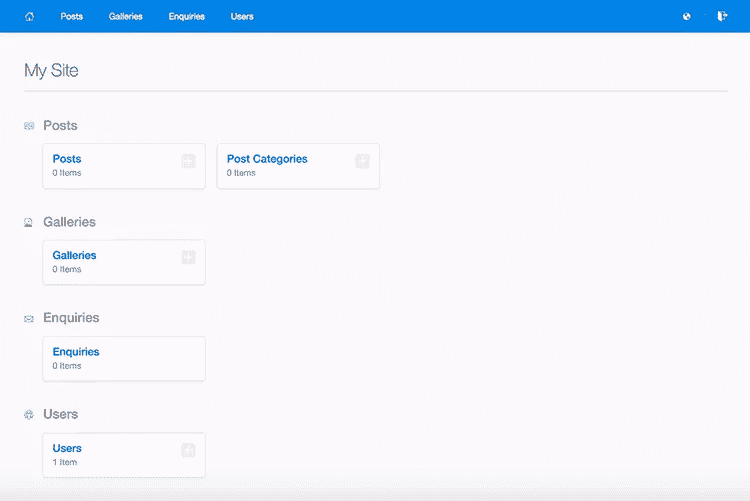
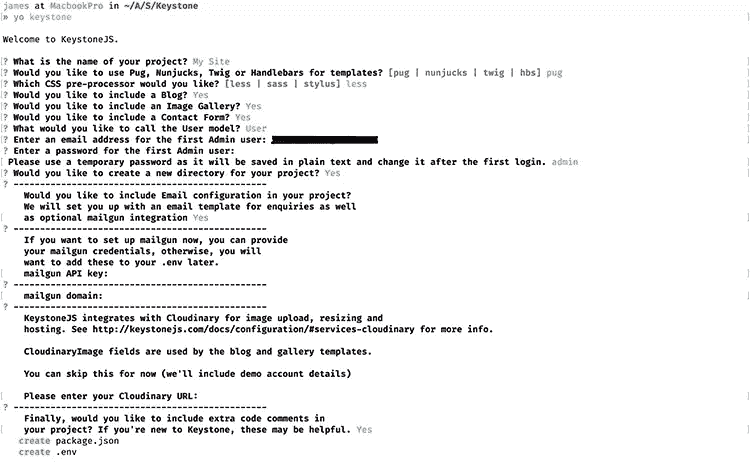
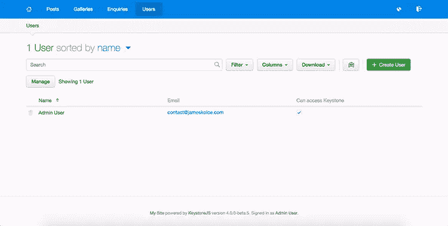

# keystone js:WordPress 的最佳 Node.js 替代品

> 原文：<https://www.sitepoint.com/keystonejs-best-node-js-alternative-wordpress/>


KeystoneJS 是一个内容管理系统和框架，用于构建与数据库交互的服务器应用程序。它基于 Node.js 的 [Express 框架](https://expressjs.com)，使用 [MongoDB](https://www.mongodb.com/cloud/atlas) 进行数据存储。它为那些想建立一个数据驱动的网站，但不想进入 PHP 平台或像 WordPress 这样的大型系统的 web 开发人员提供了一个 CMS 替代方案。

虽然 WordPress 可以由不太懂技术的用户来设置，但是 KeystoneJS 提供了专业人员开发新网站所需的控制——尽管使用 KeystoneJS 仍然比手工从头开始构建网站容易得多。它不仅提供了一个建立网站的平台；你可以替换它上面的几乎所有东西，开发更专业的系统，比如应用程序和 API。

## 关键特征

*   **自动生成的管理 UI** :当您使用 KeystoneJS 构建一些东西时，您定义的数据模型也用于自动创建一个管理仪表板来管理您的数据。您不必直接设置数据库模型；您使用[列表](http://keystonejs.com/docs/database/#lists)来描述您的数据。

    

*   轻量级且易于定制:事实上，你无需了解一个庞大的系统的里里外外就能控制一切，这使得网站既轻量级又易于定制。

*   **易于扩展** : KeystoneJS 可以被认为是一个库，你不局限于只使用它提供的功能。您可以轻松集成来自最大的库生态系统之一的任何包:JavaScript。

*   **从头开始或者使用模板**:如果你想开始建立一个类似博客的东西，你不必花时间去处理系统的逻辑；KeystoneJS 提供了现成的模板或定制模板。如果您有特定的需求，您可以利用它提供的工具从头开始，但不必自己编写所有内容。

*   **专为开发人员打造**:其他 CMS 倾向于将所有东西都包含在一个包中，这样非技术用户可以尽快上手。然而，KeystoneJS 的目标是开发人员，他们希望构建一个 CMS，但不希望预构建系统的膨胀或限制。

*   **兼容第三方服务** : KeystoneJS 提供与一些有用的第三方服务的集成，比如[亚马逊 S3](https://aws.amazon.com/s3/) 、 [Cloudinary](http://cloudinary.com) 、 [Mandrill](http://www.mandrill.com) 开箱即用。假设您想在亚马逊 S3 上存储某些数据，在定义数据时只需添加`{ type: Types.S3File }`作为[字段类型](http://keystonejs.com/docs/database/#fieldtypes)即可。

## 用例

*   面向非技术用户的网站:如果你是一名面向客户的网站开发人员，你可能会发现为非技术人员建立一个网站并不容易，因为你还必须建立一个管理面板来添加和更新数据。有了 KeystoneJS，你不必担心做双倍的工作；将自动创建一个管理面板。

*   动态网站:KeystoneJS 提供了一个有用的基础和工具来处理网站上的动态数据，当静态网站太少而不值得考虑时，这是很有用的，但是像 WordPress 这样的传统 CMS 对于你的项目来说太重或者太固执己见。

*   **性能**:没有什么比仅仅为了你的需求而建造东西更好的了；如果您需要一个高度专业化的网站，并且性能是关键，那么您可以使用 KeystoneJS 来构建符合您确切需求的东西，并利用 Node.js 平台的性能优势，尤其是对于并发服务。

*   **生态系统** : JavaScript 拥有最丰富的第三方包生态系统之一。另外，如果你被要求(或者只是喜欢)在客户端*和服务器端*都使用 JavaScript，KeystoneJS 是一个很好的工具。

*   **紧张的期限**:你有没有一个有专业特色的项目，期限很近？KeystoneJS 处理数据的方式和自动创建管理面板的事实意味着您可以花更多的时间来构建站点的实际逻辑，而不是处理实现细节。

## 入门指南

有两种方法可以启动 KeystoneJS 项目:

*   从头开始，导入 [KeystoneJS 包](https://www.npmjs.com/package/keystone)。
*   使用[约曼发电机](https://github.com/keystonejs/generator-keystone)。

如果您是一名经验丰富的开发人员，想要一些全新的东西，或者只是想了解细节，您可以从头开始使用 KeyStoneJS 构建您的站点，这可以保证您始终知道所有东西是如何构建的，并且您只拥有您需要的功能的代码。

然而，如果你想建立你的第一个网站来探索事物，或者你不需要任何特别的东西，你可以使用 Yeoman 生成器，它会根据一些基本问题创建一个完整的项目。

### 发电机安装

要安装 Yeoman 生成器，请在终端或命令行上执行以下命令:

```
npm install -g generator-keystone 
```

然后在一个空目录中，执行以下命令来启动生成器:

```
yo keystone 
```

将向您提出一系列问题，过一会儿，您就可以使用您的项目了。

### 生成器问题

KeystoneJS 生成器提供了几个特性，其中一些是可选的，您可以在安装过程中选择您想要的。



下面的列表包含了大多数被问到的问题，根据您的选择，您可以看到一些不同之处:

1.  你的项目叫什么名字？
    您可以选择您希望在提及您的网站时出现的名称，例如在管理面板上。

2.  你想用哈巴狗、双节棍、树枝还是把手做模板？
    默认情况下，你可以在四种不同的模板语言中选择。但是你不局限于那四个一，你可以设置任何你想要的语言。

3.  **您想要哪种 CSS 预处理器？**
    和模板语言一样，你可以选择任何你想要的样式语言。选项较少，Sass 和 Stylus，但你不局限于那些；你可以选择你想要的语言或者直接使用普通 CSS。

4.  **您想加入博客吗？**
    并不是所有的网站都需要博客，但是你可以通过选择这个问题中的`yes`很容易地得到一个。结果是一个简单的博客，你可以在一个简单的[所见即所得](https://en.wikipedia.org/wiki/WYSIWYG)编辑器中写文章。

5.  您是否想要包含一个图片库？
    如果你选择创建一个图片库，你可以使用管理面板上传图片——它也可以将图片存储在第三方服务上——它们会像普通图片一样显示在主页上。任何额外的功能或定制都在你的身边。

6.  您是否希望包含联系方式？
    您可以通过激活联系人表单功能接收来自查看者的消息。它将在前端创建一个表单，所有发送的消息都存储在数据库中。

7.  **您希望如何称呼用户模型？**
    ，默认值为`user`。如果您想保持有序，可以根据需要选择不同的值。

8.  **输入第一个管理员用户的电子邮件地址**
    这是您作为第一个拥有管理权限的用户登录时使用的电子邮件地址。

9.  **请使用临时密码，因为它将以明文形式保存，并在首次登录后更改。**
    为之前的用户写一个简单的密码，可以是你想要的任何东西，因为它应该在你登录后更改(推荐)。

10.  您想为您的项目创建一个新目录吗？
    如果您执行生成器的当前目录是您想要创建文件的目录，您可以选择*否*，否则，会以项目的名称创建一个新目录。

11.  您想在您的项目中包含电子邮件配置吗？
    如果您选择*是*，将会建立一个电子邮件模板，您还可以添加邮件枪集成的设置；用于发送电子邮件的服务。

12.  最后，你想在你的项目中加入额外的代码注释吗？
    如果你正在创建一个学习和探索的网站，这个选项特别有用，如果你在这个选项中选择*是*，结果代码将会有大量的注释解释一切。

### 启动应用程序

在启动服务器之前，确保 MongoDB 也在其默认端口(`27017`)中执行。一切准备就绪后，您可以通过运行以下命令来启动服务器:

```
node keystone 
```

仅此而已。黑客快乐！

## KeystoneJS vs WordPress

虽然 KeystoneJS 和 WordPress 有很大的不同，但它们都有相当多的受众:希望构建数据库驱动网站的开发人员。



以下是从开发者的角度进行的比较:

### 平台

KeystoneJS 是建立在 Node.js/JavaScript 平台之上的，对于特定的应用来说，它比基于 PHP 的 WordPress 更有潜力。支持这个平台的一个优点是软件包的可用性；如果你需要它，很可能有一个做你想要的。

WordPress 可以被认为是 PHP 平台的标志。它是驱动大量基于内容的网站(如博客和作品集)的系统，但也是具有自定义功能的大型网站，甚至是电子商务行业的网站。

### 数据库ˌ资料库

KeystoneJS 使用 MongoDB 来存储它的所有数据。 [MongoDB](https://www.mongodb.com/cloud/atlas) 是市场上最流行的非关系数据库之一，由于其在 JavaScript 项目中的易用性，它是 Node.js 开发人员的常见选择。

WordPress 使用更经典的——但仍然非常健壮的——关系数据库 MySQL 和 MariaSQL，如果你的网站有很多*结构化的*数据需求，这可能是首选的解决方案。

### 流行

虽然 Node.js 在 web 开发人员中是一个非常受欢迎的平台，但与行业中的主要竞争者相比，KeystoneJS 并不是一个使用非常广泛的 CMS。但是，受欢迎程度并不意味着很多取决于你想做什么，尤其是考虑到目标受众主要是开发者。

就受欢迎程度而言，WordPress 可以被认为是互联网之王。不仅仅是因为使用它的开发人员的数量，还因为非技术人员也可以使用它。虽然 KeystoneJS 与许多开发人员的工具兼容，但是当你需要与最终用户兼容时，WordPress 会胜出。

### 主题可用性

如果你想要 KeystoneJS 的预定义主题，你将很难找到什么，因为该项目旨在提供一个框架来构建定制网站，而不是一个现成的系统。

如果你想要一个 WordPress 的主题，你绝对没有问题。成千上万的开发者在网上发布他们的主题供出售(或免费)，这使得有东西开始使用或直接使用变得更加容易。

### 主办；主持

如果你用 KeystoneJS 建立一个网站，你将不得不考虑如何托管它。尽管有一些平台可以以一种非常简单的方式托管 Node.js 项目，但是您不会得到一个将 *KeystoneJS 作为服务*提供的服务。

因为 WordPress 是用 PHP 编写的，所以你找托管服务不会发现任何问题。此外，如果你不想弄脏你的手管理和配置主机，你可以得到一个直接由 WordPress 托管的 WordPress 网站或类似的服务。

### 模板

在 KeystoneJS 中，您可以在 Node.js 平台上可用的模板引擎之间进行选择，因此您可以根据自己的偏好获得几种风格。自耕农发电机已经包括[哈巴狗](https://pugjs.org/api/getting-started.html)、[双节棍](https://mozilla.github.io/nunjucks/)、[小树枝](https://github.com/twigjs/twig.js)和[车把](http://handlebarsjs.com)。

你也可以在 WordPress 的一些模板引擎(例如 [Timber](https://www.upstatement.com/timber/) )中进行选择，这些引擎允许使用不同的语言来编写主题，这些主题更易于阅读，类似于来自不同平台的其他模板语言。

### 目标

正如我之前提到的，KeystoneJS 的主要目标是希望构建定制站点和应用程序的 web 开发人员，而不是希望建立现成可用的站点和应用程序的最终用户。另一方面，WordPress 涵盖了从开发者到最终用户的所有领域。开发人员能够构建定制的站点，最终用户可以建立现成的站点，而不会太复杂。

### 初始复杂性

如果你想用 KeystoneJS 建立一个自定义网站，你可以自由选择你想要的所有组件，以及如何做大多数事情。问题是当你想从已经做过的事情开始；这里没有很多选择。

如果你想用 WordPress 建立一个定制网站，你必须坚持 WordPress 的做事方式和逻辑。然而，更容易找到主题来更快地开始一个新项目。

### 易于定制

因为 KeystoneJS 更像是一个库而不是一个现成的系统，如果你懂 JavaScript，几乎所有东西都是可定制的。因为是基于 Node.js、Express、Mongoose，所以你获得了几乎一样的自由；你只是有一些额外的东西来更快地工作。

WordPress 自带了一些现成的东西，当你试图定制它时，这些东西可能会妨碍你。根据你的需求调整事物的复杂性取决于你想改变什么。例如，与主题相关的更改可能非常简单，但改变内部逻辑就不那么简单了。

## 结论

KeystoneJS 为寻找 JavaScript 库的灵活性而不是像 WordPress 这样的全功能系统的 web 开发人员提供了一个优秀的解决方案。虽然它不是针对最终用户的，但是你的客户肯定会喜欢使用它，因为它自动创建了一个管理面板，使得处理网站内容更加容易。

你有在你的项目中使用 KeystoneJS 的经验吗？你觉得这个特性集太简单了，还是刚刚好？请在下面的评论中告诉我你的观点。

## 分享这篇文章