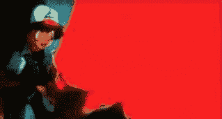
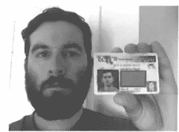
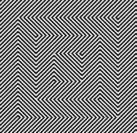

# 黑仔 GIF:动画 GIF 如何成为武器？

> 原文：<https://www.sitepoint.com/killer-gifs-how-can-an-animated-gif-become-a-weapon/>

在我们回答这个问题之前，让我们回到 20 年前。1997 年 12 月的一个下午晚些时候，数千名日本儿童在全国范围内同时癫痫发作——685 人住院，有些人住院超过两周。

后来确定，他们都是在观看新一集《口袋妖怪》中完全相同的场景时摔倒的。在第 38 集，'[电战士 Porygo](https://en.wikipedia.org/wiki/Denn%C5%8D_Senshi_Porygon) '中，皮卡丘用他的闪电攻击摧毁来袭导弹。原来动画师使用了快速的红色和蓝色频闪效果来创造闪电，这在无意中诱发了大量观众的光敏性癫痫发作。

当然，这完全是一个意外，对口袋妖怪的创作者来说是一个巨大的冲击。事实上，动画工作室花了 4 个月的时间调查这一事件，并采取措施避免所有高对比度频闪动画在未来。

但并不是所有的动画师都抱着这样的善意出发。

## 故意伤害的动画

上周五，一名马里兰州男子，约翰·雷恩·里韦洛，被控以企图谋杀罪接受审判。

去年 12 月，里韦洛对《新闻周刊》记者库尔特·艾欣沃尔德的文章提出了极端抗议，并决定采取行动。意识到 Eichenwald 的[光敏癫痫](https://en.wikipedia.org/wiki/Photosensitive_epilepsy)，Rivello 制作了一个巨大的闪烁的动画 GIF，底部写着“*你应该因为你的帖子*而被扣押。不久之后，艾肯瓦尔德的妻子发现这位作家昏倒了，于是拨打了 911。

联邦调查局指控里韦洛犯有“意图杀人或造成身体伤害的网络跟踪罪”。Eichenwald 的律师认为，在这种情况下，将这张精心制作的 GIF 直接发送给他的客户无异于邮寄爆炸装置或毒药。

里韦洛面临长达 10 年的监禁。

## 那么，设计师会意外引发癫痫吗？

好消息是，很可能不会——相对来说，在易受攻击的用户中，意外触发癫痫发作是比较困难的。据 Webaim.org 的[称，有问题的内容将需要**每秒钟持续**闪烁 5 到 30 次。虽然我们可能会创建一个闪烁的 UI 元素，但它不太可能会持续动画。](http://webaim.org/articles/seizure/)

闪烁源也需要很大——很少有动画微调器和加载图形会大到引起问题。实际上，电影、电视、娱乐照明、视频游戏甚至弹球机通常比网络带来更多的问题。

可以说，粗心的设计师面临的最大风险是具有特殊品质的静态图形。高对比度视错觉——就像我上面包含的一小部分图像——在大型面板和背景中使用时会出现严重的问题。虽然图像不是动画，但它看起来是移动的。

虽然不太可能，但这是一个*可能*无意中发生的场景，在创建图案化背景时当然应该考虑。

## 分享这篇文章