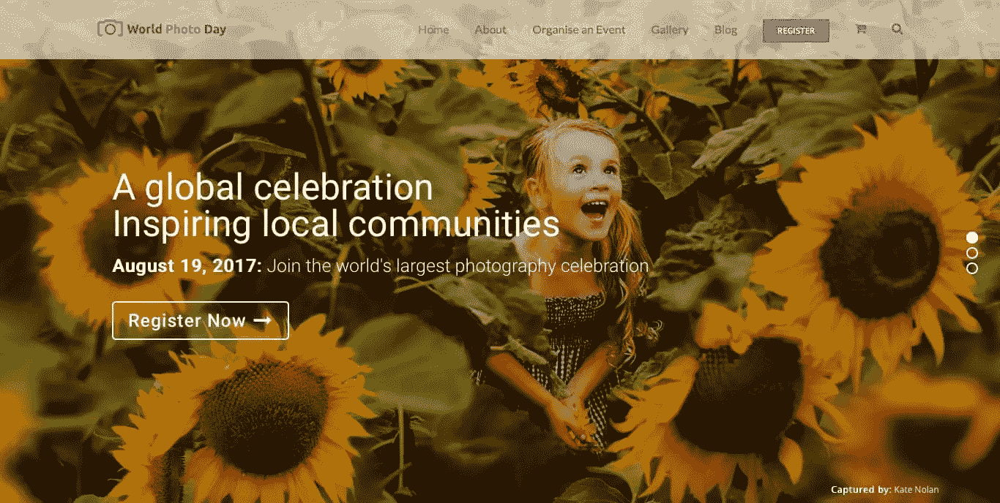
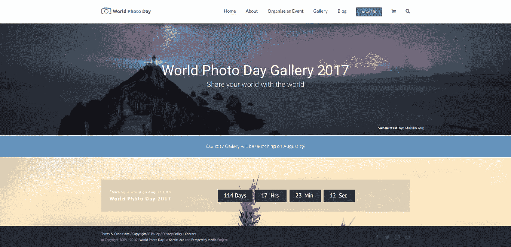

# 世界摄影日的 Korske Ara 如何使用 WordPress

> 原文：<https://www.sitepoint.com/korske-ara-world-photo-day-uses-wordpress/>

每年的 8 月 19 日是世界摄影日，庆祝我们对摄影的热情。摄影师 Korske Ara 在 2009 年创办了这项活动，从那以后它一直很受欢迎。

> “摄影是一种强有力的交流方式，我们可以用它来提升、激励和改变我们的世界。一幅画胜过千言万语，而这些千言万语可以是地球上 6500 种语言中的任何一种。Kors ke Ara——世界照片日创始人

世界照片日的公众形象是一个 WordPress 网站。我们最近采访了 Korske，聊了聊他的活动目标，他的 WordPress 主题和插件如何帮助实现这些目标，以及他对主持计划的选择。我们还讨论了他的网络和营销策略在过去几年中是如何发展的。

## 你好科斯凯。告诉我们你是如何与志同道合的人建立联系来提高对世界摄影日的认识的。

作为一项在线庆祝活动，社交媒体是围绕世界摄影日展开对话的关键。我跳到脸书和推特上开始行动。你可以在网上接触到很多你亲自工作时不一定能接触到的人。

今天，我们与个人交谈，并在社交媒体上开始对话，以继续发展世界照片日项目。线上和线下的对话都绝对有价值。

当你在网上接触到合适的人时，线下和合适的人交谈会有很大的好处！

## 世界摄影日背后有团队吗？你是怎么招募他们的？你是如何管理它们的？

在过去的七年里，我主要是一个人管理世界摄影日，偶尔会得到朋友的帮助来编写网站组件和创建内容。这些年来，我的导师也给了我一些很好的建议。

今年，我们开始着手创建一个更大的世界摄影日庆典，这意味着我们需要壮大我们的团队。我们有五名软件工程学生在我们的画廊工作，两名数字营销实习生，以及各种合作伙伴与我们一起工作，为我们以学生为主的团队提供专业支持。

我们使用 [Wrike](https://www.wrike.com) 管理我们的任务，这是一个非常强大的任务管理应用程序，允许我们跟踪我们所有项目中正在发生的一切。我强烈推荐任何管理项目的人去看看 Wrike。他们甚至提供免费计划。

## 请告诉我们您的网站，包括它在您的业务中扮演的角色。

我们的主要网站，[worldphotoday.com](http://worldphotoday.com)是一个分享世界各地普通人拍摄的精彩照片的网站。我们还利用它向我们的参与者提供信息，告诉他们如何参与世界摄影日，庆祝他们对摄影的热情。

## 你想用它达到什么目的？

我们网站的主要目标是促进全球画廊和竞赛，参与者可以与世界分享他们的世界。

我们的目标是激励世界各地的摄影师反思摄影，反思我们捕捉和分享精彩故事和瞬间的能力。

## 你为什么选择 WordPress 作为你的平台？

我们选择 WordPress 作为我们的平台，是因为它易于安装，并且可以通过各种插件进行扩展。

## 你用的是哪个主题和插件？

世界照片日网站使用市场上最受欢迎的优质 WordPress 主题之一 Avada，可在 [Themeforest](https://www.sitepoint.com/top-wordpress-multipurpose-themes/) 获得。我们选择 Avada 是因为它的可定制性和对许多流行插件的内置风格支持。

世界照片日网站有免费和付费插件。免费插件包括: [Yoast SEO](https://yoast.com/wordpress/plugins/seo/) 、 [Akismet](https://akismet.com/) 和 [WooCommerce](https://woocommerce.com/) 。我们的高级(付费)插件包括[重力形式](http://www.gravityforms.com/)、 [WPML](https://wpml.org/) 和[活动日历 PRO](https://theeventscalendar.com/product/wordpress-events-calendar-pro/) 。

## 你在创建网站的时候有没有得到任何帮助？

我有 Linux 系统管理和 Web 应用程序开发的背景，并做了大量的原创工作来建立新的 WordPress 网站。通过参考我试图实现的相关插件或特性的文档，大多数挑战都被克服了。

## 一路走来，你学到了什么？

我们学到的最大教训是关于内容的规划和写作，这是我们现在仍在努力的事情，因为我们的核心网站已经上线。

## 你有一个基本的托管计划，还是你已经升级？

因为我们接受大照片上传到我们的图库，我们发现我们的网站不适合常规共享托管。正因为如此，世界摄影日从一开始就在云主机上举办。

我们过去使用过 Linode 和 Digital Ocean，非常喜欢这两种服务的支持。我们选择 [ServerPilot](https://serverpilot.io/) 作为控制面板，以减少我们的服务器管理工作量。

世界照片日现在正在迁移到一个可扩展的亚马逊 AWS 平台，该平台利用了包括 EC2、S3、EBS、LAMDA 和 REKOGNITION 在内的各种服务。

我们选择迁移到亚马逊 AWS 是因为我们需要快速扩展以应对世界摄影日流量的增加。

## 你肯定有很多照片！您如何备份？

我们使用 [AWS CloudWatch](https://aws.amazon.com/cloudwatch/) 事件触发器管理网站的自动备份。我们的内容还会跨多个 AWS 区域进行镜像。

## 你愿意分享一些关于维护 WordPress 并保证其安全的技巧吗？

我们有一个运行自动 WordPress 更新的暂存环境，每次 WordPress 或插件更新时，我们都会收到通知。这使得有人可以在我们运行现场更新之前仔细检查它没有损坏任何东西。

因为我们每天都在我们的网站上工作，安装 WordPress 软件更新不是一个大问题。也就是说，我们也有许多定制的应用程序代码，像由 [Acunetix](https://www.acunetix.com/) 或 [Detectify](https://detectify.com/) 提供的漏洞扫描器已经成为一个重要的补充。

## 从现在开始，你对网站有什么计划？

目前，我们正在进行翻译，以增加我们在世界各地的参与，我们正在努力将 WordPress 插件管理的功能转移到我们的定制网络应用程序中。

我们将继续把 WordPress 作为一个营销平台，和 WooCommerce 商店一起使用。

## 再来说说营销。你早期的策略是什么，它们是如何发展的？

这是一个非常棘手的问题，因为我一开始并没有明确的营销策略。世界照片日始于我决定要创作一些东西，让我在 21 岁时有事可做，不惹麻烦。

我总是被驱使去激励、挑战和鼓励人们追求他们的梦想和目标。这不是真正的营销策略，但结果是一样的。为他人创造价值，他们会支持你和你的想法。

随着事件的发展，幕后有很多事情在发展。我们可能需要在一年内赶上来看看有什么变化！

## 谢谢科斯凯。关于世界摄影日发展到今天，你还有什么想补充的吗？

世界摄影日的发展基于时间的投入和七年来的持续增长。这并不是说我没有犯错，也不是说我运用了最有效的方法来成长。这些年来，我确实犯了一些错误。

最终，我发现培养纪律、决心和毅力的品质比设计一个起草良好的策略更有价值。

对于任何想要开始或建立自己事业的人，我想引用 StartupCamp 的戴尔·帕特里奇的话:

> 结果需要时间和一致性。一击即中的奇迹和早期的成功缺乏被证明的深度。长期持续的积极结果，将永远胜过“假装成功，直到成功”的虚伪尝试。

如果你想学习如何使用 WordPress 将你的网站创意变成现实，请查看我们的课程，WordPress 简介。

## 分享这篇文章