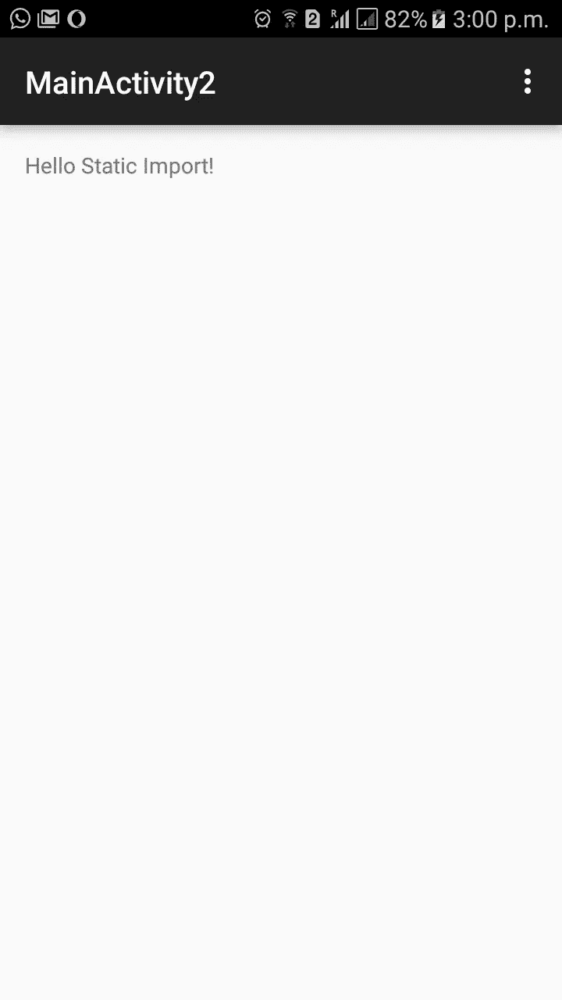
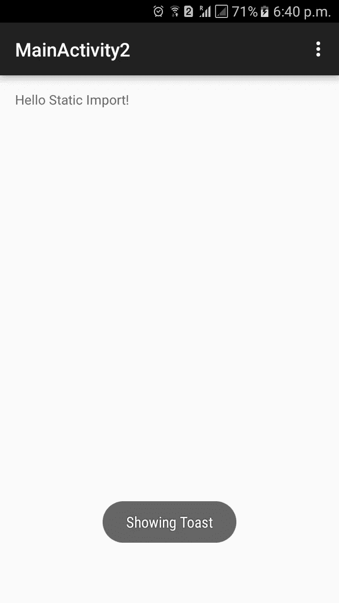

# 改进 Android 代码的 Kotlin 技术

> 原文：<https://www.sitepoint.com/kotlin-techniques-that-improve-your-android-code/>

本文涵盖了一些技术，这些技术使得用 Kotlin 编写 Android 代码变得高效而简单。Kotlin 是一种通用语言，可以编译成 Java 字节码，由开发 IntelliJ IDE 的 JetBrains 开发。你可以在 [GitHub](https://github.com/sitepoint-editors/kotlinefficienttechniques) 找到这篇文章的代码

## 在 Kotlin 中使用静态布局导入

使用 Android 的一个难点是当我们想要使用活动中的一个视图时。我们必须使用“findViewById()”函数，然后将其类型转换为适当的视图类型。Kotlin 采用了一种不同的方法:它允许您导入布局文件中的所有视图。例如，假设我们有一个如下的布局文件

```
<RelativeLayout xmlns:android="http://schemas.android.com/apk/res/android"
    xmlns:tools="http://schemas.android.com/tools" android:layout_width="match_parent"
    android:layout_height="match_parent" android:paddingLeft="@dimen/activity_horizontal_margin"
    android:paddingRight="@dimen/activity_horizontal_margin"
    android:paddingTop="@dimen/activity_vertical_margin"
    android:paddingBottom="@dimen/activity_vertical_margin"
    tools:context="com.kotlineffiecienttechniques.MainActivity2">

    <TextView android:id="@+id/maintextview"
        android:text="@string/hello_world"
        android:layout_width="wrap_content"
        android:layout_height="wrap_content" />

</RelativeLayout>
```

以及使用静态导入更新 maintextview 文本的活动代码:

```
package com.kotlineffiecienttechniques

import android.support.v7.app.ActionBarActivity
import android.os.Bundle
import android.view.Menu
import android.view.MenuItem
import android.widget.Toast
import kotlinx.android.synthetic.main.activity_main_activity2.*

public class MainActivity2 : ActionBarActivity() {

    override fun onCreate(savedInstanceState: Bundle?) {
        super.onCreate(savedInstanceState)
        setContentView(R.layout.activity_main_activity2)
        maintextview.text = "Hello Static Import!"

    }

}
```

在上面的代码中，如果您看到我们已经使用 import 语句“静态导入”了所有视图

```
import kotlinx.android.synthetic.main.activity_main_activity2.* 
```

完成后，您可以按如下方式更改文本视图:

```
maintextview.text = "Hello Static Import!"
```

为了编译上面的代码，您必须在您的`build.gradle`的依赖项中添加以下内容:

```
dependencies {
    compile 'org.jetbrains.anko:anko-sdk21:0.9' // sdk19, sdk21, sdk23 are also available
    compile 'org.jetbrains.anko:anko-support-v4:0.9' // In case you need support-v4 bindings
    compile 'org.jetbrains.anko:anko-appcompat-v7:0.9' // For appcompat-v7 bindings
}
```

应用插件:

```
apply plugin: 'kotlin-android-extensions'
```

并在 buildscript::dependencies 中添加以下内容

```
 dependencies {
        classpath "org.jetbrains.kotlin:kotlin-android-extensions:$kotlin_version"
    }
```

通过以上更改，如果您构建并运行应用程序，您将看到如下所示的活动


## 在 Kotlin 中创建 POJO 类

在很多应用中当我们想把 JSON/XML 转换成对象的时候。为此，当您使用 REST 服务时，我们需要保存 JSON/XML 数据的类。在 Kotlin 中定义这样的对象(在 Java 中也称为 POJO)更加方便。假设您想在 Java 中定义一个 POJO 来表示一本书，其代码如下

```
public class Book {

    private String ISBN;
    private float price;
    private int quantity;
    private String title;
    private String description;

    public String getISBN() {
        return ISBN;
    }

    public void setISBN(String ISBN) {
        this.ISBN = ISBN;
    }

    public float getPrice() {
        return price;
    }

    public void setPrice(float price) {
        this.price = price;
    }

    public int getQuantity() {
        return quantity;
    }

    public void setQuantity(int quantity) {
        this.quantity = quantity;
    }

    public String getTitle() {
        return title;
    }

    public void setTitle(String title) {
        this.title = title;
    }

    public String getDescription() {
        return description;
    }

    public void setDescription(String description) {
        this.description = description;
    }
}
```

如果我们想在 Kotlin 中定义具有相同功能的相同 POJO，可以定义如下

```
public class Book {
    public var ISBN: String = ""
    public var price: Float = 0.toFloat()
    public var quantity: Int = 0
    public var title: String = ""
    public var description: String = ""
} 
```

或者，为了更简洁，可以将其定义为数据类，如下所示。

```
data class Book2(var ISBN: String, var price: Float, var quantity: Int,
                 var title: String , var description: String) 
```

这与之前的 POJO 略有不同，因为它有一个主构造器。创建对象时，所有参数都需要传递给构造函数。当我们定义一个数据类时，它还添加了“equals”、“hashCode”、“toString”等方法。这应该是在 Kotlin 中定义 POJO 的首选方式。

正如你在上面看到的 POJO，它是用 Java 用大约 50 行代码定义的。在 Kotlin 中，这可以通过使用数据类在 7 行或 2 行中完成。

## Kotlin 中的构造函数和继承

Kotlin 使得为你的类编写构造函数变得更加容易。主构造函数成为类头的一部分。它跟在类名的后面。因此，假设我们的 Book 类有一个主构造函数，代码将如下所示

```
public class Book (var ISBN: String, var price: Float, var quantity: Int,
                   var title: String , var description: String){

} 
```

上面的代码定义了一个主构造函数，我们在其中传递值。成员用值初始化。

现在创建一个 Book 类的对象如下

```
val book1 = Book("123456", 43.0f, 4, "Kotlin for you", "Book on Kotlin")
```

这消除了编写单独的构造函数的样板代码。构造函数只是将传递的参数复制到成员变量中。如果您使用 Java 编写 Android 应用程序，那么编写这样的构造函数是必要的。

科特林的继承也更安全；所有的 Kotlin 类都不能扩展，除非它们被定义为`open`。

所以如果你要扩展`Book`，那么它应该被定义如下

```
open public class Book (var ISBN: String, var price: Float, var quantity: Int,
                   var title: String , var description: String){

    open fun getShippingPrice():Float {
        return price;
    }
}
```

假设我们有一个子类`HardCoverBook`，它扩展了`Book`类，也覆盖了`getShippingPrice`函数。其代码如下所示:

```
class HardCoverBook(ISBN: String, price: Float, quantity: Int,
                    title: String , description: String) :
        Book(ISBN, price, quantity, title, description) {

    override fun getShippingPrice():Float {
        return price + 3.0f;
    }
}
```

## 在 Kotlin 中使用 lambda 函数

在 Android 中，我们经常有以一个接口作为参数的函数。在这种情况下，使用 Kotlin lambda 函数很方便。看看我们如何在视图上设置一个`onClickListner`

```
maintextview.setOnClickListener({ view -> Toast.makeText(this, "Showing Toast", Toast.LENGTH_SHORT).show(); }) 
```

这只是一句台词。我们甚至不需要指定参数视图的类型，因为它可以静态地推断出来。Java 中的等效代码是

```
maintextview.setOnClickListener(new OnClickListener() {
    @Override
    public void onClick(View v) {
        Toast.makeText(this, "Showing Toast", Toast.LENGTH_SHORT).show(); 
    }
});
```

如果我们按照上面所示的 Kotlin 代码设置`onClickListener`来运行程序，您应该会看到如下所示的 toast:


## 结论。

以上是几个例子，有助于用 Kotlin 为 Android 编写简洁的代码。Kotlin 是一种新语言，但受到 Jetbrains 的支持，并且具有很好的潜力。当你的 Android 程序使用 Kotlin 而不是 Java 时，apk 的大小会增加。但是你可以用它更快地开发代码。所以，祝你在 Kotlin 中编写下一个 Android 应用时愉快。

## 分享这篇文章