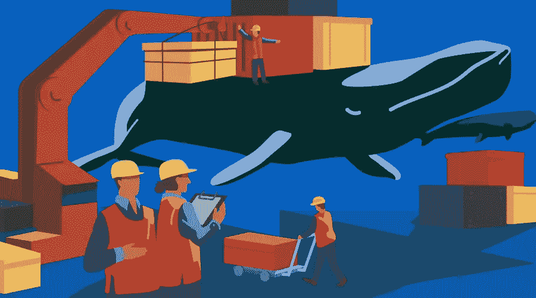

# Kubernetes 简介:如何部署 Node.js Docker 应用程序

> 原文：<https://www.sitepoint.com/kubernetes-deploy-node-js-docker-app/>



虽然容器技术已经存在了很多年，但 Docker 真正让它成为了主流。很多公司和开发者现在使用容器来发布他们的应用。Docker 提供了一个易于使用的接口来处理容器。

然而，对于任何重要的应用程序，您将不会部署“一个容器”，而是在多个主机上部署一组容器。在本文中，我们将了解一下 Kubernetes，这是一个用于自动化部署、扩展和管理容器化应用程序的开源系统。

> 先决条件:本文假设读者对 Docker 有所了解。如果您需要复习，请查看[了解 Docker、容器和更安全的软件交付](https://www.sitepoint.com/docker-containers-software-delivery/)。

## Kubernetes 解决什么问题？

使用 Docker，您可以使用类似于`docker run`或`docker stop`的简单命令来分别启动/停止一个容器。与这些让您在单个容器上执行操作的简单命令不同，没有`docker deploy`命令将新映像推送到一组主机。

最近出现了很多工具来解决这个“容器编排”的问题；流行的有 [Mesos](http://mesos.apache.org/) 、 [Docker Swarm](https://docs.docker.com/engine/swarm/) (现在是 Docker 引擎的一部分)、 [Nomad](https://www.nomadproject.io/) 和 Kubernetes。它们都有各自的优缺点，但可以说，Kubernetes 在这一点上最有价值。

Kubernetes(也称为“k8s”)提供了强大的抽象，将部署和扩展等应用程序操作与底层基础架构操作完全分离。因此，有了 Kubernetes，你不需要在单独的主机或虚拟机上运行你的代码，而是 Kubernetes 将底层基础设施视为一个放置容器的计算海洋。

## 不可思议的概念

Kubernetes 有一个客户端/服务器架构。Kubernetes 服务器运行在您的*集群*(一组主机)上，您将在其上部署您的应用程序。您通常使用客户端(如`kubectl` CLI)与集群进行交互。

### 分离舱

pod 是 Kubernetes 处理的基本单元，即一组容器。如果有两个或更多的容器总是需要一起工作，并且应该在同一台机器上，那么就把它们做成一个`pod`。pod 是一个有用的抽象，甚至有一个[提议](https://github.com/moby/moby/issues/8781)让它们成为一级 docker 对象。

### 结节

节点是一个运行 Kubernetes 的物理或虚拟机，可以在其上调度 pods。

### 标签

标签是用于标识资源的键/值对。例如，您可以用“角色=生产”来标记所有的`pods`服务生产流量。

### 选择器

通过选择，您可以按标签搜索/过滤资源。根据上一个示例，要获得所有生产单元，您的选择器应该是“role=production”。

### 服务

服务定义了一组 pods(通常由“选择器”选择)和访问它们的方法，例如单一稳定的 IP 地址和相应的 DNS 名称。

## 使用 Kubernetes 在 GKE 上部署 Node.js 应用程序

现在，我们已经了解了 Kubernetes 的基本概念，让我们通过在 [Google Container Engine](https://cloud.google.com/container-engine/) (称为 GKE)上部署 Node.js 应用程序来看看它的运行情况。你同样需要一个谷歌云平台账户(谷歌提供了一个[免费试用，300 美元信用](https://console.cloud.google.com/freetrial))。

### 1.安装 Google Cloud SDK 和 Kubernetes 客户端

`kubectl`是针对 Kubernetes 集群运行命令的命令行界面。你可以把它作为[谷歌云 SDK](https://cloud.google.com/sdk/) 的一部分来安装。Google Cloud SDK 安装后，运行以下命令安装`kubectl`:

```
$ gcloud components install kubectl 
```

或者`brew install kubectl`如果你在 Mac 上。验证安装运行`kubectl version`。

您还需要为您的 Google cloud 帐户设置 Google cloud SDK 凭证。只需运行`gcloud init`并按照说明进行操作。

### 2.创建一个 GCP 项目

所有的 Google 云平台资源都是在一个项目下创建的，所以[从 web UI](https://cloud.google.com/resource-manager/docs/creating-managing-projects#creating_a_project) 创建一个。

通过运行以下命令，在使用 CLI 时设置默认项目 ID:

```
gcloud config set project {PROJECT_ID} 
```

### 3.为你的应用程序创建一个 Docker 图像

这是我们将要使用的应用程序: [express-hello-world](https://github.com/jatins/express-hello-world) 。您可以在 [Dockerfile](https://github.com/jatins/express-hello-world/blob/master/Dockerfile) 中看到，我们正在使用来自 [dockerhub](https://hub.docker.com/) 的现有 Node.js 映像。现在，我们将通过运行以下命令来构建我们的应用程序映像:

```
$ docker build -t hello-world-image . 
```

通过运行以下命令在本地运行应用程序:

```
docker run --name hello-world -p 3000:3000 hello-world-image 
```

如果你访问`localhost:3000`，你应该会得到回应。

### 4.创建一个集群

现在，我们将创建一个包含三个实例(虚拟机)的集群，并在其上部署我们的应用程序。您可以通过进入[容器引擎页面](https://console.cloud.google.com/kubernetes/list)或运行以下命令，从相当直观的 web UI 中完成此操作:

```
$ gcloud container clusters create {NAME} --zone {ZONE} 
```

让我们通过运行以下命令在`us-east1-b`中创建一个名为`hello-world-cluster`的集群

```
$ gcloud container clusters create hello-world-cluster --zone us-east1-b --machine-type f1-micro 
```

这将启动一个包含三个节点的集群。我们使用 f1-micro 作为机器类型，因为它是最小的，以确保最低的成本。

通过运行以下命令将您的`kubectl`客户端连接到您的集群:

```
gcloud container clusters get-credentials hello-world-cluster --zone us-east1-b 
```

所以，现在我们有了一个 docker 映像和一个集群。我们希望将该映像部署到我们的集群中，并启动容器来满足请求。

### 5.将 Docker 图像上传到 Google 容器图像注册表

Google container image registry 是一个云注册表，您可以在其中推送您的图像，这些图像会自动对您的容器引擎集群可用。要推送一个图像，你必须用一个合适的名字来构建它。

要构建此应用程序的容器映像并标记它以便上传，请运行以下命令:

```
$ docker build -t gcr.io/{PROJECT_ID}/hello-world-image:v1 . 
```

`v1`是图像的*标签*。

下一步是上传我们刚刚创建的图像:

```
$ gcloud docker -- push gcr.io/{PROJECT_ID}/hello-world-image:v1 
```

### 6.首次部署

现在我们在云中有了一个集群和一个映像。让我们用 Kubernetes 在集群上部署这个映像。我们将通过创建一个`deployment`规范文件来实现。部署是一个 kubernetes 资源，所有的 kubernetes 资源都可以由一个规范文件以声明的方式定义。这个 spec 文件规定了资源的期望状态，Kubernetes 计算出如何从当前状态进入期望状态。

让我们为第一次部署创建一个:

**deployment.yml**

```
apiVersion: apps/v1beta1
kind: Deployment
metadata:
  name: hello-world-deployment
spec:
  replicas: 2
  template:
    metadata:
      labels: # labels to select/identify the deployment
        app: hello-world  
    spec:     # pod spec 
      containers: 
      - name: hello-world 
        image: hello-world-image:v1 # image we pushed
        ports:
        - containerPort: 3000 
```

这个规范文件说:启动两个 pod，每个 pod 由给定的 pod 规范定义。每个 pod 应该有一个容器，里面装着我们推动的`hello-world-image:v1`。

现在，运行:

```
$ kubectl create -f deployment.yml --save-config 
```

您可以通过运行`kubectl get deployments`来查看您的部署状态。要查看部署创建的 pod，请运行以下命令:`kubectl get pods`。您应该会看到正在运行的 pod:

```
$ kubectl get pods
NAME                                     READY     STATUS    RESTARTS   AGE
hello-world-deployment-629197995-ndmrf   1/1       Running   0          27s
hello-world-deployment-629197995-tlx41   1/1       Running   0          27s 
```

请注意，我们有两个 pod 正在运行，因为我们在 deployment.yml 文件中将副本设置为 2。

要确保服务器已启动，请运行以下命令检查日志:

```
$ kubectl logs {pod-name}  # kubectl logs hello-world-deployment-629197995-ndmrf 
```

### 7.向互联网公开服务

要将服务公开给互联网，您必须将虚拟机置于负载平衡器之后。为此，我们创建了 Kubernetes `Service`。

```
$ kubectl expose deployment hello-world-deployment --type="LoadBalancer" 
```

在幕后，它创建了一个`service`对象(服务是一个 Kubernetes 资源，就像部署一样),还创建了一个 Google Cloud 负载平衡器。

运行`kubectl get services`查看您服务的公共 IP。控制台输出应该如下所示:

```
NAME                     CLUSTER-IP       EXTERNAL-IP      PORT(S)          AGE
hello-world-deployment   10.103.254.137   35.185.127.224   3000:30877/TCP   9m
kubernetes               10.103.240.1     <none>           443/TCP          17d 
```

访问`http://<EXTERNAL-IP>:<PORT>`访问服务。也可以买个自定义域名，让它指向这个 IP。

### 8.扩展您的服务

假设您的服务开始获得更多的流量，您需要启动更多的应用程序实例。在这种情况下，要想扩大规模，只需编辑您的 *deployment.yml* 文件，将`replicas`的数量改为比如说 3，然后运行`kubectl apply -f deployment.yml`，您很快就会有三个 pod 在运行。也可以设置自动缩放，但这超出了本教程的范围。

### 9.打扫

完成后，不要忘记清理资源，否则，他们会继续蚕食你的谷歌积分！

```
$ kubectl delete service/hello-world-deployment
$ kubectl delete deployment/hello-world-deployment
$ gcloud container clusters delete hello-world-cluster --zone us-east1-b 
```

## 包扎

我们已经在本教程中涉及了很多内容，但就 Kubernetes 而言，这只是皮毛。您还可以做更多的事情，比如用一个命令将您的服务扩展到更多的 pods，或者在 pods 上安装`secret`用于 AWS 凭证等。然而，这应该足以让你开始。前往 [kubernetes.io](https://kubernetes.io/) 了解更多信息！

*这篇文章由 [Graham Cox](https://www.sitepoint.com/author/gcox/) 进行了同行评审。感谢 SitePoint 的所有同行评审员使 SitePoint 的内容尽可能做到最好！*

## 分享这篇文章