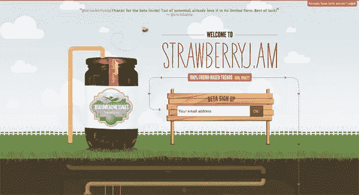
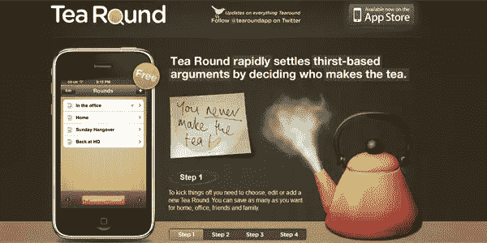

# 有效登录页面的剖析

> 原文：<https://www.sitepoint.com/landing-page-optimization-tips-2/>

有许多不同的方式来经营网上业务，方法将根据行业、目标客户和许多其他因素而有所不同。营销人员通常关心的是获得在线曝光率、增加可见性和吸引网络流量，但所有在线业务的最终目标(偶尔被忽视)不仅仅是产生兴趣——而是产生收入。

换句话说，所有的营销人员都在从事吸引访客和潜在客户，并将他们转化为买家和用户的业务。这就是登陆页面的目的和意图。在大多数情况下，登陆页面是访问者点击后看到的第一样东西，比如说，一个网络广告。请注意，登录页面不一定是您的主页；这是一个精心制作的网页，你发送访问流量“登陆”从本质上来说，登陆页面的工作是提示访问者采取某种行动，无论是购买、下载还是注册会员。一个有效的登陆页面能够吸引浏览者的注意力，因此有时被称为“线索捕捉页面”。

老实说，你的网站可以由业内最好的设计师来设计，但是如果你的登陆页面缺乏，你很可能会得到一个漂亮的网站，而不是很多业务。不要误解我的意思，漂亮的页面有其吸引力，但是如果你没有将这些人转化为客户或会员，你就浪费了一个重要的机会。

那么，如何将你的访客转化为顾客呢？简而言之，就是反复优化你的登陆页面，改善你所拥有的，增加你所缺少的，删除那些可能会让访问者远离你的产品或服务的内容。以下是一些常见的焦点领域，通过仔细研究和不断迭代，可以将其打磨得尽善尽美。

### 内容

#### 头条新闻

你的标题是大多数访问者到达你的登陆页面时看到的第一个东西，这应该是你的页面上最大和最有思想的元素之一。不仅大小很重要(因为你想抓住他们的注意力)，标题的内容也很重要。

你的标题应该引人入胜。不仅如此，它还应该在措辞上保持一致，首先赞美将访问者引向登录页面的广告。换句话说，如果你的广告是某种承诺或优惠，你的标题必须与之完全匹配。对于一个有效的标题来说，位置和大小很重要，但是不要忘记保持清晰和简洁。

#### 身体

登陆页面的主体是最关键的部分，因为这是你的主要信息将被呈现的地方。那些看到细则的访问者会认真考虑你的提议，所以拥有简洁、有说服力的信息将访问者从一个好奇的、考虑的访问者转变成一个真正的顾客是至关重要的。

尽管你的正文有一个非常重要的目的，你还是要避免在你的页面上放太多的文字。当客户故意决定不购买你的服务时，他们会离开，但如果他们只是感到无聊或分心，他们也会离开。把你的登陆页面想象成一个广告牌标志；不要让你的空间过于拥挤，只包括绝对必要的东西。就图像而言，不要害怕使用它们，因为在某些情况下，你可以用文字代替图像或视频。请记住，如果您使用视频或图像，请将它们制作得足够大，以便人们在体验时不会过度疲劳。

#### 行动号召按钮

行动号召按钮(或 CTA)也非常重要。如果你的行动号召不是清晰可见且极具吸引力，那么你其他的努力都没有意义。当创建你的 CTA 时，确保它明确地向你的访问者描述了他们在做什么。有效的 CTA 通常会显示一个循序渐进的过程，说明访问者将会做什么以及他们最终会获得什么。这样做可以让你的 CTA 清晰，让你的访客对他们的行为充满信心。有效的 CTA 还会使用强烈、果断的措辞来吸引观众的注意力——考虑使用“立即下载”这样的措辞来代替“尝试一下”这样的措辞最终，你把 CTA 放在哪里取决于你的设计，但是要确保它有一个显眼的位置，在那里它总是可见的。

#### 信任指标

许多登录页面要求访问者输入一些敏感信息，如电子邮件地址和电话号码，因此信任和可信度是重中之重。有几种方法可以证明你的网站是合法的和值得信赖的，其中之一就是证明。如果你有积极的反馈，总是考虑在你的网站上展示。

对于允许网上购物的网站来说，安全认证也是值得加强的；使用某种形式的安全认证的网站通常会看到销售额和收入的增长。问问你自己，如果你是一个访问者，你是否会信任你的网站，如果答案不是肯定的“是”，那么你应该考虑添加某种形式的信任指标。如果你不需要安全认证或者没有任何反馈可以使用，考虑提供一个无风险的试用版，让访问者预先试用你的产品。

最后，如果你的产品或服务已经被知名品牌或媒体报道或评论过(正面的),考虑把这些作为你自身可信度的额外证明。

### 设计

#### 在折叠上方

在设计你的登陆页面时，考虑一下广告牌的运作方式。当你在高速公路上时，你只有几秒钟的时间去阅读一个标志。你不必到处寻找；报价就在你的视线之内。折叠设计意味着你设计你的页面就像一个广告牌。如果你在折叠上方设计，访问者没有理由需要向下滚动来阅读相关信息。

现在，这并不意味着你不应该有一个可滚动的页面，而是意味着任何你想让访问者看到和知道的东西都不应该在你设计的下半部分。如果你现在有一些信息应该在页面的顶部，但是没有，考虑重新安排元素来纠正这个问题。

#### 颜色

无论是你的网站，标志，甚至是产品包装，错误的颜色选择会毁掉你的设计，而正确的选择可能会吸引更多感兴趣的访问者。众所周知，颜色会影响观看者的情绪，因此选择正确的颜色非常重要。考虑[研究不同的颜色及其含义](https://www.sitepoint.com/color-theory-101-2/ "Color Theory 101")看看什么颜色最适合你的网站。例如，在网页设计中使用黑色会让你的网站看起来更精致，而蓝色会给人一种安全感。

#### 安置

当你重新排列你的页面元素时，试着把相似的元素放在一起，因为这将使你的布局有凝聚力和组织性。不要犹豫[利用空白](https://www.sitepoint.com/embracing-negative-space-in-your-designs-white-space-tips-to-consider-and-examples-to-admire/ "Embracing Negative Space in Your Designs: White Space Tips to Consider and Examples to Admire")，因为你不想把元素放在彼此的顶部而使你的页面过于拥挤。当你把你的内容放在登陆页面上时，试着追求简约的感觉，让你的访问者知道你做了深思熟虑的选择，并为他们有限的时间和注意力提供了一个非常简洁的提议。

#### 大小

就大小而言，要么做大，要么回家。如前所述，你的标题应该足够大以吸引访问者的注意力。这个原理对图像和视频同样有效。CTA 之类的元素也应该足够大，不可能被遗漏，但也不能大到占据整个页面。尝试使用不同的效果，如阴影和粗轮廓，来引起对某些元素的注意，而不必将它们放大。

### 结论

正如你所看到的，优化你的登陆页面并不需要什么秘密知识，但是这些简单的改变和添加不仅会帮助你的登陆页面脱颖而出，还可能有助于提高你的转化率。要想知道什么最适合你的网站，总是要测试不同的版本，看看哪个最适合你的访问者。

你尝试过哪些让你的登陆页面更有效的方法？你认为登陆页面优化是需要稳定迭代的简单工作，还是有营销人员和设计人员可以一次就创建一个完美的登陆页面？

## 分享这篇文章