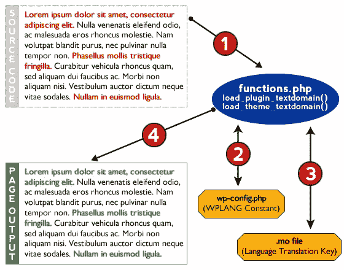

# WordPress 中的语言流畅性:理解 I18n 的基础

> 原文：<https://www.sitepoint.com/language-fluency-in-wordpress-understanding-the-basics-of-i18n/>

随着 WordPress 在世界范围内的成功和地理覆盖，很容易理解为什么能够无缝地将插件、主题和 WordPress 本身翻译成其他语言是有用的。

然而，这并不一定使它容易被采用，而且理由很充分。

对于许多 WordPress 开发者来说，本地化(或者有时被称为国际化)是许多困惑和普遍焦虑的根源。毕竟，我们是 web 开发人员，对吗？我们不是语言专家，用简单的英语给程序中的字段加上标签要容易得多。

此外，试图找出如何自己将文本字符串翻译成其他语言的想法(更不用说让别人帮你翻译了)可能会让经验丰富的开发人员感到轻微的恶心，他们以前从来没有真正需要或倾向于这样做。

但是相信我……这真的没有那么糟糕，它可以显著增加你的自定义 WordPress 插件和主题的有用性和用户基础。让我们从基础开始，把它分成小块。

**国际化的基础&本地化**

让我们稍微检查一下前面提到的发展恶心。我们许多人学习编码的方式，在编写 PHP 程序时牢记语言考虑的概念，充其量是相当学术性的。

大多数商业编码项目都有明确的目标受众，不考虑翻译通常是合理的假设。

然而，由于 WordPress 插件和主题最终会在用户可以用他们自己的语言使用时变得更加有用，我们需要一个系统的方法来纠正这个问题。

输入 i18n——另一个有趣的缩略词。由于单词*【国际化】*中的 *i* 和 *n* 之间有 18 个字母，I18n 描述了创建被设计成翻译成其他语言的软件系统的概念。

将该软件实际翻译成特定语言的过程称为*本地化*或 *l10n* (你能猜出单词*【本地化】*中的*【l】*和*【n】*之间有多少个字母吗？).WordPress 利用一个称为 GNU gettext 的特定框架来处理 i18n 几乎所有开源软件都使用的事实上的标准系统。GNU gettext 实际上只是一个 PHP 助手函数库。

因为 WordPress 被直接编码到核心中，它有必要的钩子允许你作为一个开发者在你的主题和插件中定义文本字符串变量，以及一个标准化的系统来为每一个字符串提供无限多种语言的翻译。

**定位过程的剖析**

总的来说，本地化过程非常简单。从概念上讲，主题或插件的流程有三个关键部分:

1.  在你的主题或插件中使用 GNU gettext 标记，让 WordPress 知道翻译哪些字符串
2.  一个将你的主题或插件中的标记链接到一个提供翻译密钥的文件的功能，以及
3.  提供翻译关键字的文件，本质上是在可翻译字符串和给定字符串的翻译之间建立一对一的关系。

让我们更详细地讨论一下这三个组件各自的功能。

组件#1: GNU gettext 标记，让 WordPress 知道翻译哪些字符串

首先，我们需要让 WordPress 知道我们将要翻译哪些字符串。这是直接在你的主题或插件的输出代码中完成的，方法是用一个 PHP 函数包装一个特定的字符串，该函数标识你想要做的本地化的类型，然后通过一个过滤器运行你的原始字符串，该过滤器将返回正确的版本。

虽然有一系列函数允许您以不同的方式定义或输出本地化字符串，但实际上只有两个本地化函数可供您在大多数情况下使用:

```
__( 'string', $domain )
```

这是一个*双下划线*，它返回一个本地化的字符串。

```
_e( 'string', $domain )
```

这是一个*下划线“e”*，它直接在浏览器中打印出本地化的字符串

注意，`__`和`_e`都有两个参数:一个字符串和一个域。在这种情况下，域严格地说是唯一的标识符，只不过是附加到特定翻译文件的标签。组件#2 中定义了这种关系。

组件#2:一个将你的主题或插件中的标记链接到一个提供翻译关键字的文件的函数

在你的主题或者插件中，你需要在你想要翻译的字符串和一个翻译文件之间建立一个关系，该文件为字符串翻译提供一个关键字。

这是通过使用两个 PHP 函数中的一个来完成的:`load_theme_textdomain()`用于主题，或者`load_plugin_textdomain()`用于插件。

在主题本地化的情况下，您将在您的`functions.php`文件中使用`load_theme_textdomain()`。该函数采用两个参数，如下所述:

```
load_theme_textdomain( $domain, $path )
```

`$domain`:分配给自定义可翻译字符串的唯一标识符

`$path`:主题内翻译密钥文件的路径

主题本地化关闭了`wp-config.php`中的`WPLANG`常量，但是我们将在后面详细讨论。

插件本地化的工作方式与主题本地化非常相似，但是有一些不同。在核心 PHP 文件或支持 i18n 的插件中设置，`load_plugin_textdomain()`采用如下所述的三个参数:

```
load_plugin_textdomain( $domain, $abs_rel_path, $plugin_rel_path )
```

`$domain`:分配给自定义可翻译字符串的唯一标识符

从 WP 2.7 开始，一个可选的、不推荐使用的函数。将它默认为 false 或忽略它，这没什么好担心的

`$plugin_rel_path`:翻译密钥文件的相对路径。如果您没有定义这个路径，它将默认为文件所在的根目录。虽然根据定义这是一个可选参数，但最好的做法是将语言翻译文件与逻辑文件分开，因此通常需要在这里指定一个值。

在这两个实例中，`$domain`是我们在组件#1 中引用的唯一标识符，仅用于定义需要翻译的代码中的字符串和组件#3(翻译键)之间的关系。

**组件#3:提供翻译密钥的文件**

GNU gettext 为我们提供了一种系统的方法，既提供了一种机制来创建单个默认字符串和它们各自的翻译之间的一对一的字符串翻译关系，又以一种高效的方式将这些不同的字符串翻译提供给 WordPress。这是通过`.PO`和`.MO`文件完成的。

`.PO`文件是为特定语言提供人类可读且可编辑的翻译密钥的文件。例如，如果你的主题或插件是用英语写的，并且你有现成的法语、德语和盗版英语的翻译，你将有三个相应的`.PO`文件:每种语言一个。当进行特定的字符串翻译时，它发生在这个文件中。

虽然`.PO`文件对用户友好且易于编辑，但在实际翻译过程中，它们并不适合 WordPress 使用。相反，WordPress 将使用一个`.MO`文件进行实际翻译。`.MO`文件是在你使用 Poedit 之类的辅助工具时，可以自动为你生成的编译文件。每个`.PO`文件都有一个对应的`.MO`文件，每次`.PO`文件更新时，该文件都会更新。

最终文件的相关文件类型是`.POT`文件，或`.PO`模板文件。一个`.POT`文件是一种特殊的`.PO`文件，它是本地化实例中任何`.PO`文件的精确副本，除了它没有任何翻译。让翻译人员可以使用`.POT`文件，这样任何人都可以使用助手工具轻松地将你的主题和插件翻译成他们自己的母语。

**将碎片拼在一起**

现在我们知道了本地化过程中的主要组件，让我们来看看它们是如何在 WordPress 中协同工作的。请考虑下图:



我们将从程序的源代码开始。

当浏览器最初移动以调用特定页面时，当它识别源代码包装文本字符串中的`__()`和`_e()`函数时，翻译过程开始。

WordPress 能够识别这些函数，因为 GNU gettext 内置在核心中，并且自动寻找翻译它们的方法。此时您的`functions.php`文件已经被加载，WordPress 能够使用`functions.php`文件中的`load_plugin_textdomain()`或`load_theme_textdomain()`函数来识别将字符串连接到库位置*(如上图中的步骤 1 所示)*。

`load_plugin_textdomain()`或`load_theme_textdomain()`然后从`wp-config.php` *(上图第 2 步)*中设置的`WPLANG`常量中检索区域设置信息，并检索与区域设置*(上图第 3 步)*相关的适当的`.MO`文件。

如果正确命名的`.MO`存在，函数将翻译后的字符串输出到浏览器*(上图中的步骤 4)*。

如果一个正确命名的`.MO`文件不存在，或者对于任何在`.MO`文件中没有翻译条目的字符串，默认的措辞被输出到浏览器。

最后，`.MO`文件是一个`.PO`文件的编译版本，它是人类可编辑的。同样，`.PO`文件有模板文件，允许翻译人员轻松地将程序中的字符串修改成其他语言。

看起来我在这篇文章中没有足够的空间来用一些例子来说明所有这些，这些例子真正地将整个概念过程带入了 WordPress 的生活，但是我将在下周用另一篇[文章继续深入研究实际涉及的代码](https://www.sitepoint.com/rolling-up-your-sleeves-and-getting-into-the-nitty-gritty-of-i18n-in-wordpress/)。

## 分享这篇文章