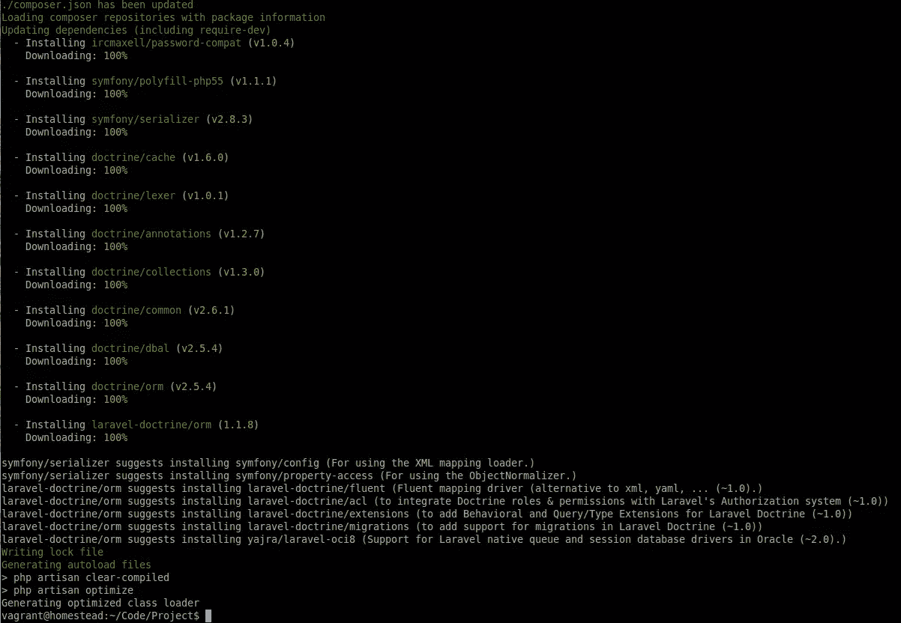
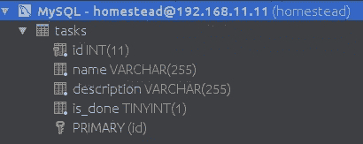
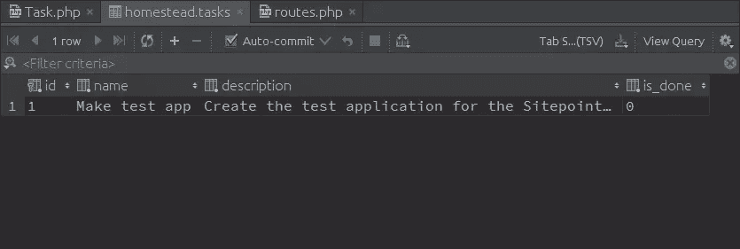
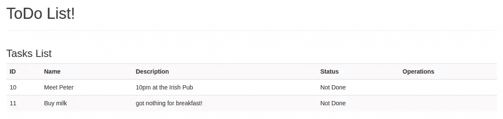
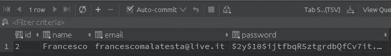
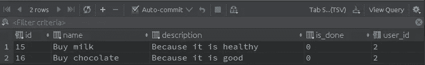

# 拉勒维尔主义——两全其美？

> 原文：<https://www.sitepoint.com/laravel-doctrine-best-of-both-worlds/>

Laravel Doctrine 是著名的 ORM 对 [Laravel 5 的一个嵌入式实现。x 框架](https://www.sitepoint.com/php/)，以及默认选择的一个非常有趣的替代方案，[雄辩](https://laravel.com/docs/5.2/eloquent)。在这篇文章中，我们将学习如何使用它，以及何时使用。


## 为什么学说，而不是雄辩？

我们这些至少用过一次 Laravel 的人，可能用过口才。我们都喜欢它流畅而简单的语法，我们都知道像下面这样的片段:

```
$user = new App\User;
$user->name = 'Francesco';
$user->email = 'francesco@foo.bar';
$user->save(); 
```

我们这里使用的是所谓的“活动记录”模式。一种经常使用的架构模式，由 Martin Fowler 在其超著名的著作《企业应用架构模式》中命名。为了简化和解释，该模式假设数据库中的一行被视为软件中的一个对象。然而，随着时间的推移，这种模式遇到了许多批评:

*   活动记录是关于数据库操作和我们软件中的类之间的强耦合。对于许多小项目来说，这种方法非常好，但是如果我们的软件越来越复杂怎么办？我们可能会偶然发现对更多类的需求，这些类并不总是与数据库中的特定表相关。在这种情况下，活动记录并不能帮助我们从数据源中获得良好的抽象水平。

*   另一个主要的批评是第一个批评的直接后果:可测试性。如果模型与数据库紧密耦合，那么在没有模型的情况下构建测试会更加困难。不得不说，这个问题的一部分可以通过嘲讽和对依赖注入的良好使用来减少(而不是解决)。

现在，在我们之前提到的同一本书里，Martin Fowler 解释了另一种架构模式:数据映射器。数据映射器由中间层的**存在组成，该中间层双向工作，一方面提供对数据源的访问，另一方面提供对数据源的良好抽象**。这意味着软件中的对象与数据源并不密切相关，在责任隔离方面有很大的改进。结果呢？开发人员现在可以专注于构建更接近真实世界情况的对象，而不是为工作选择的数据库系统。

雄辩是主动记录模式的实现，而教条是数据映射器的实现。让我们看看如何为 Laravel 安装 Doctrine，以及如何配置和使用它。

## 为拉勒维尔安装原则

像往常一样，我们将使用经过改进的作为测试的标准开发环境。

让我们创建一个新的 Laravel 项目。

```
composer create-project laravel/laravel Project 
```

然后，我们进入我们项目的文件夹，添加 Laravel 教条作为 Composer 的依赖项。

```
composer require "laravel-doctrine/orm:1.1.*" 
```



我们还需要将下面的类添加到我们的服务提供者列表中的`config/app.php`文件中:

```
LaravelDoctrine\ORM\DoctrineServiceProvider::class, 
```

此外，我们可以在同一个文件中注册 EntityManager、Registry 和 Doctrine 的三个外观:

```
'EntityManager' => LaravelDoctrine\ORM\Facades\EntityManager::class,
'Registry'      => LaravelDoctrine\ORM\Facades\Registry::class,
'Doctrine'      => LaravelDoctrine\ORM\Facades\Doctrine::class, 
```

最后，我们可以发布专用的配置文件:

```
artisan vendor:publish --tag="config" 
```

我们完了！Laravel 原则已完全安装和配置完毕。

## 示例应用程序–待办事项列表！

为了对 Laravel 的教义有更多的了解，我们将复制一个现有的使用口才的应用程序示例。Laravel 官网上的[中级任务列表](https://laravel.com/docs/5.2/quickstart-intermediate)怎么样？

我们将创建一个非常基本的多用户任务列表。在这个应用程序中，我们的用户将能够:

*   登录到自己的区域。
*   列出现有任务。
*   向列表中添加新任务。
*   将任务标记为完成/未完成。
*   更新列表中的现有任务。
*   从列表中删除现有任务。

显然，每个用户只能看到他们自己的任务。

让我们先将应用程序的名称空间改为`TodoList`。

```
artisan app:name TodoList 
```

好了，现在我们可以从教义的基础开始了。在《雄辩术》中，我们使用了模型。我们现在如何开始？

## 实体！

在原则上，我们使用实体来表示我们的应用对象。与模型扩展了一个基类的雄辩不同，教条实体是一个不扩展任何东西的普通 PHP 类。

这里是`Task`实体的第一个存根:

```
<?php

namespace TodoList\Entities;

class Task
{
    private $id;
    private $name;
    private $description;
    private $isDone = false;

    public function __construct($name, $description)
    {
        $this->name = $name;
        $this->description = $description;
    }

    public function getId()
    {
        return $this->id;
    }

    public function getName()
    {
        return $this->name;
    }

    public function getDescription()
    {
        return $this->description;
    }

    public function setName($name)
    {
        $this->name = $name;
    }

    public function setDescription($description)
    {
        $this->description = $description;
    }

    public function isDone()
    {
        return $this->isDone;
    }

    public function toggleStatus()
    {
        if(!$this->isDone) {
            $this->isDone = true;
        } else {
            $this->isDone = false;
        }
    }
} 
```

作为开始还不错。是的，比雄辩的模型更“啰嗦”一点。然而，这是有具体原因的。首先，如果我们仔细想想，这是一个普通的 PHP 类。它没有说它的实现，也没有额外的责任。它所做的一切都与任务本身严格相关。这是一件好事，因为这种方法与[单一责任原则](https://en.wikipedia.org/wiki/Single_responsibility_principle)更加“兼容”。

但是…

## 数据库在哪里？

在雄辩中，模型只是数据库的一个接口。有了一些“魔法”，有时甚至不用在模型中写一行代码，我们就可以开始使用它们。我们唯一要做的就是相应地设计我们的数据库。就教义而言，关键概念略有不同。

这里，我们从代表我们想要解决的“真实世界”问题的类开始设计我们的应用程序。然后，我们将类绑定到表，将属性绑定到列。

在理论上，我们可以通过几种方式做到这一点。对于本指南，我们将使用“注释”方法:

```
<?php

namespace TodoList\Entities;

use Doctrine\ORM\Mapping as ORM;

/**
 * @ORM\Entity
 * @ORM\Table(name="tasks")
 */
class Task
{
    /**
     * @ORM\Id
     * @ORM\GeneratedValue
     * @ORM\Column(type="integer")
     */
    private $id;

    /**
     * @ORM\Column(type="string")
     */
    private $name;

    /**
     * @ORM\Column(type="string")
     */
    private $description;

    /**
     * @ORM\Column(type="boolean")
     */
    private $isDone = false; 
```

使用这些注释(我们可以在`Doctrine\ORM\Mapping`类中找到)，我们将类及其属性绑定到数据库中的特定结构。在这种情况下，指向一个具有`id`、`name`和`description`字段的`tasks`表。

现在唯一剩下要做的事情，就是从这个结构开始构建数据库。教义可以为我们做到这一点:

```
artisan doctrine:schema:create
#  Creating database schema for default entity manager...
#  Database schema created successfully! 
```

让我们使用我们选择的工具(或从 CLI)检查数据库中发生了什么。



我们拿到了。

事情是这样的:

*   通过注释，我们在类中添加了一些元数据，但并没有对其进行重大修改。注释毕竟是注释。
*   通过执行 artisan `doctrine:schema:create`命令，Doctrine 自动扫描实体的 ORM 注释。当找到时，它相应地创建和修改数据库模式；

听起来很棒，对吧？现在我们可以开始使用它了。在下潜更深之前，让我们做一些测试。

## 实体管理器

既然我们的应用程序有了一个数据库，我们应该开始考虑如何插入新任务并读取它们。出于这个目的，在基本层面上，我们可以使用`EntityManager`类。

让我们在 routes 文件中添加一条新路线:

```
Route::get('test-add', function () {
    $task = new \TodoList\Entities\Task('Make test app', 'Create the test application for the Sitepoint article.');

    \EntityManager::persist($task);
    \EntityManager::flush();

    return 'added!';
}); 
```

…并通过浏览到`test-add` URL 来执行它。一旦完成，我们验证数据。



成功了！

`EntityManager`是一个特殊的类，它获取实体的实例并将它们“翻译”成数据库记录。正如我们可以清楚地看到的，持久性责任不再与模型/实体相关。但是为什么是两种不同的方法呢？那老好人`save`呢？嗯，事情有点不同。

*   `persist`方法用于给`EntityManager`类一个特定的指令。它说“嘿，EntityManager，当我给你信号时，持久化实体”。
*   `flush`方法用于执行我们之前给`EntityManager`的指令——它需要的信号。

这更加灵活，因为我们还可以选择对许多实体进行许多修改，然后最终为特定的“快照”调用单个`flush`方法。当然，我们也可以使用 Laravel 服务容器来使用 EntityManager:

```
Route::get('test-add', function (\Doctrine\ORM\EntityManagerInterface $em) {
    $task = new \TodoList\Entities\Task('Make test app', 'Create the test application for the Sitepoint article.');

    $em->persist($task);
    $em->flush();

    return 'added!';
}); 
```

`EntityManager`不仅仅是添加实体。我们可以很容易地使用它来查找现有实例。让我们尝试在另一条`find-test`路线中找到我们刚刚添加的那条。

```
Route::get('test-find', function (\Doctrine\ORM\EntityManagerInterface $em) {
    /* @var \TodoList\Entities\Task $task */
    $task = $em->find(TodoList\Entities\Task::class, 1);

    return $task->getName() . ' - ' . $task->getDescription();
}); 
```

如果我们检查网址，果然，这是我们以前插入的项目！

## 应用程序

好了，是时候从基础开始，开始享受我们真正的项目了。

我们将从任务区域开始。我们将学习如何添加、编辑、删除和列出它们。然后，我们将通过引入一个用户系统来“保护”我们的项目，在这个系统中，每个用户只能看到他们自己的任务。

### 任务区域

让我们首先为任务创建一个专用控制器。

```
artisan make:controller TaskController 
```

我们可以暂时让它空着。在`resources/views`文件夹中，让我们创建一个每个视图都将使用的非常基本的主布局。我们就称之为`master.blade.php`。

```
<!doctype html>
<html lang="en">
    <head>
        <meta charset="UTF-8">
        <title>@yield('title') :: ToDo List!</title>

        <link rel="stylesheet" href="https://maxcdn.bootstrapcdn.com/bootstrap/3.3.6/css/bootstrap.min.css" integrity="sha384-1q8mTJOASx8j1Au+a5WDVnPi2lkFfwwEAa8hDDdjZlpLegxhjVME1fgjWPGmkzs7" crossorigin="anonymous">
        <link rel="stylesheet" href="https://maxcdn.bootstrapcdn.com/bootstrap/3.3.6/css/bootstrap-theme.min.css" integrity="sha384-fLW2N01lMqjakBkx3l/M9EahuwpSfeNvV63J5ezn3uZzapT0u7EYsXMjQV+0En5r" crossorigin="anonymous">
    </head>

    <body>
        <div class="container">
            <h1>ToDo List!</h1>
            <hr>

            @if(session('success_message'))
                <div class="alert alert-success alert-dismissible" role="alert">
                    <button type="button" class="close" data-dismiss="alert" aria-label="Close"><span aria-hidden="true">&times;</span></button>
                    {{ session('success_message') }}
                </div>
            @endif

            @yield('content')
        </div>

        <script src="https://ajax.googleapis.com/ajax/libs/jquery/1.11.3/jquery.min.js"></script>
        <script src="https://maxcdn.bootstrapcdn.com/bootstrap/3.3.6/js/bootstrap.min.js" integrity="sha384-0mSbJDEHialfmuBBQP6A4Qrprq5OVfW37PRR3j5ELqxss1yVqOtnepnHVP9aJ7xS" crossorigin="anonymous"></script>
    </body>
</html> 
```

下一步是创建表单。让我们创建一个名为`add.blade.php`的新文件。

```
@extends('master')

@section('title') Add a Task @endsection

@section('content')
    <div class="row">
        <div class="col-md-12">
            <h3>Add Task</h3>
            <p>Use the following form to add a new task to the system.</p>

            <hr>

            <form action="{{ url('add') }}" method="post">
                {{ csrf_field() }}

                <p><input autofocus type="text" placeholder="Name..." name="name" class="form-control" /></p>
                <p><input type="text" placeholder="Description..." name="description" class="form-control" /></p>

                <hr>

                <p><button class="form-control btn btn-success">Add Task</button></p>
            </form>
        </div>
    </div>
@endsection 
```

最后，控制器:

```
<?php

namespace TodoList\Http\Controllers;

use TodoList\Entities\Task;
use Illuminate\Http\Request;
use Doctrine\ORM\EntityManagerInterface;

class TaskController extends Controller
{
    public function getAdd()
    {
        return view('add');
    }

    public function postAdd(Request $request, EntityManagerInterface $em)
    {
        $task = new Task(
            $request->get('name'),
            $request->get('description')
        );

        $em->persist($task);
        $em->flush();

        return redirect('add')->with('success_message', 'Task added successfully!');
    }
} 
```

`postAdd`方法具有我们添加新项目所需的逻辑。如上所示，我们正在创建我们的实体，然后用`persist`后跟`flush`保存它。

为了阅读它们，让我们创建一个名为`tasks.blade.php`的新视图:

```
@extends('master')

@section('title') Tasks List @endsection

@section('content')
    <div class="row">
        <div class="col-md-12">
            <h3>Tasks List</h3>

            <table class="table table-striped">
                <tr>
                    <th>ID</th>
                    <th>Name</th>
                    <th>Description</th>
                    <th>Status</th>
                    <th>Operations</th>
                </tr>

                @forelse($tasks as $task)
                    <tr>
                        <td>{{ $task->getId() }}</td>
                        <td>{{ $task->getName() }}</td>
                        <td>{{ $task->getDescription() }}</td>
                        <td>
                            @if($task->isDone())
                                Done
                            @else
                                Not Done
                            @endif
                        </td>
                        <td></td>
                    </tr>
                @empty
                    <tr>
                        <td colspan="5">No tasks in the list... for now!</td>
                    </tr>
                @endforelse
            </table>
        </div>
    </div>
@endsection 
```

`$tasks`将包含任务列表。这个列表的每个元素都是我们之前构建的`Task`实体的一个实例。没有神奇的方法，没有我们不记得的属性…只有我们创造的方法，保持干净！现在，去控制器那里！

```
...

class TaskController extends Controller
{
    public function getIndex(EntityManagerInterface $em)
    {
        $tasks = $em->getRepository(Task::class)->findAll();

        return view('tasks', [
            'tasks' => $tasks
        ]);
    }

... 
```

我们可以在`getIndex`中看到一些新的东西:`getRepository`方法。简而言之，存储库是一个具有非常明确职责的对象:处理持久层，从简单的实体开始(或者到达简单的实体)。这意味着我们可以继续像对待普通的 PHP 对象一样对待我们的实体，但是受益于简单的持久层管理。关于存储库模式的更多信息，请参见这里的。

我们可以为我们软件中的每个实体建立一个存储库，但是教条通过给`EntityManager`一个`getRepository`方法来创建一个包含最常用方法的真正基本的存储库，从而使我们的生活更加简单。`findAll`就是这些方法之一。

我们搜索的结果被放在`$tasks`变量中并传递给视图。



### 更改任务的状态

现在让我们看看如何将任务的状态从“未完成”切换到“完成”，反之亦然。让我们在`TaskController`中创建一个`getToggle`方法来响应`toggle/STATUS_ID` URL。

```
public function getToggle(EntityManagerInterface $em, $taskId)
{
    /* @var Task $task */
    $task = $em->getRepository(Task::class)->find($taskId);

    $task->toggleStatus();
    $newStatus = ($task->isDone()) ? 'done' : 'not done';

    $em->flush();

    return redirect('/')->with('success_message', 'Task successfully marked as ' . $newStatus);
} 
```

我们将从列表视图中调用这个特定的 URL。让我们在视图中编辑表格:

```
...

<td>{{ $task->getId() }}</td>
<td>{{ $task->getName() }}</td>
<td>{{ $task->getDescription() }}</td>
<td>
    @if($task->isDone())
        Done
    @else
        Not Done
    @endif
        - <a href="{{ url('toggle/' . $task->getId()) }}">Change</a>
</td>

... 
```

我们可以看到这次我们没有使用`persist`方法。我们调用实体的`toggleStatus`方法，然后使用`flush`。这是因为我们已经在数据库中保存了这个实体——我们只需要将一个现有的属性值更新为一个不同的值。

我们只是使用了现有实体的逻辑，而没有在控制器中放入任何东西。明天，我们可以改变框架中的一切，然而业务逻辑(`toggleStatus`方法)会有同样的效果。

### 删除任务

现在让我们考虑删除项目。

```
public function getDelete(EntityManagerInterface $em, $taskId)
{
    $task = $em->getRepository(Task::class)->find($taskId);

    $em->remove($task);
    $em->flush();

    return redirect('/')->with('success_message', 'Task successfully removed.');
} 
```

`EntityManager`用`remove`方法自动处理任务删除过程。我们可以在视图的“Operations”表列中添加一个链接，让用户删除特定的任务。

```
...

<tr>
    <td>{{ $task->getId() }}</td>
    <td>{{ $task->getName() }}</td>
    <td>{{ $task->getDescription() }}</td>
    <td>
        @if($task->isDone())
            Done
        @else
            Not Done
        @endif
            - <a href="{{ url('toggle/' . $task->getId()) }}">Change</a>
    </td>
    <td>
        <a href="{{ url('delete/' . $task->getId()) }}">Delete</a>
    </td>
</tr>

... 
```

### 修改任务

让我们创建一个`edit.blade.php`视图。

```
@extends('master')

@section('title') Edit Task @endsection

@section('content')
    <div class="row">
        <div class="col-md-12">
            <h3>Edit Task</h3>
            <p>Use the following form to edit che chosen task.</p>

            <hr>

            <form action="{{ url('edit/' . $task->getId()) }}" method="post">
                {{ csrf_field() }}

                <p><input autofocus type="text" placeholder="Name..." name="name" class="form-control" value="{{ $task->getName() }}" /></p>
                <p><input type="text" placeholder="Description..." name="description" class="form-control" value="{{ $task->getDescription() }}" /></p>

                <hr>

                <p><button class="form-control btn btn-success">Save Task</button></p>
            </form>
        </div>
    </div>
@endsection 
```

现在，对于控制器:让我们添加`getEdit`和`postEdit`方法。

```
public function getEdit(EntityManagerInterface $em, $taskId)
{
    $task = $em->getRepository(Task::class)->find($taskId);

    return view('edit', [
        'task' => $task
    ]);
}

public function postEdit(Request $request, EntityManagerInterface $em, $taskId)
{
    /* @var Task $task */
    $task = $em->getRepository(Task::class)->find($taskId);

    $task->setName($request->get('name'));
    $task->setDescription($request->get('description'));

    $em->flush();

    return redirect('edit/' . $task->getId())->with('success_message', 'Task modified successfully.');
} 
```

最后，让我们在任务列表中添加操作。

```
 <tr>
        <td>{{ $task->getId() }}</td>
        <td>{{ $task->getName() }}</td>
        <td>{{ $task->getDescription() }}</td>
        <td>
            @if($task->isDone())
                Done
            @else
                Not Done
            @endif
                - <a href="{{ url('toggle/' . $task->getId()) }}">Change</a>
        </td>
        <td>
            <a href="{{ url('edit/' . $task->getId()) }}">Edit</a> |
            <a href="{{ url('delete/' . $task->getId()) }}">Delete</a>
        </td>
    </tr> 
```

搞定了。

### 添加用户-关系

现在，我们如何定义两个实体之间的特定链接？让我们用更多的例子继续我们对教义的探索。为此，我们需要一个新的实体:T0。

```
<?php

namespace TodoList\Entities;

use Doctrine\Common\Collections\ArrayCollection;
use Doctrine\ORM\Mapping AS ORM;

/**
 * @ORM\Entity
 * @ORM\Table(name="users")
 */
class User
{
    /**
     * @ORM\Id
     * @ORM\GeneratedValue
     * @ORM\Column(type="integer")
     */
    private $id;

    /**
     * @ORM\Column(type="string")
     */
    private $name;

    /**
     * @ORM\Column(type="string")
     */
    private $email;

    /**
     * @ORM\OneToMany(targetEntity="Task", mappedBy="user", cascade={"persist"})
     * @var ArrayCollection|Task[]
     */
    private $tasks;

    /**
     * User constructor.
     * @param $name
     * @param $email
     * @param $password
     */
    public function __construct($name, $email)
    {
        $this->name = $name;
        $this->email = $email;

        $this->tasks = new ArrayCollection();
    }

    /**
     * @return mixed
     */
    public function getId()
    {
        return $this->id;
    }

    /**
     * @return mixed
     */
    public function getName()
    {
        return $this->name;
    }

    /**
     * @return mixed
     */
    public function getEmail()
    {
        return $this->email;
    }

    /**
     * @return mixed
     */
    public function getTasks()
    {
        return $this->tasks;
    }

    /**
     * Assigns the $task task to the current user.
     *
     * @param Task $task
     */
    public function addTask(Task $task)
    {
        if(!$this->tasks->contains($task)) {
            $task->setUser($this);
            $this->tasks->add($task);
        }
    }
} 
```

这里有什么新鲜事？特别是，这一点:

```
/**
 * @ORM\OneToMany(targetEntity="Task", mappedBy="user", cascade={"persist"})
 * @var ArrayCollection|Task[]
 */
private $tasks; 
```

使用`OneToMany`注释，我们在`User`实体和`Task`实体之间定义了一个新的一对多关系。我们还指定这个属性将是一个`ArrayCollection`，一个教条用于这个目的的结构。我们还定义了一些方法来访问当前用户的任务并添加一个新的任务。

```
/**
 * @return mixed
 */
public function getTasks()
{
    return $this->tasks;
}

/**
 * Assigns the $task task to the current user.
 *
 * @param Task $task
 */
public function addTask(Task $task)
{
    if(!$this->tasks->contains($task)) {
        $task->setUser($this);
        $this->tasks->add($task);
    }
} 
```

`addTask`方法调用了一个尚不存在的`setUser`方法。我们需要编辑`Task`类来反映这些变化。首先，`user`属性…

```
/**
 * @ORM\ManyToOne(targetEntity="User", inversedBy="tasks")
 * @var User
 */
private $user; 
```

…然后，用几个方法来设置和获取`user`实例。

```
/**
 * @return User
 */
public function getUser()
{
    return $this->user;
}

/**
 * @param User $user
 */
public function setUser(User $user)
{
    $this->user = $user;
} 
```

显然，在继续之前，我们需要一个数据库的“更新”版本，以确保一切正常。

```
artisan doctrine:schema:update 
```

上面的命令将根据我们的实体更新模式结构。好的，在临时路线的帮助下测试一下。

```
Route::get('test-rel', function(\Doctrine\ORM\EntityManagerInterface $em) {
    $user = new \TodoList\Entities\User(
        'Francesco',
        'francescomalatesta@live.it'
    );

    $user->addTask(new \TodoList\Entities\Task(
        'Buy milk',
        'Because it is healthy'
    ));

    $user->addTask(new \TodoList\Entities\Task(
        'Buy chocolate',
        'Because it is good'
    ));

    $em->persist($user);
    $em->flush();

    return 'Done!';
}); 
```

以下是我们在表格中可以找到的内容:





有用！这只是一个例子，但是[原则文档](https://doctrine-orm.readthedocs.org/projects/doctrine-orm/en/latest/reference/association-mapping.html)涵盖了你的应用可能需要的每一种关系。

### 认证用户

有了口才，认证变得非常非常容易。默认情况下，为身份验证系统选择的驱动程序是“雄辩的”,并且用户模型已经存在。稍加定制，教条方法也可以同样简单。

更准确地说，我们要做的是:

*   确保我们的`User`实体实现了 Laravel `Authenticatable`接口；
*   编辑`config/auth.php`文件中的配置设置；

Laravel 原则给了我们一个很酷的特质来处理我们想要实现的接口的所有必需操作。所以，我们来编辑一下`User`实体。

```
...

<?php

namespace TodoList\Entities;

use Doctrine\Common\Collections\ArrayCollection;
use Doctrine\ORM\Mapping AS ORM;
use Illuminate\Contracts\Auth\Authenticatable;

/**
 * @ORM\Entity
 * @ORM\Table(name="users")
 */
class User implements Authenticatable
{
    use \LaravelDoctrine\ORM\Auth\Authenticatable;

... 
```

注意:这个特征还将在我们的`users`表中添加两个新列(`password`和`remember_token`)。

现在我们只需更改`config/auth.php`文件中的配置值。更确切地说，是在`providers`数组中的那些。

```
...

'providers' => [
    'users' => [
        'driver' => 'doctrine',
        'model' => TodoList\User::class,
    ],

    // 'users' => [
    //     'driver' => 'database',
    //     'table' => 'users',
    // ],
],

... 
```

完成后，我们可以进入登录阶段。我们提出一个新的观点。

```
@extends('master')

@section('title') Login @endsection

@section('content')
    <div class="row">
        <div class="col-md-12">
            <h3>Login</h3>
            <p>Use the following form to login into the system.</p>

            <hr>

            <form action="{{ url('login') }}" method="post">
                {{ csrf_field() }}

                <p><input type="text" name="email" placeholder="Email..." class="form-control" /></p>
                <p><input type="password" name="password" placeholder="Password..." class="form-control" /></p>

                <hr>

                <p><button class="form-control btn btn-success">Login</button></p>
            </form>
        </div>
    </div>
@endsection 
```

让我们用`auth`中间件来“保护”我们的`TaskController`,并在`routes.php`文件中为登录过程创建两条路由(GET 和 POST)。

```
<?php

Route::group(['middleware' => ['web']], function () {
    Route::get('test-user', function(\Doctrine\ORM\EntityManagerInterface $em) {
        $user = new \TodoList\Entities\User('Francesco', 'francescomalatesta@live.it');
        $user->setPassword(bcrypt('123456'));

        $em->persist($user);
        $em->flush();
    });

    Route::get('login', function() {
        return view('login');
    });

    Route::post('login', function(\Illuminate\Http\Request $request) {
        if(\Auth::attempt([
            'email' => $request->get('email'),
            'password' => $request->get('password')
        ])) {
            return redirect('/');
        }
    });

    Route::get('logout', function() {
        \Auth::logout();
        return redirect('login');
    });

    Route::group(['middleware' => ['auth']], function () {
        Route::controller('/', 'TaskController');
    });
}); 
```

注意:还有一个添加示例用户的`test-user`途径。

### 用户的任务

即使我们已经定义了关系，任务还没有它的所有者。我们可以很快解决这个问题。

让我们在`TaskController::postAdd`方法中添加一个对`User::setUser`方法的调用。

```
public function postAdd(Request $request, EntityManagerInterface $em)
{
    $task = new Task(
        $request->get('name'),
        $request->get('description')
    );

    $task->setUser(\Auth::user());

    $em->persist($task);
    $em->flush();

    return redirect('add')->with('success_message', 'Task added successfully!');
} 
```

最后一步是实现一个有限的列表，用户只能看到自己的任务。为此，我们像这样修改`TaskController::getIndex`方法:

```
public function getIndex(EntityManagerInterface $em)
{
    /* @var User $user */
    $user = \Auth::user();

    $tasks = $user->getTasks();

    return view('tasks', [
        'tasks' => $tasks
    ]);
} 
```

通过调用`getTasks`方法，我们获得给定用户的所有任务。在这种情况下，由于`Auth::user`返回当前用户的一个实例，我们只获得登录用户的任务。

## 结论

我们的第一个 Laravel 原则的测试应用程序完成了！这并不难，是吗？

需要注意的是，Laravel Doctrine 有对[验证](https://www.laraveldoctrine.org/docs/1.1/orm/validation)的支持，可以帮助我们做[密码重置](https://www.laraveldoctrine.org/docs/1.1/orm/passwords)。同样，它为我们的实体支持[多个数据库连接](https://www.laraveldoctrine.org/docs/1.1/orm/multiple-connections)，就像本地 Laravel 为模型提供的一样。

最后但同样重要的是，在这个测试应用程序中，我们触及了*库*。然而，我们并没有充分发挥它们的潜力。事实上，当我们需要一组更专注于手头领域问题的特定功能时，我们可以扩展这个原则。文档中的[相关页面包含了很多有趣的信息。](https://www.laraveldoctrine.org/docs/1.1/orm/repositories)

你用过拉腊维尔主义吗？你会吗？为什么/为什么不？请在评论中告诉我们！

## 分享这篇文章