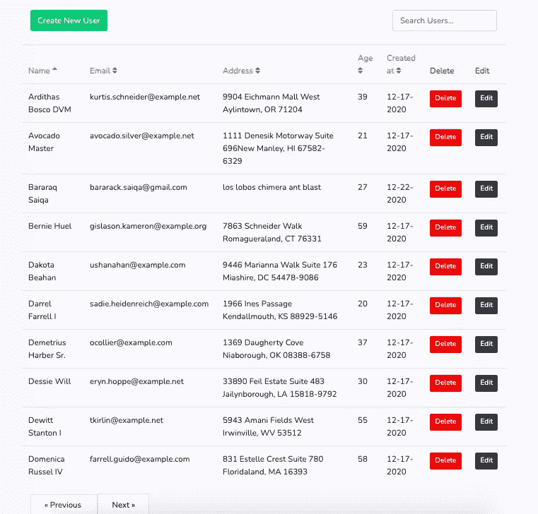

# Laravel Livewire 入门

> 原文：<https://www.sitepoint.com/laravel-livewire-getting-started/>

作为开发人员，我们总是在寻找能让我们的生活更轻松的工具、库和框架。对于 Laravel 开发者来说没什么不同。这就是为什么我们一开始就喜欢这个框架的原因，因为一切对我们来说都很容易——允许我们专注于构建令人敬畏的应用程序，而不是陷入如何实现东西的困境。

在本教程中，我们将看到另一个工具，它可以让 Laravel 开发人员的生活变得更加轻松。具体来说，我们将研究 Livewire，这是一个面向 Laravel 的全栈框架，它允许我们无需编写大量 JavaScript 就能构建动态界面。作为一名 Laravel 开发人员，一切基本上都是使用您已经熟悉的工具来完成的。

## 什么是 Livewire？

Livewire 是一个库，它允许我们使用 Blade 和一点点 JavaScript 构建反应式和动态界面。我说“一点点”是因为我们只打算编写 JavaScript 来通过浏览器事件传递数据并对它们做出响应。

您可以使用 Livewire 实现以下功能，而无需重新加载页面:

*   页码
*   表单验证
*   通知
*   文件上传预览

请注意，Livewire 并不局限于上述功能。你可以用它做更多的事情。上面的功能只是你可能想在应用中实现的最常见的功能。

## Livewire vs Vue

Vue 一直是 Laravel 开发者为其应用添加交互性的首选前端框架。如果你已经在使用 Vue 来驱动你的应用，Livewire 是你可以选择学习的。但是，如果你是 Laravel 前端的新手，并且你正在寻找 Livewire 作为 Vue 的替代品，那么是的，你可以使用 Livewire 作为 Vue 的替代品。学习曲线
不会像学习 Vue 那样陡峭，因为你将主要使用 Blade 编写你的模板文件。

有关 Livewire 和 Vue 比较的更多信息，请查看“ [Laravel Livewire vs Vue](https://blog.logrocket.com/livewire-vs-vue/) ”。

## 应用概述

我们将创建一个实时 CRUD 应用程序。所以它基本上是一个没有页面重新加载的 CRUD 应用程序。Livewire 将处理更新 UI 所需的所有 AJAX 请求。这包括通过搜索字段过滤结果，通过列标题排序，以及简单的分页(上一页和下一页)。创建和编辑用户将利用引导模式。



你可以在其 [GitHub repo](https://github.com/sitepoint-editors/livecrud) 上查看这个项目的源代码。

## 先决条件

本教程假设您有 PHP 应用程序开发的经验。在 Laravel 的经验是有帮助的，但不是必需的。如果你只知道普通的 PHP 或者另一个 PHP 框架，你仍然可以理解。

本教程假设您的计算机上安装了以下软件:

*   [PHP](https://www.php.net/manual/en/install.php)
*   [MySQL](https://dev.mysql.com/doc/refman/8.0/en/installing.html) 的实现
*   [NGINX](https://docs.nginx.com/nginx/admin-guide/installing-nginx/installing-nginx-open-source/)
*   [作曲家](https://getcomposer.org/download/)
*   [节点和 npm](https://www.sitepoint.com/quick-tip-multiple-versions-node-nvm/)

如果你用的是 Mac，一个更方便的选择是安装 [DBngin](https://dbngin.com/) 和 [Laravel Valet](https://laravel.com/docs/8.x/valet) ，而不是安装 MySQL 和 NGINX。

## 设置项目

您现在可以创建一个新的 Laravel 项目:

```
composer create-project laravel/laravel livecrud 
```

在它将生成的`livecrud`文件夹中导航。这将是根项目文件夹，您可以在其中执行本教程中的所有命令。

下一步是使用您选择的数据库管理工具创建一个 MySQL 数据库。将数据库命名为`livecrud`。

### 安装后端依赖项

我们对后端只有一个依赖，那就是 Livewire。使用以下命令安装它:

```
composer require livewire/livewire:2.3 
```

注意:我们正在安装我在创建演示时使用的特定版本。如果你将来读到这篇文章，建议你安装最新的版本。不要忘记在 GitHub repo 上查看[项目的变更日志](https://github.com/livewire/livewire/releases)，确保你没有遗漏任何东西。

### 设置数据库

更新创建`users`表的默认迁移，并添加我们将使用的定制字段:

```
// database/migrations/<timestamp>_create_users_table.php
public function up()
{
    Schema::create('users', function (Blueprint $table) {
        $table->id();
        $table->string('name');
        $table->string('email')->unique();
        $table->enum('user_type', ['admin', 'user'])->default('user'); // add this
        $table->tinyInteger('age'); // add this
        $table->string('address')->nullable(); // add this
        $table->timestamp('email_verified_at')->nullable();
        $table->string('password');
        $table->rememberToken();
        $table->timestamps();
    });
} 
```

接下来，更新`database/factories/UserFactory.php`文件，并向我们添加的定制字段提供值:

```
// database/factories/UserFactory.php
public function definition()
{
    return [
        'name' => $this->faker->name,
        'email' => $this->faker->unique()->safeEmail,
        'email_verified_at' => now(),
        'password' => '$2y$10$92IXUNpkjO0rOQ5byMi.Ye4oKoEa3Ro9llC/.og/at2.uheWG/igi', // password
        'remember_token' => Str::random(10),

        // add these
        'user_type' => 'user',
        'age' => $this->faker->numberBetween(18, 60),
        'address' => $this->faker->address,
    ];
} 
```

最后，打开`database/seeders/DatabaseSeeder.php`文件，取消对创建虚拟用户的调用的注释:

```
// database/seeders/DatabaseSeeder.php
public function run()
{
    \App\Models\User::factory(100)->create();
} 
```

不要忘记用您将要使用的测试数据库更新您的`.env`文件。在本例中，我将数据库命名为`livecrud`。完成后，运行迁移和种子程序来填充数据库:

```
php artisan migrate
php artisan db:seed 
```

### 设置前端依赖关系

为了简化，我们将使用 Laravel scaffold 进行引导。要使用它，您首先需要安装`laravel/ui`包:

```
composer require laravel/ui 
```

接下来，安装引导程序 4。这将在您的`webpack.mix.js`文件上添加配置，并创建`resources/js/app.js`和`resources/sass/app.scss`文件:

```
php artisan ui bootstrap 
```

接下来，将字体 Awsome 添加到`resources/sass/app.scss`文件中。默认情况下，这里应该已经有字体、变量和引导导入:

```
// Fonts
@import url("https://fonts.googleapis.com/css?family=Nunito");

// Variables
@import "variables";

// Bootstrap
@import "~bootstrap/scss/bootstrap";

// add these:
@import "~@fortawesome/fontawesome-free/scss/fontawesome";
@import "~@fortawesome/fontawesome-free/scss/brands";
@import "~@fortawesome/fontawesome-free/scss/regular";
@import "~@fortawesome/fontawesome-free/scss/solid"; 
```

完成后，安装所有依赖项:

```
npm install @fortawesome/fontawesome-free
npm install 
```

## 创建 Livewire 组件

您可以使用`make:livewire`命令创建一个新的 Livewire 组件:

```
php artisan make:livewire LiveTable 
```

这将创建以下文件:

*   `app/Http/Livewire/LiveTable.php` —组件的控制器
*   `resources/views/livewire/live-table.blade.php` —组件的视图文件

打开`resources/views/livewire/live-table.blade.php`文件并添加以下内容:

```
<div>
    <div class="row mb-4">
        <div class="col-md-12">
          <div class="float-right mt-5">
              <input wire:model="search" class="form-control" type="text" placeholder="Search Users...">
          </div>
        </div>
    </div>

    <div class="row">
        @if ($users->count())
        <table class="table">
            <thead>
                <tr>
                    <th>
                        <a wire:click.prevent="sortBy('name')" role="button" href="#">
                            Name
                            @include('includes.sort-icon', ['field' => 'name'])
                        </a>
                    </th>
                    <th>
                        <a wire:click.prevent="sortBy('email')" role="button" href="#">
                            Email
                            @include('includes.sort-icon', ['field' => 'email'])
                        </a>
                    </th>
                    <th>
                        <a wire:click.prevent="sortBy('address')" role="button" href="#">
                            Address
                            @include('includes.sort-icon', ['field' => 'address'])
                        </a>
                    </th>
                    <th>
                        <a wire:click.prevent="sortBy('age')" role="button" href="#">
                            Age
                            @include('includes.sort-icon', ['field' => 'age'])
                        </a>
                    </th>
                    <th>
                        <a wire:click.prevent="sortBy('created_at')" role="button" href="#">
                        Created at
                        @include('includes.sort-icon', ['field' => 'created_at'])
                        </a>
                    </th>
                    <th>
                        Delete
                    </th>
                    <th>
                        Edit
                    </th>
                </tr>
            </thead>
            <tbody>
                @foreach ($users as $user)
                    <tr>
                        <td>{{ $user->name }}</td>
                        <td>{{ $user->email }}</td>
                        <td>{{ $user->address }}</td>
                        <td>{{ $user->age }}</td>
                        <td>{{ $user->created_at->format('m-d-Y') }}</td>
                        <td>
                            <button class="btn btn-sm btn-danger">
                            Delete
                            </button>
                        </td>
                        <td>
                            <button class="btn btn-sm btn-dark">
                            Edit
                            </button>
                        </td>
                    </tr>
                @endforeach
            </tbody>
        </table>
        @else
            <div class="alert alert-warning">
                Your query returned zero results.
            </div>
        @endif
    </div>

    <div class="row">
        <div class="col">
            {{ $users->links() }}
        </div>
    </div>
</div> 
```

代码太多了，所以让我们从上到下分解一下。首先，我们有用于搜索用户的搜索字段。我们希望用户能够在输入时看到他们的查询结果。我们实现的方法是使用`wire:model`。这允许我们从组件类(`LiveTable`)中传递变量的名称。无论用户在该字段中键入什么，都将被同步到该变量的值。在本例中，我们绑定了`search`变量:

```
<input wire:model="search" class="form-control" type="text" placeholder="Search Users..."> 
```

稍后，在 LiveTable 组件类的代码中，您将看到如下代码所示的绑定变量。这些在 Livewire 中被称为[属性](https://laravel-livewire.com/docs/2.x/properties)。如果你来自 Vue，那么这就相当于这个州。只有`public`属性可以从前端直接访问:

```
// app/Http/Livewire/LiveTable.php
<?php
class LiveTable extends Component
{
  public $search = ''; // don't add this yet
} 
```

接下来，我们有表格标题。这里我们使用`wire:click.prevent`来监听 link 元素中的点击事件。这些在 Livewire 中被称为[动作](https://laravel-livewire.com/docs/2.x/actions)。它们本质上允许您监听浏览器事件，但使用后端的方法对其做出响应。使用`.prevent`阻止默认的浏览器动作。您为此提供的值是您想要在组件类中执行的方法的名称。在这种情况下，它是`sortBy`。然后我们传入我们想要排序的列的名称:

```
<th>
  <a wire:click.prevent="sortBy('name')" role="button" href="#">
      Name
      @include('includes.sort-icon', ['field' => 'name'])
  </a>
</th> 
```

下面是组件类中相应方法的样子。稍后我们将添加代码:

```
// app/Http/Livewire/LiveTable.php
public function sortBy($field)
{
  //
} 
```

在上面的代码中，我们包含了另一个名为`sort-icon`的视图文件。创建一个`resources/views/includes/sort-icon.blade.php`文件并添加以下内容。这将根据用户选择的当前排序呈现当前排序图标:

```
@if ($sortField !== $field)
    <i class="text-muted fas fa-sort"></i>
@elseif ($sortAsc)
    <i class="fas fa-sort-up"></i>
@else
    <i class="fas fa-sort-down"></i>
@endif 
```

对于加价来说差不多就是这样了。其余的代码基本上与您的标准刀片模板相同。所以我们仍然使用`links()`方法显示分页，使用`@if`指令有条件地显示一些内容。

我们现在转到组件类。打开`app/Http/Livewire/LiveTable.php`文件并更新它，使其包含以下代码:

```
<?php

namespace App\Http\Livewire;

use Livewire\Component;
use Livewire\WithPagination;
use App\Models\User;

class LiveTable extends Component
{
    use WithPagination;

    public $sortField = 'name'; // default sorting field
    public $sortAsc = true; // default sort direction
    public $search = '';

    public function sortBy($field)
    {
        if ($this->sortField === $field) {
            $this->sortAsc = !$this->sortAsc;
        } else {
            $this->sortAsc = true;
        }

        $this->sortField = $field;
    }

    public function render()
    {
        return view('livewire.live-table', [
            'users' => User::search($this->search)
                ->orderBy($this->sortField, $this->sortAsc ? 'asc' : 'desc')
                ->simplePaginate(10),
        ]);
    }
} 
```

如前所述，我们已经通过`wire:model`将`search`变量的值绑定到客户端的特定文本字段。所以每当用户输入一些东西时，`search`变量也会被更新。当它被更新时，组件也会被重新渲染。这是因为在`render()`函数中，我们依赖于`search`变量的值来获取用户数据。因此，对于每一次击键，我们实际上是通过提供用户的查询和选择的排序从数据库中获取数据(我们将在稍后的**优化**部分研究如何改进这一点):

```
User::search($this->search)
                ->orderBy($this->sortField, $this->sortAsc ? 'asc' : 'desc')
                ->simplePaginate(10) 
```

`sortBy()`方法是我们用来更新对 users 表排序的字段的方法。每个字段可以按升序或降序排序。默认情况下，单击排序字段将按升序排序。再次单击它只会产生相反的效果:

```
public function sortBy($field)
{
    if ($this->sortField === $field) {
        $this->sortAsc = !$this->sortAsc; // if field is already sorted, use the opposite instead
    } else {
        $this->sortAsc = true; // sort selected field by ascending by default
    }

    $this->sortField = $field;
} 
```

当过滤`users`表时，我们使用`search()`方法。但是我们还没有加上这个。更新`app/Models/User.php`文件以包含`search()`方法。这会过滤用户表，只返回类型为`user`的用户。那么其余的条件将是我们要用来过滤搜索字段的字段:

```
protected $casts = [
    //
];

public static function search($query)
{
    return empty($query) ? static::query()->where('user_type', 'user')
        : static::where('user_type', 'user')
            ->where(function($q) use ($query) {
                $q
                    ->where('name', 'LIKE', '%'. $query . '%')
                    ->orWhere('email', 'LIKE', '%' . $query . '%')
                    ->orWhere('address', 'LIKE ', '%' . $query . '%');
            });
} 
```

## 使用 Livewire 组件

一旦完成，搜索和排序功能应该就可以使用了。打开您的`routes/web.php`文件，用以下内容替换现有路线:

```
Route::get('/', function () {
    return view('index');
}); 
```

接下来，创建一个`resources/views/index.blade.php`文件并添加以下内容。这就是我们使用我们创建的活动表组件的地方。我们可以像处理标准组件一样将它呈现到页面中。唯一的区别是，我们需要在组件名前面加上前缀`livewire:`，我们还需要使用`@livewireScripts`来呈现 Livewire JavaScript 文件:

```
<!DOCTYPE html>
<html lang="en">
<head>
    <meta charset="UTF-8">
    <meta name="viewport" content="width=device-width, initial-scale=1.0">
    <title>{{ config('app.name') }}</title>
    <link rel="stylesheet" type="text/css" href="{{ asset('css/app.css') }}">
</head>
<body>

    <div class="container">
        <div class="row justify-content-center">
            <div class="col-md-9">
                <livewire:live-table />
            </div>
        </div>
    </div>

    @livewireScripts
    <script src="{{ asset('js/app.js') }}"></script>

</body>
</html> 
```

现在，您可以开始运行应用程序了。最简单的方法是使用 Artisan 服务于项目:

```
php artisan serve 
```

然后在您的浏览器中通过 [http://127.0.0.1:8000/](http://127.0.0.1:8000/) 访问该应用。

如果你已经建立了一个本地域，无论是通过 Laravel 代客或其他工具，那么你也可以使用它。

## 删除用户

接下来，我们来实现用户的删除。就像前面一样，我们使用`wire:click`来监听删除按钮上的点击事件。只是这一次，我们不会直接调用组件类中的方法。那是因为这是一个删除操作。我们不希望用户错误地删除某人，所以我们需要在继续删除之前显示某种确认。这是 [Livewire 事件](https://laravel-livewire.com/docs/2.x/events)的完美用例。这允许我们向服务器发送特定的事件，并从服务器接收特定的事件。您可以通过调用`$emit()`方法来使用它。它的第一个参数是事件的名称，后面的参数是您要传递给该事件的侦听器的参数。在本例中，我们有`deleteTriggered`事件，我们将用户的 ID 和名称作为参数传递给侦听器。

打开`resources/views/livewire/live-table.blade.php`文件并更新删除按钮的代码:

```
<button class="btn btn-sm btn-danger" wire:click="$emit('deleteTriggered', {{ $user->id }}, '{{ $user->name }}')">
  Delete
</button> 
```

然后，我们可以在服务器或客户端监听该事件。因为我们想要的只是在这个事件被触发时显示一个确认，所以我们在客户端监听它。创建一个`resources/js/users.js`文件并添加以下内容。如您所见，我们通过传递给监听器的参数来访问用户的`id`和`name`:

```
Livewire.on("deleteTriggered", (id, name) => {
    const proceed = confirm(`Are you sure you want to delete ${name}`);

    if (proceed) {
        Livewire.emit("delete", id);
    }
}); 
```

一旦用户同意，我们就发出实际删除用户的事件。要在后端监听事件，创建一个`$listeners`数组，其中包含监听器的名称和它们映射到的类方法。在这种情况下，事件和方法的名称是相同的，所以我们只需添加`delete.`。`delete()`方法将删除带有相应`id`的用户:

```
// app/Http/Livewire/LiveTable.php
protected $listeners = ['delete'];

public function sortBy($field)
{
    //
}

public function delete($id)
{
    User::find($id)
        ->delete();
} 
```

如果您想在用户被删除时得到某种通知，您可以[发送一个浏览器事件](https://laravel-livewire.com/docs/2.x/events#browser):

```
User::find($id)
        ->delete();
$this->dispatchBrowserEvent('user-deleted', ['user_name' => $user->name]); // add this 
```

然后在客户端，通过标准的[浏览器事件监听器 API](https://developer.mozilla.org/en-US/docs/Web/API/EventListener) 监听该事件。这里，我们只是显示一个包含已删除用户名称的警报:

```
// resources/js/users.js
window.addEventListener("user-deleted", (event) => {
    alert(`${event.detail.user_name} was deleted!`);
}); 
```

最后，不要忘记将`users.js`文件添加到`webpack.mix.js`中:

```
// webpack.mix.js
mix.js("resources/js/app.js", "public/js")
    .sass("resources/sass/app.scss", "public/css")
    .js("resources/js/users.js", "public/js") // add this
    .sourceMaps(); 
```

现在，如果您在浏览器上尝试删除用户，应该可以了。

## 创建新用户

让我们继续创建新用户。打开`resources/views/livewire/live-table.blade.php`文件，添加创建新用户的按钮。同样，我们使用`wire:click`来触发一个叫做`triggerCreate`的事件:

```
<div>
    <div class="row mb-4">
        <div class="col-md-12">
            <div class="float-left mt-5">
                <button class="btn btn-success" wire:click="$emit('triggerCreate')">Create New User</button>
            </div>

            <div class="float-right mt-5">
                <input wire:model="search" class="form-control" type="text" placeholder="Search Users...">
            </div>
        </div>
    </div>

    <!-- code for the users table from earlier -->
    <div class="row">
        @if ($users->count())
        @endif
    </div>
</div> 
```

然后在您的`resources/js/users.js`文件中，监听该事件并打开模态:

```
Livewire.on("triggerCreate", () => {
    $("#user-modal").modal("show");
}); 
```

*注意:上面的代码并不是真正的“Livewire 纯粹主义”做事方式。通常，如果你使用 Livewire，你会希望所有的交互都由 Livewire 来处理，包括模态。在本例中，我们使用 jQuery 来打开模型。这是可以原谅的，因为它只是一行代码。但是如果要用 Livewire，正确的做法是什么都用 Livewire。不能和 jQuery 混搭。当您以后需要添加前端测试时，这将有助于使事情变得更容易。*

我们实际上还没有创建 Livewire 组件，所以让我们开始吧:

```
php artisan make:livewire UserForm 
```

就像活动表一样，这将创建组件类和视图文件:

*   `app/Http/Livewire/UserForm.php`
*   `resources/views/livewire/user-form.blade.php`

首先，打开视图文件并添加以下内容。这段代码看起来很熟悉，因为它的大部分只是一个用于呈现表单的标准 Blade 模板。唯一不同的是，我们为它添加了一些 Livewire 属性，所有这些属性您都已经熟悉了:

```
<!-- resources/views/livewire/user-form.blade.php -->
<div>
    <form wire:submit.prevent="save">
        <div class="form-group">
            <label for="name">Name</label>
            <input type="text" class="form-control" id="name" name="name" wire:model="name">
            @error('name') <span class="text-danger">{{ $message }}</span> @enderror
        </div>

        <div class="form-group">
            <label for="exampleInputPassword1">Email</label>
            <input type="email" class="form-control" id="email" name="email" wire:model="email">
            @error('email') <span class="text-danger">{{ $message }}</span> @enderror
        </div>

        <div class="form-group">
            <label for="age">Age</label>
            <input type="number" class="form-control" id="age" name="age" wire:model="age">
            @error('age') <span class="text-danger">{{ $message }}</span> @enderror
        </div>

        <div class="form-group">
            <label for="address">Address</label>
            <input type="text" class="form-control" id="address" name="address" wire:model="address">
            @error('address') <span class="text-danger">{{ $message }}</span> @enderror
        </div>

        <button class="btn btn-primary" type="submit">Save</button>
    </form>
</div> 
```

此时，您已经知道当单击 save 按钮时会触发`wire:submit.prevent="save"`。`.prevent`阻止默认操作，即表单的实际提交。然后我们使用`wire:model`将每个字段绑定到组件类中的特定属性。

这段代码的另一个特点是:这是显示表单错误的标准 Blade 模板代码。您可能想知道，当我们处于 Livewire 组件中时，它在这里做什么。答案是，Livewire 也可以利用这些代码向我们显示表单错误。因此，如果用户在提交表单时没有为特定字段提供值，服务器就会发出声音，并触发以下错误:

```
@error('name') <span class="text-danger">{{ $message }}</span> @enderror 
```

接下来，打开`resources/views/index.blade.php`文件并添加模态的标记:

```
<div class="container">
    <div class="row justify-content-center">
        <div class="col-md-9">
            <livewire:live-table />
        </div>
    </div>
</div>

<!-- add this -->
<div class="modal" tabindex="-1" role="dialog" id="user-modal">
    <div class="modal-dialog" role="document">
        <div class="modal-content">
            <div class="modal-header">
                <h5 class="modal-title">User</h5>
                <button type="button" class="close" data-dismiss="modal" aria-label="Close">
                    <span aria-hidden="true">&times;</span>
                </button>
            </div>

            <div class="modal-body">
                <livewire:user-form>
            </div>
        </div>
    </div>
</div> 
```

现在我们有了前端的代码，让我们来看看后端。打开`app/Http/Livewire/UserForm.php`并添加以下内容:

```
<?php

namespace App\Http\Livewire;

use Livewire\Component;
use App\Models\User; // add this

class UserForm extends Component
{

    // add these
    public $name;
    public $email;
    public $age;
    public $address;

    public function render()
    {
        return view('livewire.user-form');
    }

    // add this
    public function save()
    {
        $validated = $this->validate([
            'name' => 'required|min:10',
            'email' => 'required|email|min:10',
            'age' => 'required|integer',
            'address' => 'required|min:10',
        ]);

        User::create(array_merge($validated, [
            'user_type' => 'user',
            'password' => bcrypt($this->email)
        ]));

        $this->resetForm();
        $this->dispatchBrowserEvent('user-saved', ['action' => 'created', 'user_name' => $this->name]);
        $this->emitTo('live-table', 'triggerRefresh');
    }

    public function resetForm()
    {
        $this->user_id = null;
        $this->name = null;
        $this->email = null;
        $this->age = null;
        $this->address = null;
    }

} 
```

这是一个很大的数字，但是其中的大部分应该已经对你有意义了，因为我们之前已经使用过它们了。所以我不会详细介绍它们。相反，让我们回顾一下为什么我用某种方式编码它的原因。

首先是我验证表单的方式。这里没什么新鲜的。这只是标准的 Laravel 表单验证代码。但是为什么我用这个而不是一个请求类呢？那是因为 Livewire 的做事方式和 Request 类不兼容。基本上，Laravel 请求类只适用于标准的 HTTP 请求。这意味着如果出现验证错误，它会将用户重定向到上一页。我们不能在 Livewire 中真正做到这一点，因为一切都是通过 AJAX 完成的:

```
$validated = $this->validate([
    'name' => 'required|min:10',
    'email' => 'required|email|min:10',
    'age' => 'required|integer',
    'address' => 'required|min:10',
]); 
```

接下来是这段代码。这里我们用`emitTo()`代替`emit()`。这为不同的组件提供了通过事件相互通信的能力。它接受组件名作为第一个参数，事件名作为第二个参数:

```
$this->dispatchBrowserEvent('user-saved', ['action' => 'created', 'user_name' => $this->name]);
$this->emitTo('live-table', 'triggerRefresh'); 
```

当我们只能使用一个事件时，为什么要使用两个独立的事件(一个浏览器事件和一个 Livewire 事件)？我们确实可以只用一个事件。问题是，一旦创建了用户，我们还需要刷新数据表。我目前还不知道从客户端触发特定组件重新加载的方法，这就是为什么我使用两个独立的事件——一个用于隐藏模式并显示警告，另一个用于刷新数据表。

现在您已经知道了代码背后的原因，让我们继续讨论这些事件的处理程序。将以下内容添加到`resources/js/users.js`文件中:

```
window.addEventListener("user-saved", (event) => {
    $("#user-modal").modal("hide");
    alert(`User ${event.detail.user_name} was ${event.detail.action}!`);
}); 
```

然后在您的 LiveTable 组件类中，添加用于`triggerRefresh`的监听器。这与`delete`监听器有点不同，因为我们指向的是一个`$refresh`函数，我们实际上并不需要将其声明为类方法。这是因为它是所有 Livewire 组件类的内置方法，允许我们重新加载整个组件:

```
// app/Http/Livewire/LiveTable.php
    protected $listeners = ['delete', 'triggerRefresh' => '$refresh']; 
```

此时，当您在浏览器上尝试时，就可以创建用户了。

## 更新现有用户

我们将实现的最后一点功能是更新用户。用以下内容更新`resources/views/livewire/live-table.blade.php`文件中的编辑按钮。因为我们在 LiveTable 组件中，编辑功能应该在 UserForm 组件中，所以我们必须使用`$emitTo()`向 UserForm 组件发出`triggerEdit`事件。与之前我们只提供单个值不同，这里我们提供整个`user`对象:

```
<td>
    <button class="btn btn-sm btn-dark" wire:click="$emitTo('user-form', 'triggerEdit', {{ $user }})">Edit</button>
</td> 
```

为了监听`triggerEdit`事件，打开`app/Http/Livewire/UserForm.php`文件并添加以下内容。单个的`user`对象被传递给这个函数，我们用它在表单字段中填充值。请注意，您访问的不是对象，而是单个字段，就像在数组中一样。一旦完成，发出`dataFetched`事件:

```
protected $listeners = ['triggerEdit'];

public function resetForm()
{
    //
}

public function triggerEdit($user)
{
    $this->user_id = $user['id'];
    $this->name = $user['name'];
    $this->email = $user['email'];
    $this->age = $user['age'];
    $this->address = $user['address'];

    $this->emit('dataFetched', $user);
} 
```

在客户端监听`dataFetched`事件。因为此时我们已经用值填充了各个字段，所以我们可以简单地打开模式:

```
// resources/js/users.js
Livewire.on("dataFetched", (user) => {
  $("#user-modal").modal("show");
}); 
```

最后，更新 UserForm 组件类中的`save()`方法来处理更新。为此，检查`user_id`字段的值。如果它有一个值，那么它意味着用户当前正在被更新。否则，我们创建它:

```
// app/Http/Livewire/UserForm.php
public function save()
{
    $validated = $this->validate([
        'name' => 'required|min:10',
        'email' => 'required|email|min:10',
        'age' => 'required|integer',
        'address' => 'required|min:10',
    ]);

    if ($this->user_id) {
        User::find($this->user_id)
            ->update([
                'name' => $this->name,
                'email' => $this->email,
                'age' => $this->age,
                'address' => $this->address,
            ]);

        $this->dispatchBrowserEvent('user-saved', ['action' => 'updated', 'user_name' => $this->name]);
    } else {
        User::create(array_merge($validated, [
            'user_type' => 'user',
            'password' => bcrypt($this->email)
        ]));

        $this->dispatchBrowserEvent('user-saved', ['action' => 'created', 'user_name' => $this->name]);
    }

    $this->resetForm();
    $this->emitTo('live-table', 'triggerRefresh');
} 
```

此时，当您在浏览器上尝试时，可以编辑用户详细信息。

## 最佳化

在这一节中，我们将介绍一些你可以做的优化，以确保你的应用程序不会使用超过它需要的服务器资源。

### 搜索字段

您可能已经注意到，在搜索字段中键入内容几乎会立即触发一个 AJAX 请求，从服务器中获取更新的数据。每次都会向数据库发送一个查询，所以这并不理想。默认情况下，Livewire 对输入应用 150 毫秒的去抖。我们希望增加延迟，这样当用户还在打字时，Livewire 就不会向服务器发送请求。下面的代码增加了 800 毫秒的去抖，所以有明显的延迟。尝试这个值以确保有一个完美的平衡:

```
<!-- resources/views/livewire/live-table.blade.php -->
<input wire:model.debounce.800ms="search"> 
```

### 表单字段

我们可以做的另一个快速优化是更新用户表单中的表单字段。就像搜索字段一样，当您键入内容时，请求几乎会立即发送到服务器。这一次，我们使用延迟更新，而不是添加去抖。只有当用户的焦点离开文本字段时，才会向服务器发送请求:

```
<!-- resources/views/livewire/user-form.blade.php -->
<input wire:model.lazy="name"> 
```

## 结论

就是这样！在本教程中，您学习了使用 Livewire 使您的 Laravel 应用程序更加动态的基础知识，而无需编写一大堆 JavaScript 来获取和提交数据到服务器。

具体来说，我们构建了一个简单的 CRUD 应用程序，它使用 Livewire 来消除对前端包(如数据表)的需求，以实现表搜索和排序。我们还消除了表单提交时刷新整个页面的需要。最后，我们利用 Livewire 事件和 browser 事件使前端和后端相互通信，而不需要编写 AJAX 代码。

你可以在这个 [GitHub repo](https://github.com/sitepoint-editors/livecrud) 上查看项目源代码。

## 分享这篇文章