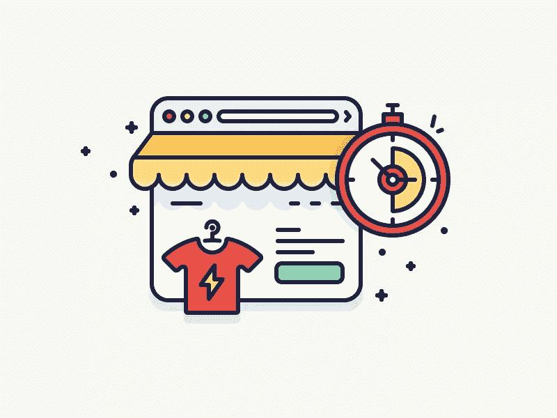

# 我如何在不到 30 分钟的时间内推出我的电子商务商店

> 原文：<https://www.sitepoint.com/launched-ecommerce-store-less-30-minutes/>

老实说，我花了 12 个月的时间试图开我的第一家店！我按照通常的方式开始。

我组建了自己的公司，寻找批发商，低估了我的营销预算需求，开发了一个[很棒的](https://dribbble.com/shots/1406488-Landing-page-for-a-book-auction)商店，手工添加了数千种产品，…

…但从未售出。

今天，我刚刚卖掉了我的电子商务项目，年销售额达 300 万美元，在我的简历中有 7 个电子商务商店，我明白我做错了什么，并找到了解决的办法。

我做了大多数人都会做的事情——我太专注于创造一个看起来很棒的商店，而不是真正努力去销售。

人们认为，如果你正在开展一项电子商务业务，你应该努力去做。他们认为，你永远不应该开设一家发展不佳的商店，或者你应该在进行任何实际销售之前，努力与批发商达成一笔超级交易。

但我发现，在这个过程中学习和创造会更有成效。你的第一步是简单地创建你的商店。一旦你的商店开始运营，你可以在以后探索广告活动和标志设计。

正如我最喜欢的名言所说:“[开始行动，变得更好](http://www.amazon.com/Velocity-Seven-Laws-World-Digital/dp/0091947561)”。

下面我将分享一个详细的教程，告诉你如何在 30 分钟内推出你的第一个电子商务商店，里面有几十种产品。它不会尽善尽美，但它会是你开始行动所需要的。

在这个例子中，我将建立一个销售非品牌时髦服装的全品类女装商店。我强烈建议你按照指南所写的去做，并在发布后尝试实现额外的功能和想法。

## 开设商店(约 5 分钟)

### 1.选择一个名字

选择一个名字现在不应该是一个大问题。想一些随机的简单的东西。对于我的女装店，我想出了:森林商店，希尔希尔商店，1999 年。

我建议添加“商店”或“商店”,因为你需要找到一个可用的互联网地址(域名),当名称中有几个单词时，更容易找到可用的地址。

### 2.创建一个 Shopify 帐户

在过去，你必须得到一台服务器，上传一个电子商务系统，雇人根据你的需要改变它，并支付维护费用。它既昂贵又耗时，最终的结果仍然是一个缓慢而低效的网站。

谢天谢地，Shopify 和其他替代软件简化了这个过程。只需点击几下鼠标，你就可以创建自己的商店，所有的服务器设置和维护都由你负责。

前往[Shopify.com](http://shopify.com)，点击“开始免费试用”，输入你的商店名称，并创建你的商店。

[//fast.wistia.net/embed/iframe/sug1apwjiw?videoFoam=true](//fast.wistia.net/embed/iframe/sug1apwjiw?videoFoam=true)