# 2020 年领先的网络工具和服务

> 原文：<https://www.sitepoint.com/leading-web-tools-services/>

*这篇赞助文章是由我们的内容合作伙伴 [Mekanism](http://mekanism.co/) 创作的。感谢您对使 SitePoint 成为可能的合作伙伴的支持。*

即使 2020 年以巨大的疫情开始——这场危机已经影响了许多人和企业——一些非常受欢迎的网络工具和服务仍然做得非常好。

在这篇文章中，你会发现更多关于 2020 年领先的网络工具和服务。有超过 30 个来自不同领域的解决方案:UI 套件、模板和仪表板；WordPress 的一整套服务；不同的 logo 创作者；一些最常用的 WordPress 主题；网站建设者，可以用 0 经验与真棒的结果；还有更多。

开始了。

## 1.[创意 Tim](https://www.creative-tim.com/)

Creative Tim 为学生和专业人士提供完全编码的 UI 工具来创建 web 和移动应用程序。它们建立在 Bootstrap、Vue.js、React、Angular、Node.js 和 Laravel 之上，这些技术都有免费版本。

一个**免费**版本包含什么？就拿现在最流行的套件来说吧，叫材料套件。

随着 Bootstrap 元素的重新设计，您会发现三个完全编码的示例页面、两个插件和 60 个元素，灵感来自 Google 的材料设计。

Creative Tim 还为开发者提供了六个捆绑包，每种技术一个。产品中包含的所有内容都可以在麻省理工学院的许可下免费下载。在该网站上，您还可以找到预制的部分和元素、管理模板和完全编码的仪表板。

如果你不认识他们，去看看他们的[网站](https://www.creative-tim.com/)和他们的[脸书页面](https://www.facebook.com/CreativeTim)。

## 2.[48HoursLogo.com](https://www.48hourslogo.com/)

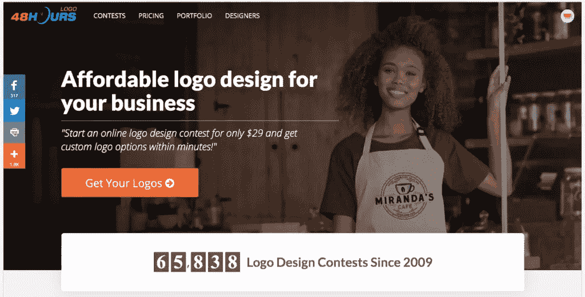

需要一个预算紧张的创意标志设计？48hourslogo 很荣幸能够在互联网上举办最实惠的标志设计大赛。客户只需发布设计简介，收到 20 多个徽标概念，然后选择他们最喜欢的设计。只需 99 美元，客户就可以期待最大的创造力和无限的徽标修改和独家徽标版权。

10 多年来，48hourslogo 已经将自由设计师与世界各地的企业家和品牌联系起来。自 2009 年以来，48hourslogo 已经帮助超过 65，000 家小企业和企业家创建了他们的标志。他们的设计师社区在此过程中上传了超过 500 万个标志，使他们成为互联网上顶级标志设计网站之一。如果你仍然不确定商标竞赛是否适合你的品牌，你可以花 29 美元开始一场竞赛。在支付全额竞赛奖金之前，看看提交的设计。

## 3. [UPQODE 网页设计公司](https://upqode.com/)

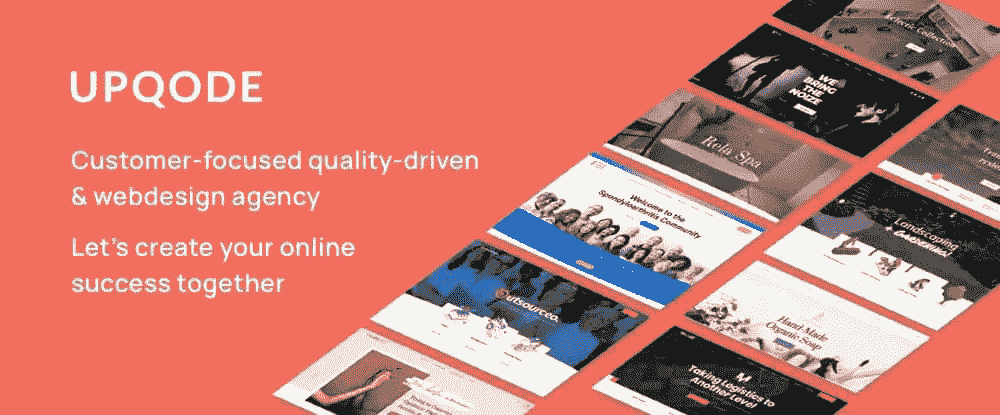

UPQODE 是一家屡获殊荣、以客户为中心、以质量为导向的数字营销和网页设计机构，专注于 WordPress。作为一家价值观驱动的公司，他们与您一对一地合作，通过创新、时尚和强大的网站推动流量并提高品牌认知度，将您的在线愿景转化为现实。

他们的目标是超越你的期望，他们通过细心和开放的工作来做到这一点。

通过花时间了解你的目标和业务目标，他们努力成为你在这个过程中的合作伙伴，而不仅仅是你的“开发者”。

透明的工作流程为您提供了对流程的深入了解和滚动的设计审批，他们知道创造在线成功的唯一途径是合作。

## 4.[总主题](https://total.wpexplorer.com/)

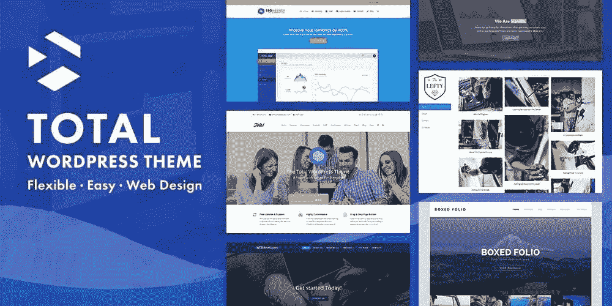

Total 是完美的 WordPress 主题，装载了你需要的一切，可以轻松设计数百个独特的网站。您会发现包括 80 多个构建器模块，40 多个预制演示，500 多个样式选项，以及一个拖放式构建器，将在整个过程中为您提供巨大帮助。

这个 WordPress 主题和其他的主题非常不同。Total 非常快速、灵活、反应灵敏、易于操作，所有的演示都可以一键安装，它会让你的网站看起来和演示中的一模一样，等等。

检查总数。这个一体化的 WordPress 主题将帮助你创建华丽的网站。

## 5.[编码员](https://www.codester.com/)

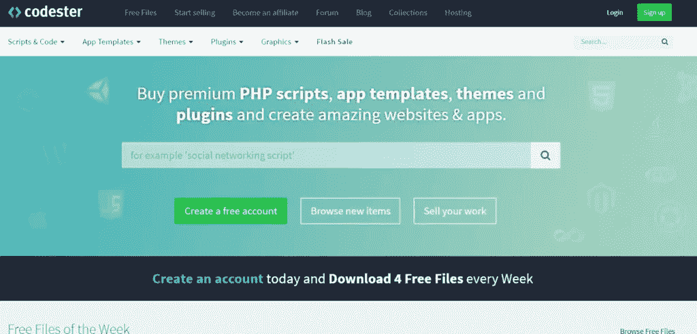

Codester 是一个巨大的市场，网页设计者和网页开发者可以在这里找到成千上万的 PHP 脚本、应用模板、主题、插件等等。

经常查看打折区，那里有打折商品出售。

## 6.[博士链接检查](https://www.drlinkcheck.com/)

每个人都讨厌断开的链接。手动清理它们是一项耗时的任务，对于非常大的旧网站来说甚至是不可能的。

“链接检查博士”将在几秒钟内自动为您进行扫描，并向您发送一份完整的报告。

输入您的网站地址，并点击开始检查按钮。就这么简单。

## 7.[设计发票模板](https://www.hellobonsai.com/a/freelance-graphic-designer-invoice-template)

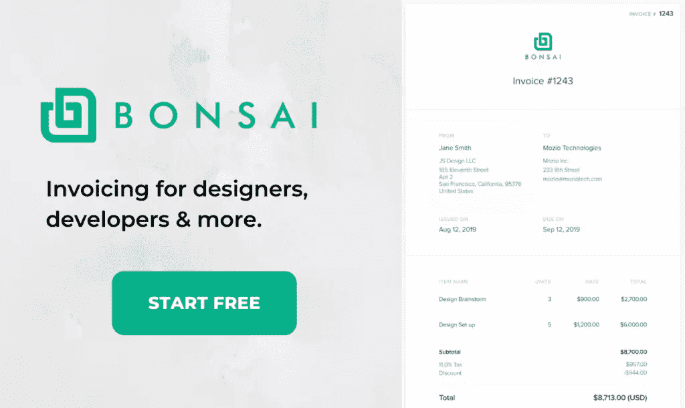

Bonsai 是一款专用的发票软件，受到 20 多万自由职业者和机构的信任，它将为您节省大量时间，让您的生活变得轻松。

可以自己做[设计发票模板](https://www.hellobonsai.com/a/freelance-graphic-designer-invoice-template)。您可以自动完成所有事情—创建、发送和提醒…甚至自动收取滞纳金。您还可以接受全球支付，等等。

像专家一样开发票。

## 8. [FunctionFox](https://www.functionfox.com/mekanism)

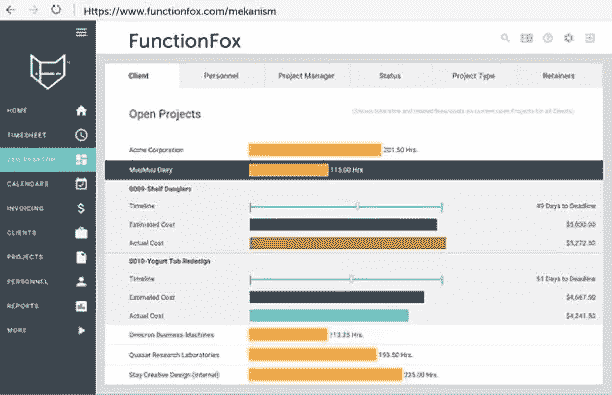

FunctionFox 是为全球远程创意团队提供时间表和项目管理软件的领先提供商。它是由一家广告公司为广告公司、平面设计师、公关、数字、营销公司和内部创意团队创建的。FunctionFox 因其简单易用、五星级服务和免费的专家建议而深受全球小公司和财富 500 强企业的喜爱。轻松处理多项工作、分配任务、创建待办事项列表以及管理资源，包括远程员工。

立即在 [FunctionFox](https://www.functionfox.com/mekanism) 获取免费演示，提高您的工作效率和盈利能力。

## 9.[莫比里斯](https://mobirise.com/)

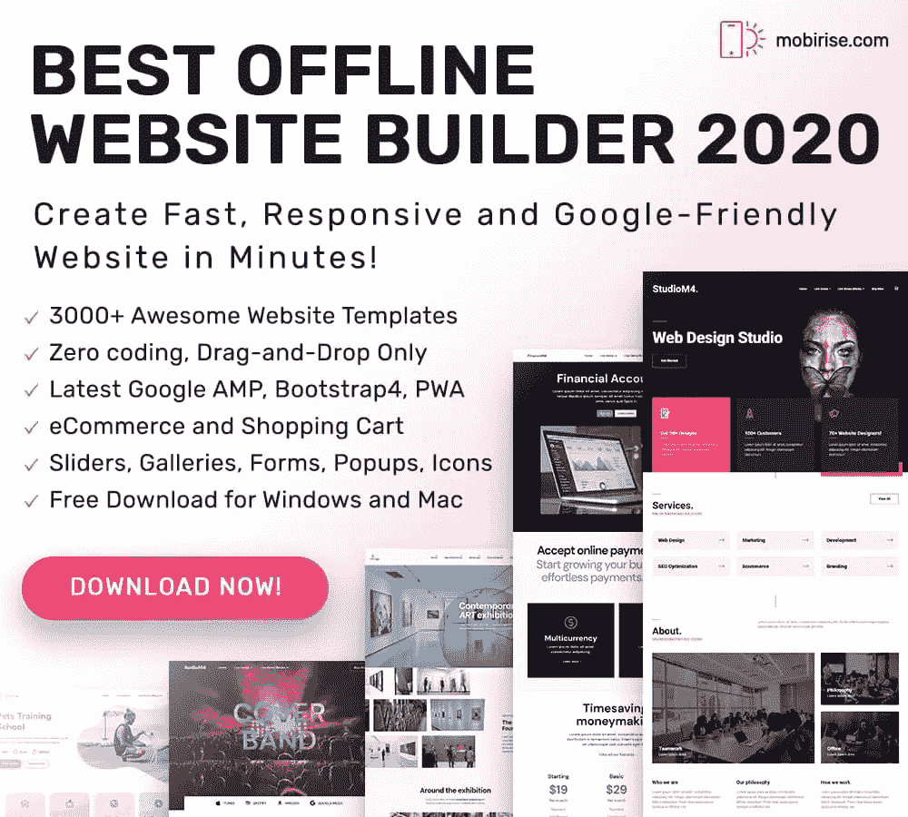

Mobirise 是一个超级离线网站建设商，里面有很多好东西:

*   3000 多个精美的网站模板
*   滑块、图库、表单、弹出窗口、图标
*   一个优秀和快速的界面
*   更加

你不需要任何经验就可以用 Mobirise 创建很棒的网站。

## 10.[经济实惠的代码设计 web 开发服务](https://goodiewebsite.com/)

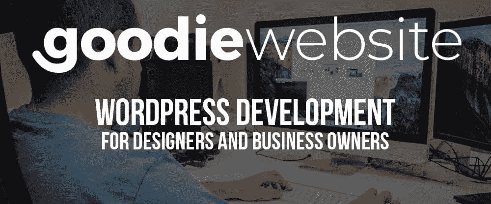

Goodie 是代理商和网页设计师一直在寻找的可靠的网页开发伙伴。他们专注于一到十页的现代网站、简单的 WordPress 网站、电子邮件模板等等。

与 [Goodie](https://goodiewebsite.com/) 取得联系。

## 11.[空中聚焦](https://airfocus.com/)

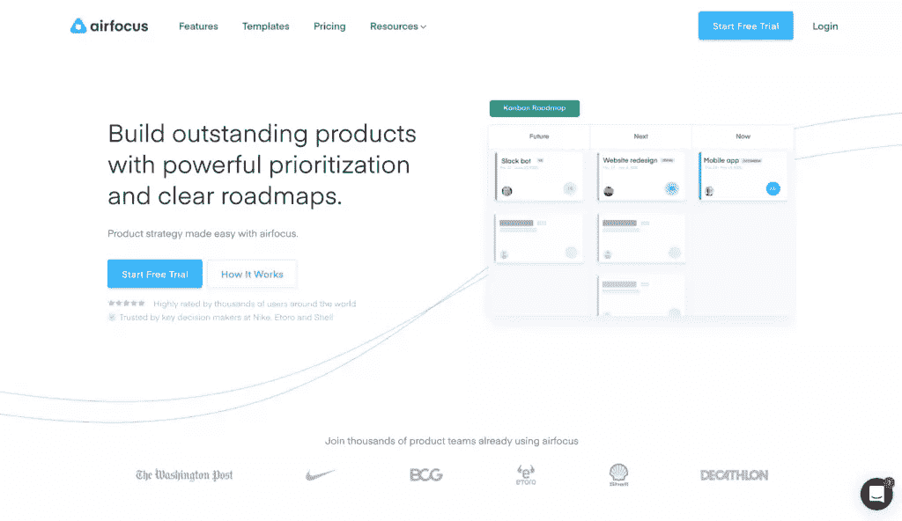

借助强大的优先级划分和清晰的路线图，打造出色的产品。airfocus 是一款面向团队的软件解决方案，通过一个先进但易于使用的评分系统，您可以对项目进行优先排序。只需几分钟，即可拖放精美的演示路线图。让每个人都团结起来，做正确的事情。airfocus 与您现有的工作流程和工具(如吉拉、特雷罗、Azure DevOps 和 Asana)相集成，让您在几分钟内开始工作。

Airfocus 拥有最大的通用[产品管理](https://airfocus.com/glossary/category/product-management/)、产品营销和敏捷开发术语和定义词汇表。

在[airfocus.com](https://airfocus.com/)开始为期 14 天的免费试用。

## 12.[登陆页面](https://www.mailmunch.com/landing-pages/)

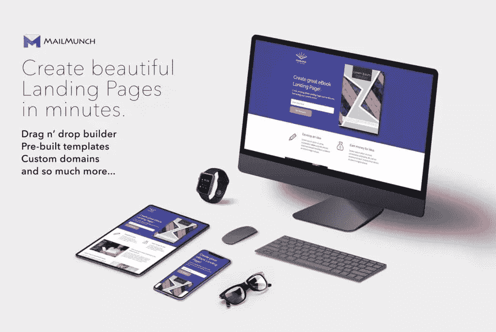

MailMunch 将帮助您创建登录页面和压缩转换页面。

使用拖放式登录页面生成器，可以在几分钟内轻松创建任何布局。从头开始或使用漂亮的预建登录页面模板。无论你走哪条路，都简单明了。

使用增长最快的登录页面平台，将转化率提高高达 400%。

## 13.[电子邮件模板构建器](https://unlayer.com/)

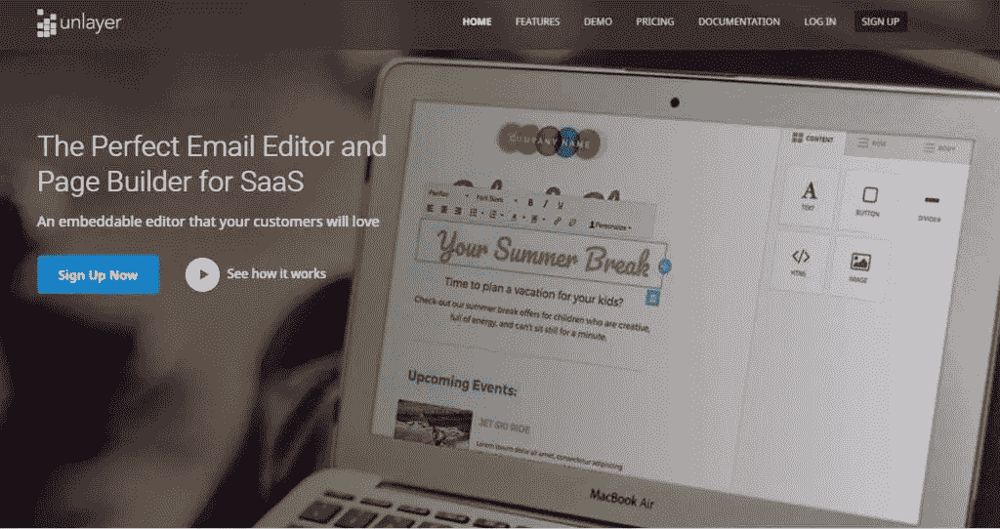

Unlayer 是 SaaS 完美的电子邮件编辑器和页面生成器，可以让您的网站访问者直接从您的网站创建引人入胜的登录页面和电子邮件模板。

它装载了一个出色的拖放生成器，华丽的模板，友好快捷的界面。

检查[拆层](https://unlayer.com/)。

## 14.[x store——特大号 WooCommerce 主题](https://xstore.8theme.com/preview-new/)

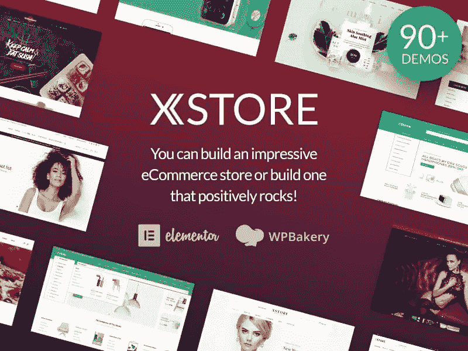

XStore 让电子商务变得简单。就这么简单。如果你一直希望为你的电子商务需求找到一个游戏规则改变者，那就别再找了:90 多家好又多商店。单一产品页面生成器。页面导入程序。价值刚刚超过 300 美元的插件。完全兼容最流行的多厂商插件。完全支持 Elementor 页面生成器。

## 15. [Zentoshop](https://www.zentoshop.com/)

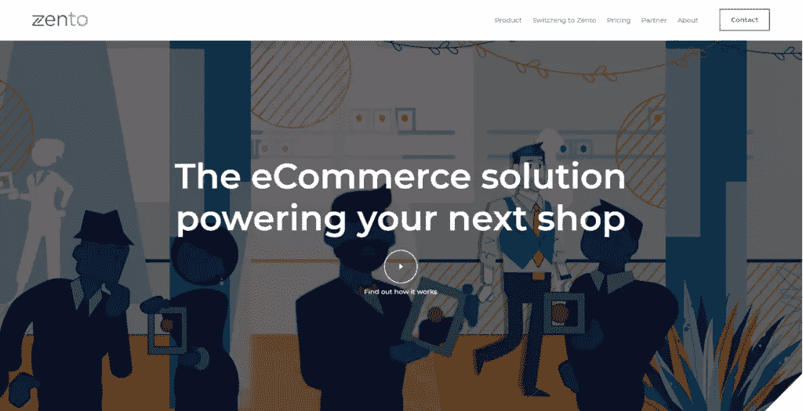

Zento 是下一代 SaaS 电子商务解决方案，利用 Magento 2 的坚实基础，以移动购物者为目标，允许公司以可预测的成本更快、更容易地在任何地方销售。

## 16.[图标 8 设计工具](https://icons8.com/)

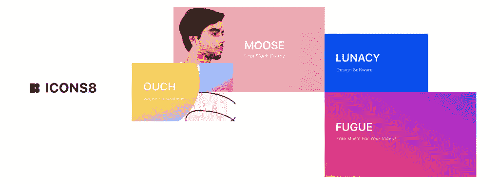

Icons8 是设计师获得免费资产多样性的一站式场所。超过 120，000 个不同风格的图标；界面、幻灯片和信息图的矢量插图；风格一致的各种库存照片库；照片创作者，使照片拼贴容易；和疯子编辑器，免费的图形设计软件。

## 17.[内容陷阱](https://contentsnare.com/)

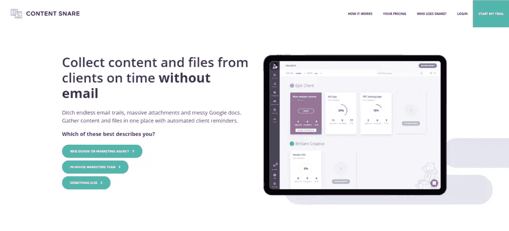

Content Snare 是最受欢迎的无需发送电子邮件就能从客户那里收集内容和文件的服务。有了这个平台，您可以轻松地自动化收集内容的任务，并节省重要的时间。

配置非常简单明了。

开始为期 14 天的免费试用。不需要信用卡。

## 18. [Quanzo](https://themeforest.net/item/quanzo-personal-portfolio-wordpress-theme/26054049)

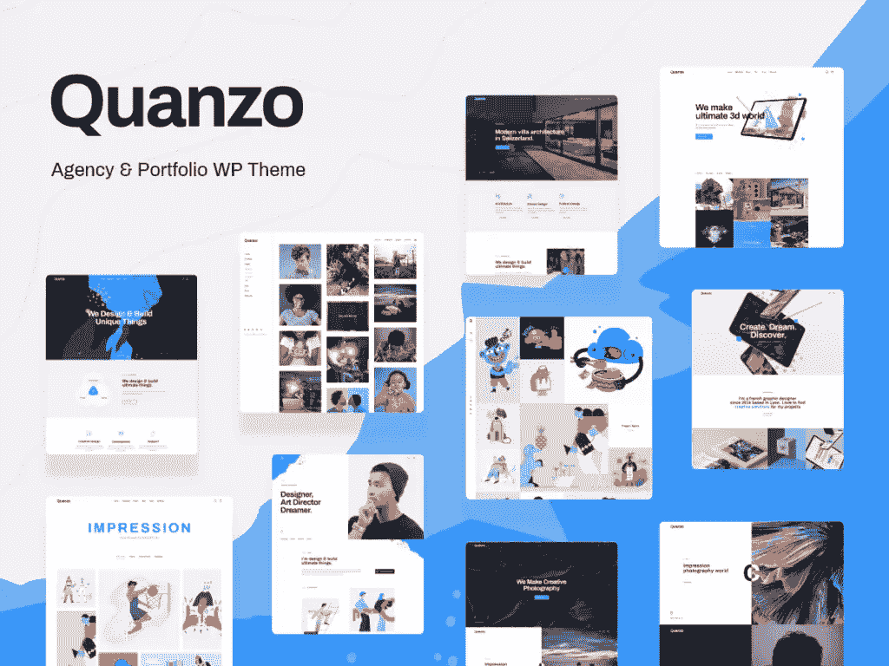

当你在为你的个人作品集寻找一个时尚和多功能的 WordPress 主题时，考虑使用 Quanzo 作为一个快速的起点。这个极简主义的 WordPress 主题的完全响应设计在所有设备上看起来都很惊人。主题是多用途的，完全可编辑的。

您可以调整网页的任何元素，使其符合您的专业需求。主题是由 Elementor 页面生成器创建的，它可以快速、轻松地修改任何布局元素。除了默认布局之外，该主题还包含 11 种额外的主页样式，适合文案、设计师、开发人员、摄影师、时尚、个人资料、生活方式博客和其他特定项目。

## 19. [HelpJet](https://helpjet.com/)

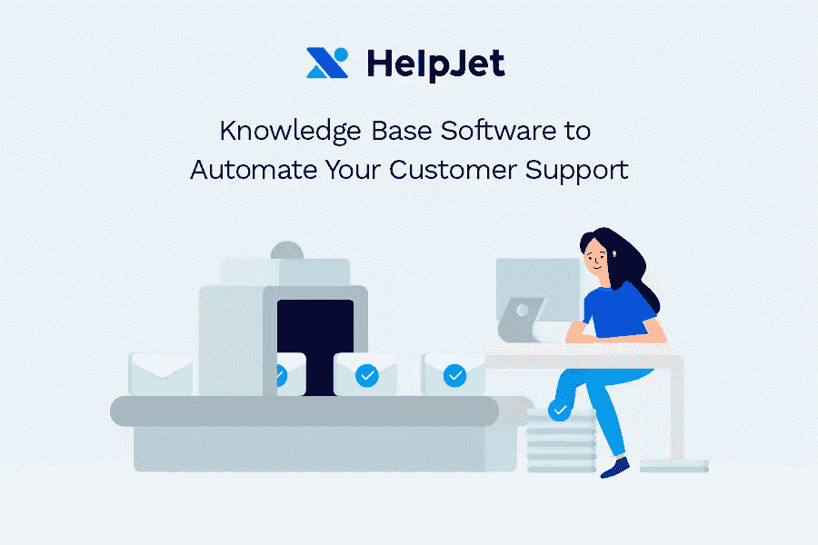

HelpJet 是基于知识的软件。如果您正在销售产品或服务，您可以使用 HelpJet 向客户介绍和告知您的产品，提高对您业务的认识，改进 SEO 并提供文档。

而这只是一种方式；使用 HelpHet 还有很多其他方法。

阅读更多关于 HelpJet 的信息。

## 20. [8b](https://8b.com/)

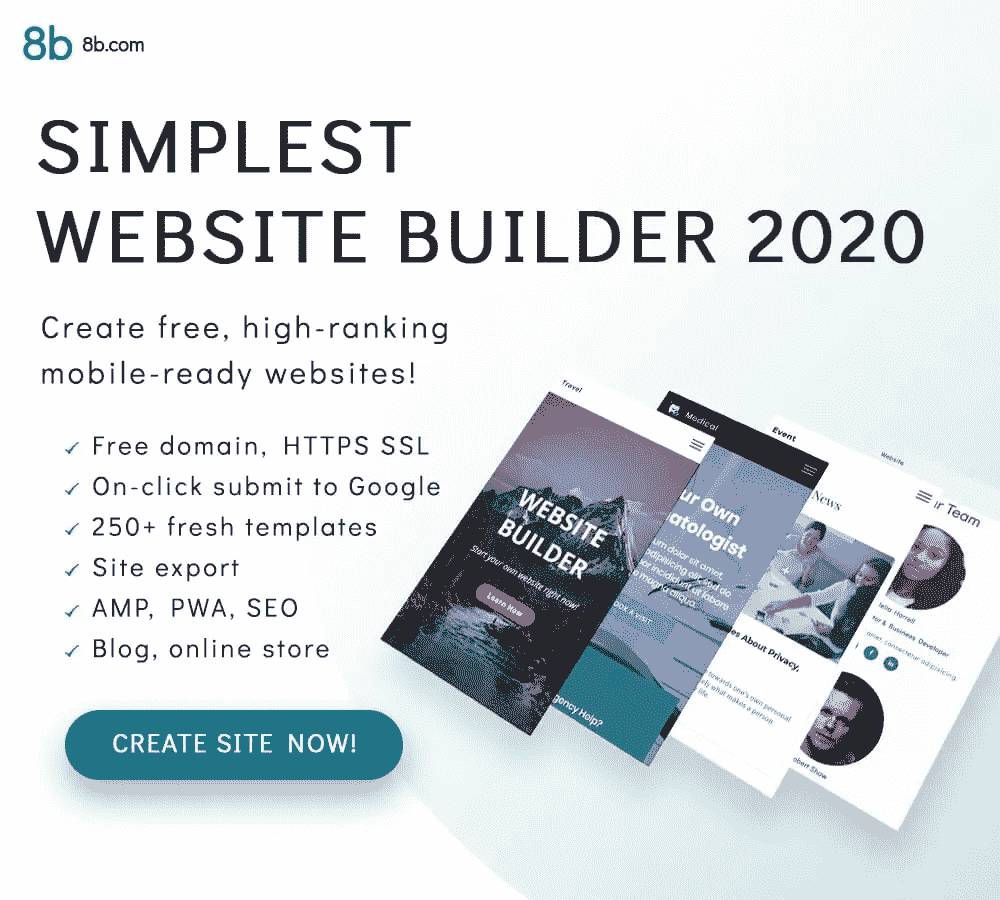

8b 是你在 2020 年可以使用的最简单的网站生成器。极简界面快速直观，帮助你专注于建设一个华丽的网站。

你不需要任何特殊技能或经验。你可以从头开始，或者使用 250 多个新模板中的一个。

使用 [8b](https://8b.com/) 立即创建您的网站。

## 21.赞助冲击

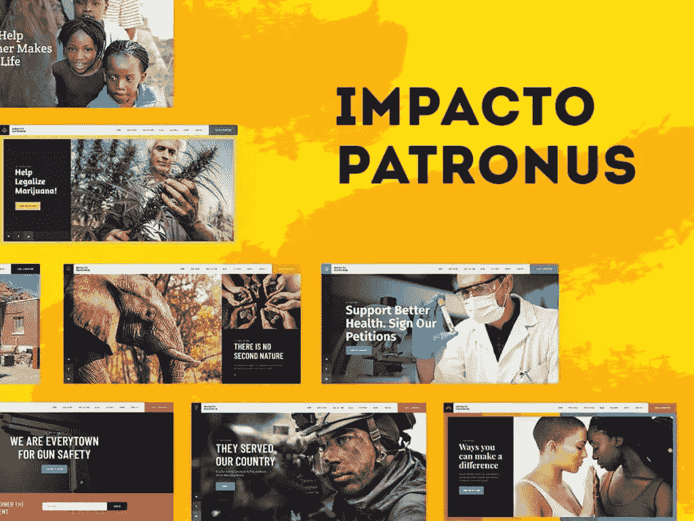

当全世界都在抗击新冠肺炎的传播时，重要的是联合起来，尽我们所能相互支持。这对于帮助穷人、医务人员、志愿者和其他比以往任何时候都更需要我们支持的人群尤为重要。

通过 Impacto Patronus WordPress 主题，您可以为众筹、活动家、社会运动和当代社会运动网站推出一个功能强大、响应全面的网络资源。该主题基于强大的 RemeREX 框架，并提供了极好的定制机会。这是一个不断发展的 WordPress 解决方案，提供了八个特定的皮肤集合。它还支持 Give 捐赠插件，该插件以一种灵活和可用的方式在您的站点上接受捐赠，从而增强了您的站点。

## 22.[礼帽](https://themerex.net/downloads/topper-all-in-one-elementor-blog-news-magazine-wordpress-theme-pro-plan/)

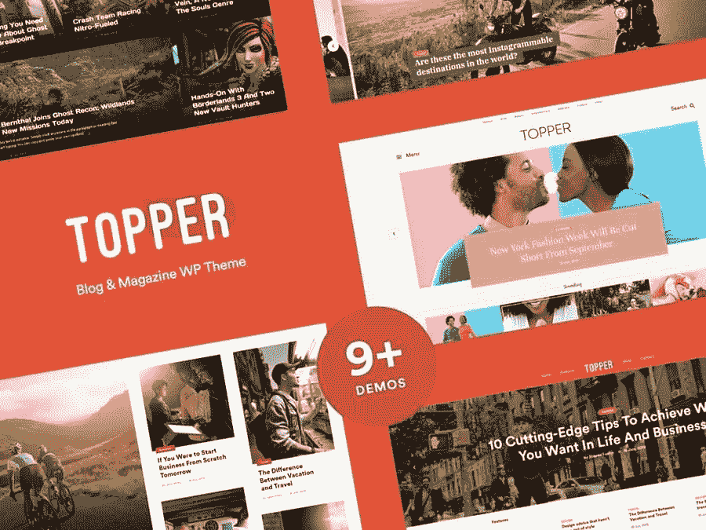

Topper 是一个多功能的 WordPress 主题，用于在线杂志和报纸网站。它有一个干净时尚的布局，让你的访问者把注意力集中在最重要的事情上。这就是多用途网页设计。

Topper 包括 10+个现成的布局，旨在用于技术、旅游、时尚、美食和其他类型的特定主题网站。该主题通过一键安装功能快速安装。用 Elementor 页面生成器编辑也很容易。它提供了 12 个博客演示风格和 30+独家古腾堡块的选择。该主题的现代设计是 100%响应和速度优化的。

## 23.[超级网站构建者](https://superbwebsitebuilders.com/)

SuperbWebsiteBuilders.com 侧重于审查最受欢迎和功能丰富的网站建设者和托管提供商。这些信息有助于用户选择符合他们需求、技能和偏好的最佳网页设计工具。这里也有服务的详细比较，最高评级以及有用的文章，提供用户正在寻找的利基相关内容。

## 24.[图形弹簧](https://www.graphicsprings.com/)

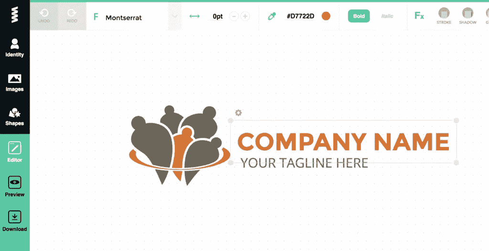

GraphicSprings 是原创标志设计工具之一。这个徽标制作工具配备了数千个预先设计的模板，您可以根据关键字和行业进行搜索。编辑平台提供直观且易于使用的功能来制作您的完美徽标，最棒的是，它完全免费试用！

## 25.[口号生成器 Logaster](https://www.logaster.com/slogan-generator/)

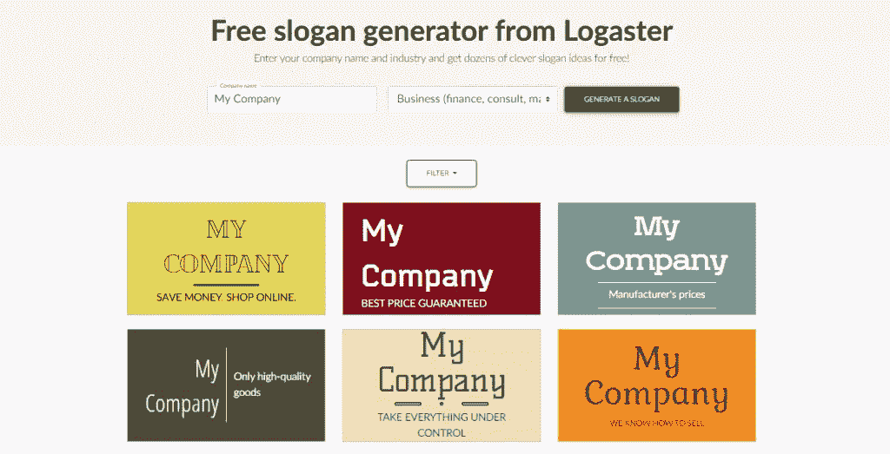

数百万人使用 Logaster 为他们的企业免费制作标语。

写下你的公司名称，选择你所在的行业，然后你会得到一个很棒的口号，可以用在你的网站、社交媒体渠道和营销材料上。

试用[口号生成器 Logaster](https://www.logaster.com/slogan-generator/) 。你会印象深刻的。

## 26.[意见阶段测验和调查](https://www.opinionstage.com/quiz/)

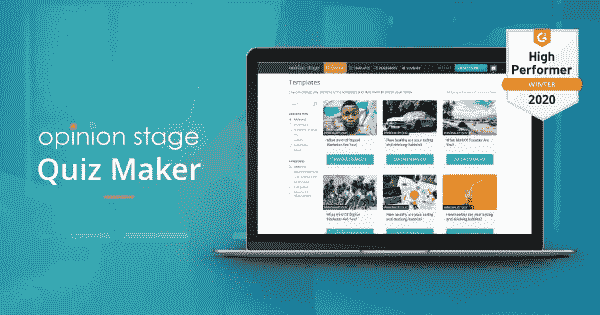

使用一流的测验制作工具创建令人惊叹的高性能测验和调查。进行人们喜欢完成和分享的测验和调查。品牌、博主和出版商使用意见平台来提高参与度、产生更多合格的线索、推动销售并获得可操作的见解。

意见阶段提供了一个免费的计划，并支付计划的情况下，更多的数量或功能是必要的。它充满了功能和定制选项，并提供了数百个免费模板，以便您可以在几分钟内开始使用。

## 27. [uKit 网站建设者](https://ukit.com/)

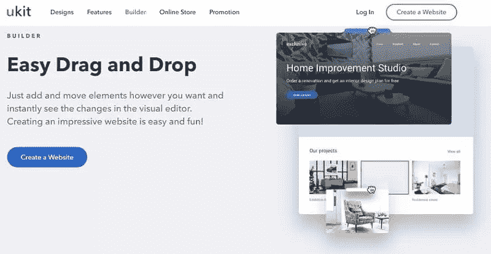

想创建一个网站但是不知道怎么做？uKit 网站建设者是来救援的！只要挑一个你喜欢的模板，然后你需要做的就是用你自己的替换样本数据。不需要编码或编程知识；即使是一个孩子也能掌握这个直观的网站建设者。不要拖延。使用 [uKit](https://ukit.com/) 立即创建您的网站！

## 28.[发票软件](https://www.invoiceberry.com/invoice-software)

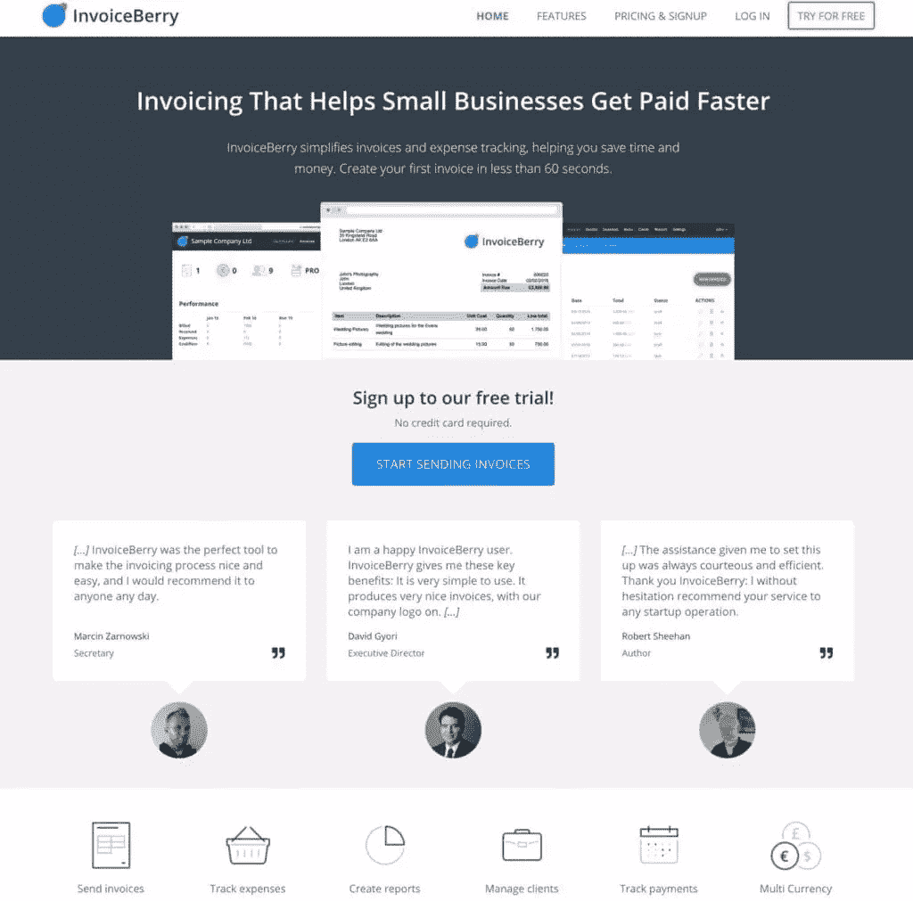

InvoiceBerry 是一个超级发票软件，可以帮助小企业更快地获得付款。它简化了发票和费用跟踪，帮助您节省时间和金钱。

创建看起来很棒的发票只需不到 60 秒。界面快速简单。

注册免费试用。不需要信用卡。

## 29.[阶梯式](https://stepform.io/)

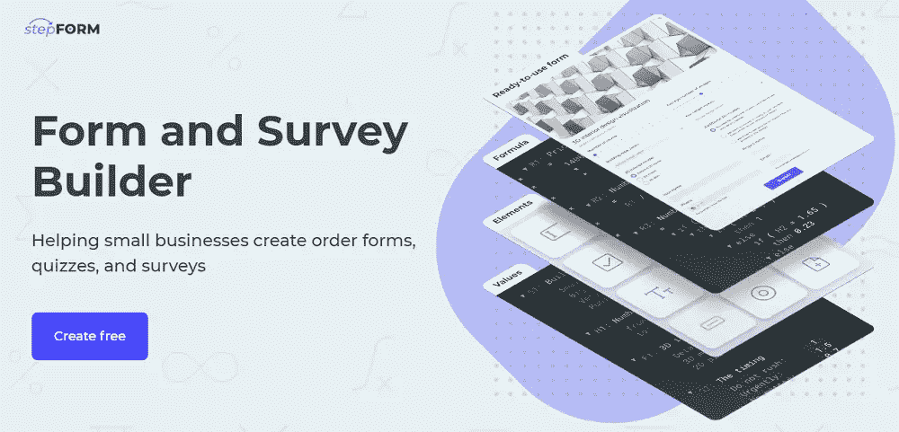

stepFORM 是一个最新的表格和调查生成器，由于其可视化编辑器，不需要编程技能。只需选择一个美丽的模板，并利用 15 个基本元素。就这么简单。该平台是小型企业、自由职业者和网络工作室的首选解决方案。今天就尝试一下，亲自看看结果吧！

## 30. [Pixpa](https://www.pixpa.com/)

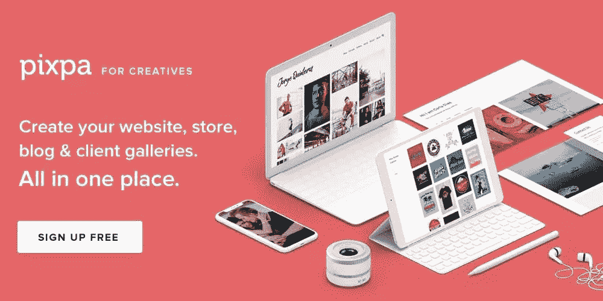

Pixpa 将帮助您创建自己的网站、商店、博客和客户画廊，集所有功能于一身。这个网站构建器装载了大量华丽的模板和元素，你可以在你的设计中使用。

不需要任何编码技能或经验。

## 31.[乌兰丁](https://ulanding.io/en)

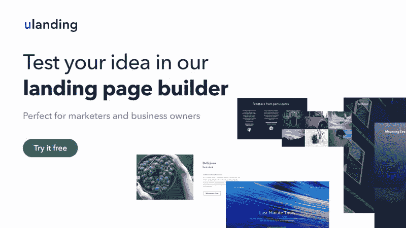

试图选择正确的单页创建工具？需要一些易于使用和功能丰富的东西吗？乌兰丁就是你要找的。选择一个设计精美的模板，并在直观的可视化编辑器中定制它们。您还可以使用内置的分析功能来跟踪您的登录页面的有效性。创建自己的网站从未如此简单！立即开始免费试用，享受结果。

## 32.[for](https://www.fotor.com/)

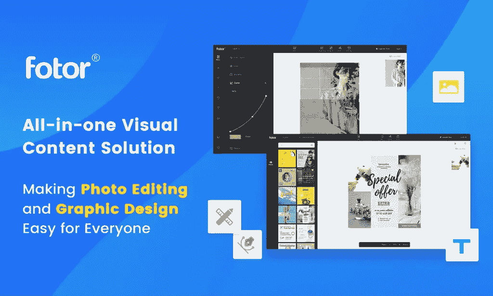

Fotor 是领先的照片编辑和图形设计工具，被数百万人使用，取得了巨大的成功。

为您的社交媒体渠道、网站、登录页面等创建引人入胜的图片。

给一个旋转。

## 33. [WordPressToWix。PRO](https://wordpresstowix.pro/)

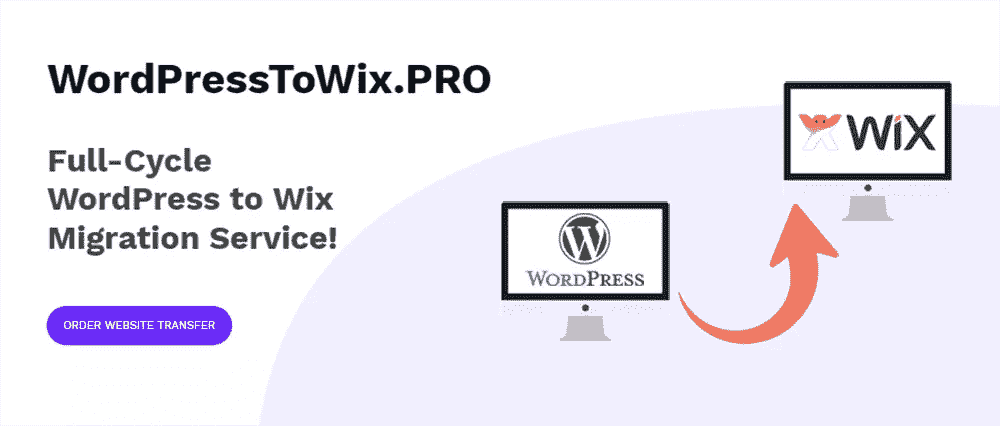

WordPressToWix。对于那些厌倦了复杂的 WordPress web 设计细节并希望切换到更简单的 Wix 网站构建器的用户来说，PRO 是最好的选择。这项服务有助于初学者和网页设计专业人士轻松、快速、轻松地完成迁移过程。直接在网站申请办理过户流程，等待反馈即可。

## 34. [WrapPixel](https://www.wrappixel.com/)

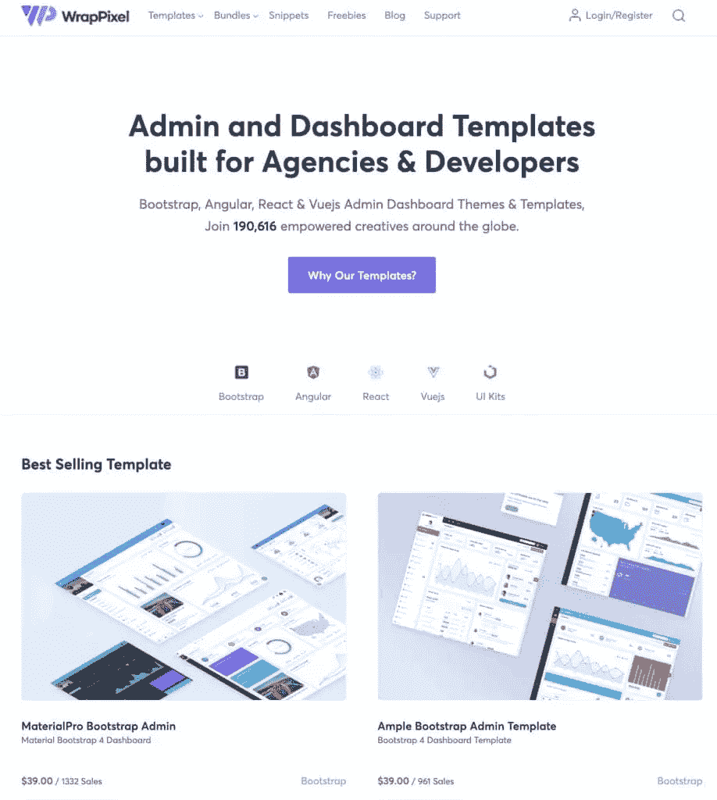

在 WrapPixel 上，你会发现为机构和开发者构建的令人敬畏的管理和仪表板模板，因此他们可以节省大量时间，而不必每次有新项目时都从头开始。

产品的质量非常好，他们有近 200，000 名快乐的创意人员在使用他们的产品。

浏览 [WrapPixel](https://www.wrappixel.com/)

## 35.[主持在线问答群组聊天&和网络活动](https://www.rumbletalk.com/moderated)

RumbleTalk 将帮助您立即为现场问答和网络活动添加一个有主持的聊天，而不需要您有任何特殊的技能或经验。

嵌入您自己的主持式聊天需要两分钟。

## 36.什么字体是最好的字体查找工具

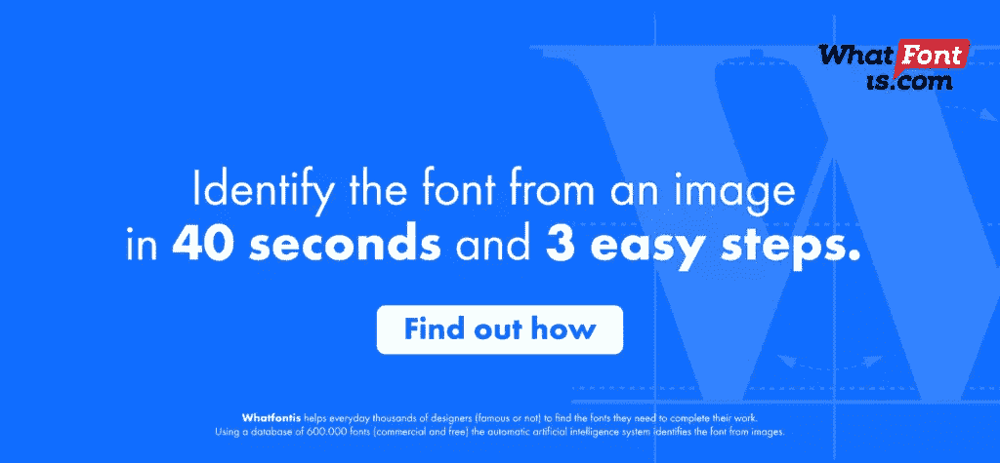

WhatFontIs 将帮助您在 40 秒内通过三个简单的步骤从图像中识别字体。这个强大的软件加载了超过 600，000 种索引字体，它是唯一一个可以识别免费和付费字体的系统。它可以与所有字体代工厂合作，包括谷歌字体。

要开始使用 WhatFontIs，你可以制作一个你想要识别的字体的截图，上传到 WhatFontIs，写下识别的字符(如果你是注册用户，这是自动发生的)，然后，强大的人工智能软件将识别字体，为你提供以下信息:

*   字体的名称
*   价格(也许你很幸运，它是免费的)
*   下载链接
*   60 多种免费和付费选择

[WhatFontIs](https://www.whatfontis.com/) 是免费的，一定要试一试。

## 包装

正如你所看到的，在 2020 年，当你可能被关在家里的时候，你可以使用超级网络工具和服务，当新冠肺炎有希望离开的时候。

如果你有一个 WordPress 网站，24x7WPSupport 的人可以处理你所有的请求。

想免费识别任何给定图片的字体吗？太好了，那你应该用 WhatFontIs。

要不要建立一个完全没有经验的超级网站？试试 Mobirise 或者 8b，都很优秀。

尝试这些解决方案，利用你在家的时间。

## 分享这篇文章