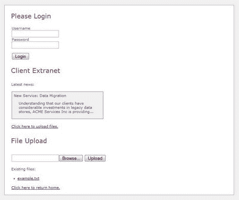
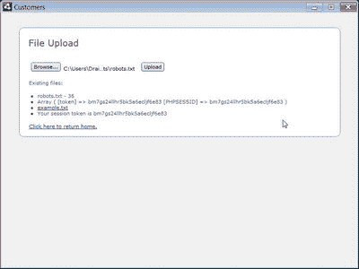

# 了解 Adobe AIR，第三部分:超越浏览器

> 原文：<https://www.sitepoint.com/learn-adobe-air-part-3/>

谁说桌面已经死了？像易贝这样的大网站为他们的网络服务提供桌面应用程序，因为它们通常更稳定，更轻量级，并且提供更流畅的用户体验。

Adobe AIR 的一大特色是对 Ajax 的重新思考——特别是跨域安全限制。在 AIR 出现之前，web 应用程序只能向它所来自的同一个域发出 Ajax 请求，但也有一些例外。为了从另一个域获取数据，需要一个服务器端代理脚本来中继请求。在 AIR 中，Adobe 已启用跨域 Ajax 请求来支持 AIR 应用程序的各种潜在用途，这些应用程序使用 web 服务并与服务器端应用程序交互。这为完全在客户端运行的各种方便的混搭打开了大门。

在本文中，我们将研究如何从一个简单的 PHP 应用程序中使用 web 服务——我们将使用登录机制、文件上传和阅读 RSS 新闻提要。我们将构建一个简单的界面，使公司的客户能够登录并提交文件，以及浏览新闻订阅源中的内部通知。

继续我们最近的主题，在 的最后会有一个 [**的小测验，来测试你学到了什么。前 100 名参加测试的人将免费获得帖子中的 *Adobe AIR For JavaScript 开发者*袖珍指南。记住，这本书可以**](https://www.sitepoint.com/quiz/air/beyond-the-browser/) **[**作为 PDF**](https://www.sitepoint.com/quiz/air/beyond-the-browser/) 免费下载，所以赶紧破解吧！**

***注:背景知识**
为了从本教程中获得最大收益，我建议您通读我的 HTML/Ajax AIR 入门文章，[构建客户管理应用](https://www.sitepoint.com/article/learn-adobe-air-part-2/)和[构建笔记存储应用](https://www.sitepoint.com/article/learn-adobe-air-part-1/)，或者至少熟悉 AIR 和 jQuery。我们将再次使用 [AIR SDK](http://ad.doubleclick.net/clk;207716299;29856506;x) ，以及 Aptana 和 jQuery。如果你还没有设置这些，我会在我的第一篇文章中介绍这个过程，在[构建 AIR 应用的强大工具](https://www.sitepoint.com/article/learn-adobe-air-part-1/)一节中。出于本例的目的，您还需要访问支持 PHP 的 web 服务器。或者，您可以用您选择的服务器端语言重写琐碎的 PHP 例程。*

##### 从示例项目开始

为了准备构建应用程序，[下载基线项目文件](https://www.sitepoint.com/examples/AdobeAIR/air3-web-skeleton.zip)。您会发现一个单独的 HTML 文件，其中包含应用程序界面关键部分的单独的`div`元素——我们将根据需要使用 jQuery 来显示和隐藏相关部分。打开 Aptana，在提取基线文件的同一个目录下创建一个新项目，或者使用**文件>导入**对话框中的“现有文件夹作为新项目”。

该档案还包括一个名为`serverfiles`的文件夹——如果你想修改和试验后端，你需要将这些文件上传到一个支持 PHP 的 web 服务器上。或者，您可以按照本教程中的说明创建自己的。现在，我们将使用这些文件的托管演示副本。

在我们的新项目中，所有的动作都发生在`index.html`文件中。下面是显示了所有部分的文件截图。



我们将把所有的行为逻辑存储在`behavior.js` JavaScript 文件中。

##### 在空气中运行

现在我们已经准备好了 AIR 项目和接口，让我们开始使用 API 添加功能。

***认证***

我们应用程序的前端是认证对话框。创建我们的客户端登录系统与创建服务器端登录系统非常相似，除了一些例外:身份验证 API 是通过 HTTP 访问的，我们必须对敏感数据格外小心。

下面是我们的登录表单的 HTML:

```
<div class="form">  

  <div class="input">  

    <label for="username">Username</label>  

    <input type="text" id="username"/>  

  </div>  

  <div class="input">  

    <label for="password">Password</label>  

    <input type="password" id="password"/>  

  </div>  

  <div class="input">  

    <input type="submit" value="Login" id="loginbtn" />  

  </div>  

</div> 
```

让我们打开`behavior.js`文件并添加一些 JavaScript。该文件目前是空的，除了一个带有一些基本接口管理代码的`$(document).ready()`函数。我们将用它绑定到表单的`submit`事件，这样我们就可以捕捉到用户点击**登录**按钮。在`$(document).ready()`函数中，添加以下内容:

```
server = 'http://bitmeta.org/air/';  

$("#loginbtn").click(function(){  

  params = 'username='+$("#username").val()+'&password='+$("#password").val();  

  request = new air.URLRequest(server + 'loginService.php');  

  request.data = params;  

  request.method = air.URLRequestMethod.POST;  

  loader = new air.URLLoader();  

  loader.addEventListener(air.Event.COMPLETE, loginComplete);  

  try {  

    loader.load(request);  

  } catch (error) {  

    alert("Error connecting to login server.");  

  }  

}); 
```

我们首先使用 jQuery 绑定到我们的**登录**按钮的`click`事件(来自上面的 HTML 片段)。这里，我们使用两个关键的 AIR API:`URLRequest`和`URLLoader`。`URLRequest`管理请求信息——在我们的例子中，是要加载的 URL、要使用的请求方法、要传递的参数等等——而`URLLoader`处理实际的 HTTP 传输并处理结果。`request`对象有一个数据属性，它接受`name=value&name=value`格式的变量，就像任何 POST 请求体一样。我们真的不应该以纯文本的形式传输密码，即使我们在上面做了——考虑使用 HTTPS、[客户端哈希](http://pajhome.org.uk/crypt/md5/)，或者两者都用。

加载器对象有许多事件，包括请求进度、响应状态代码标识和 IO 错误——完整列表见[此处](http://help.adobe.com/en_US/AIR/1.1/jslr/flash/net/URLLoader.html)。目前，我们只对请求的完成感兴趣，所以我们使用泛型`air.Event.COMPLETE`来捕捉它，并使用回调函数:`loginComplete`。

我们将从 web 服务接收一个 XML 文档，稍后我们将使用 jQuery 来处理它。现在，我们将定义我们的回调处理程序——将它插入前一个块之后:

```
function loginComplete(event) {  

  handleLogin(event.target.data);  

}
```

通过这一行，我们将 XML 响应传递给我们的`handleLogin` 函数，然后就可以开始了！

##### 阅读我们的回复正文

是时候开始考虑我们的服务器后端了——我们的演示服务器在`bitmeta.org/air/`运行，用户名和密码为“test”。

我们引用了回调函数`loginComplete`，它被传递了一个参数——一个`Event`对象。这有一个`target`属性，引用事件的`target`—`URLLoader`——它总是将响应体放在它的`data`属性中。现在，`loginService.php`将给我们一个 XML 响应，如下所示:

```
<?xml version="1.0" encoding="utf-8"?>  

<response >  

  <login code="LOGIN_PASS">4d0vncb4j41mpu...</login>  

  <latestNews>  

    <item>  

      <heading>New Service: Data Migration</heading>  

      <content>Understanding that our clients...</content>  

      <guid>http://example.com/rss/article/1</guid>  

    </item>  

    <item>  

      <heading>Security Breach!</heading>  

      <content>On 1/1/1 we were made aware of a...</content>  

      <guid>http://example.com/rss/article/2</guid>  

    </item>  

  </latestNews>  

</response> 
```

在 login 元素中是我们的会话令牌；这对于每次成功登录都是唯一的。登录失败响应如下所示:

```
<?xml version="1.0" encoding="utf-8"?>

<response >

  <login code="LOGIN_FAIL"/>

</response>
```

我们现在只需要一个`handleLogin`函数来处理这个响应。这里我们将依靠 jQuery 来处理复杂的 XML 遍历和 DOM 操作。将此复制到您的`behavior.js`文件的最后:

```
function handleLogin(data) {  

  if ($("login", data).attr("code") == 'LOGIN_PASS') {  

    air.trace('Our session token is '+$("#login", data).text());  

    $("#latestnews").empty();  

    $("latestNews item", data).each(function(i) {  

      item = $("latestNews item", data).get(i);  

      story = $('<div class="rssitem"></div>')   

          .append('<span>'+$("heading",item).text()+'</span>'+  

          '<p>'+$("content",item).text()+'</p>'+  

          '<a href="'+$("guid",item).text()+'">Read More...</a>')  

          .appendTo('#latestnews'    });  

    $(".rssitem a").click(function(){  

      air.navigateToURL(new air.URLRequest(this.href));  

      return false;  

    })  

    $("#login").hide();  

    $("#main").show();  

  } else {  

    alert('Login Failed: Please Try Again.');  

  }  

} 
```

我们首先检查`code="LOGIN_PASS"`属性值是否出现在`login`元素中；如果是这样，我们在控制台上记录收到的会话令牌。然后我们清空主页上的`<div id="latestnews">`元素，开始用响应中包含的虚假 RSS 条目填充它。(解析一个真正的 RSS 提要也同样简单。)此时，我们还可以使用 Javascript 常用的 DOM 遍历函数——`data`变量保存一个完全正常的 XML 文档。要在默认的 web 浏览器中启动一个 URL(而不是在我们的 AIR 应用程序中)，我们需要调用`air.navigateToURL(new air.URLRequest(url))`——在这个代码片段中，我们使用当前对象的超链接，因为我们绑定到了新闻部分中的所有链接。

我们在这里使用了很多 CSS 选择器——记住 jQuery 选择器语法，`$` ( `"css selector"`，`domdocument`)将尝试在提供的 DOM 文档中选择与选择器匹配的元素，默认为当前文档。我们指定 XML 响应文档来设置操作的上下文。

***注意:维护一个会话**
在我们的登录例程中，我们一次性加载认证信息和最新消息。然而，通常情况下，您需要在身份验证后发出进一步的 HTTP 请求。在我们的服务器脚本中，`loginService.php`包含了各种会话 ID。在我们的例子中，它是由 PHP 的会话扩展生成的，但是它也可以是任何登录令牌。为了在 AIR 应用程序中保持这一点，在接收时将它存储在一个变量中是非常可行的，如果需要，还可以存储在一个 cookie 中。然后，应用程序中的任何 JavaScript 代码都可以通过在将来的请求中包含这个令牌来使用它。当然，如果您使用基于 cookie 的会话机制，您的应用程序可以将整个过程留给 PHP，从而避免存储会话令牌的需要；在客户端，URL 请求库将自动为您处理 cookies。*

##### 处理文件上传

现在我们已经验证了用户并显示了最新的新闻，剩下我们要做的就是启用文件上传特性。我们可以采取的典型且最方便的方法是使用普通的旧表单。正如我们可以在 Safari 中的典型网页上使用 Ajax 文件上传一样，我们也可以在 AIR 中这样做。不幸的是，事情没那么简单 Ajax 文件上传实际上并不存在；JavaScript `XMLHttpRequest`对象不能处理文件。这个概念的大部分实现都涉及到将表单重定向到一个`iframe`，由于 AIR 对远程内容设置了安全限制，这对于我们来说不是一个可靠的选择。

相反，AIR 在每个`File`对象中提供了一个上传方法。给定一个文件的引用，我们可以上传一个`URLRequest`对象和一个仿表单字段的名称，文件应该假装是这个仿表单字段的一部分。然后，它将根据`URLRequest`数据发出一个 HTTP 请求；唯一真正的限制是我们无法处理响应——我们必须在上传后再次请求列出我们的文件。

下面是我们的表单此时的样子:

```
<div class="form">   

  <div class="input">   

    <input type="file" name="file" id="file" />   

    <input type="submit" value="Upload" id="uploadbtn" />   

  </div>   

</div> 
```

为了实现文件上传的 Ajax，我们只需计算出上传按钮被点击的时间，构造一个`File`对象，构造一个`URLRequest`对象，然后将`File`对象上传到`URLRequest`。就在`behavior.js`文件中的`$(document).ready`块的末尾，添加以下内容:

```
$("#uploadbtn").click(function(){   

  filePath = $("#file").val();   

  file = air.File.userDirectory.resolvePath(filePath);   

  request = new air.URLRequest(server + 'uploadService.php');   

  request.method = air.URLRequestMethod.POST;   

  request.data = "token="+sid;   

  file.addEventListener(air.Event.COMPLETE, uploadComplete);   

  file.upload(request, "AIRfile");   

}); 
```

带有`id`“文件”的表单域有一个对应于适当文件路径的值。这个块中的前两行计算文件路径，并给我们一个`air.File`对象(在变量:`file`中)指向用户选择的文件；这个`File`对象将管理上传。然后，我们构造我们的请求变量，将它指向我们的上传 web 服务，并传入存储在`sid`中的会话 ID。最后，我们将`uploadComplete`函数绑定为对`air.Event.COMPLETE`事件的回调，然后上传文件。

***我们的服务器端上传脚本***

我们来看看`serverfiles/uploadService.php`中的上传服务。下面是 PHP 代码:

```
<?php   

session_start();   

if (empty($_FILES['AIRfile']) && !empty($_SESSION['latestfile'])) {   

  echo "<li>$_SESSION[latestfile]</li>n";   

}   

if (!empty($_FILES['AIRfile'])) {   

  $_SESSION['latestfile'] = $_FILES['AIRfile']['name'] .    

      ' - '   

 . $_FILES['AIRfile']['size'];   

  exit;   

}   

?>   

<li><?php print_r($_REQUEST); ?></li>   

<li><a href="http://bitmeta.org/air/dump/example.txt">example.txt</a></li>   

<li>Your session token is <?=$_REQUEST['token']?></li> 
```

该脚本首先初始化会话处理程序，并检查是否为当前用户存储了一个“`latestfile`”变量。如果是，我们输出它。接下来，我们检查是否有文件被上传——在这里，**我们没有上传任何文件**，因为这是一个演示服务器。如果一个文件正在被上传，我们设置那个`latestfile`会话变量，这样它将在我们下次检查时可见；然后我们在那里结束脚本。如果脚本继续超过此点:

```
 exit;   

} 
```

我们知道我们目前没有上传文件，而是在上传文件后再检查*。然后，我们继续为最终用户输出一些示例信息。*

***上传后回查***

既然我们已经上传了文件，我们需要检查一下，从服务器获取当前的文件列表。我们在`behavior.js`中使用了一个回调函数:

```
file.addEventListener(air.Event.COMPLETE, uploadComplete);
```

我们现在需要编写那个`uploadComplete`函数。在`$("#uploadbtn").click(function(){`块中添加以下代码:

```
function uploadComplete(event) {   

  request = new air.URLRequest(server + 'uploadService.php');   

  request.data = "token="+sid;   

  loader = new air.URLLoader();   

  loader.addEventListener(air.Event.COMPLETE, statusComplete);  try {   

    loader.load(request)   

  } catch (error) {   

    air.trace("Could not retrieve file list.");   

  }   

  function statusComplete(event) {   

    $("#filelist").html(event.target.data);   

  }   

} 
```

这又调用了`uploadService.php`，传入了会话 ID——只是这次我们使用了一个`URLLoader`对象，因为我们想要读取响应。`uploadService.php`脚本将为我们的列表输出一系列的`<li>`标签，所以我们使用`html` jQuery 函数获取响应体——在`loader.data`或`event.target.data`回调中——并将它直接放入页面上的`<ul id="filelist">`。当我们用一个样本`robots.txt`文件运行这个脚本时，结果如预期的那样出现。



我们完事了。你可以从[代码档案库](https://www.sitepoint.com/examples/AdobeAIR/air3-web-final.zip)下载我们完成的`behavior.js`文件。

##### 进一步阅读

现在，我们已经完成了一个简单的支持 web 的 AIR 应用程序，您可以将您的 web 应用程序和服务扩展到浏览器之外了。您可能会发现这些方便的参考资料有助于进一步探索我们已经讨论过的主题:

*   [处理外部数据](http://help.adobe.com/en_US/AIR/1.1/devappshtml/WS5b3ccc516d4fbf351e63e3d118666ade46-7cb1.html)
*   [使用 URL `Request`类](http://help.adobe.com/en_US/AIR/1.1/devappshtml/WS5b3ccc516d4fbf351e63e3d118666ade46-7cb2.html)
*   [使用`File`对象](http://help.adobe.com/en_US/AIR/1.1/devappshtml/WS5b3ccc516d4fbf351e63e3d118666ade46-7fe4.html)
*   [语言参考-`URLLoader`样本](http://help.adobe.com/en_US/AIR/1.1/jslr/flash/net/URLLoader.html)
*   [负载`async URLLoader`上的可用事件](http://help.adobe.com/en_US/AIR/1.1/jslr/flash/net/URLLoader.html)

##### 自我测试

**你可以通过[小测验](https://www.sitepoint.com/quiz/air/beyond-the-browser/)来测试你对本教程的理解程度，并有望获得免费的袖珍指南*Adobe AIR For JavaScript Developers*，感谢你的努力。该指南将由 Adobe Systems 免费提供，但此优惠仅适用于前 100 人，所以赶快加入吧！(如果你确实错过了，你仍然可以免费下载这本书的 PDF 格式。)**

**[参加小测验！](https://www.sitepoint.com/quiz/air/beyond-the-browser/)**

## 分享这篇文章