# 了解如何在 Illustrator 中创建复古电视

> 原文：<https://www.sitepoint.com/learn-how-to-create-a-retro-tv-in-illustrator/>

Photoshop 无疑是最受设计师欢迎的软件，但它不太出名的堂兄 Illustrator 也有自己的优点。每个设计师都应该学习 Illustrator，尤其是如果你已经将它作为你的 Adobe Creative Suite 的一部分。Adobe 最近为 Illustrator CS6 添加了一些令人印象深刻的新功能，使其成为一个更加强大和直观的设计工具。所以，今天我将向您展示如何通过一个简单的步骤在 Adobe Illustrator 中创建一个华丽的复古电视。希望你能学到一些在 Illustrator 中创建矢量的技巧。

**资源:**

[垃圾质地](http://lostandtaken.com/gallery/pattern3.html "Grunge Texture")
[纸板质地](http://www.unsigneddesign.com/Seamless_background_textures/1200px/seamlesstexture28_1200.jpg "Cardboard Texture ")

在我们开始之前，让我们看看我们的最终结果。

[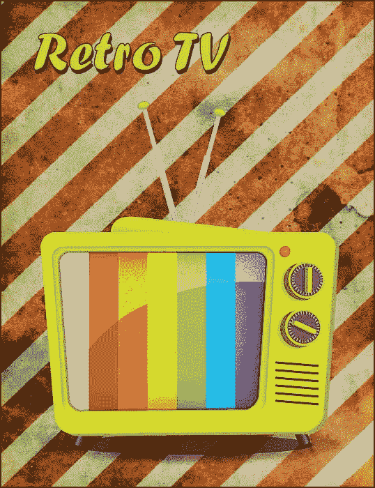](https://www.sitepoint.com/wp-content/uploads/2012/05/Final-result.jpg)

### 第一步

在 Illustrator 中创建新文档，宽度为 600 像素，高度为 700 像素。确保选择 RGB 颜色模式。

### [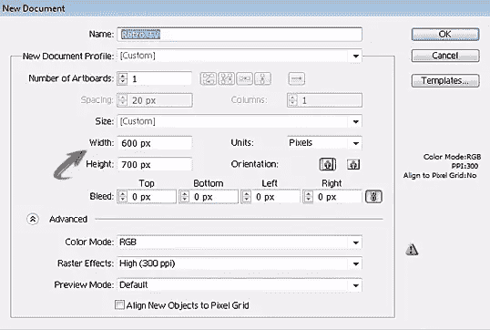](https://www.sitepoint.com/wp-content/uploads/2012/05/110.jpg)

### 第二步

首先，我们将制作电视机的基本框架。所以，选择“圆角矩形工具”画一个矩形，如下图所示。为这个矩形使用浅绿色填充颜色和深绿色 3 磅描边。颜色值显示在下图中。

[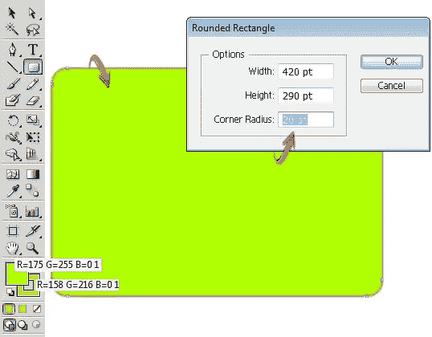](https://www.sitepoint.com/wp-content/uploads/2012/05/22.jpg)

现在，点击这个矩形层上的环形目标来选择它，然后选择“直接选择工具”(A)。现在，点击各个锚点，重新定位它们，给出如下所示的形状。

[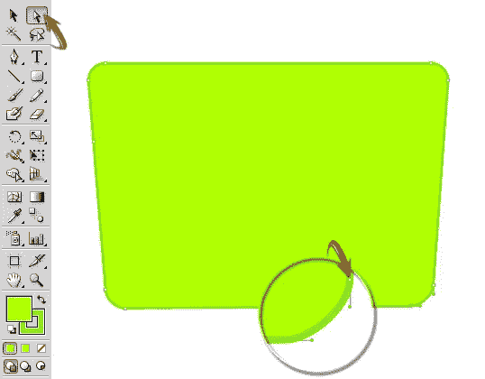](https://www.sitepoint.com/wp-content/uploads/2012/05/2b.jpg)

### 第三步

接下来，复制矩形层；将其填充颜色和描边更改为“无”之后，将复制的图层放在原始图层的下面，使用“选区工具”(V)向右下方拖动一点。

[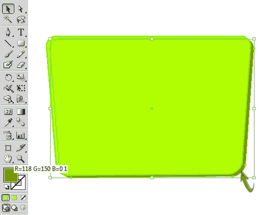](https://www.sitepoint.com/wp-content/uploads/2012/05/32.jpg)

### 第四步

现在，复制原来的矩形层，并减少其大小使用“选择工具”(V)。之后，使用“渐变工具”(G)应用如下所示的渐变。确保将“笔画”更改为“无”

[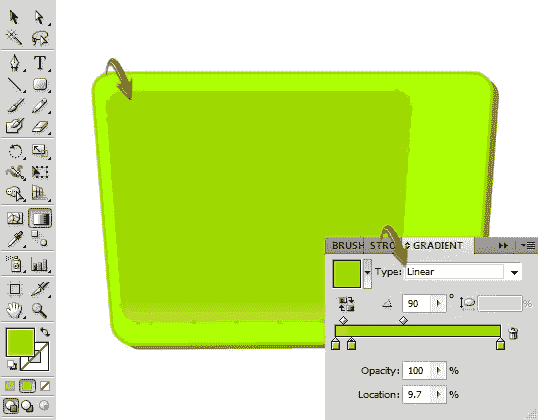](https://www.sitepoint.com/wp-content/uploads/2012/05/42.jpg)

一旦你完成了，选择这个较小的矩形层，进入“效果”>“风格化”>“内部发光”使用下面提供的值。

[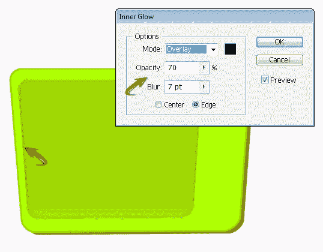](https://www.sitepoint.com/wp-content/uploads/2012/05/4b.jpg)

### 第五步

选择“钢笔工具”绘制形状，形成复古电视的顶部边缘。在上面应用下面的渐变；保持 3 点击球。

### 第六步

复制原来的矩形层，并把这一层以上的休息。缩小它的尺寸，形成一个漂亮的屏幕形状。改变其填充颜色为“无”，并创建一个 2 点的中风。

[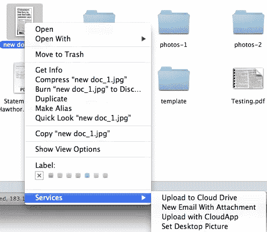](https://www.sitepoint.com/wp-content/uploads/2012/05/61.jpg)

### 第七步

现在，为了形成电视屏幕，我们将使用“矩形工具”创建不同颜色的条纹之后，通过按下 *shift* 键选择所有的彩色矩形图层，并将它们合并成一个单独的新图层。你可以通过点击图层面板右上角的方块找到“在新图层中收集”选项。

[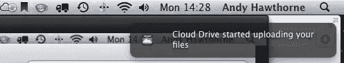](https://www.sitepoint.com/wp-content/uploads/2012/05/71.jpg)

### 第八步

现在，按住 *shift* 键选择彩色条纹层和屏幕笔画层。之后，选择“形状生成器工具”将工具应用于屏幕外的条纹部分，并按下 *alt* 键。按下 *alt* 键，你会看到一个带箭头的负号；单击此处删除不需要的部分。

[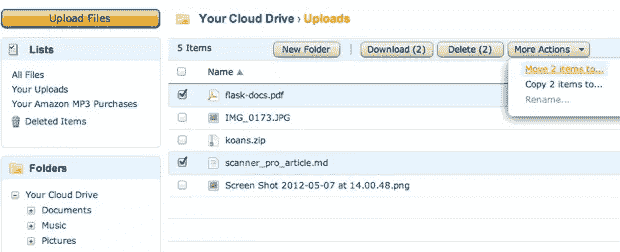](https://www.sitepoint.com/wp-content/uploads/2012/05/81.jpg)

### 第九步

接下来，选择彩色条纹层，进入“效果”>“风格化”>“内部发光”使用下面提供的设置。

[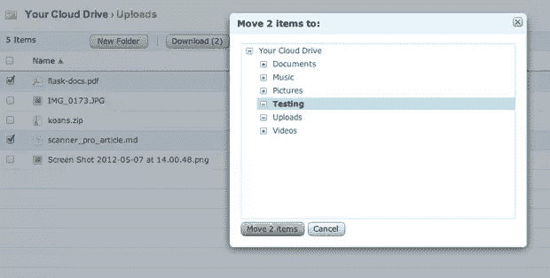](https://www.sitepoint.com/wp-content/uploads/2012/05/91.jpg)

### 第十步

选择“钢笔工具”并使用白色填充颜色在屏幕上创建一个亮点。然后，改变这一层的混合模式为“柔光”

### 步骤 11

用黄色填充颜色创建另一个高光；改变它的混合模式为“柔光”。

[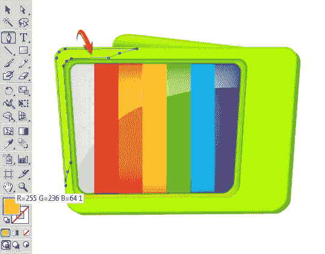](https://www.sitepoint.com/wp-content/uploads/2012/05/112.jpg)

### 步骤 12

现在，要制作一个电源按钮，选择“椭圆工具”并应用如下所示的渐变。

[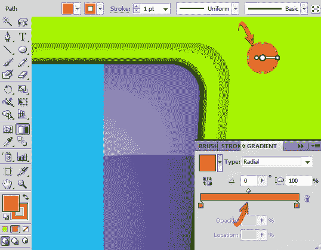](https://www.sitepoint.com/wp-content/uploads/2012/05/122.jpg)

复制这个椭圆；改变其填充颜色为灰色，其中风为“无”将这个副本放在原始椭圆的下面，向左下方拖动一点。

[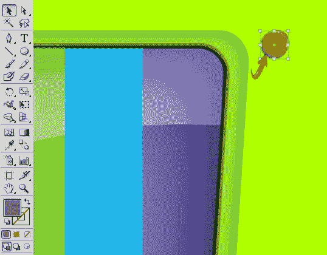](https://www.sitepoint.com/wp-content/uploads/2012/05/12b.jpg)

### 第十三步

接下来，制作通道选择器按钮，使用“椭圆工具”创建 4 个不同颜色的圆，排列如下。将最后一个圆形图层的不透明度降低到 70%，形成阴影。

[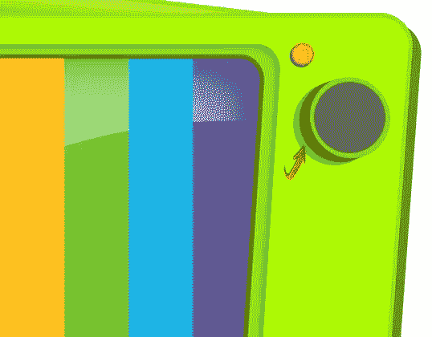](https://www.sitepoint.com/wp-content/uploads/2012/05/131.jpg)

现在，使用“圆角矩形工具”创建一个小矩形之后，进入“效果”>“3D”>“挤压和倒角”，使用给定的设置给它一个 3D 的外观。

[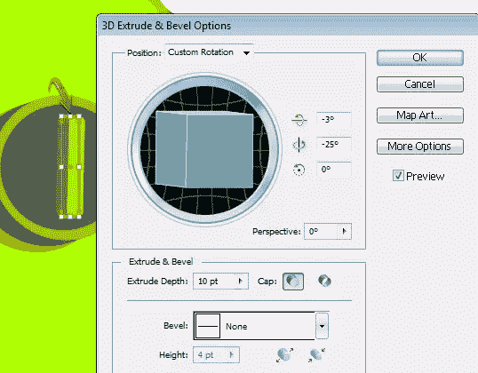](https://www.sitepoint.com/wp-content/uploads/2012/05/13b.jpg)

在灰色阴影中形成另一个圆角矩形，将该层放置在 3D 调谐器下方，并将其不透明度降低到 70%。

[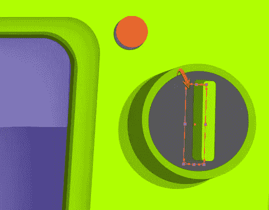](https://www.sitepoint.com/wp-content/uploads/2012/05/13c.jpg)

### 步骤 14

接下来，我们将在开关上做标记。用白色做一个小矩形，进入“效果”>“扭曲和变形”>“变形”应用以下设置。

[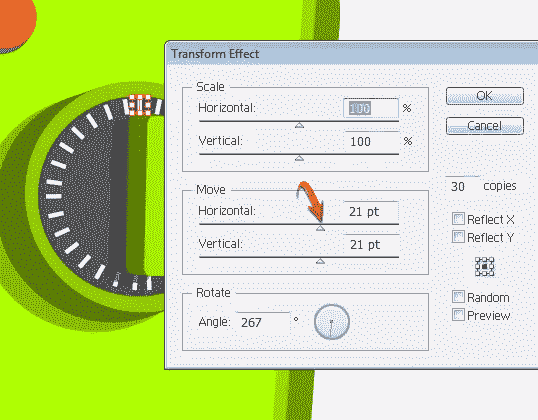](https://www.sitepoint.com/wp-content/uploads/2012/05/141.jpg)

现在，点击标记层，进入“效果”>“风格化”>“阴影”使用下面显示的设置。

[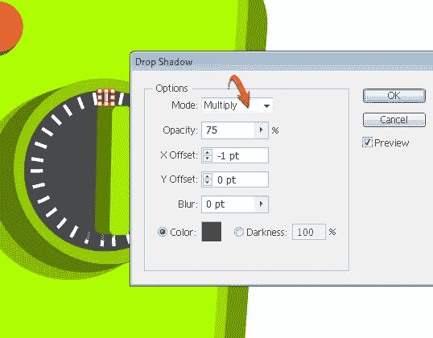](https://www.sitepoint.com/wp-content/uploads/2012/05/14b.jpg)

### 第十五步

现在，将构成此交换机的所有层组合成一个新层，然后复制此层以构成另一个交换机。您可以通过“挤出”和“倒角”设置来更改调谐器的角度。

[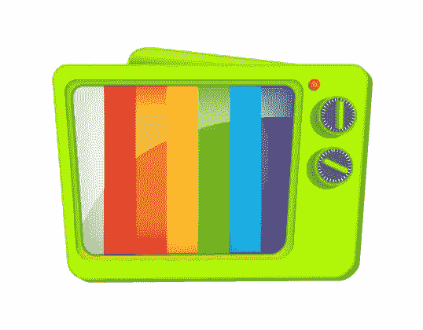](https://www.sitepoint.com/wp-content/uploads/2012/05/151.jpg)

### 第十六步

要形成扬声器，做一个薄的水平矩形，使用“选择工具”(V)旋转一点，然后进入“效果”>“扭曲和变换”>“变换”使用以下设置。

[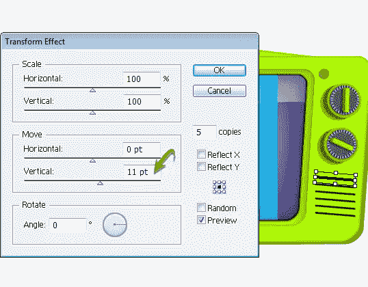](https://www.sitepoint.com/wp-content/uploads/2012/05/161.jpg)

### 步骤 17

要形成一个天线，做两个长方形和一个椭圆形。如下图所示排列它们。在这些矩形和椭圆上应用下面的渐变。

[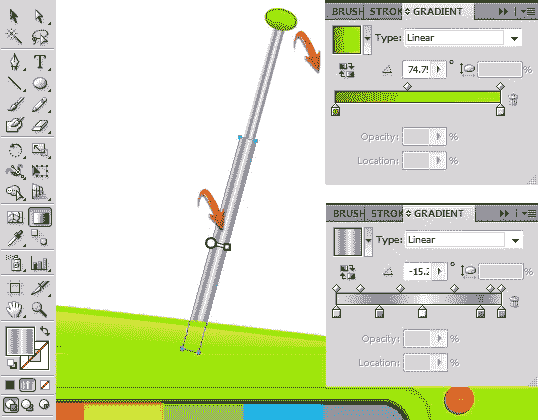](https://www.sitepoint.com/wp-content/uploads/2012/05/171.jpg)

复制天线层以形成第二个天线。换个角度排列。

[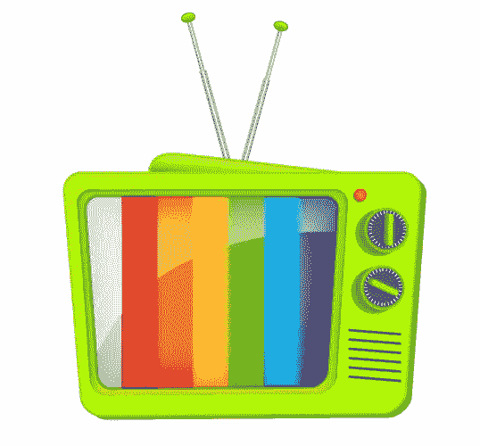](https://www.sitepoint.com/wp-content/uploads/2012/05/17b.jpg)

### 步骤 18

使用“圆角矩形工具”在底座下方制作电视脚架，并应用以下渐变效果。

[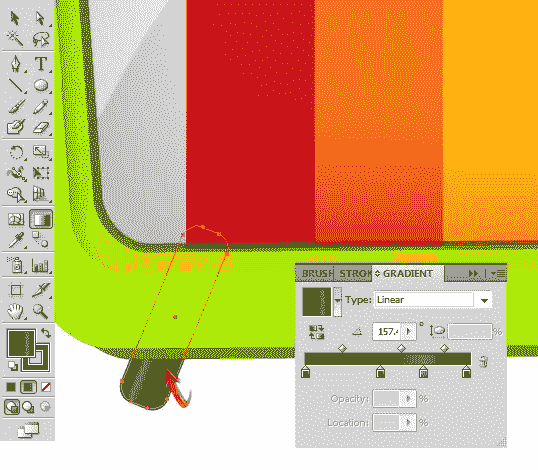](https://www.sitepoint.com/wp-content/uploads/2012/05/181.jpg)

复制脚架层形成第二只脚。

[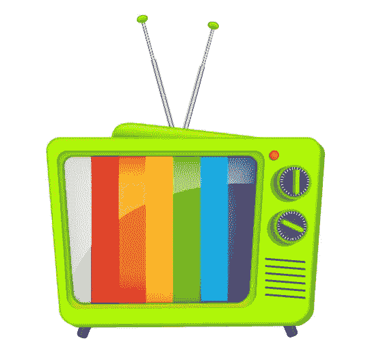](https://www.sitepoint.com/wp-content/uploads/2012/05/18b.jpg)

### 步骤 19

现在，为复古电视创建阴影，用深灰色制作一个椭圆。改变其混合模式为“乘”，减少其不透明度为 60%。

[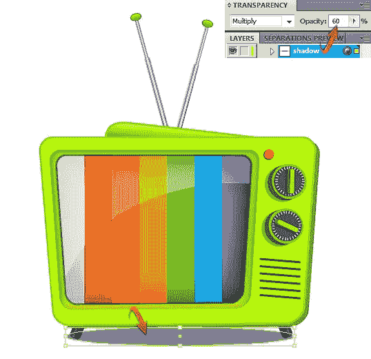](https://www.sitepoint.com/wp-content/uploads/2012/05/191.jpg)

复制阴影层，增加其大小使用“选择工具”(V)。之后，进入“效果”>“模糊”>“高斯模糊”高斯模糊使用以下值。

[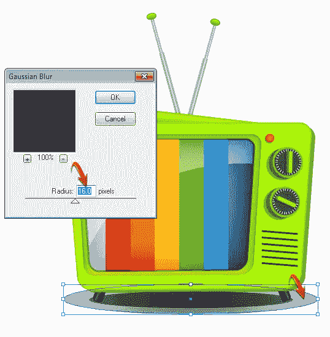](https://www.sitepoint.com/wp-content/uploads/2012/05/19b.jpg)

### 步骤 20

我们的复古电视矢量都完成了。你可以使用任何背景。我将使用一个肮脏的纹理作为背景。打开教程开头提到的“垃圾纹理”资源，复制粘贴到你的文档中剩下的图层下面。

[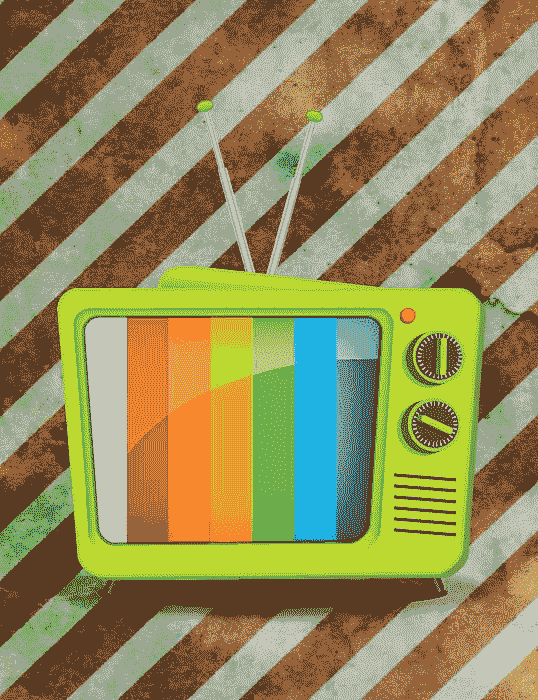](https://www.sitepoint.com/wp-content/uploads/2012/05/201.jpg)

### 步骤 21

如果需要，您可以添加一些文本。选择“文字工具”，键入您想要的文本。使用以下颜色填充，并使用 1 磅的笔画。

[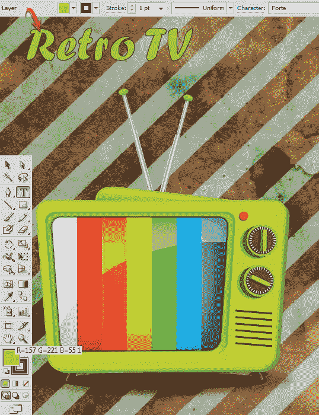](https://www.sitepoint.com/wp-content/uploads/2012/05/211.jpg)

现在，复制文本层，并改变其填充颜色为黑色。将它放在原始文本层下面，向右下方拖动一点，如下图所示。

[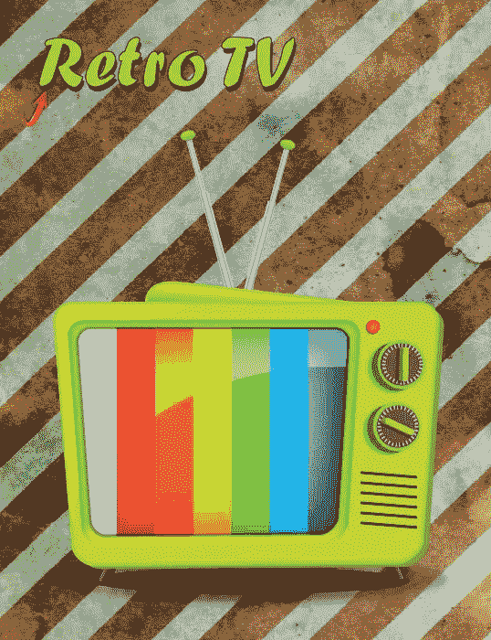](https://www.sitepoint.com/wp-content/uploads/2012/05/21b.jpg)

### 步骤 22

打开纸板纹理，复制并粘贴到一个新的层上面的其余层。改变这一层的混合模式为“叠加”，并减少其不透明度为 65%。

[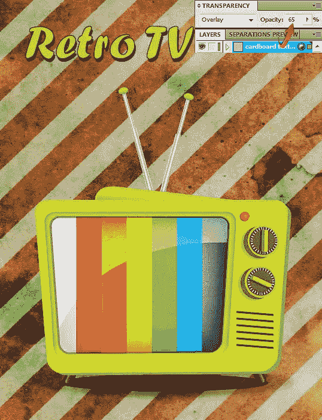](https://www.sitepoint.com/wp-content/uploads/2012/05/221.jpg)

我们的矢量化复古电视就完成了。我希望你磨练了你的插画技巧，也学到了一些有用的东西。请分享你的想法。玩得开心！

## 分享这篇文章