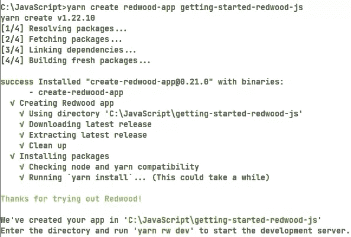
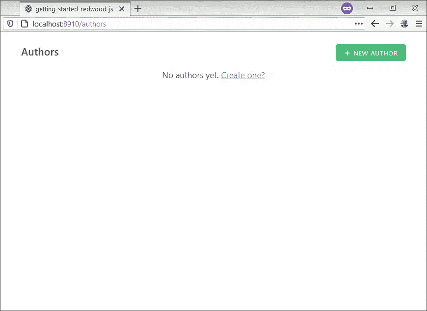
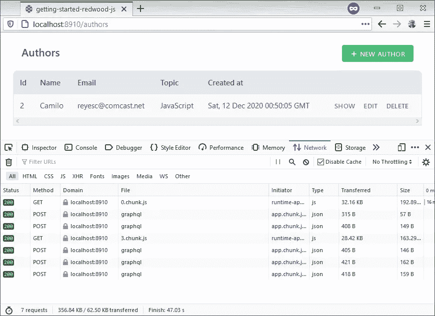
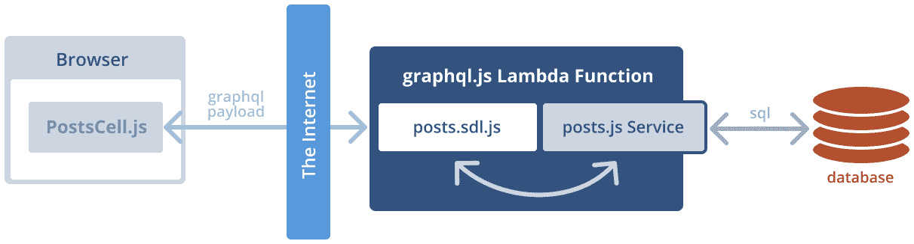

# 认识 Redwood，一个全栈、无服务器的 Jamstack 框架

> 原文：<https://www.sitepoint.com/learn-redwood/>

**想象一个由 CDN 提供的 React 应用程序，它将 GraphQL 查询发送到在世界各地运行 AWS Lambdas 的后端，所有这些都可以通过`git push`访问。这是 Redwood——一个固执己见的全栈框架，包含了[jam stack](https://www.sitepoint.com/learn-jamstack/)。**

Redwood 填补了 JavaScript 社区一段时间以来一直缺失的需求——在一个新工具出现的速度已经成为其自身的迷因的生态系统中，这不是一个容易的壮举。这种全栈 JavaScript 解决方案具有出色的开发人员体验，旨在将 Rails 固执己见、支架驱动的开发理念引入 Jamstack 站点提供的快速、安全的体验。

Redwood 希望成为一种工具，打破 Jamstack 在很大程度上的静态限制，并将这种体验应用到更加复杂的项目中。

Redwood 框架背后的思想体现在名称本身。红杉是北加利福尼亚的一种树。它们是世界上最高的大树，有些高达 380 英尺(约 116 米)。现存最古老的红杉大约在 3200 年前开始生长。红杉松果出奇的小。这些树是耐火的，从远处看起来很复杂，但在近处看起来很简单。这就是该框架试图实现的目标——给开发人员一种方法来构建密集、有弹性且易于使用的漂亮应用程序。

在本教程中，我将好好看看 Redwood 以及它带来了什么。我假设您对 React、GraphQL 和 Jamstack 有所了解。如果您想继续学习，您可以在 GitHub 上找到完整的演示[示例代码。本教程将构建一个 CRUD 应用程序(创建-读取-更新-删除),并展示这在 Redwood 中是如何无缝的。](https://github.com/sitepoint-editors/getting-started-redwood-js)

## 初始设置

为了成功安装 Redwood，该工具会检查以下版本要求:

*   节点:> =12
*   纱线:> =1.5

例如，假设节点[通过 NVM](https://www.sitepoint.com/quick-tip-multiple-versions-node-nvm/) 可用，通过`npm`安装 Yarn:

```
npm install -g yarn 
```

所有 Redwood 命令都使用 Yarn，这是一个要求。要启动您的第一个应用程序:

```
yarn create redwood-app getting-started-redwood-js 
```

终端中的初始输出如下所示:



确保目标目录是一个新的或空的文件夹，否则这个 Yarn 命令会失败。转到这个新目录并启动开发服务器:

```
cd getting-started-redwood-js
yarn redwood dev 
```

哒哒！这将自动打开设置为`http://localhost:8910`的浏览器。您的新项目应该如下所示:


继续，让开发服务器运行。当它需要重新启动时，我会告诉你的。接下来，最初的 Redwood 项目已经就绪，是时候提交进度了:

```
git init
git add .
git commit -m "First commit" 
```

请随意在 skeleton 项目中探索。应该有一个`.gitignore`文件，您可以在其中附加任何想要忽略的文件。例如，初始的框架项目在这个文件中有一个`node_modules`文件夹。任何不在这个文件中的东西都会被提交给回购。

现在，深呼吸，欣赏一下这个工具是如何完成让一个框架项目启动的大部分工作的。有两个有趣的文件夹——`web`和`api`——似乎暗示了这个项目的后端和前端。有一个 Babel 和一个 GraphQL 配置文件表明这些是依赖关系。

在初始项目运行后，返回查看控制台输出。应该会有一条信息写着“在`api/src/functions`里看文件”。这意味着任何后端代码更改都会通过这个 webpack 文件监视器自动刷新。

## Redwood 文件夹结构

在文件浏览器或您喜欢的代码编辑器中打开 Redwood 项目，并查看文件夹结构。忽略不重要的文件，它具有以下层次结构:

```
┳
┣━┓ api
┃ ┣━┓ db
┃ ┃ ┣━━ schema.prisma
┃ ┃ ┗━━ seed.js
┃ ┗━┓ src
┃   ┣━┓ functions
┃   ┃ ┗━━ graphql.js
┃   ┣━━ graphql
┃   ┣━┓ lib
┃   ┃ ┗━━ db.js
┃   ┗━━ services
┗━┓ web
  ┣━┓ public
  ┃ ┣━━ favicon.png
  ┃ ┣━━ README.md
  ┃ ┗━━ robots.txt
  ┗━┓ src
    ┣━━ components
    ┣━━ layouts
    ┣━┓ pages
    ┃ ┣━┓ FatalErrorPage
    ┃ ┃ ┗━━ FatalErrorPage.js
    ┃ ┗━┓ NotFoundPage
    ┃   ┗━━ NotFoundPage.js
    ┣━━ index.css
    ┣━━ index.html
    ┣━━ index.js
    ┗━━ Routes.js 
```

在根处是`web`和`api`文件夹，它们将前端和后端代码分开。Redwood 将这些称为“侧面”，Yarn 将其称为“工作空间”。

`api`文件夹有以下子目录:

*   `db`，其中包含数据库:
*   `schema.prisma`具有带表和列的数据库模式定义。
*   `seed.js`最初用任何零配置数据填充数据库。

数据库迁移在 SQLite 中，是框架的一部分。我添加完数据库后，会有一个`dev.db`文件，和一个名为`migrations`的文件夹。这就是 Redwood 跟踪项目中数据库模式变化的方式。

*   `src`拥有所有后端代码:
*   `functions`:这些将有 Lambda 函数和 Redwood 生成的`graphql.js`文件。
*   `graphql`:这是用模式定义语言(或 SDL)写的 GraphQL 模式。
*   `lib`有一个建立 Prisma 数据库的文件`db.js`。该文件夹用于存放不符合`functions`或`services`的代码。
*   `services`:这是处理数据的业务逻辑。这里是查询或改变数据的代码。

对于前端，看`web`目录:

*   拥有所有不在 React 中的静态资产。该文件夹中的所有文件按原样复制:
*   `favicon.png`:页面第一次打开时，浏览器标签中弹出的图标。
*   控制搜索引擎优化的网络爬虫。
*   `README.md`解释如何以及何时使用此公用文件夹。
*   `src`有几个子目录:
*   `components`具有传统的 React 组件和 Redwood 细胞(稍后将详细介绍)。
*   `layouts`:跨页面共享的 HTML/组件。在项目中，布局是可选的。
*   有一些组件可能被包装在布局中，成为 URL 的登陆页面。例如，`/authors`映射到一个页面，每个页面路径都有自己的文件夹。
    *   `NotFoundPage/NotFoundPage.js`:当没有页面存在时，框架服务于该页面(请看下面的`Routes.js`)。
    *   `FatalErrorPage/FatalErrorPage.js`在应用程序中呈现未捕获的错误异常。
*   放置不属于任何其他地方的全局 CSS 的通用位置。
*   `index.html` : React 初始页面。
*   `index.js`:启动并运行应用程序的引导代码。
*   `Routes.js`:将 URL 映射到页面的路由定义。

在`Routes.js`文件中，应用程序是这样路由到`NotFoundPage`的:

```
<Router>
  <Route notfound page={NotFoundPage} />
</Router> 
```

## 创建作者数据库

对于这个应用程序，我将构建一个 CRUD 应用程序，在页面上显示作者列表。每个作者都有姓名、时间戳和他们喜欢的主题等信息。为了保持简单，该表有一个带有连续整数的代理主键。假设一个作者数据库包含以下几列:

*   `id`:该作者的连续唯一标识符
*   `name`
*   `topic`:作者最喜欢的话题
*   `createdAt`:该记录的时间戳

Redwood 使用 Prisma ClientJS 通过 ORM 查询构建器与数据库对话。Prisma 客户端有另一个名为 Migrate 的工具，它可以一致地更新数据库模式。对模式的每次更改都是一次迁移，Prisma Migrate 会创建一次迁移来改变数据库。Prisma 支持大多数流行的 SQL，如 SQLite、MySQL 和 PostgreSQL。对于本教程，我将以 SQLite 为目标，以保持简单。

打开`api/db/schema.prisma`并定义一个`Author`表。请务必清除该文件中的任何示例代码，因为它将在迁移中运行。

例如:

```
datasource DS {
  provider = "sqlite"
  url      = env("DATABASE_URL")
}

generator client {
  provider      = "prisma-client-js"
  binaryTargets = "native"
}

model Author {
  id    Int     @id @default(autoincrement())
  name  String
  email String  @unique
  topic String?
  createdAt DateTime @default(now())
} 
```

这定义了一个包含以下列的表:

*   an `id` : Prisma 使用`@id`来建立与其他表的关系，而`@default`值是一个连续的`autoincrement()`值
*   定义为`String`类型的`name`
*   定义为`String`的`@unique`电子邮件
*   名为 topic 的可选`String?`列
*   时间戳`createdAt`列设置为`DateTime`，将`@default`设为`now()`

继续操作，将此快照作为迁移。确保在项目的根目录下运行这个 Yarn 命令:

```
yarn redwood db save create authors 
```

这将创建一个名为“创建作者”的迁移。Redwood 不在乎名字是什么，因为这是给其他开发者的。完成后，在`api/db/migrations`中查找一个新文件夹，该文件夹带有这次迁移的时间戳和名称。终端的输出将包含这个名称以及它生成了什么文件。模式的快照在`schema.prisma`中，应用迁移的指令在`steps.json`中。

现在让我们应用数据库更改:

```
yarn rw db up 
```

注意使用了简写`rw`而不是`redwood`。

随着数据库的成形，是时候转向 UI 了。Redwood 已经搭建了脚手架，可以立即获得一个基本的 CRUD 应用程序:

```
yarn rw g scaffold author 
```

终端输出为此应用程序生成的文件。如果您让 dev 服务器保持运行，请注意浏览器现在指向 404 Not Found。将浏览器指向`http://localhost:8910/authors`以查看可用内容:

这是使用支架 CSS 的框架 UI 的样子。如果页面中缺少样式，打开`index.js`并添加`import './scaffold.css'`:



尽管 topic 是一个可选列，但是 scaffold 使得`Author`表中的所有字段都是必需的。要解决这个问题，打开`web/src/components/AuthorForm/AuthorForm.js`并用这个替换主题`TextField`:

```
<TextField
  name="topic"
  defaultValue={props.author?.topic}
  className="rw-input"
/> 
```

要查看 Jamstack 的运行情况，请在浏览器中打开开发人员工具，开始探索。我将用我的名字创建一个作者，没有我喜欢的主题(这是可选的)。然后，用我喜欢的话题更新记录。网络流量将向后端显示 Ajax 请求，完成所有工作，而无需刷新整个页面。确保禁用缓存以查看所有网络流量。

这是浏览器的样子:



有几点需要注意。`chunk.js`请求是在浏览器中呈现部分应用程序的部分页面加载。这是 React 和 webpack 的实际应用。JSON 网络请求通过在后端查询或改变数据的`POST`获得 GraphQL 负载。

打开网络请求负载会显示 GraphQL 查询。例如:

```
{
  "operationName": "AUTHORS",
  "variables": {},
  "query": "query AUTHORS {authors {id name email topic createdAt __typename}}"
} 
```

唷，Redwood 只用很少的代码就创建了所有的页面。无需从头开始编写复杂的 SQL 或 React 组件。这就是 Redwood 所说的*脚手架*的含义。

这是我运行`yarn rw g scaffold author`命令时生成的结果:

*   在`api/src/graphql/authors.sdl.js`中定义了几个 GraphQL 查询和变异的 SDL 文件
*   `api/src/services/authors/authors.js`中的一个服务文件，它调用 Prisma 来处理数据库
*   用一个 Jest 测试文件来编写单元测试(稍后会详细介绍)
*   `web/src/pages`中的几页
*   `EditAuthorPage`编辑作者
*   `AuthorPage`显示一个作者的详细信息
*   `AuthorsPage`获取所有作者
*   `NewAuthorPage`创建作者
*   `web/src/Routes.js`中这些页面的路径
*   一个*布局`web/src/layouts/AuthorsLayout/AuthorsLayout.js`中的*
*   *细胞*在`web/src/components`
*   `AuthorCell`获得一个作者
*   获取作者列表
*   `EditAuthorCell`获取作者要编辑的数据库
*   *组件*也在`web/src/components`中
*   `Author`:显示单个作者
*   `AuthorForm`:用于改变数据字段的实际 HTML 表单
*   `Authors`显示作者列表
*   `NewAuthor`呈现表单以创建作者(编辑使用单元格)

这个脚手架很酷，足以为我创建一个测试文件，因为 Jest 是在最初的项目中内置的。打开`services/authors/authors.test.js`并放下几个单元测试:

```
import { createAuthor, deleteAuthor } from './authors'

let author

it('creates an author', () => {
  author = createAuthor({ input: { name: 'T', email: 'xyz@abc.xo' } })
})

it('deletes an author', () => {
  deleteAuthor(author)
}) 
```

因为这与实际的数据库对话，所以一定要编写*等幂*的测试。这意味着重复运行测试应该没有副作用，也不会在数据库中留下任何坏数据。如果您认为合适，可以随意添加更多的测试。

从项目的根目录运行测试:

```
node_modules/.bin/jest 
```

## Redwood 如何处理数据

Redwood 使用 GraphQL 来查询和变异数据。这是 GraphQL 查询在后端做的事情:



前端使用 Apollo 客户端创建一个 GraphQL 有效负载，发送到云中的无服务器 AWS Lambda 函数。如果您在开发人员工具中查看请求 URL，请注意所有有效负载都指向`.redwood/functions/graphql`端点。`graphql/authors.sdl.js`和`services/authors/authors.js`文件是面向互联网的公共 API 的接口。

打开`api/src/graphql/authors.sdl.js`会显示以下 GraphQL 模式定义:

```
export const schema = gql` type Author {
    id: Int!
    name: String!
    email: String!
    topic: String
    createdAt: DateTime!
  }

  type Query {
    authors: [Author!]!
    author(id: Int!): Author
  }

  input CreateAuthorInput {
    name: String!
    email: String!
    topic: String
  }

  input UpdateAuthorInput {
    name: String
    email: String
    topic: String
  }

  type Mutation {
    createAuthor(input: CreateAuthorInput!): Author!
    updateAuthor(id: Int!, input: UpdateAuthorInput!): Author!
    deleteAuthor(id: Int!): Author!
  } ` 
```

这转化为 Redwood 寻找以下五个解析器:

*   `authors()`
*   `author({id})`
*   `createAuthor({input})`
*   `updateAuthor({id, input})`
*   `deleteAuthor({id})`

打开`api/src/services/authors/author.js`，有如下界面:

```
import { db } from 'src/lib/db'

export const authors = () => {
  return db.author.findMany()
}

export const author = ({ id }) => {
  return db.author.findOne({
    where: { id },
  })
}

export const createAuthor = ({ input }) => {
  return db.author.create({
    data: input,
  })
}

export const updateAuthor = ({ id, input }) => {
  return db.author.update({
    data: input,
    where: { id },
  })
}

export const deleteAuthor = ({ id }) => {
  return db.author.delete({
    where: { id },
  })
} 
```

回头看看我写的单元测试，因为它重用了相同的代码来访问数据库。Redwood 允许您重用这些服务，因为它们是单个表之上的抽象。这意味着业务逻辑可以重用尽可能多的服务来完成工作。这些功能中的一部分可以通过或不通过 GraphQL 向客户端公开。将`authors.sdl.js` GraphQL 模式定义视为向浏览器公开的公共接口，将这个`author.js`文件视为私有接口。为了证明这一点，编辑 SDL 文件，用核武器摧毁任何有突变的行——比如说`updateAuthor()`。下一次 GraphQL 负载请求这一更改时，它会在浏览器中爆炸。很整洁，是吧？

接下来，Redwood 使用单元的概念告诉`Success`组件数据何时可用。我现在将深入研究细胞，找出这个`Success`组件是什么，它做什么。

## 细胞

好消息是支架已经在负责制造细胞了。Redwood 使用单元格作为数据获取的装饰方法。每当组件需要来自数据库的数据或任何有延迟的异步调用时，使用单元。Cells 输出几个特别命名的组件，如`Success`，Redwood 完成剩下的工作。

Redwood cells 在处理数据时遵循以下生命周期:

*   执行`QUERY`并显示`Loading`组件
*   如果有错误，渲染`Failure`组件
*   如果没有数据(零配置)，渲染`Empty`组件
*   否则，渲染`Success`组件

还有像`beforeQuery`这样的生命周期助手，用于在运行`QUERY`之前按摩道具，还有`afterQuery`用于按摩从 GraphQL 返回的数据。这些助手在数据被发送到`Success`组件之前运行。

至少，细胞需要`QUERY`和`Success`输出。如果没有`Empty`组件，结果将在`Success`中结束。如果没有`Failure`组件，错误将会出现在浏览器的控制台。

要查看单元格，请打开`web/src/components/AuthorCell/AuthorCell.js`:

```
export const QUERY = gql` query FIND_AUTHOR_BY_ID($id: Int!) {
    author: author(id: $id) {
      id
      name
      email
      topic
      createdAt
    }
  } `

export const Loading = () => <div>Loading...</div>

export const Empty = () => <div>Author not found</div>

export const Success = ({ author }) => {
  return <Author author={author} />
} 
```

注意当页面呈现单个作者时，此单元格处理加载、空和成功状态。

## 最后的想法

总的来说，Redwood 还没有准备好投入生产，但是它从 JavaScript 社区中吸取了很多好的概念。像 React 和 GraphQL 这样的现代思想将这个框架放在了一条好的道路上。单元格解决了一个常见的反应问题，我看到这个问题在获取数据时经常发生。将 GraphQL 和 Prisma 作为具有私有/公共接口的一等公民是一件有趣的事情。另外，我惊喜地发现在后端编写单元测试是多么容易。

## 分享这篇文章