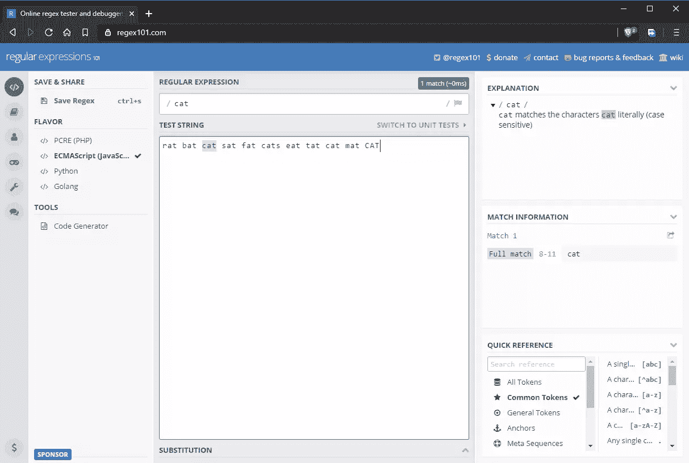
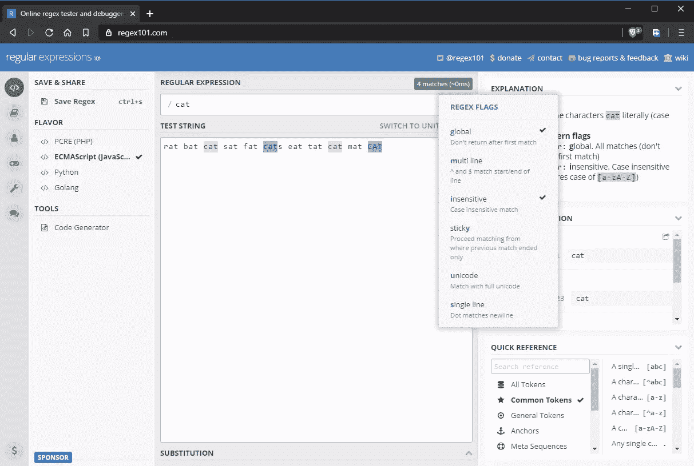
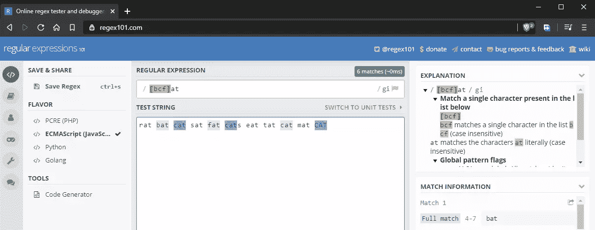
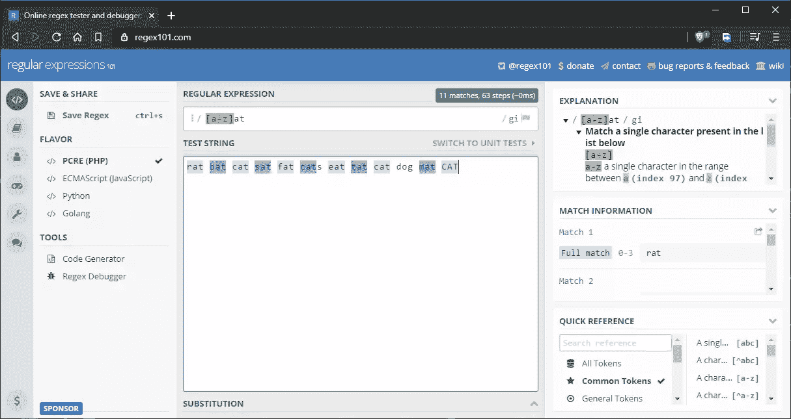
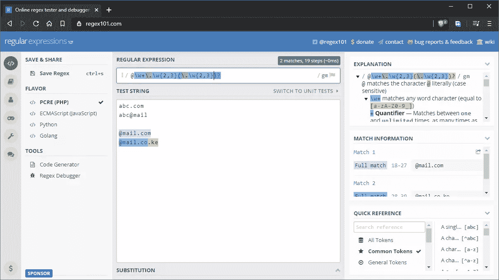
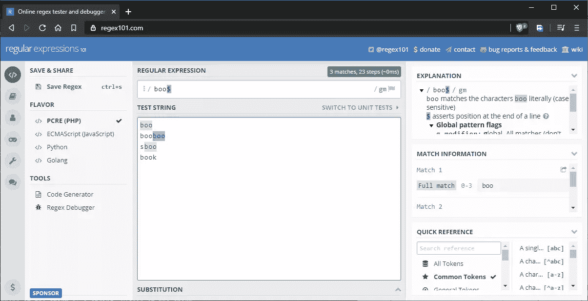
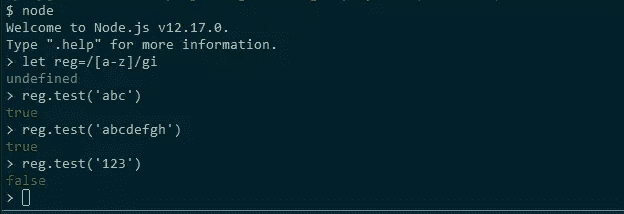

# 学习正则表达式:初学者指南

> 原文：<https://www.sitepoint.com/learn-regex/>

在本指南中，你将学习正则表达式语法。最后，您将能够在 web 开发工作中的大多数场景中应用 regex 解决方案。

## 什么是正则表达式？

正则表达式是用于查找或匹配字符串中模式的特殊序列。这些序列使用[元字符](https://en.wikipedia.org/wiki/Metacharacter)和其他语法来表示集合、范围或特定字符。例如，表达式`[0-9]`匹配 0 到 9 之间的数字范围，而`humor|humour`匹配字符串“幽默”和“幽默”。

正则表达式有许多真实世界的用例，包括:

*   表单输入验证
*   网页抓取
*   搜索和替换
*   过滤大量文本文件(如日志)中的信息

对于新用户来说，它们可能看起来复杂而吓人。看一下这个例子:

```
/^[a-zA-Z0-9.!#$%&’*+/=?^_`{|}~-]+@[a-zA-Z0-9-]+(?:\.[a-zA-Z0-9-]+)*$/ 
```

它看起来像是乱码。但不要绝望，这种疯狂背后是有方法的。

在本指南中，我将向您展示如何掌握正则表达式，但首先，让我们澄清本指南中使用的术语:

*   **模式**:正则表达式模式
*   **字符串**:用于匹配模式的测试字符串
*   **数字** : 0-9
*   **字母** : a-z，a-z
*   **符号**:！$%^&*()_+| ~-= ` { }[]:"；< >？,./
*   **空格**:单个空格，制表符
*   **字符**:指字母、数字或符号


*信用:[xkcd](https://xkcd.com/208/)*

## 基础

为了通过本指南快速学习 Regex，请访问 [Regex101](https://regex101.com/) ，在这里您可以构建 regex 模式并根据您提供的字符串(文本)测试它们。

当你打开网站时，你需要选择 **JavaScript** 风格，因为这就是我们将在本指南中使用的。(所有语言的正则表达式语法基本相同，但有一些细微的差别。)

接下来，您需要禁用 Regex101 中的`global`和`multi line`标志。我们将在下一节讨论它们。现在，我们来看看我们可以构建的最简单的正则表达式。输入以下内容:

*   **正则表达式输入字段** : cat
*   **测试串**:鼠蝠猫坐肥猫吃 tat 猫垫猫



注意 JavaScript 中的正则表达式以`/`开始和结束。如果您用 JavaScript 代码编写一个正则表达式，它看起来应该是这样的:`/cat/`没有任何引号。在上面的状态中，正则表达式匹配字符串“cat”。然而，正如您在上面的图像中看到的，有几个“cat”字符串不匹配。在下一节中，我们将看看为什么。

## 全局和不区分大小写的正则表达式标志

默认情况下，正则表达式模式将只返回它找到的第一个匹配。如果您想要返回额外的匹配，您需要启用**全局**标志，表示为`g`。默认情况下，正则表达式模式也区分大小写。您可以通过启用由`i`表示的**不敏感**标志来覆盖这种行为。更新后的正则表达式模式现在完全表示为`/cat/gi`。正如您在下面看到的，所有的“cat”字符串都匹配了，包括大小写不同的那个。



## 字符集

在前面的示例中，我们学习了如何执行区分大小写的精确匹配。如果我们想把“蝙蝠”、“猫”和“胖子”搭配起来呢？我们可以通过使用**字符集**来做到这一点，用<括号表示——代码> []。基本上，你放入多个你想要匹配的字符。例如，`[bcf]at`将匹配多个字符串，如下所示:



字符集也适用于数字。

## 范围

假设我们想要匹配所有以`at`结尾的单词。我们可以在字符集内提供完整的字母表，但那会很乏味。解决方案是使用这样的范围`[a-z]at`:



下面是正在测试的完整字符串:`rat bat cat sat fat cats eat tat cat dog mat CAT`。

如您所见，所有单词都如预期的那样匹配。我添加了单词`dog`只是为了加入一个无效的匹配。以下是使用范围的其他方式:

*   **部分范围**:选择`[a-f]`或`[g-p]`等。
*   **大写范围** : `[A-Z]`。
*   **位数范围** : `[0-9]`。
*   **符号范围**:例如`[#$%&@]`。
*   **混合范围**:例如`[a-zA-Z0-9]`包括所有数字、小写和大写字母。请注意，一个范围只为一个模式中的**单个字符**指定多个选项。为了进一步理解如何定义一个范围，最好查看完整的 ASCII 表，以便了解字符是如何排序的。


## 重复字符

假设您想要匹配所有三个字母的单词。你可能会这样做:

```
[a-z][a-z][a-z] 
```

这将匹配所有三个字母的单词。但是如果你想匹配一个五个或八个字符的单词呢？以上方法比较繁琐。使用`{}`花括号符号有更好的方式来表达这种模式。您所要做的就是指定重复字符的数量。以下是一些例子:

*   `a{5}`会匹配“aaaaa”。
*   `n{3}`会匹配“nnn”。
*   `[a-z]{4}`将匹配任何四个字母的单词，如“门”、“房间”或“书”。
*   `[a-z]{6,}`将匹配任何包含六个或更多字母的单词。
*   `[a-z]{8,11}`将匹配 8 到 11 个字母之间的任何单词。基本密码验证可以通过这种方式完成。
*   `[0-9]{11}`将匹配一个 11 位数字。基本的国际电话验证可以这样做。

## 元字符

元字符允许您编写更加紧凑的正则表达式模式。让我们一个一个地看一下:

*   `\d`匹配任何与`[0-9]`相同的数字
*   `\w`匹配任何字母、数字和下划线字符
*   `\s`匹配空白字符，即空格或制表符
*   `\t`仅匹配制表符

根据我们目前所学，我们可以编写这样的正则表达式:

*   `\w{5}`匹配任何五个字母的单词或五位数字
*   `\d{11}`匹配 11 位数字，如电话号码

## 特殊字符

特殊字符让我们更进一步，编写更高级的模式表达式:

*   `+`:一个或多个量词(前面的字符必须存在，可以重复)。例如，表达式`c+at`将匹配“cat”、“ccat”和“cccccccat”。您可以重复前面的字符任意多次，您仍然会得到一个匹配。
*   `?`:零个或一个量词(前面的字符是可选的)。例如，表达式`c?at`将只匹配“cat”或“at”。
*   `*`:零个或多个量词(前面的字符是可选的，可以重复)。例如，表达式`c*at`将匹配“at”、“cat”和“ccccccat”。这就像是`+`和`?`的组合。
*   当我们想要字面上使用一个特殊的字符时，使用这个“转义字符”。比如`c\*`会精确匹配“c*”，而不是“ccccccc”。
*   `[^]`:这个“求反”符号用于表示一个范围内不应该匹配的字符。例如，表达式`b[^a-c]ld`将不匹配“bald”或“bbld ”,因为第二个字母 a 到 c 是负数。但是，该模式将匹配“beld”、“bild”、“bold”等。
*   `.`:这个“do”符号将匹配除换行符之外的任何数字、字母或符号。例如，`.{8}`将匹配一个由字母、数字和符号组成的八字符密码。例如，“password”和“P@ssw0rd”都匹配。

从我们到目前为止所学的，我们可以创建一个有趣的紧凑但强大的正则表达式。例如:

*   `.+`匹配一个或无限个字符。比如“c”、“cc”、“bcd#.670”都会匹配。
*   `[a-z]+`将匹配所有小写字母单词，无论其长度如何，只要它们至少包含一个字母。例如，“书”和“会议室”都匹配。

## 组

我们刚刚提到的所有特殊字符只影响单个字符或一个范围集。如果我们想将效果应用到表达式的*部分*呢？我们可以通过使用圆括号— `()`创建组来做到这一点。例如，模式`book(.com)?`将匹配“book”和“book.com ”,因为我们已经创建了“.com "部分可选。

下面是一个更复杂的例子，它将用于电子邮件验证等现实场景中:

*   图案:`@\w+\.\w{2,3}(\.\w{2,3})?`
*   测试字符串:`abc.com abc@mail @mail.com @mail.co.ke`



## 替代字符

在 regex 中，我们可以使用“管道”符号— `|`来指定替代字符。这与我们之前展示的特殊字符不同，因为它影响管道符号每一侧的所有字符。例如，模式`sat|sit`将匹配“sat”和“sit”字符串。我们可以将模式重写为`s(a|i)t`来匹配相同的字符串。

上面的模式可以用`()`括号表示为`s(a|i)t`。

## 开始和结束模式

您可能已经注意到，一些肯定的匹配是部分匹配的结果。例如，如果我编写了一个模式来匹配字符串“boo ”,那么字符串“book”也会得到一个肯定的匹配，尽管不是完全匹配。为了解决这个问题，我们将使用以下符号:

*   `^`:放在开头，这个字符匹配一个字符串开头的模式。
*   `$`:放在末尾，这个字符匹配字符串末尾的一个模式。

为了修正上面的情况，我们可以把我们的模式写成`boo$`。这将确保最后三个字符与模式匹配。但是，有一个问题我们还没有考虑，如下图所示:



字符串“sboo”得到一个匹配，因为它仍然满足当前的模式匹配要求。为了解决这个问题，我们可以如下更新模式:`^boo$`。这将严格匹配“嘘”字。如果您同时使用这两种规则，则两种规则都会被强制执行。例如，`^[a-z]{5}$`严格匹配一个五个字母的单词。如果字符串超过五个字母，则模式不匹配。

## JavaScript 中的正则表达式

```
// Example 1
const regex1=/a-z/ig

//Example 2
const regex2= new RegExp(/[a-z]/, 'ig') 
```

如果您的机器上安装了 Node.js，打开一个终端并执行命令`node`来启动 Node.js shell 解释器。接下来，按如下方式执行:



随意使用更多的正则表达式模式。完成后，使用命令`.exit`退出 shell。

## 真实世界的例子:用正则表达式验证电子邮件

在我们结束本指南时，让我们看看正则表达式的一个流行用法，**电子邮件验证**。例如，我们可能希望检查用户在表单中输入的电子邮件地址是否是有效的电子邮件地址。

这个问题比你想象的要复杂。邮件地址的语法很简单:`{name}@{domain}`。理论上，一个电子邮件地址可以包含有限数量的符号，如`#-@&%.`等。然而，这些符号的位置很重要。邮件服务器对符号的使用也有不同的规则。例如，一些服务器将`+`符号视为无效。在其他邮件服务器中，该符号用于[电子邮件子地址](https://tools.ietf.org/id/draft-newman-email-subaddr-01.html)。

为了测试您的知识，请尝试构建一个正则表达式模式，该模式仅匹配下面标记的有效电子邮件地址:

```
# invalid email
abc
abc.com

# valid email address
abc@mail.com
abc@mail.nz
abc@mail.co.nz
abc123@mail.com
abc.def@music.com

# invalid email prefix
abc-@mail.com
abc..def@mail.com
.abc@mail.com
abc#def@mail.com

# valid email prefix
abc-d@mail.com
abc.def@mail.com
abc@mail.com
abc_def@mail.com

# invalid domain suffix
abc.def@mail.c
abc.def@mail#archive.com
abc.def@mail
abc.def@mail..com

# valid domain suffix
abc.def@mail.cc
abc.def@mail-archive.com
abc.def@mail.org
abc.def@mail.com
fully-qualified-domain@example.com 
```

请注意，一些标记为**有效**的电子邮件地址可能对某些组织无效，而一些标记为**无效**的电子邮件地址实际上在其他组织中可能是允许的。无论哪种方式，学习为您工作的组织构建定制的正则表达式对于满足他们的需求是至关重要的。万一卡住了，可以看看以下可能的解决方案。请注意，没有一个会给你 100%匹配以上有效的电子邮件测试字符串。

*   **可能的解决方案 1** :

```
^\w*(\-\w)?(\.\w*)?@\w*(-\w*)?\.\w{2,3}(\.\w{2,3})?$ 
```

*   **可能的解决方案 2** :

```
^(([^<>()\[\]\\.,;:\s@"]+(\.[^<>()\[\]\\.,;:\s@"]+)*)|(".+"))@((\[[0-9]{1,3}\.[0-9]{1,3}\.[0-9]{1,3}\.[0-9]{1,3}])|(([a-zA-Z\-0-9]+\.)+[a-zA-Z]{2,}))$ 
```

## 摘要

我希望您现在已经学习了正则表达式的基础知识。在这本快速入门指南中，我们没有涵盖所有的正则表达式特性，但是您应该有足够的信息来解决大多数需要正则表达式解决方案的问题。要了解更多信息，请阅读我们的 regex 在现实场景中的[实际应用最佳实践指南。](https://www.sitepoint.com/demystifying-regex-with-practical-examples/)

## 分享这篇文章