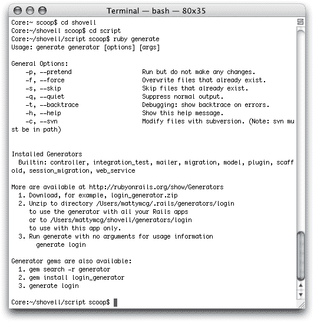
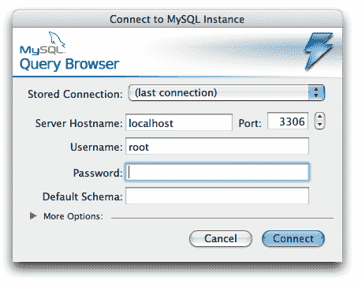
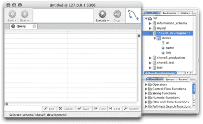
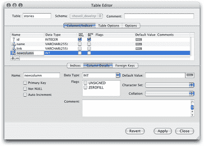

# 学习 Ruby on Rails:终极初学者教程

> 原文：<https://www.sitepoint.com/learn-ruby-on-rails-10/>

## 代码生成

Rails 让我们能够相当轻松地生成应用程序的基本结构，而不是让我们从头开始创建所有的应用程序代码。就像我们创建应用程序的整个目录结构一样，我们可以使用一个命令创建新的模型、控制器和视图。

为了在 Rails 中生成代码，我们使用 generate 脚本，它位于 script 文件夹中。现在试试吧:键入 ruby generate，不带任何命令行参数。Rails 显示了该命令可用参数的概述，并列出可供我们选择的生成器，如图 4.6 所示。

*图 4.6。来自`script/generate`的样本输出*

Rails 可以生成不同复杂度的代码。最简单的方法是，创建一个新的控制器会将一个模板文件放在应用程序的适当子目录中。模板本身主要由一个空的类定义组成，类似于我们在本章前面看到的`Story`和`Author`类。

然而，代码生成对于自动化复杂的、重复的任务也是一个非常强大的工具；例如，您可能会生成一个用于处理用户身份验证的基础。当我们开始生成我们的模型和控制器时，我们将在第 5 章“模型、视图和控制器”中直接开始生成代码。

另一个例子是为模型生成一个基本的基于 web 的界面，称为脚手架。当我们开始构建视图时，我们还将在第 5 章“模型、视图和控制器”中看到脚手架。

## `ActionMailer`

虽然严格来说不是网络的一部分，但电子邮件是我们在线体验的重要组成部分，Rails 对电子邮件的集成支持值得一提。Web 应用程序经常使用电子邮件来完成诸如向新用户发送注册确认和重置用户密码之类的任务。

是 Rails 的一个组件，它可以很容易地将电子邮件的发送和接收集成到您的应用程序中。`ActionMailer`的结构与 ActionPack 类似，由控制器和带有模板的动作组成。

虽然创建电子邮件和处理收到的电子邮件是复杂的任务，`ActionMailer`隐藏了这些复杂性并为您处理这些任务。这意味着创建一封外发邮件只需使用模板和一点 Ruby 代码提供邮件的主题、正文和收件人。同样，`ActionMailer`为您处理收到的电子邮件，为您提供一个 Ruby 对象，以一种易于访问的方式封装整个消息。

向 web 应用程序添加电子邮件功能超出了本书的范围，但是您可以在 Ruby on Rails wiki 上阅读更多关于`ActionMailer`的内容。

## 测试和调试

**测试**

Rails 支持许多不同类型的测试，包括自动化测试和集成测试。

**自动化测试**

自动化测试的概念对世界传统软件开发来说并不新鲜，但在 web 应用程序开发中却相当少见。虽然大多数基于 Java 的 web 应用程序利用了全面的测试工具，但是大量的 PHP 和 Perl web 应用程序在只执行了一些手动测试之后就投入使用了(有时甚至根本没有任何测试！).尽管执行自动化测试可能是一个选项，但是开发人员可能会因为从任务的复杂性到时间限制等原因而决定不使用它们。

我们在第 1 章介绍 Ruby on Rails 中简单地提到了这一点，但是值得再次强调:Rails 内置了全面的自动化测试，并且非常容易实现，这意味着是否应该测试您的应用程序不再是一个问题:尽管去做！

我们刚才介绍的`generate`命令可以自动创建测试模板，您可以将其用于您的控制器、视图和模型。(请注意，Rails 只是协助您完成工作，它不会取代您——目前还不会！)

您想要实现自动化测试的程度取决于您自己。等到出现问题，然后编写一个测试来证明问题的存在，这可能符合您的需要。一旦你解决了问题，测试不再失败，你就再也不会得到那个特定问题的错误报告了。

另一方面，如果您想完全接受自动化测试，您可以编写测试来确保特定的 HTML 标签存在于页面层次结构中的精确位置。(这里所指的层次结构是文档对象模型(DOM)，这是一种 W3C 标准，用于描述(X)HTML 页面的层次结构。)是的，自动化测试可以那么精确。

**集成测试**

Rails 的测试能力还包括集成测试。

集成测试是指连续测试几个网站组件，通常，组件的顺序类似于用户在使用应用程序时遵循的路径。例如，您可以构建一个集成测试，重新构建用户点击链接、注册用户帐户、确认您发送的注册电子邮件以及访问仅限注册用户访问的页面的操作。

我们将在后面的章节中更详细地研究自动化测试和集成测试。

**调试**

当你解决问题时，第一步是确定问题的根源。像许多语言一样，Rails 通过提供开发人员(也就是您)来协助这一过程。)以及代码的完整堆栈跟踪。正如我们前面所看到的，堆栈跟踪是到出现异常时为止调用的所有方法的列表。该列表不仅包括每个方法的名称，还包括这些方法所属的类，以及它们所在的文件的名称。

使用堆栈跟踪中包含的信息，您可以返回到您的代码来确定问题。根据问题本身的性质，有几种不同的方法可以解决这个问题:

*   如果您对问题可能是什么有一个粗略的想法，并且能够将它隔离到您的应用程序的模型(或者是您的数据的一个特定的类或方面)，您最好的选择是使用我们在本章前面看到的 Rails 控制台。从脚本目录中键入 console 以启动控制台。一旦进入，您就可以加载您感兴趣的特定模型，并戳它来重现和修复问题。
*   如果问题更倾向于与用户的浏览器或会话有关，您可以在问题发生的地方添加一个断点语句。有了这个工具，您就可以重新加载浏览器，并使用 breakpointer 命令行工具单步执行您的应用程序代码，以探索变量内容或手动执行 Ruby 语句。

我们将在第 11 章调试、测试和基准测试中讨论所有血淋淋的细节。

## MySQL 的图形用户界面工具

我们在本章中使用的 MySQL 命令行是维护数据库结构及其包含的数据的一种方式。但是在命令行客户机中工作肯定是令人难以招架的、复杂的和乏味的——尤其是当您刚刚开始使用数据库并且不熟悉环境的时候！

值得一提的是，MySQL Query Browser 是一个可用于 MySQL 的 GUI 工具。MySQL 查询浏览器由 MySQL AB(MySQL 的开发者)发布，是一款免费的跨平台工具，目前可用于 Windows、Linux 和 Mac OS x。MySQL 查询浏览器可从[http://dev.mysql.com/downloads/query-browser/](http://dev.mysql.com/downloads/query-browser/)下载。遗憾的是，OS X 10.3 或更早版本没有二进制安装包；CocoaMySQL 是一个很好的替代方案。

在大多数平台上，安装 MySQL 查询浏览器是一个简单的过程:

*   Windows—Windows 有一个二进制安装程序—启动安装程序，并为向导中的每个步骤选择默认选项。
*   Mac OS X——Mac 上也有一个二进制安装程序。装载磁盘映像并将应用程序图标拖到“应用程序”文件夹。
*   Linux——大多数 Linux 发行版都有一个包；使用发行版的软件包管理器安装应用程序。

*图 4.7。MySQL 查询浏览器连接屏幕*

MySQL 查询浏览器可用于对数据库执行查询。您还可以使用它通过创建和修改数据库和表来改变数据库结构。图 4.7 显示了连接屏幕。

要使用的连接细节与我们之前在 config/database.yml 文件中将 Rails 配置为连接到我们的数据库时使用的细节相同。假设从那以后您没有更改过 MySQL 配置，那么在主机名字段中输入 localhost，在用户名字段中输入 root。现在点击连接。

一旦连接上，你应该会看到一个类似于图 4.8 所示的窗口。

*图 4.8。MySQL 查询浏览器的查询窗口*

主窗口的顶部是一个文本字段，您可以在其中键入数据库查询。右侧的拉出选项卡列出了您可以连接的数据库。甚至还有函数和语法参考。

MySQL 查询浏览器显示的 stories 表的表模式与我们创建它时完全一样，另外一个好处是我们只需单击鼠标就可以更改它。通过点击列列表底部的+按钮，可以添加一列；单击–按钮删除当前选定的列。很简单，不是吗？

探究查询浏览器的每一个特性绝对超出了本书的范围，但是我还想向您展示一个东西:表编辑器，如图 4.9 所示。

要启动表格编辑器，首先通过单击数据库名称旁边的三角形来展开 shovell_development 数据库。这将列出数据库中的所有表。目前，应该只有一个:我们之前创建的`stories`表。现在右键单击(在 Mac 上按住 Control 键单击)要编辑的表格，并从出现的菜单中选择“编辑表格”。

*图 4.9。MySQL 表格编辑器*

表格编辑器允许您编辑现有表格和添加新表格，所有这些都使用一个漂亮的 GUI 界面。我相信你会同意这是一个比不得不与神秘的命令行工具战斗友好得多的体验。

这就是 MySQL 查询浏览器——我们将在第 5 章“模型、视图和控制器”中简要回顾它，但现在可以随意关闭应用程序了。

## 摘要

在这一章中，我们剥离了组成 Ruby on Rails 框架的一些层。到目前为止，您应该已经很好地理解了 Rails 的哪些部分在 MVC 架构的上下文中执行特定的角色。Rails 应用程序如何处理 web 浏览器发出的请求也应该相当清楚。

我们研究了 Rails 为解决应用程序生命周期的不同阶段而提供的不同环境，并创建了数据库来支持这些环境。我们还为 Rails 提供了连接数据库所需的详细信息。

我们也第一次接触了真实的代码，因为我们看到了我们的克隆[digg.com](http://digg.com/)的 ActiveRecord 模型、ActionController 控制器和 ActionView 模板。我们探讨了代码生成、测试和调试的主题，并简要介绍了一个 GUI 客户机，它使与 MySQL 数据库的交互更加方便。

在下一章中，我们将在所有这些知识的基础上，使用代码生成工具为我们的 sleaglel 应用程序创建实际的模型、控制器和视图。这将是一个大的！

以上是 [*构建你自己的 Ruby On Rails Web 应用*](https://www.sitepoint.com/books/rails1/) 的节选——但是不要忘记[可下载的 PDF 包含了比这里包含的更多的三个章节](https://www.sitepoint.com/show-modal-popup-after-time-delay/)。请参见完整的[目录](https://www.sitepoint.com/books/rails1/toc.php)了解本书涵盖的全部细节。

如果你喜欢读这篇文章，你会爱上[可学的](https://learnable.com/)；向大师们学习新技能和技术的地方。会员可以即时访问 SitePoint 的所有电子书和交互式在线课程，如[学习 Ruby on Rails 3](https://learnable.com/courses/learning-ruby-on-rails-3-212) 。

**Go to page:** [1](https://sitepoint.com/learn-ruby-on-rails-1/) | [2](https://sitepoint.com/learn-ruby-on-rails-2/) | [3](https://sitepoint.com/learn-ruby-on-rails-3/) | [4](https://sitepoint.com/learn-ruby-on-rails-4/) | [5](https://sitepoint.com/learn-ruby-on-rails-5/) | [6](https://sitepoint.com/learn-ruby-on-rails-6/) | [7](https://sitepoint.com/learn-ruby-on-rails-7/) | [8](https://sitepoint.com/learn-ruby-on-rails-8/) | [9](https://sitepoint.com/learn-ruby-on-rails-9/) | [10](https://sitepoint.com/learn-ruby-on-rails-10/)

## 分享这篇文章