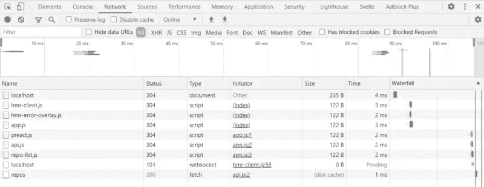

# 学习 Snowpack:一个高性能的前端构建工具

> 原文：<https://www.sitepoint.com/learn-snowpack/>

在这篇文章中，我们将首先看看[snow pack](https://www.snowpack.dev/)——特别是 Snowpack 3，它在撰写本文时刚刚发布。Snowpack 是一个前端构建工具，因为它提供了一种与 webpack 等工具不同的方法，所以在社区中受到了很多关注，我很想尝试一下。让我们开始吧！

## 构建工具的历史

在我们研究 Snowpack 之前，我们需要花一点时间来了解像 webpack 这样的捆扎机是如何以及为什么会出现的。在 ES2015 的模块之前，JavaScript 缺乏模块系统，这意味着在浏览器中，我们可以最接近模块的方式是将代码分成文件，将代码放入全局范围，因为这是我们在文件之间共享代码的方式。这样的代码很常见:

```
window.APP = {}

window.APP.Authentication = {...}
window.APP.ApiLoader = {...} 
```

当 Node.js 出现并流行起来时，它有了一个 CommonJS 形式的模块系统:

```
const Authentication = require('./Authentication.js')
const APILoader = require('./APILoader.js') 
```

一旦它作为 Node 的一部分流行起来，人们希望能够在浏览器中使用它。这就是工具开始出现的时候。他们可以将一个使用 CommonJS 模块的应用程序捆绑到一个大的 JavaScript 文件中，去掉所有的`require`,可以在浏览器中执行。 [Browserify](http://browserify.org/) 是我记忆中第一个用来做这件事的工具，老实说，这感觉就像魔术一样！这大约是 webpack 出现的时间，其他工具也支持使用 CommonJS。

当 ES 模块第一次被引入时(参见“[了解 ES6 模块](https://www.sitepoint.com/understanding-es6-modules/)”复习)，人们热衷于使用它们，但是有两个问题:

1.  虽然规范已经完成，但是浏览器不支持 ES 模块。
2.  即使浏览器支持 ES 模块，您可能仍然希望捆绑到产品中，因为如果它们被定义为单独的文件，那么加载所有的模块需要时间。

Webpack(以及其他)已经更新，支持 ES 模块，但是它们总是将您的代码捆绑到一个文件中，无论是开发还是生产。这意味着典型的工作流程是:

1.  在应用程序中编辑文件。
2.  Webpack 查看哪个文件发生了更改，并重新绑定您的应用程序。
3.  您可以刷新浏览器并查看您的更改。通常，这是由一个 webpack 插件来完成的，比如热模块重载。

随着您的应用程序规模的增长，问题出在第二步。webpack 发现文件变化，然后决定将应用程序的哪些部分重新捆绑到主捆绑包中的工作需要时间，对于大型应用程序，这可能会导致严重的速度下降。这就是积雪场出现的原因…

## 积雪场的方法

对我来说，Snowpack 的关键卖点是他们文档中的一行文字:

> Snowpack 在开发过程中为您的应用程序提供服务。每个文件只需要构建一次，然后就被永久缓存了。当一个文件改变时，Snowpack 会重建这个文件。

Snowpack 充分利用了所有主流浏览器都支持的 es 模块，并且不在开发中捆绑您的应用程序，而是将每个模块作为单个文件提供，让浏览器通过 ES 模块导入您的应用程序。有关浏览器及其对非捆绑 es 模块支持的更多详细信息，请参见“[今天在浏览器中使用 ES 模块](https://www.sitepoint.com/using-es-modules/)”。

在这一点上需要注意的是，您必须使用 ES 模块才能使用 Snowpack。不能在应用程序中使用 CommonJS。

然而，这提出了一个问题:如果您从使用 CommonJS 的 npm 安装一个依赖项，该怎么办？虽然我希望有一天大多数 npm 包都作为 es 模块发布，但我们离这还有一段距离，现实是，即使你专门用 ES 模块构建一个应用程序，在某个时候你也很可能需要一个用 CommonJS 编写的依赖项。

幸运的是，Snowpack 也可以处理这个问题！当它在你的`node_modules`文件夹中看到一个依赖项(比如说，React)时，它可以将*仅仅是那个依赖项*捆绑到它自己的迷你捆绑包中，然后可以使用 es 模块导入。

希望你能明白为什么积雪引起了我的注意。让我们启动并运行它，看看在应用程序上使用感觉如何。

## 入门指南

首先，我创建一个新的空项目文件夹，并运行`npm init -y`让我启动并运行。这创建了一个基本的`package.json`,如果我想的话，我可以在以后编辑它。您也可以在没有`-y`的情况下运行`npm init`，这将使 npm 提示您回答问题以填写您的`package.json`中的详细信息。我喜欢用`-y`快速上手运行；我可以稍后编辑`package.json`。

然后，我将 Snowpack 作为开发人员依赖项进行安装:

```
npm install --save-dev snowpack 
```

现在我将两个脚本添加到我的`package.json`中:

```
"scripts": {
  "start": "snowpack dev",
  "build": "snowpack build"
}, 
```

这为我们设置了两个`npm run`命令:

*   将在开发模式下运行 Snowpack。
*   将运行 Snowpack 的生产版本，我们稍后会详细讨论。

当我们运行我们的应用程序时，Snowpack 启动一个小的开发服务器来本地运行我们的应用程序。它将寻找一个`index.html`文件，所以让我们创建其中一个，同时创建`app.js`，现在它将把`hello world`记录到控制台:

```
<!DOCTYPE html>
<html lang="en">
<head>
  <meta charset="UTF-8">
  <meta name="viewport" content="width=device-width, initial-scale=1.0">
  <title>Snowpack testing</title>
</head>
<body>

  <script src="./app.js"></script>
</body>
</html> 
```

```
console.log('hello world') 
```

现在我们可以运行`npm run start`(或者简称为`npm start`——`start`是 [npm 生命周期方法中的一种，在这里你不需要给它加上前缀`run`](https://docs.npmjs.com/cli/v6/using-npm/scripts#npm-start) )。

您应该看到您的终端输出如下所示:

```
snowpack

  http://localhost:8080 • http://172.18.33.234:8080
  Server started in 80ms.

▼ Console

[snowpack] Hint: run "snowpack init" to create a project config file. Using defaults...
[snowpack] Nothing to install. 
```

输出的第一部分告诉我们 Snowpack 正在`localhost:8080`上运行。下一行提示我们创建一个 Snowpack 配置文件，我们很快就会完成，但这是我想强调的最后一行:

```
[snowpack] Nothing to install. 
```

这是 Snowpack 告诉我们，它检查了任何需要处理的 npm 模块，但没有找到任何模块。一会儿，我们将添加一个 npm 包，看看 Snowpack 如何处理它。

## 生成配置文件

您可以运行`npx snowpack init`来生成命令行输出所建议的配置文件。我们不需要改变 Snowpack 的行为，直到我们开始捆绑生产，但是如果你这样做了，你可以创建这个文件并[配置一系列选项](https://www.snowpack.dev/reference/configuration)让 Snowpack 按照你想要的方式运行。

## 在 ES 模块中编写

让我们创建另一个 JavaScript 文件，看看 Snowpack 如何处理多个文件。我创建了`api.js`，它导出了一个函数，该函数接受一个用户名并从 GitHub 获取一些公共存储库:

```
export function fetchRepositories(user) {
  return fetch(`https://api.github.com/users/${user}/repos`)
    .then(response=> response.json());
} 
```

然后在`app.js`中，我们就可以导入使用这个功能了。请随意用你自己的用户名替换我的 GitHub 用户名！

```
import {fetchRepositories} from './api.js';
fetchRepositories('jackfranklin').then(data => console.log(data)); 
```

保存这个文件，并再次运行 Snowpack，如果你没有让它运行。在浏览器控制台中，您会看到一个错误:

```
Uncaught SyntaxError: Cannot use import statement outside a module 
```

这是因为 HTML 文件中的`<script>`标签:

```
<script src="./app.js"></script> 
```

因为 es 模块的行为与不使用 ES 模块的代码略有不同，所以浏览器不可能在所有脚本中都支持 ES 模块。这样做几乎肯定会破坏一些现有的网站，JavaScript 的主要目标之一是任何新功能都是向后兼容的。否则，每一个新的 JS 特性都可能会破坏成千上万个现有的网站！

为了使用 ES 模块，我们需要做的就是告诉浏览器，通过给`script`标签一个`module`的`type`:

```
<script type="module" src="./app.js"></script> 
```

当你保存时，你的浏览器应该会自动刷新(Snowpack 的另一个好功能),你会看到一个登录到控制台的 GitHub 库列表。

## 安装 npm 依赖项

让我们看看 Snowpack 如何处理从 npm 安装一个包。我将用 [Preact](https://preactjs.com/) 将我们的存储库列表呈现在屏幕上。首先，让我们安装它:

```
npm install --save preact 
```

为了检查它的工作情况，我将更新`app.js`以将`Hello world`渲染到屏幕上:

```
import {fetchRepositories} from './api.js';
import {h, render} from 'preact';

fetchRepositories('jackfranklin').then(data => {
  render(h('p', null, 'Hello world'), document.body);
}); 
```

注意，我使用`h`助手来创建 HTML，而不是使用 JSX。我这样做是为了提高速度，让一个例子运行起来。我们将在本文稍后切换到 JSX，看看 Snowpack 如何处理它，所以请耐心等待。

现在，当我们运行`npm start`时，Snowpack 将输出:

```
[snowpack] ! building dependencies...
[snowpack] ✔ dependencies ready! [0.33s] 
```

您可以看到它找到了 Preact，并创建了一个 ES 模块包供我们使用。如果您查看开发人员工具的网络选项卡，您会看到对`app.js`、`api.js`和`preact.js`的请求，这是从 Preact 依赖项为我们创建的文件 Snowpack。Snowpack 方法的好处在于，现在它创建了 Preact 文件，它将缓存该文件，并且只在 Preact 发生变化时才改变它。鉴于 Preact 是一个依赖项，我们可能不会定期更改它，所以它不应该经常做这项工作。这是 Snowpack 让开发变得又好又快的方法之一。



## 支持 JSX

Snowpack 对许多现成的语法和文件类型都有很好的支持。它[支持 JSX](https://www.snowpack.dev/reference/supported-files#jsx) ，但是有一个条件:所有的 JSX 必须在`.jsx`文件中定义。如果你想的话，你可以改变它(查看文档以了解细节)，但是我一直喜欢使用`.jsx`。让我们创建一个新的 JSX 文件，其中包含我们的 Preact 组件，`repo-list.jsx`:

```
import {h} from 'preact';

export function RepoList(props) {
  return <ul>{props.repos.map(repo => {
    return <li><p>{repo.name}</p></li>
  })}</ul>
} 
```

注意，尽管我们没有直接调用`h`助手，我们需要导入它，这样 Snowpack 就不会认为我们在使用 React。

现在在`app.js`中，我们可以渲染我们的组件:

```
import {h, render} from 'preact';
import {fetchRepositories} from './api.js';
import {RepoList} from './repo-list.jsx';

fetchRepositories('jackfranklin').then(data => {
  render(h(RepoList, { repos: data }, null), document.body);
}); 
```

屏幕上显示了我们的存储库列表。

## 生产版本

在撰写本文时，运行 Snowpack 生产版本不会像您所期望的那样将所有文件打包成一个包。在 [Snowpack 产品构建指南](https://www.snowpack.dev/guides/optimize-and-bundle)中有进一步的解释，但是 Snowpack 的专长是成为一个 ES 模块多文件构建工具，而不是一个完整的捆绑器。在撰写本文时，Snowpack 正致力于通过 [esbuild](https://esbuild.github.io/) 提供内置捆绑，但文档表明这仍然是非常实验性的，不应该依赖于大型项目。

相反，建议使用 Snowpack 提供插件的另一个捆绑器:

*   [网页包插件](https://www.npmjs.com/package/@snowpack/plugin-webpack)
*   [汇总插件](https://github.com/ParamagicDev/snowpack-plugin-rollup-bundle)

请注意，您不必手动安装另一个捆扎机。这些是 Snowpack 插件，你可以在你的 Snowpack 配置文件中进行配置。然后 Snowpack 会在你运行`snowpack build`的时候负责调用 webpack/Rollup 为你捆绑你的应用。

### 与 Webpack 捆绑

我们将很快看到 Snowpack 内置的 esbuild bundler 支持，但目前使用这些插件是一个简单的解决方案，也是推荐的方法。让我们设置 Snowpack 的 webpack 插件，以便在我们为生产而构建时缩减我们的代码。首先，我们将安装它:

```
npm install --save-dev @snowpack/plugin-webpack 
```

您还需要一个配置文件，所以运行`npx snowpack init`(如果您还没有)来生成一个配置文件，我们可以在其中为生产构建配置 webpack 插件。

在`snowpack.config.js`中，使`plugins`项看起来像这样:

```
plugins: [
  ['@snowpack/plugin-webpack', {}]
], 
```

这个空的对象是你可以放置任何额外的配置设置的地方，尽管它应该开箱即用。现在，当我们运行`npm run build`时，Snowpack 会识别出我们已经添加了相应的 webpack 插件和捆绑包，为我们生成了一个优化的、缩小的捆绑包，我们可以发货了。

webpack 提供的开箱即用的好东西之一是死代码消除——在 JavaScript 社区中也称为“树抖动”——以避免不需要的代码进入我们的最终包。

如果我们在`api.js`中导出并定义一个我们从未使用过的函数，我们就可以看到这一点:

```
export function fetchRepositories(user) {
  return fetch(`https://api.github.com/users/${user}/repos`)
    .then(response=> response.json());
}

export function neverUsed() {
  console.log('NEVER CALLED')
} 
```

如果我们再次运行`npm run build`，然后加载我们的缩小输出(它将在`build/js`目录中，并被称为`app.[hash].js`)我们可以看到，如果我们搜索文件中的`'NEVER CALLED'`，它并没有被包括在内。Webpack 足够聪明，能够理解我们从未调用过那个函数，所以它可以从最终输出中删除。

### 与 esbuild 捆绑

为了了解一旦 Snowpack 的 esbuild 支持得到改进并且 esbuild 本身更适合生产时，未来可能会是什么样子(参见 [esbuild 文档以了解关于 esbuild 及其路线图的更多细节](https://esbuild.github.io/faq/#production-readiness))，让我们配置一下。首先从您的`snowpack.config.js`文件中删除所有 webpack 插件配置，并添加一个`optimize`对象:

```
plugins: [
],
optimize: {
  bundle: true,
  minify: true,
  target: 'es2018',
  treeshake: true,
}, 
```

现在，当您运行`npm run build`时，esbuild 将接管并执行最后的优化步骤，创建`build/app.js`，这将是一个完全缩小的版本。它也像 webpack 一样删除死代码，所以我们的`neverUsed()`函数没有进入最终版本。

目前，如果你需要完全健壮的、经过实战检验的捆绑包，我会坚持使用 webpack 插件，但是对于辅助项目或小型应用程序，可能值得进一步探索 esbuild。

## 结论

Snowpack 给了我一次奇妙的开发体验，这让我非常渴望在另一个项目中再次尝试。我知道在这篇文章中我们使用了 Preact，但是 Snowpack 支持许多其他的库，包括 [React](https://www.snowpack.dev/tutorials/react) 、[svelite](https://www.snowpack.dev/tutorials/svelte)以及更多你可以在网站上找到的[。](https://www.snowpack.dev/guides)

如果你以前没有用过 Snowpack，我强烈建议你试一试，并在接下来的几个月或几年里关注 Snowpack。如果它是大多数开发人员在不久的将来使用的工具，我不会感到惊讶。

在 GitHub 上有一个方便的 Snowpack 演示，演示了 Snowpack 如何在开发模式下作为一个模块捆绑器运行，以及(在它的 Webpack 插件的帮助下)如何为生产缩减你的代码。

## 分享这篇文章