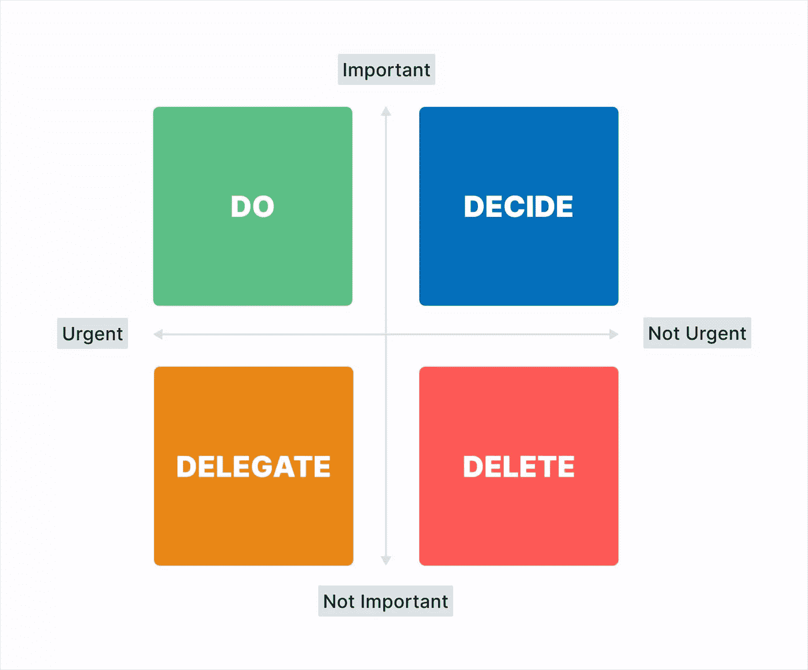

# 开发人员的 7 个学习习惯:在更短的时间内达到技能目标

> 原文：<https://www.sitepoint.com/learning-habits-for-developers/>

作为一名开发人员，[永远学习](https://www.sitepoint.com/how-to-learn-anything/)很重要。行业在不断变化，如果你不跟上，你会很快落后。在这篇博文中，我们将讨论每个开发人员都应该掌握的七个学习习惯。这些习惯将帮助你在你的领域保持最新，并继续成长为一名专业人士！

近年来，软件业发生了巨大的变化。每天都有新技术推出，以跟上这种发展。如果开发人员希望他们的职业生涯成功地通过这些变化，他们必须具有适应性！

开发人员不断地学习如何在行业中保持领先。 [2020 栈溢出开发者调查](https://app.jasper.ai/docs/edit/217812f1-6fb4-45ba-9c51-81f7af58ffbd?m=power#:~:text=https%3A//insights.stackoverflow.com/survey/2020)发现，75%的受访者至少每隔几个月或一年学习一项新技术。鉴于创新发生得如此之快，开发人员别无选择，只能跟上不断变化的技术。

## 创造可持续的学习习惯

为了在职业生涯中保持竞争力，你需要问自己一些问题。

*   "我们公司使用的技术会改变和进步吗？"
*   “我的角色是否有助于我跟上技术发展？”

答案并不总是响亮的“是”。

并不是所有的公司都有能力或兴趣站在技术的最前沿。许多大公司专注于交付业务成果，这意味着维护当前的系统，而不是做出剧烈的改变。

你需要对自己的学习负责，以保持在职业生涯中的竞争力。

曾几何时，你在这个行业呆的时间越长，你需要学习的东西就越少。但是现在不一样了！当你在一家科技公司获得一个开发员的职位后，你可以高枕无忧了吗？你会失望的。

你需要学会学习，学会[如何快速学习](https://www.sitepoint.com/how-to-learn-quickly/)。

为了确保你有效地学习，你需要做的不仅仅是设定目标。你需要创造可持续的学习习惯。

人类是习惯性动物。习惯改变了我们的生活，因为我们日复一日重复做着什么，就变成了什么。如果你想实现一个目标，你不能心血来潮，指望明天就能实现。

不管你的目标是变得更有头脑、获得晋升还是赚一百万美元，这都是真的。

成为一名出色的学习者——在实践中学习并应用所学——需要持续的努力。你只能通过培养良好的学习习惯来做到这一点。我将与您分享开发人员的七个学习习惯，以帮助您在职业生涯中取得成功。

## 习惯 1:划分学习时间

成功人士和不成功人士的区别在于他们实现目标的方式。

成功人士每天都留出时间做对他们来说重要的事情。其他人试图设定远大的目标，并抱最大的希望。

因此，你需要培养的第一个也是最重要的习惯是学习自律。你可以通过留出专门的时间来学习来实现这一点。

如果你有一份全职工作，这可能发生在下班后。你可以决定每周三个晚上，在晚饭后留出两个小时。也可能是每个周末的几个小时。

要养成一个习惯，你需要先留出时间。然后你需要坚持不懈地花时间学习。无论是看书，看教程，还是写代码，都需要把它当成一次约会。那时你会养成学习新技能的习惯。一旦你这么做了，你就不用再犹豫了。

有一个指定的时间段也有助于确保你优先学习。如果你看看[艾森豪威尔矩阵](https://todoist.com/productivity-methods/eisenhower-matrix)，学习时间会落入重要但不紧急的象限。

如果没有专门的时间，你很容易优先处理其他更紧急的事情。通常，那些紧急的活动并不重要，也不会让你更接近你的目标。

## 习惯 2:创建一个高层次的计划

你知道这句谚语:“如果你没有计划，你就计划失败。”这也适用于学习。

有时，开发人员会不耐烦，毫无准备地直接投入到主动学习中。

如果你想成为一名前端开发人员，你不需要阅读所有关于如何用 JavaScript、HTML 和 CSS 编码的书籍。你不需要看所有的 JavaScript 教程。你也不需要订阅每一个网络开发者的网站。如果你那样做，你最终会迷失在信息过载中。

相反，从基础开始。一次读一本书或一篇文章。或者一次看一个视频教程系列。然后根据需要慢慢扩展你的资源。

当你有太多的资源时，它会让你不知所措，难以集中注意力。为你的目标制定一个高层次的计划，然后把它分解成更小的里程碑，这很重要。

这将帮助你一次专注于一件事，防止信息过载。这也将使你更容易跟踪你的进展，看看你已经走了多远！

另一个例子是当一个开发人员想要学习一个 JavaScript 框架时，比如 React。她开始阅读关于 React 的教程，却不知道应该关注哪些领域，也不知道如何实现自己的目标——编写 React 应用的能力。

对她来说，学习 React 的更好方法是:

*   拿起一本专注的书或一门课程，
*   看看官方文档，
*   从主要概念到高级指南和 API 参考，
*   并在 React 中创建一个示例应用程序，同时查看和学习其他示例。

这种结构化的学习方式可以通过你学习的每个阶段的 S.M.A.R.T 目标来实现。S.M.A.R.T .目标是好的目标，因为它们是具体的、可衡量的、可实现的、现实的、有时间限制的。

通过结构化的学习方式培养学习习惯并不意味着订阅传统的课堂式学习和定期上课。我给大家介绍一个学习框架，叫做 70:20:10 模型。

作为开发人员，我们知道您通过实际工作来学习。70:20:10 框架基于这样一个原则，即你 70%的学习将是实践和在职的。20%将是通过他人已经完成的社会学习，通过教练或合作活动，如同伴编程。10%将通过传统方式学习。

各有千秋。但这个模型很好地提醒了你，你必须将与他人合作和互动纳入你的学习计划。因此，当您创建一个高层次的计划时，请确保将它们都包括在内。

以下是如何将 70:20:10 模型付诸实践。继续上一个例子，您想学习 React。在创建高级计划时，您将提出一个小的项目想法，创建一个最终目标，定义实现该最终目标所需的步骤，对于每个步骤，只阅读和学习完成该项目所需的内容。

在这里，您的最终目标可能是创建一个在后端和前端都使用 React 的 web 应用程序。第一步可能包括创建一个静态页面，其中包含指向您最喜欢的网站的链接。一旦你做到了这一点，你就可以着手下一步。这可能是连接到第三方 API 并显示最近的五篇文章。因此，这一步将包括研究 API、了解其数据结构、在应用程序中实现它等任务。研究、阅读和观看教程占 10%，其余的实践活动占 70%。

在制定高级计划时，确保包括 S.M.A.R.T .里程碑。S.M.A.R.T 代表:

*   具体:这可以确保你的里程碑是经过深思熟虑的，不会含糊或笼统。不要像*成为一名更好的程序员*那样设定一个普通的目标，而是设定一个具体的里程碑。例如，*理解数据结构和算法的基本概念*。这会让你实现成为一名更好的程序员的目标。
*   可衡量:这可以量化你的里程碑，让你知道你在哪里，是否已经达到。不要说*学习 React* ，一个可衡量的里程碑可能会说:*在 React 中创建一个接口，从第三方 API 读取 JSON 响应，显示结果，并每 30 秒刷新一次*。
*   可达到的目标:有远大的目标是好事。但是如果它们不现实，那么它们就没有意义。如果你没有机器学习算法的经验，你不能指望在几天内编写一个基于用户搜索历史提供个性化新闻的系统。通过将一个雄心勃勃的目标分解成具有里程碑意义的可行任务，你有更大的机会实现它们。
*   **相关:**这确保你的里程碑与你的总体目标相关。就像俗话说的，“永远不要忘记你的愿景”，与目标不一致的里程碑是一个随机的活动——或者说是无用功。
*   **及时:**这个很简单。在敏捷软件开发中，有一个叫做时间盒的概念，它为一项活动分配最大的时间单位。对每一个里程碑都有时间限制意味着你有一个完成你计划要达到的活动的最后期限。

没有 S.M.A.R.T .里程碑，你将无法衡量自己的表现，你的高水平计划也将变得不太实际。

## 习惯 3:反思你所学到的东西

有一个清晰的带有里程碑的高层次计划是好的。但是如果你不跟踪自己的进步，这就没什么用了。

有了这个习惯，你会承诺每两周或者至少每个月回顾一次你的进步。你会将它与你的时间表进行比较，并问自己是否正朝着正确的方向前进。

在学习目标开始时设置一个日历提醒，这样你就不会忘记。

对照你的高水平计划，想想你每个月都学到了什么。如果你没有按时实现你的里程碑，反思一下你学到了什么来帮助你理解你在哪里挣扎。然后你可以相应地修改你的行动。把它想象成对你的学习方法的 A/B 测试。

另一方面，如果你正在实现你的里程碑，反思是思考创造性想法的一个很好的工具。例如，思考你如何在你最新的网络应用中使用 API 可能会激发出使用相同 API 的新想法。

## 习惯 4:修补&享受乐趣

人们发现很难坚持好习惯的一个原因是，坚持做这项工作并不总是令人愉快的。这需要纪律。

例如，很容易养成饭后吃甜点的习惯，因为这是令人愉快的。建立健康的饮食习惯要难得多。那只是因为它没有在你想吃的时候吃你想吃的东西有趣。

我们是人类，人类天生喜欢做有趣和愉快的事情。我们寻求快乐，避免痛苦。因此，为了确保你的学习习惯坚持下去，你需要在这个过程中注入一些乐趣。

好玩是什么样子的？从我作为开发人员的经验来看，没有什么比看到我的代码成功运行更令人满意的了。它让你感觉很好。成就感是最好的感觉之一，因为它深深植根于自我。

对于一个新的后端开发人员来说，可以看到数据是如何成功地保存到数据存储中的。对于一个前端开发人员来说，这可能是第一次看到他们的新应用程序在浏览器中工作。

当你知道什么能给你带来快乐和满足时，就把那些东西纳入你的高层次学习计划。当学习变得有趣时，这将是你可能会长期保持的习惯。

## 习惯 5:像专家一样记笔记

无论你是在工作中学习，从别人那里学习，还是在正式的学习活动中学习，你都应该做笔记。

对于中学生或大学生来说，记笔记是很自然的事情。但是许多知识工作者在进入职场后就失去了这个习惯。

关于为什么记笔记有益于学习，有很多研究。

*   它有助于信息的保持和回忆。
*   当你的大脑处理信息时，它有助于理解你正在学习的东西。记笔记鼓励你在记东西的时候阐明主要观点和关键点。
*   最后(可能也是最重要的)，它将你的注意力集中在你正在学习的东西上。

今天，有如此多的分心事物在争夺我们的注意力，从看到社交应用程序的红色徽章到我们指尖的信息兔子洞。只要敲几下键盘，记笔记就能迫使你专注于你的学习主题。

> 只要你做了，你怎么记笔记并不重要比尔·盖茨。

虽然记笔记比不记要好，但恕我不同意比尔·盖茨的观点。你可以记好笔记，也可以记坏笔记。如果你要做笔记，你最好做好。

以下是开发人员的一些笔记策略:

*   选择一个合适的系统，比如康奈尔系统、思维导图系统或分类系统。
*   康奈尔系统非常适合在看书、听播客或看教程时做笔记。
*   思维导图系统适用于对一个主题以及各种信息如何汇集在一起的深入研究。在思维导图笔记上查看这些[例子。](https://www.edrawsoft.com/mindmaster/mind-map-note-taking-practice.html)
*   [大纲系统](https://medium.goodnotes.com/how-the-outline-note-taking-method-works-f0808ea2cbfa)非常适合使用标题、副标题和列表根据重要性对信息进行分类。这是最常见的笔记方法，经常被学生使用。

## 习惯 6:在公共场合学习

# [buildinpublic](https://twitter.com/search?q=%23buildinpublic&src=typed_query) 是创客和企业家的时髦概念。有些人甚至称之为运动。

在这里，创作者通过 Twitter 和 YouTube 等公共平台分享他们的创作进展。他们分享他们的成功，以及他们的尝试和错误。

只有在你成功地创造了一些东西之后，才分享你的成就，这绝对是相反的。

就像#buildinpublic 一样，在公共场合学习就是在公共平台上分享自己的进步。这是个很好的习惯。通过早期和经常的分享，其他人将能够对你的进步提供反馈，分享他们自己学习经验的见解，最后但同样重要的是，帮助你在学习之旅中建立动力。

更重要的是，你会接触到业内志同道合的个人。他们也许能帮你联系到潜在的雇主和项目。他们从你在公共场合的分享中知道你有什么样的技能。

查看 Twitter 上的 [#learninpublic 标签](https://twitter.com/hashtag/LearnInPublic?src=hashtag_click)。你会看到许多来自开发者的推文，分享他们的学习和享受开放的对话。

## 习惯 7:庆祝小胜利

庆祝小胜利的习惯可能看起来是自我放纵的，但实际上它会将所有其他习惯聚集在一起，并对您作为开发人员的职业生涯产生影响。

你可能想知道，庆祝和创造影响力有什么关系。这是因为当你庆祝你的成就时，不管这些成就有多小，它都有助于保持你前进的动力和动机。

例如，如果你正在 React Native 中构建一个 iPhone 应用程序，你不必等到你的应用程序完成并在 App Store 中可用时才感到完成了。每当你达到你在高层次计划中设定的里程碑时，你都可以庆祝。

第一个里程碑可能是你可以在 iOS 模拟器上运行 React 原生应用的时候。第二个庆祝可能是当你为你的应用程序创建了一个闪屏。所有这些小胜利对于帮助你建立你需要的动力来实现你能够使用 React Native 创建 iPhone 应用的目标是至关重要的。

在詹姆斯·克莱尔的畅销书《原子习惯》中，作者描述了通过四个简单的步骤建立持久习惯的过程:

*   提示。提示是促使你采取行动的触发器。就学习习惯而言，是习惯 1，即留出专门的学习时间。
*   **渴求。渴望是你所希望的，一些给你积极感觉的东西，比如成就感、生产性或有用性。**
*   **回应。渴望会让你做出反应。当你分享你的学习进度时，这可能是修补或获得他人支持的艺术。**
*   **奖励。**最后但同样重要的是，习惯循环是通过奖励来完成的，奖励是你从从事习惯中获得的收益。作为一名开发人员，在培养学习习惯的过程中，通过庆祝小的胜利来强化奖励。

通过这个过程，你的大脑将开始把庆祝小胜利的奖励与在特定时间学习的暗示联系起来。这就是你如何创造一个持久的学习习惯循环。

## 学习对未来的工作至关重要

过去，职业发展基本上是线性的。一个人会沿着传统的职业阶梯向上爬——从初级职位，到中级职位，再到高级职位，然后成为经理，然后可能以高级主管的身份退休。

然而，你未来的职业发展将会不同。这将是一个格子式的职业发展，在你的职业生涯中，无论是水平的，对角的，还是垂直的，两个方向都可以。这种形式的职业发展在我们这一代已经变得很普遍，因为更多的工作场所拥有更扁平的组织结构和灵活的工作方式。

据估计，21 世纪 60%的新工作需要的技能只有当前劳动力的 20%具备。这意味着你需要灵活，适应性强，并在职业生涯中不断学习和成长，以便在未来的工作中茁壮成长。

成为一名优秀的学习者会给你带来优势，并为你的职业成功做好准备。我坚信，如果你花时间去理解这个过程，并愿意改进，你就能在生活中做得更好。

学习也不例外。这是一种可以通过练习来提高的技能。作为一名开发人员，培养可持续的学习习惯会让你不断接受挑战，让你感到兴奋，并推动你作为开发人员的职业发展。

## 分享这篇文章