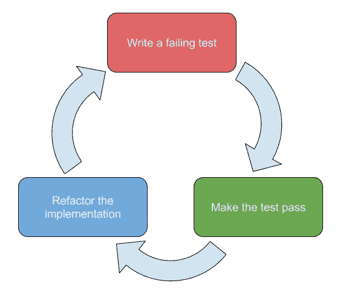
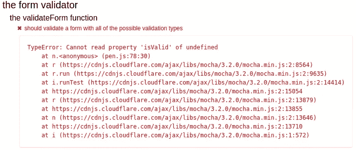

# 通过示例学习 JavaScript 测试驱动开发

> 原文：<https://www.sitepoint.com/learning-javascript-test-driven-development-by-example/>


您可能已经熟悉了自动化测试及其好处。为您的应用程序准备一组测试可以让您放心地对代码进行更改，因为您知道如果您有任何问题，测试会支持您。有可能更进一步，在你【tests】编写代码之前编写测试*；一种被称为测试驱动开发(TDD)的实践。*

在本教程中，我们将讨论 TDD 是什么，它给作为开发人员的你带来了什么好处。我们将使用 TDD 来实现一个表单验证器，它确保用户输入的任何值都符合一组指定的规则。

> 请注意，本文将着重于测试前端代码。如果你正在寻找专注于后端的东西，一定要看看我们的课程:[node . js 中的测试驱动开发](https://www.sitepoint.com/premium/courses/test-driven-development-in-node-js-2932)

## 什么是 TDD？

测试驱动开发是一种编程方法，人们可以用它来处理代码单元的设计、实现和测试，以及某种程度上程序的预期功能。

作为对极限编程的测试优先方法的补充，TDD 也促进了代码的重构。这通常被称为*红绿重构周期*。



*   **编写一个失败的测试**——编写一个调用您的逻辑并断言产生了正确行为的测试

    *   在单元测试中，这可能是断言一个函数的返回值，或者验证一个被模仿的依赖项是否按预期被调用
    *   在功能测试中，这将确保 UI 或 API 在许多操作中的行为是可预测的
*   **使测试通过**–实现导致测试通过的最少数量的代码，并确保所有其他测试继续通过

*   **重构实现**——在不破坏任何公共契约的情况下更新或重写实现，在不破坏新的和现有测试的情况下提高其质量

自从我在职业生涯之初接触到 TDD 以来，我已经在一定程度上使用了它，但是随着我在具有更复杂需求的应用程序和系统上的工作的进展，我个人发现这种技术节省了时间，并且有助于我工作的质量和健壮性。

在继续之前，熟悉一些可以编写的各种类型的自动化测试可能是值得的。埃里克·埃利奥特[很好地总结了它们](https://www.sitepoint.com/javascript-testing-unit-functional-integration/):

*   **单元测试**–确保应用程序的各个单元，如函数和类，按预期工作。断言测试所述单元返回任何给定输入的预期输出
*   **集成测试**–确保单元协作按预期工作。断言可能会测试 API、UI 或交互，这些可能会导致副作用(如数据库 I/O、日志记录等)
*   **端到端测试**–确保从用户的角度来看软件按预期工作，并且每个单元在系统的整体范围内正确运行。断言主要测试用户界面

## 测试驱动开发的好处

### 即时测试覆盖率

通过在特性实现之前为其编写测试用例，可以立即保证代码覆盖率，并且可以在项目开发生命周期的早期发现行为错误。当然，这需要覆盖所有行为的测试，包括错误处理，但是人们应该总是以这种心态实践 TDD。

### 自信地重构

参考上面的红绿重构循环，对实现的任何更改都可以通过确保现有测试继续通过来验证。编写尽可能快速运行的测试将会缩短这个反馈循环；虽然涵盖所有可能的场景很重要，并且不同计算机之间的执行时间可能略有不同，但从长远来看，编写精益且重点突出的测试将会节省时间。

### 合同设计

测试驱动开发允许开发人员考虑如何使用 API，以及它有多容易使用，而不必担心实现。在测试用例中调用一个单元实质上反映了生产中的一个调用点，所以外部设计可以在实现阶段之前修改。

### 避免多余的代码

只要一个人频繁地，甚至自动地，在改变相关的实现时运行测试，满足现有的测试就减少了不必要的额外代码的可能性，可以说产生了更容易维护和理解的代码库。因此，TDD 帮助一个人跟随[吻(保持简单，笨蛋！)原理](https://en.wikipedia.org/wiki/KISS_principle)。

### 不依赖集成

当编写单元测试时，如果符合所需的输入，那么一旦集成到代码库中，单元就会像预期的那样运行。然而，还应该编写集成测试，以确保新代码的调用站点被正确调用。

例如，让我们考虑下面的函数，它确定用户是否是管理员:

```
'use strict'

function isUserAdmin(id, users) {
    const user = users.find(u => u.id === id);
    return user.isAdmin;
} 
```

我们希望将用户数据作为一个参数，而不是硬编码。这允许我们在测试中传递一个预先填充的数组:

```
const testUsers = [
    {
        id: 1,
        isAdmin: true
    },

    {
        id: 2,
        isAdmin: false
    }
];

const isAdmin = isUserAdmin(1, testUsers);
// TODO: assert isAdmin is true 
```

这种方法允许独立于系统的其余部分来实现和测试单元。一旦数据库中有了用户，我们就可以集成单元并编写集成测试来验证我们是否正确地将参数传递给了单元。

## 用 JavaScript 进行测试驱动的开发

随着用 JavaScript 编写的全栈软件的出现，出现了大量允许测试客户端和服务器端代码的测试库；这种库的一个例子是 [Mocha](https://mochajs.org/) ，我们将在练习中使用它。

在我看来，TDD 的一个很好的用例是表单验证；这是一项有些复杂的任务，通常遵循以下步骤:

1.  从需要验证的`<input>`中读取数值
2.  针对所述值调用规则(例如字母、数字)
3.  如果无效，向用户提供一个有意义的错误
4.  对下一个可验证的输入重复上述步骤

这个练习有一个[代码笔，其中包含一些样板测试代码，以及一个空的`validateForm`函数。请在我们开始前叉好这个。](http://codepen.io/SitePoint/pen/NpZLzR)

我们的表单验证 API 将获取一个`HTMLFormElement` ( `<form>`)的实例，并验证每个具有`data-validation`属性的输入，该属性的可能值为:

*   `alphabetical`–任何不区分大小写的 26 个英文字母的组合
*   `numeric`–0 到 9 之间的任意数字组合

我们将编写一个端到端的测试，针对真实的 DOM 节点以及我们最初支持的两种验证类型来验证`validateForm`的功能。一旦我们的第一个实现工作了，我们将通过编写更小的单元来逐步重构它，也遵循 TDD。

下面是我们的测试将使用的表单:

```
<form class="test-form">
    <input name="first-name" type="text" data-validation="alphabetical" />
    <input name="age" type="text" data-validation="numeric" />
</form> 
```

在每次测试之间，我们创建一个新的表单克隆来消除潜在副作用的风险。传递给`cloneNode`的`true`参数确保表单的子节点也被克隆:

```
let form = document.querySelector('.test-form');

beforeEach(function () {
    form = form.cloneNode(true);
}); 
```

### 编写我们的第一个测试用例

套件将用于测试我们的 API。在内部函数中，编写第一个测试用例，这将确保字母和数字规则的合法值都被识别为有效:

```
it('should validate a form with all of the possible validation types', function () {
    const name = form.querySelector('input[name="first-name"]');
    const age = form.querySelector('input[name="age"]');

    name.value = 'Bob';
    age.value = '42';

    const result = validateForm(form);
    expect(result.isValid).to.be.true;
    expect(result.errors.length).to.equal(0);
}); 
```

在保存对 fork 的更改时，您应该看到测试失败了:



现在让我们把这个测试变成绿色吧！记住，我们应该努力写出最低限度的、合理的(no `return true;`！)的代码量来满足测试，所以我们现在不要担心错误报告。

下面是初始实现，它遍历表单的`input`元素，并使用正则表达式验证每个元素的值:

```
function validateForm(form) {
    const result = {
        errors: []
    };

    const inputs = Array.from(form.querySelectorAll('input'));
    let isValid = true;

    for (let input of inputs) {
        if (input.dataset.validation === 'alphabetical') {     
            isValid = isValid && /^[a-z]+$/i.test(input.value);
        } else if (input.dataset.validation === 'numeric') {
            isValid = isValid && /^[0-9]+$/.test(input.value);
        }
    }

    result.isValid = isValid;
    return result;
} 
```

您现在应该看到我们的测试通过了:


### 错误处理

在我们的第一个测试下面，让我们编写另一个测试，验证返回的`result`对象的`error`数组包含一个`Error`实例，当一个字母字段无效时，该实例会显示预期的消息:

```
it('should return an error when a name is invalid', function () {
    const name = form.querySelector('input[name="first-name"]');
    const age = form.querySelector('input[name="age"]');

    name.value = '!!!';
    age.value = '42';

    const result = validateForm(form);

    expect(result.isValid).to.be.false;
    expect(result.errors[0]).to.be.instanceof(Error);
    expect(result.errors[0].message).to.equal('!!! is not a valid first-name value');
}); 
```

在保存 CodePen fork 时，您应该在输出中看到新的失败测试用例。让我们更新我们的实现来满足这两个测试用例:

```
function validateForm(form) {
    const result = {
        get isValid() {
            return this.errors.length === 0;
        },

        errors: []
    };

    const inputs = Array.from(form.querySelectorAll('input'));

    for (let input of inputs) {
        if (input.dataset.validation === 'alphabetical') {     
            let isValid = /^[a-z]+$/i.test(input.value);

            if (!isValid) {
                result.errors.push(new Error(`${input.value} is not a valid ${input.name} value`));
            }
        } else if (input.dataset.validation === 'numeric') {
            // TODO: we'll consume this in the next test
            let isValid = /^[0-9]+$/.test(input.value);
        }
    }

    return result;
} 
```

现在让我们添加一个测试，该测试断言数字验证错误得到了正确处理:

```
it('should return an error when an age is invalid', function () {
    const name = form.querySelector('input[name="first-name"]');
    const age = form.querySelector('input[name="age"]');

    name.value = 'Greg';
    age.value = 'a';

    const result = validateForm(form);

    expect(result.isValid).to.be.false;
    expect(result.errors[0]).to.be.instanceof(Error);
    expect(result.errors[0].message).to.equal('a is not a valid age value');
}); 
```

一旦你看到测试失败，更新`validateForm`函数:

```
} else if (input.dataset.validation === 'numeric') {
    let isValid = /^[0-9]+$/.test(input.value);

    if (!isValid) {
        result.errors.push(new Error(`${input.value} is not a valid ${input.name} value`));
    }
} 
```

最后，让我们添加一个测试来确保处理多个错误:

```
it('should return multiple errors if more than one field is invalid', function () {
    const name = form.querySelector('input[name="first-name"]');
    const age = form.querySelector('input[name="age"]');

    name.value = '!!!';
    age.value = 'a';

    const result = validateForm(form);

    expect(result.isValid).to.be.false;
    expect(result.errors[0]).to.be.instanceof(Error);
    expect(result.errors[0].message).to.equal('!!! is not a valid first-name value');
    expect(result.errors[1]).to.be.instanceof(Error);
    expect(result.errors[1].message).to.equal('a is not a valid age value');
}); 
```

鉴于我们在第二次和第三次测试中的错误处理实现，这个新案例应该会立即通过。通过[对照我的](http://codepen.io/SitePoint/pen/peXOOw?editors=0010)验证你的实现，你可以确认你已经正确地遵循了这些步骤。

## 重构我们的验证器

尽管我们有一个测试覆盖的工作函数，但它散发出许多代码气味:

*   **多重责任**

    *   我们查询输入的内部 DOM 节点，指定我们的规则集，并在同一个函数中计算我们的总体结果。就 [*稳固原则*](https://en.wikipedia.org/wiki/SOLID_(object-oriented_design)) 而言，这违反了 [*单一责任原则*](https://en.wikipedia.org/wiki/Single_responsibility_principle)
    *   此外，缺乏抽象会导致其他开发人员更难理解代码
*   **紧耦合**

    *   我们当前的实现将上述职责交织在一起，使得对每个关注点的更新变得脆弱；在我们引入问题的情况下，对我们的大方法的一个细节的改变将使调试变得困难
    *   此外，我们不能在不更新`if`语句的情况下添加或更改验证规则。这违反了固氏 [*开/关原理*](https://en.wikipedia.org/wiki/Open/closed_principle)
*   **逻辑复制**–如果我们希望更新错误消息的格式，或者将另一个对象推送到我们的数组中，那么我们必须在两个地方进行更新

幸运的是，由于我们已经为验证器函数编写了功能测试，我们可以确信不会破坏代码，从而使代码变得更好。

让我们使用 TDD 为以下各项编写单独的函数:

1.  将我们的输入映射到验证查询
2.  从适当的数据结构中读取我们的验证规则

### `createValidationQueries`功能

通过将我们的`HTMLInputElement`的`NodeList`映射到表示表单字段的名称、应该验证的类型以及所述字段的值的对象，我们不仅将从 DOM 中解耦`validateForm`函数，而且当我们替换硬编码的正则表达式时，我们将促进验证规则查找。

例如，`first-name`字段的验证查询对象将是:

```
{
    name: 'first-name',
    type: 'alphabetical',
    value: 'Bob'
} 
```

在`validateForm`函数之上，创建一个名为`createValidationQueries`的空函数。然后，**在`validateForm`** 的`describe`套件之外，创建另一个`describe suite`，命名为 createValidationQueries 函数’。

它应该包括单个测试用例:

```
describe('the createValidationQueries function', function () {
    it(
        'should map input elements with a data-validation attribute to an array of validation objects',

        function () {
            const name = form.querySelector('input[name="first-name"]');
            const age = form.querySelector('input[name="age"]');

            name.value = 'Bob';
            age.value = '42';

            const validations = createValidationQueries([name, age]);

            expect(validations.length).to.equal(2);

            expect(validations[0].name).to.equal('first-name');
            expect(validations[0].type).to.equal('alphabetical');
            expect(validations[0].value).to.equal('Bob');

            expect(validations[1].name).to.equal('age');
            expect(validations[1].type).to.equal('numeric');
            expect(validations[1].value).to.equal('42');
        }
    );
}); 
```

一旦您目睹了这一失败，请编写实现代码:

```
function createValidationQueries(inputs) {
    return Array.from(inputs).map(input => ({
        name: input.name,
        type: input.dataset.validation,
        value: input.value
    }));
} 
```

当这个过程结束时，更新`validateForm`的`for`循环来调用我们的新函数，并使用查询对象来确定表单的有效性:

```
for (let validation of createValidationQueries(form.querySelectorAll('input'))) {
    if (validation.type === 'alphabetical') {     
        let isValid = /^[a-z]+$/i.test(validation.value);

        if (!isValid) {
            result.errors.push(new Error(`${validation.value} is not a valid ${validation.name} value`));
        }
    } else if (validation.type === 'numeric') {
        let isValid = /^[0-9]+$/.test(validation.value);

        if (!isValid) {
            result.errors.push(new Error(`${validation.value} is not a valid ${validation.name} value`));
        }
    }
} 
```

如果我们的新测试和现有的测试都通过了，[如这支笔](http://codepen.io/SitePoint/pen/EWBeep?editors=0010)所示，那么我们可以进行更大的改变；分离验证规则。

### `validateItem`功能

为了删除我们硬编码的规则，让我们编写一个函数，将我们的规则作为一个 [`Map`](https://developer.mozilla.org/en/docs/Web/JavaScript/Reference/Global_Objects/Map) ，并断言我们输入的有效性。

像`createValidationQueries`一样，我们将在实现之前编写一个新的测试套件。在`validateForm`的实现上面，写一个名为`validateItem`的空函数。然后在我们的主`describe`套件中，为我们的新成员编写另一个`describe`套件:

```
describe('the validateItem function', function () {
    const validationRules = new Map([
        ['alphabetical', /^[a-z]+$/i]
    ]);

    it(
        'should return true when the passed item is deemed valid against the supplied validation rules',

        function () {
            const validation = {
                type: 'alphabetical',
                value: 'Bob'
            };

            const isValid = validateItem(validation, validationRules);
            expect(isValid).to.be.true;
        }
    );
}); 
```

我们从测试中显式地向我们的实现传递了一个`Map`规则，因为我们希望独立于我们的主函数来验证它的行为；这使它成为一个单元测试。这是我们第一次实现`validateItem()`:

```
function validateItem(validation, validationRules) {
    return validationRules.get(validation.type).test(validation.value);
} 
```

一旦这个测试通过，编写第二个测试用例来验证我们的函数在验证查询无效时返回`false`；由于我们当前的实施，这应该会过去:

```
it(
    'should return false when the passed item is deemed invalid',

    function () {
        const validation = {
            type: 'alphabetical',
            value: '42'
        };

        const isValid = validateItem(validation, validationRules);
        expect(isValid).to.be.false;
    }
); 
```

最后，编写一个测试用例，确定在没有找到验证类型时`validateItem`返回`false`:

```
it(
    'should return false when the specified validation type is not found',

    function () {
        const validation = {
            type: 'foo',
            value: '42'
        };

        const isValid = validateItem(validation, validationRules);
        expect(isValid).to.be.false;
    }
); 
```

在根据相应的正则表达式测试任何值之前，我们的实现应该检查指定的验证类型是否存在于`validationRules`映射中:

```
function validateItem(validation, validationRules) {
    if (!validationRules.has(validation.type)) {
        return false;
    }

    return validationRules.get(validation.type).test(validation.value);
} 
```

一旦我们看到这个测试通过，让我们在`createValidationQueries`之上创建一个新的`Map`，它将包含我们的 API 使用的实际验证规则:

```
const validationRules = new Map([
    ['alphabetical', /^[a-z]+$/i],
    ['numeric', /^[0-9]+$/]
]); 
```

最后，让我们重构`validateForm`函数以使用新的函数和规则:

```
function validateForm(form) {
    const result = {
        get isValid() {
            return this.errors.length === 0;
        },

        errors: []
    };

    for (let validation of createValidationQueries(form.querySelectorAll('input'))) {
        let isValid = validateItem(validation, validationRules);

        if (!isValid) {
            result.errors.push(
                new Error(`${validation.value} is not a valid ${validation.name} value`)
            );
        }
    }

    return result;
} 
```

希望你能看到所有的测试都通过了。恭喜你使用测试驱动开发来重构和提高我们代码的质量！您的最终实现应该类似于[这支笔](http://codepen.io/SitePoint/pen/xqoamQ?editors=0010):

在 [CodePen](http://codepen.io) 上通过 SitePoint ( [@SitePoint](http://codepen.io/SitePoint) )查看 Pen [TDD 表单验证完成](http://codepen.io/SitePoint/pen/xqoamQ/)。