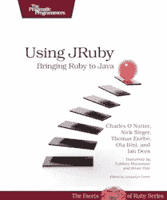
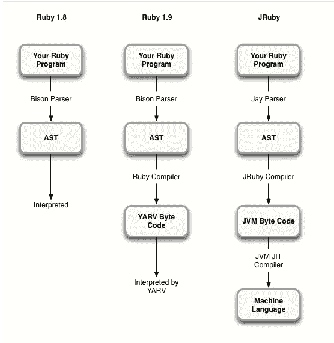
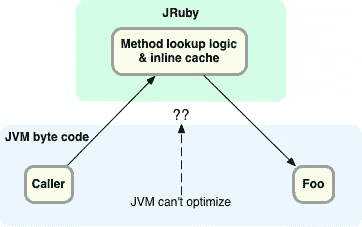
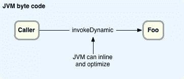

# 向 Charles Nutter 学习更多关于 JRuby 的知识

> 原文：<https://www.sitepoint.com/learning-more-about-jruby-from-charles-nutter/>

JRubyConf 定于 5 月 21 日至 23 日在明尼阿波利斯
举行

JRuby 最近经常出现在新闻中:就在几个星期前，JRuby 1.6.7 发布了、 [JRubyConf](http://jrubyconf.com/) 即将发布，在过去的几个月里，关于即将发布的 JRuby 1.7 以及它将如何利用 Java 7 对“InvokeDynamic”的新支持，已经有了很多传言。随着这一切的进行，我很高兴有机会采访 JRuby 核心团队的开发者之一[Charles nutter](http://twitter.com/headius)。

如果你有几分钟的时间，请继续阅读，听听 Charles 用他自己的话讲述 JRuby 的新特性，为什么一个传统的 Ruby 爱好者想要使用 JRuby，Ruby 应用程序如何使用 Maven 库中的 Java 库，以及我最喜欢的话题——JRuby 的内部机制。对我来说，这一切都令人着迷！采访 Charles 是了解 JRuby 更多信息的绝好机会。

## RubyConf 印度、JRubyConf 和 JRuby 1.6.7

查尔斯·纳特

问:我听说你将在下周的印度 RubyConf 上发表主题演讲……祝贺你！

是的，主题演讲是一个惊喜！我只想出来聊聊天，玩玩，但那应该会很有趣。

问:说到会议， [JRubyConf 不是定在 5 月](http://jrubyconf.com/)吗？

是啊！我邀请所有人从 5 月 21 日到 23 日来到明尼阿波利斯的 JRubyConf，这是汤姆·埃内博和 T2 的家乡。它价格合理，在一个便宜的地方，我们希望有尽可能多的人来。我们将讨论 JRuby 和非 JRuby 的内容。应该只是一件大事吧！

问:我听说你们刚刚发布了 JRuby 1.6.7 。此版本中有什么新内容？

我们在 1.6.6 中发布了一个主/次版本，我们希望这是最后一个 1.6 版本。我们做了很多修正:很多改进，一些性能错误被修复，很多 Ruby 1.9 的行为被改进。因为 1.6.6 有一个很长的周期，在你发布之前没有人尝试过，在我们发布它之后，我们立即收到了大量的错误报告，特别是我们还没有修复的 1.9 编码问题。所以几个星期后，我们决定再发布一个版本。我们修复了另外 40 个问题，其中大部分都与 Ruby 1.9 的特性有关，这就是 1.6.7。这是一个快速的后续版本，修复了人们在 1.6.6 中发现的一系列问题。

## 为什么要用 JRuby？

问:以防我们的一些读者不太熟悉 JRuby，从哪里开始学习 JRuby 呢？

嗯，有一本实用程序员写的书[使用 JRuby:将 Ruby 引入 Java](http://pragprog.com/book/jruby/using-jruby)——这是一本很棒的书，似乎能帮助很多人。

问:你能解释一下为什么一个传统的 Ruby 爱好者想要使用 JRuby 吗？

我们通常会指出几件事:其中一件大事是我们一直在努力提高性能。在小型应用或计算/执行密集型的东西上，JRuby 通常是目前最快的 Ruby。这并不意味着所有的应用程序我们都是最快的，特别是一些复杂的 Rails 应用程序，我们很难以我们希望的速度运行。但是性能是一个大问题，我们一直在努力。此外，我们利用 JVM 人员一直在做的工作来提高性能。

下一件事是，如果垃圾收集或内存管理是基于 MRI 的应用程序的瓶颈，它可能不会成为 JRuby 上的问题。JVM 有优秀的垃圾收集器，我们基本上只是借用了它。

最后一个领域是 JVM 的稳定性和跨平台性:许多优秀的库，运行在每个平台上，而且几乎都是免费的。您不必做大量的工作来将 JRuby 从一个平台移植到另一个平台。如果你有能在一个平台上工作的代码，那么它在其他地方也能工作。

问:有了 Heroku，只需几个命令就能让一个新的应用程序在互联网上运行。JRuby 有没有类似的简单选择？

这实际上是我们花费大量时间的领域之一。我们想让 JRuby 的日常体验感觉更像普通的 Ruby。为此，有一个云选项已经过很好的测试，并且正在被[发动机场](http://www.engineyard.com/)的人们使用。你在 Engine Yard 用 MRI 或者 JRuby 部署 app 的方式基本是一样的。使用 cedar 栈和其他东西在 Heroku 部署是可能的。我认为有一个构建包可以让它变得更简单。如果你正在做你自己的手工部署，有许多命令行服务器模仿[独角兽](http://unicorn.bogomips.org/)或[乘客](http://www.modrails.com/)或任何这些。我们更喜欢的是 [Trinidad](http://thinkincode.net/trinidad/) ，它包装了 [Tomcat](http://tomcat.apache.org/) 并给你一个命令行选项。我们做了很多努力，试图让它看起来和部署或运行普通 Ruby 差不多。

这是一个持续的过程，但是我们希望 Ruby 爱好者在使用 JRuby 时能够像 ruby 爱好者一样工作。

问:JVM 和标准 MRI Ruby 之间有什么明显的区别？

使用 JRuby，您可以运行真正的并发线程…您有这样的好处:能够并发运行和使用多个内核。但是我们不能保证某些东西是线程安全的，因为它们会有太多的开销:比如字符串、数组、哈希之类的并发变异。

JRuby 的缺点之一是启动时间，我们一直在努力改进。对于 JRuby 来说，情况肯定更糟，但是一旦你做好准备并开始运行，性能应该会比 Ruby 的标准实现更好，有时会好很多。这是一种交易。

问:所以每天的开发启动时间是痛苦的？

每天的开发时间都受到不得不开始的事情的影响。TDD，Ruby 爱好者做事的典型方式，对于 JRuby 来说仍然有点痛苦。随着时间的推移，它肯定会有所改进，但还是会有点碍事。JVM 启动时间本身并不差，但是几乎所有的 JRuby 代码都必须在运行时间*由 JVM 编译。因此，在应用程序运行的前一两秒钟，没有任何东西被编译成本机代码。甚至不是 JRuby 的 Java 部分。所以我们需要多花一点时间来热身并达到全速。*

另一半是，许多 Ruby 库和工具是围绕 MRI 快速启动这一事实构建的。例如，“bundle exec”是您正在运行的任何 Ruby 实现的两个启动。如果你在 Rails 中运行“rake test ”,我记得我计算过它会启动 4 或 5 个独立的进程。

问:用 MRI 进行开发并在生产中切换到 JRuby 有意义吗？

如果你正在使用的库是兼容的，那实际上是一个不错的方法。例如，对于他们的日常开发，他们倾向于使用 MRI，然后在 JRuby 上进行测试和部署。

问:许多 Ruby 爱好者因为这样或那样的原因讨厌 Java…如果你讨厌 Java，你会不会也讨厌 JRuby？

启动时间可能是他们大多数人唯一能看到的东西。人们讨厌的 Java 的其他方面，如类路径、应用服务器和 Java 语言本身的冗长——如果你使用 JRuby，你绝不会看到其中的大部分。我们把这些东西藏得很好。

## JRuby 和 Maven:在 Ruby 应用程序中利用 Java 库

问:我在看去年秋天 RubyConf 的一个视频，看到你谈到使用 Maven 作为 Ruby 的包管理器。你能告诉我们更多吗？

任何处理 Java 世界的人都知道，它基本上围绕着 [Maven](http://maven.apache.org/index.html) 和 Maven 仓库——在某种程度上，一切都与 Maven 有关。Maven 实际上做得很好，不管你是否真的喜欢这个构建过程和它的严格性，它提供了一个包含所有 Java 库的全局存储库，其中映射了所有的依赖关系，所有的信息都清晰可用。我们想要做的是让整个 Java 库仓库变得可用，就像它们只是普通的珍宝一样。

[search.maven.org](http://search.maven.org)允许你搜索阿帕奇的中央 Maven 仓库，而
mvnrepository.com 允许你搜索各种公共 Maven 仓库

问:所以这是 RubyGems.org 的 Java 版本？我应该这么想吗？

是的——总的来说。它比 RubyGems 大得多，跨许多服务器联合，并且有比 ruby gems 多得多的库，但这基本上是它为 Java 世界所做的。因为我们想让 Ruby 开发者更容易地使用 Java 库，而不必考虑 Maven 之类的东西，所以随着时间的推移，我们慢慢地向我们的 RubyGems 副本添加了一些东西，比如补丁，允许安装任何 Maven 库，就像它只是一个宝石一样。

问:所以我可以运行“gem install XYZ”并从 Maven 安装一个库？

没错。您只需指定该库的标识符，它就会从 Maven 服务器上下载它。

问:这将适用于任何 Java 库吗？

哦，是的——我用的一个例子是 gem-installing [Clojure](http://clojure.org/) ，JVM 的语言。你拉下这个库，启动 IRB，实际上你可以调用 Clojure 或者任何其他以这种方式安装的 Java 库。

## JRuby 内部

问:我一直知道 JRuby 的 Java 代码被编译成了字节码，但直到最近我才知道目标 Ruby 脚本也被编译成了字节码。你能描述一下它是如何工作的吗？

对于标准的小部分，比如核心类 String 和 Array，在常规 Ruby 中用 C 编写的大部分内容都是为 JRuby 用 Java 编写的。这是最基本的。除此之外，我们还有一个解释器，类似于 Ruby 1.8，它基本上只是遍历树，即从代码中解析出来的[抽象语法树(AST)](http://en.wikipedia.org/wiki/Abstract_syntax_tree) 。

我们有一个解析器，它很大程度上是 Ruby 解析器的一个端口，使用一个类似的解析器生成器。Ruby 用一个叫[Bison](http://www.gnu.org/software/bison/)；我们使用一个叫做 [Jay](http://www.informatik.uni-osnabrueck.de/alumni/bernd/jay) 的解析器，它本质上是相同的语法，相同的句法，我们的解析器看起来很像 Ruby 的解析器。

Ruby 1.8、Ruby 1.9 和 JRuby 在解析和执行代码时有何不同

我们解释了一段时间，基本上只是走着它，做 AST 说要做的任何事情。如果一段代码运行了很多次，那么我们会再运行一次，把它编译成 JVM 字节码。我认为阈值大约是 50 次调用，我们将把它变成 JVM 字节代码。从那以后，就由 JVM 来决定了。JVM 有自己的解释一段时间，然后编译成本机代码的循环。但是大多数情况下，我们试图尽可能快地将代码交给 JVM，以便在某个时候所有的东西都被编译成本地。

问:最近我听说了很多关于“InvokeDynamic”的事情，以及它将如何进一步加速 JRuby，但我不确定它到底是什么。你能解释一下 InvokeDynamic 实际上是做什么的吗？

Ruby 方法调用的基础是:如果你正在调用一个方法“foo ”,你需要在某个目标对象上查找伴随方法“foo”的代码段，然后调用它。理想情况下，你不希望每次调用 foo 的时候都进行查找，因为它可能需要遍历类的层次结构，在你的调用和目标类之间可能会有一些复杂的模块和其他东西。所以你想以某种方式缓存它。Ruby 1.9、JRuby 和其他一些实现的典型方式是使用所谓的内联缓存。在你调用代码的每一点，我们都有一个小缓存，保存最近看到的方法。如果你在那个时候继续调用同一个方法，一遍又一遍，它就不会继续查找了。这就是 JRuby 在 Java 6 上的工作方式。

在 JRuby 1.6 中，JVM 不能优化 JRuby 中复杂的方法查找代码

在 Java 7 上，我们实际上能够做的是告诉 JVM:“这是你如何查找这个方法。去找到它并将其绑定到一个特定的调用。我们会做寻找方法的逻辑。我们希望你这样称呼它。这是我们希望你如何组织参数，这是任何需要在前后出现的逻辑，这是你如何知道它是否是后续调用的正确方法，这是你如何防止它成为不同的类型，不同的类。因为我们能够告诉 JVM 所有这些信息，所以对它来说优化它要容易得多。它实际上可以看到从调用“foo”到目标方法的所有过程，并理解其间的所有逻辑。这是我们在以前版本的 JVM 上做不到的。

在 JRuby 1.7 中，JVM 能够内联和优化动态调用

JVM 本身是相当动态的，因为几乎所有东西都是对象，它们都是虚拟调用。它必须在内部做大量的动态语言工作，尽管它是在 Java 语言级别上静态类型化的。当它进入链接阶段时，在 Java 6 JVM 上，它确实有四五种方法知道如何做到这一点。要么是静态调用，要么是虚拟调用，要么是接口调用等等。，它已经在优化器中硬编码了管道，知道如何尽快完成这些工作。InvokeDynamic 给我们的是一种方式，告诉它一种新的方式，从一个调用链接到一个目标方法，就像所有其他调用协议一样，它可以理解和优化。

JRuby 1.7 是目前的主要分支，在这里完成所有的 InvokeDynamic 工作。你现在就可以开始玩了——表演看起来已经很棒了，尽管我们还有很多工作要做。

## 下一步是什么？

问:我听说有一款新的 JRuby 编译器即将推出，叫做“IR 编译器”——是这样吗？

这是正确的！为了给 JVM 更好的字节码，我想这是最简单的说法，我们一直在开发我们自己的新编译器，它完全在 JVM 级别之上工作，有我们自己的指令集。这是一个我们可以控制的指令集，我们可以用自己的方式进行优化，我们甚至在将它交给 JVM 之前，就已经开始在指令集级别上进行简单的内联。我们试图建立一个执行环境和指令集来更好地匹配 Ruby 的工作方式，然后从那里得到一个更好的解释器和编译器。

问:所以在这个过程中会有额外的一步；你需要先编译成这个新的指令集，然后再把它翻译成 Java 字节码？

是的，没错。这将适合我们现在有 AST 行走的地方，AST 解释器。我们可以将代码交给我们的 IR 编译器和优化器，然后让它解释一会儿，而不是直接进入 AST 解释器。从那里，我们将把 IR 转换成 JVM 字节码，理想情况下，从那里出来的字节码将是某种“预优化的”,没有那么多事情要做。

问:JRuby 的未来如何？下一步是什么？

我们会继续努力改进 JRuby 的性能。在过去的几个月里，我们做了大量的工作来完善 Ruby 1.9 的特性。我们将再次开始把注意力转向性能:IR 编译器、invokeDynamic 工作，所有这些东西都应该开始作为 JRuby 1.7 及以后的一部分而得到回报。

## 谢谢！

问:哇——太棒了！谢谢你给我解释了这一切！

非常感谢——很高兴与你交谈……

## 分享这篇文章