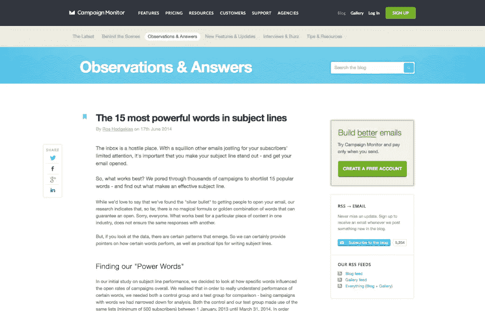
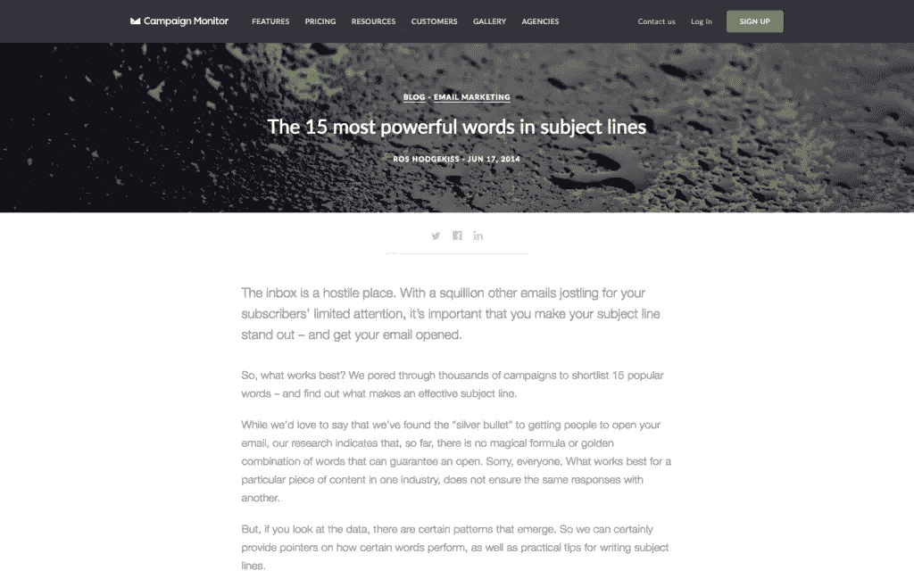

# 将 1，000 篇博客文章迁移到 WordPress 的经验教训

> 原文：<https://www.sitepoint.com/lessons-learned-from-migrating-1000-blog-posts-to-wordpress/>

企业博客是任何数字营销策略的重要基石，与网站、分析、当然还有电子邮件营销一样。

对于许多希望通过内容营销提高知名度和吸引更多客户的组织来说，创建博客是至关重要的第一步。今天有一系列博客平台可供选择，其中许多都是免费的，可以帮助启动这个过程，甚至将最小的企业变成强大的内容出版商。

但是如果你的公司已经有博客了呢？

如果现有的博客和运行它的平台已经存在了十年，那会怎么样呢？

这是一个团队的故事，他们继承了一个十年前的博客，并将其迁移到一个新的平台上，以重新设计整个用户体验，增加有机搜索流量，并防止内容作者因沮丧而将笔记本电脑扔出窗外。

## 是改变的时候了

一年半前，我加入了 Campaign Monitor，负责数字营销。

Campaign Monitor 为成长中的企业提供了一个优雅简单的电子邮件营销平台。我一直是这个产品和团队的忠实粉丝，很高兴有机会成为其中的一员。这个团队有着丰富而悠久的博客历史，可以追溯到 2000 年初。作为一名数字营销人员，这是一笔值得继承的惊人财富。我们每月一半的内容页面浏览量来自我们关于电子邮件营销的真知灼见。

继承一个历史悠久的博客的另一面是继承一个十年前的博客基础设施。这部分就没那么有趣了。

我们的营销团队发展迅速，我们需要一个现代化的内容平台来跟上我们内容制作的规模。我们旧的博客基础设施难以置信地难以使用。每篇文章都需要一个多步骤的过程，用 HTML 对待定的博客文章进行编码(团队中的大多数人使用 Dreamweaver 来开始发布最终草稿的过程)，然后复制并粘贴到我们的平台上进行发布。编码阶段的任何微小失误都有可能彻底毁掉发表的文章。这对我们的内容团队来说是一场噩梦。我们的内容团队乐于写作，而不是编码。即使我们最终成功发布了一篇没有问题的新帖子，最终产品也不是 SEO 友好的，也不是为搜索而优化的。我们的内容生产相当于将高辛烷值的喷气燃料倒入一辆生锈的自行车。

我们欠我们的内容团队一些更好的东西。

考虑到我们经历的所有痛苦，我们迫切需要一个新的博客，从头开始重建。因此“更新我们的博客”项目诞生了。这个项目需要跨多个团队的一些关键内部调整，包括高管、产品营销、设计、web 开发、运营和内容营销。

## 经验教训# 1–在一个令人敬畏的平台背后组织起来

首先，我们将项目分为几个主要阶段:

1.  **平面设计**–结构、类别、线框
2.  **数字设计**–编码、反应灵敏的外观和感觉
3.  **数据**-导出所有的 URL 和类别，重新分类和重构 URL，并且[服务器端 301 在直播时将](https://support.google.com/webmasters/answer/93633?hl=en)从旧的 URL 重定向到新的 URL
4.  创建我们的新博客并托管它，新的评论平台

在内部，我们使用一个简单的电子表格作为我们的“新博客发布跟踪器”。跟踪者包含了上面详述的阶段，以及特定的子任务、所有者、状态和日期。这个追踪器是为了让我们所有人都保持在正确的轨道上，同时也为其他相关的利益相关者提供可见性。这一点尤其重要，因为我们有一个跨多个时区的国际团队。

我们在 WordPress 上结盟作为我们的博客平台有几个原因。在我以前的雇主那里，我们整个网站都是用 WordPress 管理的。我们的内容负责人和有机收购负责人过去都管理过公司的 WordPress 账户。我们的内容规划工具与 WordPress 无缝集成，这将使发布变得轻而易举。

WordPress 是一个世界级的博客平台，我们的团队非常了解它——它是满足我们需求的最佳选择。

## 经验之二——与有才华的数字设计师合作

我们一前一后处理了第一阶段的两个项目。我们的数字设计师( [Mike Twigg](https://twitter.com/twiggmichael) )负责创建我们的新博客外观，而数据团队则采取了第一步，导出我们所有的旧网址，并对它们进行重新分类/重组。我们的设计和产品营销团队花时间想出了反映我们公司和品牌的各种选项，最终确定了一个干净简单的主页三栏布局，带有关键的英雄图像(英雄图像是页面顶部的一个大的视觉横幅)。

我们的旧博客设计没有针对我们的主要博客页面或博客帖子的英雄，因此这意味着我们的设计团队还承担了为我们所有现有内容以及新内容整理英雄图像的繁重任务。对于我们现有的帖子，我们专注于最近和最受欢迎的帖子，并简单地向下搜索。这是一项乏味的任务，但对我们的博客未来的成功至关重要。

Campaign Monitor 是一个面向成长型企业的电子邮件营销平台。我们希望我们的新博客设计能清晰地传达这一信息。我们坚持三大主题，这三大主题定义了我们的公司和品牌:

*   **优雅**
    *   简洁而鲜明的设计直接反映了运动显示器的品牌和信息需要是重中之重。
*   **简单**
    *   我们博客的大部分流量将继续来自有机和电子邮件/营销来源，而不是来自网站导航。
    *   清晰的超链接和 CTA 对于推动用户和活动监控的最佳行为至关重要。
*   **可读**
    *   作为一个内容平台，我们希望突出内容，尽量减少不必要的干扰。
    *   我们优先考虑大字体、标题大写、英雄形象、辅助形象和标注(引用、统计等。)与消费博客内容没有直接关系。

## 经验教训# 3–与优秀的网络工程师合作

在重新设计的过程中，我们运营团队的网络工程师( [Tynan Young](https://www.linkedin.com/in/tynan-young-4993243b) )导出了我们 1000 多篇历史博客文章，这样我们就可以开始重新分类阶段。选择我们的新类别和博客类别 URL 需要我们的执行团队和有机收购负责人的一致。

一旦团队就我们的新类别达成一致，我就将项目转移到 Excel，并对我们现有的所有博客文章进行重新分类和重组。(书呆子边注——我最喜欢的几个 Excel 公式，特别是对于这样的项目，是简单的[文本到列](https://support.office.com/en-us/article/Split-names-by-using-the-Convert-Text-to-Columns-Wizard-2cd989db-2b1f-4d89-b17b-534250ff9905)、[连接函数](https://support.office.com/en-us/article/CONCATENATE-function-8f8ae884-2ca8-4f7a-b093-75d702bea31d?ui=en-US&rs=en-US&ad=US)和可靠的 [VLOOKUP](https://support.office.com/en-us/article/VLOOKUP-function-0bbc8083-26fe-4963-8ab8-93a18ad188a1) 。当我们在数据方面进行项目的这一阶段时，我们忙于跟上我们的内容团队，因为他们继续在现有的博客平台上发布新内容。

以下是当时一个现有的博客网址及其新的对应网址的例子:

例子: ***主题词中最有力的 15 个词***

*   [https://www . campaign monitor . com/blog/post/4210/power-words-in-email-subject-lines/](https://www.campaignmonitor.com/blog/email-marketing/2014/06/power-words-in-email-subject-lines/)(上一篇)
*   [https://www . campaign monitor . com/blog/email-marketing/2014/06/power-words-in-email-subject-lines/](https://www.campaignmonitor.com/blog/email-marketing/2014/06/power-words-in-email-subject-lines/)(新)

一旦我们准备好了所有的新网址，我们的网络工程师处理了所有来自以前网址的 301 重定向，以确保我们将所有的历史流量驱动到正确的位置。

## 经验之四——与优秀的网络开发人员合作

下一步是开始建立我们的新博客。我们选择 WordPress 作为我们的内容管理系统，Disqus 作为我们的评论平台，Rackspace 作为我们的主机提供商。从这里开始，我们稍微改变了模式，对我们的博客基础设施采取了独特的方法。

我们的网络开发人员( [Ash Durham](https://twitter.com/ashrdurham) )希望我们的博客“两全其美”:(WordPress 给我们内部用户带来的易用性和熟悉度，以及(2)我们营销网站最终“产品”的内在安全性和速度。这个自定义设置允许我们的员工创建、组织、起草和发布新的博客文章。这个环境位于我们内部网络的后面，WordPress 环境作为我们的登台环境。一旦我们在任何给定的时间对修改感到满意，我们就开始从 WordPress 内部“生成文件”的过程。这个过程利用了多种技术(PHP、Python、Bash、GIT)最终让博客的静态文件在 https://www.campaignmonitor.com/blog/的[上直播。](https://www.campaignmonitor.com/blog/)

传统的 WordPress 插件需要在发布的博客文章和 WordPress 之间来回交互，这在我们的设置中不适用，但这是一个折衷，我们很乐意为我们所有的博客文章提供网站的速度和安全性。

当我们最终准备好进行实际的推送和上线时，我们的 web 开发人员和网络工程师接管了工作。我们最终将我们可能错过的任何最近的博客帖子，以及我们对任何历史帖子的任何最新评论迁移到我们的新平台。

我们选择在周日晚些时候上线。我们关闭了旧博客，并在新家推出了新的 WordPress 博客。然后，我们将 301 重定向和我们的新博客推向全世界。

## 结果

大多数营销项目都是通过某种成功标准来衡量的。

对于这个项目，我最担心的是失败。

我们的博客迁移中的任何停顿都会对我们的搜索量、流量、有机排名以及我们的收入目标产生巨大的负面影响。如果我们在一个全新的平台上重组了 1000 多个博客网址，并且没有对我们的流量产生任何影响，我会非常激动。

从数据的角度来看，我们的博客迁移的实际结果非常突出。

虽然我们希望在不破坏任何东西的情况下迁移到一个新平台，但我们看到我们博客的有机搜索流量逐月增长了 50%，导致我们营销网站的总独立用户逐月增长了 8%。我们最初的平台真的没有给我们带来任何好处，尤其是在有机搜索方面，并且经常延迟或复杂化我们按时发布新博客文章的能力。结合一个非常现代的博客基础设施的好处，为有机搜索优化，结果肯定不言自明。我们的内容团队喜欢这个新平台。关键的集成让我们的内容制作按计划进行，让我们的内容制作者愉快地写作，而不是执行其他平凡的任务。

来看看我们的新博客，让我们知道你的想法:[https://www.campaignmonitor.com/blog/](https://www.campaignmonitor.com/blog/)

## 分享这篇文章