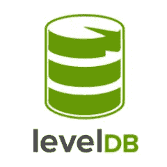

# Ruby 中的 LevelDB

> 原文：<https://www.sitepoint.com/leveldb-ruby/>



通常，当您开始使用 Rails 应用程序时，您的数据存储在 MySQL(或 PostgreSQL、或 SQLite、或 Oracle)数据库中。但是，事实证明，传统的关系数据库并不适合所有类型的数据。例如，如果您希望快速访问不常刷新到磁盘的数据，可以将该信息保存在 RAM 中。在这种情况下，您可能需要 Redis 或 Memcached。如果您的数据可以用图形表示，您会想要查看 Neo4j 或 OrientDB。但是有时候，你不想或者不需要一个成熟的数据库服务器。相反，您可以用一个简单的库来凑合，该库可以与您的应用程序打包在一起。这就是 LevelDB 的用武之地:它是一个键值存储*库*，意在快速运行。

在本文中，我们将介绍如何在 Ruby 包装器中使用 LevelDB，并通过展示常见用例来讨论在哪些地方应该使用 LevelDB，哪些地方不应该使用 level db。

## 为什么不是杂烩？

LevelDB 是一个键值存储库，这意味着您可以将字符串键和字符串值相关联，以便以后查询。等等——那不是像红宝石哈希吗？如果 Ruby 已经有了我们想要的东西，那么添加另一个依赖项又有什么意义呢？事实证明，Ruby 的 hash 不能真正用作磁盘上的键值存储。

首先，level db“hash”存储在数据库文件中，而不是保存在内存中。因此，当您的应用程序结束/崩溃时，您仍然可以在应用程序重新启动时访问 LevelDB 数据。此外，LevelDB 还包括处理可能会发生的问题的工具。首先，当您试图写入数据库时，可能会出现各种各样的错误。LevelDB 让您知道是否出了问题。

它还允许我们自动地将更新应用到键值存储库*。基本上，对于原子更新，要么整个更新完成，要么什么都不完成(我们很快就会看到一个例子)。另一个很棒的特性是完全同步写入，这意味着对键值存储的更新直到它实际将它们写入底层设备(例如硬盘)时才返回。我们可以构建一个系统，它丢失的不会比崩溃发生时正在处理的更新更多。*

LevelDB 给了我们一些自动同步。如果我们有两个线程访问同一个数据库，对于某些操作，LevelDB 将确保我们不会因为试图同时访问或修改数据库而遇到问题。最后，LevelDB 还给我们带来了各种各样的性能优势。

总的来说，显而易见，键值存储不仅仅是获取一个散列并序列化它。我们*总是*不得不考虑失败，而且大多数时候，还要考虑并发性。LevelDB 考虑到了所有这些复杂性，并让我们将键值存储视为一个简单的散列，这就是它令人敬畏的地方。

## LevelDB-Ruby 基础

LevelDB 的“默认”API 是 C++，不过谢天谢地，有人给我们 Rubyists 写了一个绑定！在我们安装它之前，我们需要一个本地库的副本。安装取决于您所在的平台(或者您可以从源代码编译)。如果你在 Mac OS X 上使用家酿软件，你可以运行:

```
brew install leveldb
```

如果你使用的是 Debian 衍生系统(例如 Ubuntu):

```
sudo apt-get install leveldb
```

现在我们可以安装宝石了:

```
gem install leveldb-ruby
```

不幸的是，gem 有点旧，缺少一些特性，但是它仍然非常有用。让我们直接看一个简单的例子:

```
require 'leveldb'

db = LevelDB::DB.new("my-database.db")
db.put "dhaivat", "pandya"
```

首先，创建一个 LevelDB 数据库(它实际上是作为一个目录创建的，里面有一堆文件)，并将键“dhaivat”与值“pandya”相关联。我们可以很容易地从“哈希”中获取值:

```
db.get "dhaivat"
```

通过允许我们在 LevelDB 数据库上使用标准散列语法，绑定使我们的生活变得更加轻松:

```
db["dhaivat"] = "pandya"
p db["dhaivat"]
```

我们还得到了一个非常有用的名为`contains?`的实用方法，它告诉我们数据库是否包含给定的键:

```
db.includes?("dhaivat") => true
```

我们可以很容易地获得键和值:

```
db.keys
db.values
```

## 循环

在底层，LevelDB 可以近似为一种称为“B+树”的数据结构的非常有效的实现。这意味着 LevelDB 表示的散列是一个按顺序排序的散列。换句话说，每个键值对都按照特定的规则进行排序，而 Ruby Hash 没有提供这样的排序保证。默认情况下，LevelDB 按照键的字母顺序对这些对进行排序，因此我们可以按照这个顺序迭代它们:

```
db.each do |key, value|
  puts "#{key}, #{value}"
end
```

我们甚至可以像对常规 Ruby 散列那样映射数据库:

```
db.map do |key, value|
  [key, " #{value} "]
end
```

## 原子数

到目前为止，我们只是将一些非常简单的操作串联在一起，没有过多考虑如果其中一个操作失败会发生什么。让我们来看看这个场景:

```
db.put "fred", "smith"
db.put "john", db["fred"]
db.delete "fred"
```

如果我们在删除“弗雷德”之前失败了怎么办？这意味着值“smith”现在同时与“fred”和“john”相关联。在许多情况下，这种中介案例会破坏您的业务逻辑。相反，我们需要一种方法来确保这三个操作要么全部完成，要么都不完成。我们需要原子性。

LevelDB 为此提供了“WriteBatch”的概念。获取所有操作，并将它们填充到 WriteBatch 中。通常，它们是作为原子操作来执行的。这里有一个例子:

```
db.batch do |b|
  b.put "fred", "smith"
  b.put "john", b['fred']
  b.delete "fred"
end
```

这确保了我们所有的三个操作都将作为一个*事务*运行。要么所有操作都完成，要么都不完成。但是，默认情况下，调用是异步的，这意味着当调用返回时，数据库不一定与文件同步。幸运的是，有一种简单的方法可以使它成为同步事务:

```
db.batch, :sync => true do |b|
  b.put "fred", "smith"
  b.put "john", b['fred']
  b.delete "fred"       
end
```

## 用例

好了，现在我们对 LevelDB 有了一个基本的了解。这似乎太容易了，但这正是 LevelDB 的亮点。它隐藏了所有复杂的优化、算法等等，让你看起来好像只是在访问一个奇怪的小 Ruby Hash。

但是，什么时候应该使用它呢？

首先要理解清楚的是，LevelDB 是*而不是*一个数据库服务器。不涉及服务器。它只是一个图书馆。这给了它一个非常大的优势:您不需要知道部署目标的设置就可以高效地处理磁盘上的数据。因此，如果你正在编写一个运行在可能还没有 Postgres 或 MySQL 的环境中的应用程序，LevelDB 绝对是*要考虑的东西。例如，LevelDB 通常在客户端与 Javascript 一起使用，因为没有关系数据库的良好等效物可用。*

有人可能会认为*不*使用 LevelDB 的一个很好的理由是如果你有比简单的键值关系更复杂的东西。幸运的是，事实并非如此。只要稍加思考，就可以使用键值存储在数据中创建更复杂的关系。LevelDB 的另一个主要好处是它是非常低级的，所以您可以准确地知道(至少，渐进地)查询和操作将花费多少时间。因此，您可以在 LevelDB 之上创建自己的抽象，提供特定的权衡。

## 包装它

我希望你喜欢这次通过 Ruby 的 LevelDB 之旅。如果你有任何问题，请在下面的评论中提出！

## 分享这篇文章