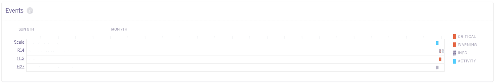
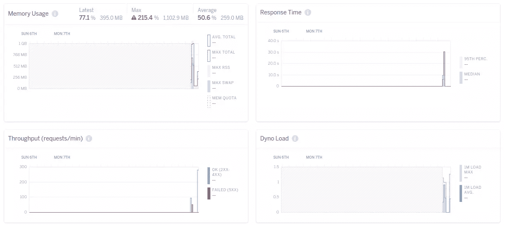
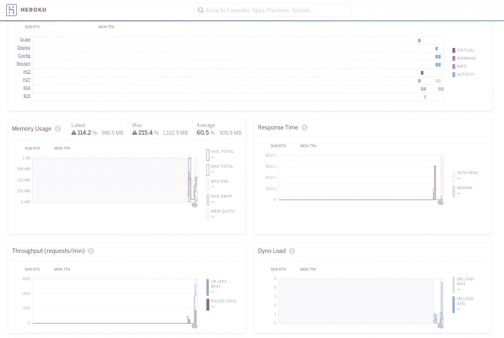

# 利用 Heroku 的指标提高应用性能

> 原文：<https://www.sitepoint.com/leverage-herokus-metrics-for-better-app-performance/>


今天，我们将讨论 Rails 和 Heroku 上与性能相关的项目。我想介绍 Heroku metrics dashboard，以及如何基于它对我们的应用程序进行性能优化。

Heroku 是一个托管 web 应用的平台即服务(PaaS)产品，是让您的应用快速上线的最简单的服务之一。虽然它是建立在 [AWS](https://aws.amazon.com/) 之上的，但它有许多功能，使它比其他云计算服务更容易和有吸引力。其中一个功能是它的指标仪表板，它提供了关于应用程序在基础架构级别上如何执行的见解。

在本教程中，我们将看到如何利用这一点来优化我们的 Rails 应用程序。

请注意，Heroku 指标仅在资源利用率方面有所帮助，如 CPU、内存和 IO，但它对我们的应用程序性能没有太大帮助。应用监控的工具有很多，比如[新遗迹](https://newrelic.com)和[天窗](https://skylight.io)。我强烈建议将这些服务与 Heroku metrics 一起使用。

在本教程中，我们将首先看到度量仪表板的概述，它提供了什么样的见解，以及一些您应该知道的重要错误代码。然后，我们将构建一个包含几个表的示例 Rails 应用程序，并将其托管在 Heroku 上。

一旦托管，我们将过载我们的服务器，并看到 Heroku 指标显示我们的问题。在此基础上，我们将探索一些最佳实践来进行微调，并查看我们的修复效果。

让我们开始吧。

## Heroku 指标概述

正如我们在上面看到的，Heroku metrics 提供了关于您的应用程序性能的见解。只有付费层的应用程序才能启用和访问指标仪表板。您可以从 Heroku 中的应用程序页面访问应用程序的指标仪表板。

### 仪表盘

首先，让我们看看 Heroku 的仪表板提供的指标。默认情况下，Heroku 为您的 dynos 收集以下指标。

#### 内存使用

这提供了对进程类型的应用程序内存使用情况的洞察。此度量提供了总内存使用量、交换空间使用量和内存配额。所有这些指标都是在动态级别收集的。还有 RSS，它是所选进程类型的所有 dynos 上的内存总量。

#### 动态负载

动态负载代表您的动态正在招致的负载。这是队列中等待空闲动态的 CPU 任务数。

#### 事件

这表示应用程序中发生的事件和错误。部署、重启和扩展等事件都记录在这里。此外，它还捕获已经发生的错误。我们将在下面看到一些你经常看到的重要错误。

虽然这些是为所有动态捕捉的，但有几个指标只为`web`动态捕捉。

#### 响应时间

这显示了我们的应用程序和第 95 百分位的平均响应时间。第 95 个百分位数表示 95%的应用程序请求比指定时间得到了更快的处理。

#### 吞吐量

这让我们了解到我们的应用程序在一分钟内收到的请求数量。它显示已成功处理的请求数和未成功处理的请求数。

### 错误

现在，让我们看看您可能在仪表板上遇到的几个重要错误代码。

#### R14 和 R15

臭名昭著的 R14 错误代码代表内存溢出问题。也就是说，你的应用程序使用了比你的 dyno 更多的内存。当应用程序的内存需求超过配额时，Heroku 开始提供交换内存，即存储在磁盘上的内存。但是，这会直接影响应用程序的响应时间。

发生这种情况的原因有很多，但更常见的情况是内存泄漏。如果您看到内存使用量的连续攀升图，这很好地表明您的应用程序可能正在泄漏内存。

如果您的应用程序没有停止消耗更多的内存，R15 就是 R14 之后的错误代码。当这个错误发生时，Heroku 会自动重启应用程序。每个 dyno 计划的配额可以在[这里](https://devcenter.heroku.com/articles/dynos#memory-behavior)找到。

#### H10

这是一个你应该注意的错误代码，当这种情况发生时，你最好立即修复它。H10 表示应用程序崩溃。大多数 web 服务器都有关于工作线程数量的配置和崩溃工作线程的静默重启。如果它不是为您的应用程序配置的，或者如果您的应用程序是单线程/单工作应用程序，这个错误代码意味着您的应用程序关闭了。

#### H12 和 H13

这些错误代码与请求/响应时间有关。每次请求超时时都会触发 H12，这意味着需要 30 秒以上的时间来返回响应。30 秒的限制是在 Heroku 路由器级别。

H13 也是一种请求超时，但它发生在应用程序中。当您的 web 服务器有一个较低的请求超时阈值时，比如说 10 秒，而处理一个请求需要 15 秒，那么您的 web 服务器就会关闭这个连接。当这种情况发生时，Heroku 触发了 H13。

上面提到的一些错误比其他的更常见。错误代码的完整列表及其解释可以在[这里](https://devcenter.heroku.com/articles/error-codes)找到。

有了 Heroku dashboard 的基本概述，我想向您展示一个基于我们上面讨论的示例应用程序的优化。

## 示例应用程序

我们的示例应用程序将会非常小而琐碎。您可以使用以下命令生成它:

```
rails new heroku-metrics-example -d postgresql
rake db:create && rake db:migrate
rails g scaffold post title body:text
railg g scaffold comment body post:references
rake db:migrate 
```

我刚刚创建了一个具有两个支架的 Rails 应用程序:帖子和评论。现在，我们将添加一个种子文件来生成用于测试的样本数据。这一步是可选的，但它只是为每个请求留出一些处理时间。我正在使用 [faker](https://github.com/stympy/faker) gem 来生成种子数据。下面是种子文件的内容。

```
100.times do |t|
    post = Post.create(title: Faker::Lorem.word, body: Faker::Lorem.paragraphs(3).join(' '))
    puts("Created Post - #{post.id}")
    rand(10..50).times do |c|
        comment = Comment.create(body: Faker::Lorem.paragraph, post: post)
        puts("Created Comment - #{comment.id} for Post #{post.id}")
    end
end 
```

现在，让我们初始化 git 存储库并部署到 Heroku:

```
git init
git add .
git commit -m "Initial commit"
heroku apps:create
git push heroku master
heroku run rake db:migrate
heroku run rake db:seed 
```

Rails 应用程序现已成功部署到 Heroku。让我们开始在应用程序中加载负载，以生成一些指标。

> 对于本教程，我使用 Heroku 的爱好 dyno，它带有 512 MB 的内存。这里有更多关于 dyno 类型的信息

### 请求超时

我在用[围攻](https://www.joedog.org/siege-home/)给服务器施压。下面是我的负载测试的当前设置。

```
siege -t 5M -c 30 https://rocky-coast-29518.herokuapp.com/posts -v 
```

在这里，我连续 5 分钟生成 30 个并发用户到 posts 端点。运行后，您可以使用 Heroku 指标查看它对应用程序的影响:



如您所见，请求很快就超时了。为什么？

首要原因是我们的网络服务器。默认情况下，Rails 附带 WEBrick，这是一个用于 Ruby 的简单 HTTP 服务器。它是而且应该主要用于发展目的。WEBrick 是单线程 web 服务器，不支持并发，所以一次只能处理一个请求。要解决这个问题，让我们配置一个不同的 web 服务器。

我们要用的是 Heroku 推荐的 web 服务器 [Puma](http://puma.io/) 。

添加 web 服务器非常简单。只需将`gem "puma"`添加到您的 gem 文件中，然后执行`bundle install`。

安装完成后，在`config/puma.rb`下创建 puma 配置文件，并添加以下几行。

```
workers Integer(ENV['WORKERS'] || 4)
threads_count = Integer(ENV['THREADS'] || 5)
threads threads_count, threads_count

preload_app!

rackup      DefaultRackup
port        ENV['PORT']     || 3000
environment ENV['RACK_ENV'] || 'development'

on_worker_boot do
  ActiveRecord::Base.establish_connection
end 
```

我将工人计数从一个环境变量传递给`workers`方法，默认为 4。然后在第 3 行，我将最小线程数和最大线程数都作为 5 传递。在最后一个块中，当一个工人开始工作时，我正在建立一个活动的记录连接。

配置完成后，在应用程序的根目录下创建一个名为`Procfile`的文件，并在其中添加下面一行，然后将应用程序部署到 Heroku。

```
web: bundle exec puma -C config/puma.rb 
```

部署完成后，我以相同的规格开始了负载测试。很快，我开始看到改进的结果。响应时间显著下降，记忆片段也是如此。我们还可以看到吞吐量的增加:



更新我们的 web 服务器后，我们看到应用程序的性能有了巨大的提高。

### 记忆霸主

我们的表现很好，但是我们仍然可以从我们的资源中得到更多。从图中可以看出，我们只使用了一半的可用内存。

让我们在 Heroku 上将工作线程数更新为 5，线程数更新为 10。让我们再次运行负载测试，这次有更多的并发用户。下面是更新后的负载测试配置。

```
siege -t 5M -c 200 https://rocky-coast-29518.herokuapp.com/posts -v 
```

我刚刚把并发用户从 30 更新到了 200！不，正如你所料，应用程序没有崩溃。但是我们确实重新开始使用我们的资源。吞吐量增加了，但是我们开始看到许多失败的请求和内存过载。



发生这种情况有几个原因:

1.  我们的工作线程设置不太正确。我们使用 5 个工作线程和 10 个线程。但是本例中使用的 DB 计划最多只有 20 个连接。因此，一些线程没有获得 DB 连接，并在该阶段失败。

2.  因为我们的工作线程数更多地是针对内存大小，而且因为工作线程使用内存，所以我们开始看到 R14。

为了解决这个问题，我将工作线程数更新为 3，线程数更新为 8。当我重新运行测试时，没有请求超时或内存过载。

作为我们在应用程序上增加负载的副作用，响应时间增加了，吞吐量减少了一点。但是，缓慢的请求在任何时候都比失败的请求要好。

还有一些事情也可以在应用程序级别上解决。例如，`/posts`端点正在加载整个 posts 表，这非常糟糕，可以通过添加分页或延迟加载来修复。但是，我们在这里关注的是优化我们可用的资源。你可以在这里了解更多关于 Rails 性能优化的信息。

## 结论

正如我们所看到的，Heroku 的应用程序指标非常方便，有助于优化我们的 Rails 应用程序。一些配置调整可以带来一些大的改进。

解决负载问题最常见的方法是提供更多的资源，这很好。但是，我仍然建议在投入更多资源之前，先看一下指标，看看应用程序是否真正利用了可用的资源。

在上面讨论的步骤中，没有为 workers 或 threads count 设置一个标准值，因为它与应用程序、dyno 大小和服务(例如:DB)约束相关。我建议对它进行调整，直到您可以在资源使用、吞吐量和响应时间之间找到平衡。

这里使用的示例应用程序可以在 [github](https://github.com/avinoth/heroku-metrics-example) 上获得。

感谢阅读！

## 分享这篇文章