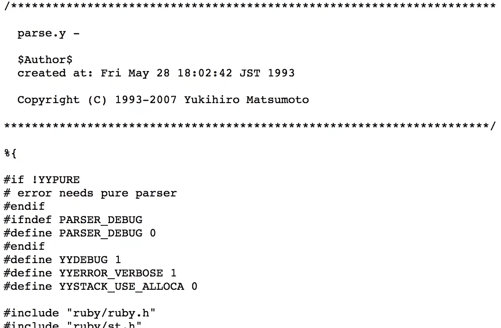

# 词法分析器、语法分析器和语法分析器，天啊！:Ruby 如何执行

> 原文：<https://www.sitepoint.com/lexers-parsers-and-asts-oh-my-how-ruby-executes/>



我们想当然地认为`ruby my_app.rb`会执行我们的代码。但是它是如何工作的呢？引擎盖下发生了什么？让我们通过内部来了解一下。

## 词法分析程序

第一个停靠的港口是 lexer。lexer 读取您的代码并将其分解成“标记”(因此，您可能会听到 Tokenizer 和 Lexer 可以互换使用)。你问的令牌是什么？很棒的问题！让我们来看一个例子:

```
5.times do |x|
  puts x
end 
```

当您运行`ruby my_app.rb`时，Ruby 打开文件并依次读入每个字符。第一个是整数(5)，所以 lexer 知道它处理的类型是整数对象。`0`也是一个整数(有趣的是，`.`也算作一个整数，因为它可以表示一个浮点)，但是一旦它命中`t`，lexer 识别出这个过程的数字部分已经结束，返回，并将类型`tINTEGER`分配给令牌。

在`.`之后，雷克萨斯遭遇`times`。这被归类为`identifier`,这是一种表示类、变量或方法名的技术方法。接下来，它遇到了`do`，这是一个保留字，因为它是语言中的一个关键字。词法分析器如何区分保留字和标识符？嗯，Ruby 本身必须知道什么是关键字，什么不是，所以它在内部保存了一个保留字列表。[这里的](https://github.com/ruby/ruby/blob/202bbda2bf5f25343e286099140fb9282880ecba/lib/irb/completion.rb#L16-L36)是一个例子——你可以看到它被导入到解析文件的顶部，我们一会儿会深入研究这个文件。

实际上，我在稍微简化事情。现代 Ruby 中的词法分析和解析过程已经得到了简化，变得更加高效。实际上，lexing 函数是作为解析过程的一部分被调用的。这是在一个名为 [parse.y](https://github.com/ruby/ruby/blob/trunk/parse.y) 的语法规则文件中完成的——11，000 行复杂的逻辑和你的源文件的低级争论。看到[这个](https://github.com/ruby/ruby/blob/trunk/parse.y) 600+线的案例声明了吗？那是你的 lexer。

理论够了。让我们来点实际的吧！从 Ruby 1.9 开始，Ruby 附带了一个 API 来与它的 Lexer 接口。这叫开膛手，是个有趣的练习。所以，我们来试试吧。启动优秀的[撬](http://pryrepl.org/)或`irb`并跟随；

```
[1] pry(main)> require 'Ripper'
=> true
[2] pry(main)> to_lex = <<STR
[2] pry(main)* 5.times do |n|
[2] pry(main)* puts n end
[2] pry(main)* STR
=> "5.times do |n|\nputs n end\n"
[3] pry(main)> pp Ripper.lex(to_lex)
[[[1, 0], :on_int, "5"],
 [[1, 2], :on_period, "."],
 [[1, 3], :on_ident, "times"],
 [[1, 8], :on_sp, " "],
 [[1, 9], :on_kw, "do"],
 [[1, 11], :on_sp, " "],
 [[1, 12], :on_op, "|"],
 [[1, 13], :on_ident, "n"],
 [[1, 14], :on_op, "|"],
 [[1, 15], :on_ignored_nl, "\n"],
 [[2, 0], :on_ident, "puts"],
 [[2, 4], :on_sp, " "],
 [[2, 5], :on_ident, "n"],
 [[2, 6], :on_sp, " "],
 [[2, 7], :on_kw, "end"],
 [[2, 10], :on_nl, "\n"]]
=> [[[1, 0], :on_int, "5"],
 [[1, 2], :on_period, "."],
 [[1, 3], :on_ident, "times"],
 [[1, 8], :on_sp, " "],
 [[1, 9], :on_kw, "do"],
 [[1, 11], :on_sp, " "],
 [[1, 12], :on_op, "|"],
 [[1, 13], :on_ident, "n"],
 [[1, 14], :on_op, "|"],
 [[1, 15], :on_ignored_nl, "\n"],
 [[2, 0], :on_ident, "puts"],
 [[2, 4], :on_sp, " "],
 [[2, 5], :on_ident, "n"],
 [[2, 6], :on_sp, " "],
 [[2, 7], :on_kw, "end"],
 [[2, 10], :on_nl, "\n"]] 
```

很简单——我们需要 Ripper，传入一些源代码作为 heredoc，并调用 Ripper 的`to_lex`方法。输出是我们的标记器；左边的数字采用[line，position]格式，前缀`:on_`表示令牌的类型。让我们看一个类似的例子:

```
[5] pry(main)> pp Ripper.lex(to_lex)
[[[1, 0], :on_int, "5"],
 [[1, 2], :on_period, "."],
 [[1, 3], :on_ident, "times"],
 [[1, 8], :on_sp, " "],
 [[1, 9], :on_kw, "do"],
 [[1, 11], :on_ignored_nl, "\n"],
 [[2, 0], :on_ident, "puts"],
 [[2, 4], :on_sp, " "],
 [[2, 5], :on_ident, "n"],
 [[2, 6], :on_sp, " "],
 [[2, 7], :on_kw, "end"],
 [[2, 10], :on_nl, "\n"]]
=> [[[1, 0], :on_int, "5"],
 [[1, 2], :on_period, "."],
 [[1, 3], :on_ident, "times"],
 [[1, 8], :on_sp, " "],
 [[1, 9], :on_kw, "do"],
 [[1, 11], :on_ignored_nl, "\n"],
 [[2, 0], :on_ident, "puts"],
 [[2, 4], :on_sp, " "],
 [[2, 5], :on_ident, "n"],
 [[2, 6], :on_sp, " "],
 [[2, 7], :on_kw, "end"],
 [[2, 10], :on_nl, "\n"]] 
```

在本例中，我已经从 heredoc 中删除了块(`|x|`)，因此它显示为:

```
"5.times do\nputs n end\n" 
```

这将是 Ruby 运行时范围内的语法错误。不过 lexer 并不关心，因为它的工作只是标记输入，因为语法检查是在不同的级别上执行的。回车:解析器

## 解析器

我们有我们的令牌，但我们仍然需要执行它们。我们如何做到这一点？我们需要一些东西来理解它们，这是解析器生成器的工作。解析器生成器采用一系列已定义的规则(与语言中的语法相似)并根据这些规则检查输入的有效性。Ruby 使用一个名为 [Bison](https://www.gnu.org/software/bison/) 的解析器生成器，定义该语言的规则可以在前面提到的 [parse.y](https://github.com/ruby/ruby/blob/trunk/parse.y) 中找到。这就是 Ruby 作为一种语言的定义。

### 解析算法

解析算法是用于解析令牌的过程。有许多不同的类型，但是我们要关注的是前瞻从左到右最右偏差(简称 LALR)。我的字数限制不允许我深入编译器工程，但是如果你想更好地熟悉一些术语，这里的有一些[资源](http://www3.cs.stonybrook.edu/~cse304/Fall08/Lectures/lrparser-handout.pdf)。

简而言之，这就是解析器正在做的事情:

*   从左向右处理令牌
*   获取当前令牌并将其推送到堆栈上
*   检查语法规则是否匹配；将匹配的规则添加到状态表中，并删除不再可能的规则
*   将下一个令牌推送到堆栈上，并应用相同的过程
*   执行类似于[减少](https://ruby-doc.org/core-2.1.0/Enumerable.html#method-i-reduce)堆栈的过程(如果适用)
*   向前看以检查下一个令牌是否与状态表中的剩余规则兼容。如果是，则继续，如果不是，则解析的这一部分完成，过程重新开始。这是`LALR`的`LR`部分。
*   它重复这个过程，直到栈中减少的内容与一个语法规则匹配(或者因为语法错误而出错！)

解析器记录应用状态列表和它可以移动到的潜在状态列表。换句话说，解析器本质上只是一个公认的复杂的有限状态机，由 Bison 为您维护。如果出于某种原因，您希望看到 Ruby 的状态转换，您可以使用`-y`标志运行您的程序，它会打印出调试信息:

```
Starting parse
Entering state 0
Reducing stack by rule 1 (line 939):
lex_state: EXPR_NONE -> EXPR_BEG at line 940
-> $$ = nterm $@1 ()
Stack now 0
Entering state 2
lex_state: EXPR_BEG -> EXPR_END at line 7386
Reading a token: Next token is token tINTEGER ()
Shifting token tINTEGER ()
Entering state 41
... 
```

希望这些输出现在有意义:`tINTEGER`是词法分析器分配给令牌的令牌类型，状态由解析器处理，`Reducing`和`Shifting`是遍历令牌流的解析器。

解析的结果是什么？一棵[抽象语法树](https://en.wikipedia.org/wiki/Abstract_syntax_tree)

### 抽象语法树

[Lisp](https://en.wikipedia.org/wiki/Lisp_(programming_language) 用户在这里会很熟悉。抽象语法树(AST)由一个“符号表达式”树(简称为`sexpressions`或`sexprs`)组成，它是 Ruby 程序转换成字节码之前的最后一个阶段。AST 很好地适应了这一点，因为通过程序的可能路径都被映射出来了，这使得生成字节码成为一种派生的优势。在编译过程的这一点上，我们的程序会被检查正确性[语义分析](https://en.wikipedia.org/wiki/Semantic_analysis_(compilers)，如果你正在编写一个 transpiler 来将你的 Ruby 代码转换成一种不同的目标语言(或者是你的 Rack 应用的模板引擎)，这就是你要做的事情。

让我们看一下表示为 AST 的代码:

```
[1] pry(main)> require 'Ripper'
=> true
[2] pry(main)> to_ast = <<STR
[2] pry(main)* 5.times do |n|
[2] pry(main)* puts n end
[2] pry(main)* STR
=> "5.times do |n|\nputs n end\n"
[3] pry(main)> pp Ripper.sexp(to_ast) 
```

这将产生:

```
[:program,
 [[:method_add_block,
   [:call, [:@int, "5", [1, 0]], :".", [:@ident, "times", [1, 3]]],
   [:do_block, nil, [[:command, [:@ident, "puts", [2, 0]], [:args_add_block, [[:vcall, [:@ident, "n", [2, 5]]]], false]]]]]]] 
```

您也可以通过运行`ruby --dump parsetree your_program.rb`来检索这些信息。

与前面类似，数字是行/字符数。这就是你的堆栈跟踪可以告诉你在你的源代码中哪里出错的原因。`ident`当然是`identifier`的缩写，是对我们在 Lexer 一节中提到的方法或变量标识符的引用。

从这个 AST，我们现在可以运行我们的代码了！Ruby 将遍历 AST，将每个节点转换成其虚拟机(又一个 Ruby VM，或 YARV)的指令。在这一点上有一些轻微的优化，像加法等常用操作的自定义指令。YARV 如何工作是一整篇文章的主题。可以这么说，Ruby 令人愉悦的语法已经变成了我们的计算机能够理解并按照编写的代码运行的代码。构建过程并不像最初看起来那么复杂。它只是一个管道，接受一些输入，应用一组规则并返回一个对象——在这种情况下，我们可以理所当然地认为是工作的可执行代码。

## 分享这篇文章