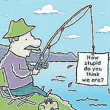
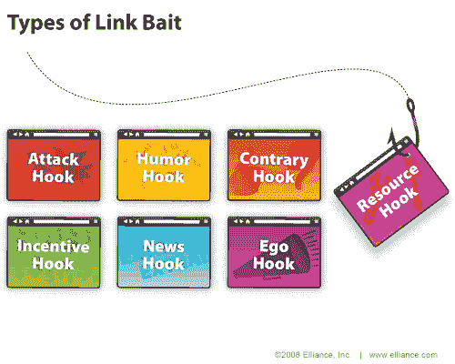

# SEO 钓鱼与空钩

> 原文：<https://www.sitepoint.com/link-baiting/>

 **【链接诱饵】**是 SEO 行业中一个相对较新的术语，由 ~~Aaron Wall 在他的 SEO 书~~**[Nick Wilson](http://www.linkedin.com/in/nickwilson)**(**更新:**他在 LinkedIn 的一次消息交流中亲自确认他在 2004 年创造了这个术语，在我的苏朋友 [Lyndoman](http://lyndoman.stumbleupon.com/) 给我发了一条关于这个错误的消息后，我问 Nick。谢谢你林顿。)——但“吸引”读者的技术无疑与第一份印刷出版物一样古老。总是需要抓住读者的注意力，精明的作家总是知道说什么，什么时候说，以及如何把他们的作品呈现在观众面前。

SEO“链接诱饵”策略的问题是，它经常使用“技巧”从其他网站产生链接到一个网站，但也吸引流量。然而，正如我们所知，诡计并不总是最好的策略。

##### 链接诱饵的类型

链接诱饵就是这样一种技术:它吸引读者；它吸引他们到你的内容。如果他们“咬”你，他们也可以链接回你想让他们链接的任何东西；这就是你如何知道你的“诱饵”是成功的:内容是诱饵，“反向链接”是捕捉。

你可以使用不同的“诱饵”策略，从“高质量的内容”到与你网站的实际定位没有太大关系的内容(“空钩”)，从图像到视频和声音，从徽章和小工具到有用的资源等等——最终你如何吸引读者到你的网站与你的创造力和独创性有很大关系。

链接诱饵主要有七种:**攻击钩、幽默钩、对立钩、激励钩、新闻钩、自我钩、资源钩**。对于每一种方式，你可以使用不同的策略和技巧:召唤一个著名的博客写手，让某人出名，送出一些东西，颁奖等等。例如，博客圈中一种非常流行的链接诱饵技术是“迷因”——如果主题“抓住”发起者，就会获得大量链接(所有参与者都需要链接到原始条目——我们将在另一个时间讨论这个问题)。

##### 怎么诱饵？书名的情感营销价值

**挂钩的不是内容，是标题。你有两秒钟的时间来吸引读者的注意力，这就是为什么写一个“杀手级标题”是任何出版商都应该掌握的技能。**

标题需要承载足够高的情感营销价值，以说服观众。头衔与可怜的 EMV 不挂钩；他们经常被读者忽略。如果标题被忽略，内容被阅读的机会就很小。

我的今日头条情感营销价值超过 33%(用高级营销学院[情感营销价值头条分析仪](http://www.aminstitute.com/headline/index.htm)测试)。

根据高级营销研究所的数据，英语包含 20 %的 EMV(情感营销价值)词汇，大多数专业文案的标题中会有 30%-40%的 EMV 词汇，而最有天赋的文案会有 50%-75%。最理想的是 100%——除非标题少于五个字，否则这是非常罕见的。

相比之下，像“链接诱饵提示初学者”这样的标题的 EMV 为 0%，而“搜索引擎优化链接诱饵建议”的得分为 25%。Lisa Barone 的《【Link Baiting 能成熟吗？没错，它得了 12.5%，布莱恩·克拉克的《[链接诱饵的历史](http://www.copyblogger.com/the-history-of-link-bait/)40%，克里斯·布罗根的《[链接诱饵的精妙艺术](http://www.chrisbrogan.com/the-subtle-art-of-linkbaiting/)20%。

##### 怎么诱饵？标题的情感冲击

高级营销研究所确定了三个情感影响群体:**理智型、移情型**和**精神型**。

根据你想要吸引的观众，每个群体吸引个人的不同方面。

标题“ **SEO 钓鱼空钩**”被高级市场研究所归类为“知识分子”。知识性的标题能有效地激起好奇心，吸引对需要推理和仔细评估的主题感兴趣的读者。显然，我的意图是“钩”智力读者开始一个有意义的关于链接诱饵作为搜索引擎优化技术的对话。

相比较而言，Lisa Barone 的《**能否链接 Baiting 成熟？是的，它已经被归类为“精神的”精神头衔具有最大的潜在影响力，通常在市场上最具影响力(注意“精神”并不仅限于宗教)。**

克里斯·布罗根的“**微妙的链接艺术**”被归类为移情。这在 SEO 行业中并不常见——移情头衔大多被护理行业的人使用。然而，感同身受的标题的目的是引起人们强烈的积极反应，所以如果这是你的目标，就写得感同身受。

链接诱饵的其他方面将在以后的文章中讨论，但对链接诱饵如何工作以及标题如何发挥如此重要的作用的初步理解，足以构建一个基本策略。要记住的是，如果方法合乎道德，出版商可以获得巨大的 SEO 收益。像其他搜索引擎优化策略一样，链接诱饵只是给谷歌和其他搜索引擎留下深刻印象的更广泛策略的一部分。虽然我的标题是“钩子”，但它肯定不是“空的”，因为我认为任何人都可以从这些有用的花絮中受益，这些花絮从未在其他任何地方的类似链接诱饵文章中涉及过。

*链接诱饵的种类图文有礼[埃利斯](http://searchengineoptimization.elliance.com/)。*

## 分享这篇文章