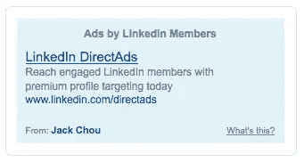

# LinkedIn 尝试脸书式广告

> 原文：<https://www.sitepoint.com/linkedin-tries-facebook-style-ads/>

商务社交网站 LinkedIn 推出了一项名为 [DirectAds](https://www.linkedin.com/directads) 的新广告功能，允许网站成员购买定向文本广告。DirectAds 在几周前推出了有限的测试版，并于昨晚向整个网站开放。产品经理 Jack Chou 在[发布的博文](http://blog.linkedin.com/blog/2008/07/linkedin-direct.html)中介绍了这项新服务，作为个人和小企业在网站上做广告的替代方式(通过他们的销售团队)。

DirectAds 是一款几乎相同的产品，脸书已经推出了几年，最初叫做“Flyers ”,去年秋天开始叫做“SocialAds”。基本上，这两个系统都允许网站成员购买定向文本广告——在脸书是按点击费或每次点击费，在 LinkedIn 是按每次点击费。

在脸书，结果大多很糟糕。2007 年 3 月， [Valleywag 报告说](http://valleywag.com/tech/advertising/facebook-consistently-the-worst-performing-site-242234.php)脸书广告的点击率为 0.04%，这个数字比风险投资家[Fred Wilson 8 个月后看到的](http://avc.blogs.com/a_vc/2007/11/my-facebook-ad-.html)要好*很多。Charlene Li 在脸书传单上获得了 2.76%的相当可观的回复率，但这似乎是例外而不是常态(她没有卖任何东西)。*

在 LinkedIn 上，结果可能会明显更好。因为该网站的平均家庭收入是 109，000 美元，而且该网站的成员是为了工作而不是娱乐，LinkedIn 已经以 50-75 美元的 CPM 价格出售 CPM 广告。尽管 MySpace 和脸书等主流社交网络的用户数量比 LinkedIn 多几千万，但它们的用户群对广告商的吸引力较小，因为它们更专注于建立社交联系，而不太关注商业主张。

杰克·周在他的博客中说:

> 例如，你可能是一家希望接触年轻专业人士的税务会计公司，或者你是一家希望在关键行业寻找潜在新客户的设计机构，或者你刚刚写了一本关于职业或商业主题的新书。你可以使用 DirectAds 向你的目标客户<u>传达信息。</u>

我们强调了关键词:客户。在 LinkedIn 上，用户是顾客，在脸书和主流社交网络上，他们是“朋友”DirectAds 也非常透明，将广告链接到发布者的个人资料。因为任何投放广告的人都有自己的职业声誉，所以垃圾邮件或滥用系统的情况很可能会很少。

## 分享这篇文章