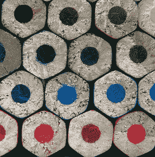
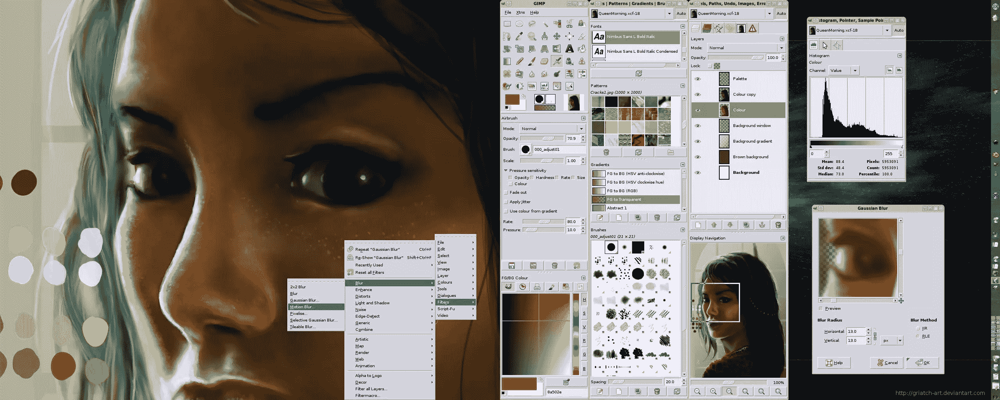
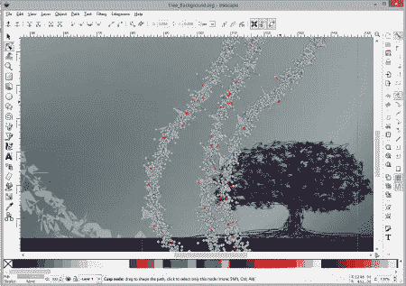
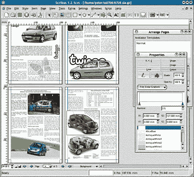
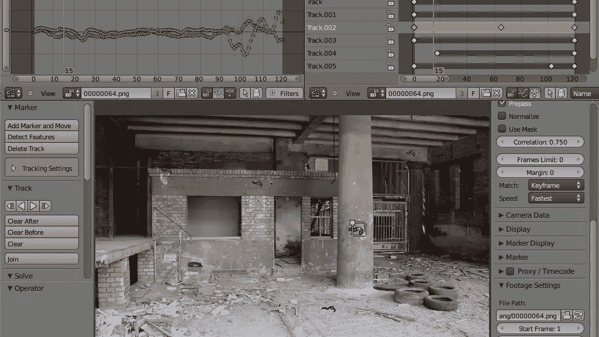
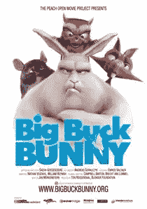

# Linux 设计工具:低端预算上的高端设计？

> 原文：<https://www.sitepoint.com/linux-design-tools/>

照片:[奥利巴克](http://www.flickr.com/photos/olibac/2354102486/)

虽然世界上最好的商业图形应用程序都有丰富的功能，但它们的价格也让许多人难以接受。

尽管有很多更便宜的选择，简单的事实是:很难比免费更便宜。

今天，我们将看看一些免费的开源图形应用程序，看看它们是否是可行的替代品。

如果你目前不熟悉大量的免费开源图形应用程序，你可能会错失良机。

这份名单上最好的开源图形应用程序在质量上可以与领先的商业应用程序相媲美。

也不要被“免费”这个词吓跑。这是一个“免费”绝对不意味着低质量的例子。

我知道你在想什么:“如果我使用自由软件，我会有太多的额外收入！'

放松点。你可以随时向这些应用背后辛勤工作的开发者捐款，帮助他们做得更好。

所以，让我们来看看这个列表，看看开源软件能否真正与昂贵的商业软件竞争**。**

 **旁注:虽然大多数应用程序最初是为 Linux 开发的，但它们通常有 Windows 和 Mac 版本。

## 1.你能用 GIMP 代替 Photoshop 吗？

当你想到免费的开源图形时，第一个想到的应用通常是 GIMP (Gnu 图像处理程序)。

虽然 GIMP 没有 Photoshop 的所有特色功能，但它确实提供了很多。事实上，有很多专业设计人员使用 GIMP，从他们的输出来看，结果是惊人的。

所以，假设你有一些设计技巧，你使用的应用程序的局限性是次要的。

图片来源:gimp.org

### GIMP 能做什么？

GIMP 是一个光栅图形应用程序，对图像编辑和修饰很有用。

您还可以使用它从头开始创建光栅图像，以及简单的动画。

笼形变压器在运行

它支持图层和通道，具有高级渐变功能，包括路径和快速蒙版。有旋转和变换工具，还有缩放、裁剪、调整大小、文件格式转换等工具。

GIMP 也可以用于网页和印刷设计。

它甚至有一些工具在 Photoshop 中没有直接的模拟——例如，允许扭曲对象部分的笼子变换工具。

### GIMP 的不足在哪里？

GIMP 落后的主要领域是接口和特性列表。

任何在 Photoshop 界面中成长起来的设计师，可能并不总能在他们预期的地方找到菜单选项。

是真的，GIMP 界面和 Photoshop 不一样，会有不可避免的学习曲线。

然而，如果 UI 差异是你的绊脚石，那么总会有 [Gimpshop](http://www.gimpshop.com/) 。Gimpshop 是 GIMP 改装的一个非常像 Photoshop 的界面。

有些人可能会说，复制 Photoshop 不是什么值得向往的事情。你是法官。

就功能而言，很难准确指出 Photoshop 缺少哪些功能，因为大多数缺少的功能都可以通过 GIMP 丰富的插件生态系统来添加。

理论上，这是一个更好的模型，因为您不会有很多未使用的功能掩盖了您需要的特性。

例如，GIMP 没有 RAW 图像处理功能，但是可以通过 UFRaw 插件添加。

GIMP 没有 Photoshop 的精细文本选项，也没有它的调整图层。默认情况下，CMYK 支持也有所限制，不过如果需要的话，额外的插件可以填补这一空白。

虽然缺乏这些功能可能会成为一些人的绊脚石，但我怀疑许多设计师甚至不会注意到它们的缺失。

互操作性经常被认为是 GIMP 用户面临的最大问题。客户经常希望为您提供 PSD 文件，尽管 GIMP 在理论上支持 PSD，但实际结果并不总是理想的。

这个文件格式问题经常被认为是新采用者的一个主要障碍，也可能是 GIMP 没有被广泛采用的主要原因。

### GIMP 和 Photoshop 的价格比较

虽然采用 GIMP 有一些明显的注意事项，但是当你比较成本时，这些障碍就变得不那么重要了。正如我提到的，GIMP 是免费的——很难比这更便宜了。

另一方面，Photoshop 是一笔不小的投资。目前，你可以以 699-999 美元或 1299-2559 美元的价格获得 Photoshop CS6 作为独立应用程序，与其他 Creative Suite 6 产品捆绑在一起。

对于 Adobe 新的仅出租政策，即他们的 Creative Cloud，情况类似。

如果你幸运地赶上了促销，你可以以每月不到 10 美元的价格获得 Photoshop 否则正常价格是每月 19.99-29.99 美元。

如果你决定购买完整的创意云，价格会涨到每月 49.99 美元(按年度合同计算)，也就是每年 600 美元。

对我们大多数人来说，这是一大笔钱——尤其是如果你不是每天都使用这个软件的话！

## 2.你能用 Inkscape 代替 Illustrator 吗？

Adobe Illustrator 是另一个领先的商业矢量图形应用程序，它有一个可行的免费开源竞争对手，即 [Inkscape](http://inkscape.org/) 。

截图，图片鸣谢:inkscape.org

### Inkscape 带来了什么？

默认情况下，Inkscape 使用 W3C 标准可缩放矢量图形(SVG)文件格式。如您所知，SVG 是一种日益受到 web 开发人员青睐的格式。

它还可以处理其他流行的矢量格式，如。艾，。eps，或者。pdf，而大多数其他矢量图形程序可以处理它的 SVG 文件。

Inkscape 附带了标记、克隆、alpha 混合、路径操作、位图跟踪和其他标准 SVG 功能。

如需完整的功能列表，请查看[此](http://inkscape.org/en/about/features/)。

也许这里最有趣的部分是 Illustrator 中缺少的 Inkscape 特性列表。根据[inkscape.org](http://wiki.inkscape.org/wiki/index.php/Inkscape_for_Adobe_Illustrator_users)的说法，Illustrator 缺少以下 Inkscape 功能:

*   直接编辑 SVG 源

*   克隆，平铺克隆，在画布上编辑克隆

*   按屏幕像素移动/旋转/缩放的按键

*   形状作为对象

*   在画布上编辑带有手柄的渐变

*   用键盘编辑节点

*   一键式油漆桶填充

虽然这个列表可能需要更新，但我认为无论如何包括它都足够有用。

### Inkscape 缺少哪些 Illustrator 功能？

如果你决定改用 Inkscape，你也应该知道它的局限性。

首先，文件互操作性可能是一个问题，尤其是旧的。ai 文件。

Inkscape.org 还发布了一份目前 Inkscape 中缺失的 Illustrator 功能列表:

其中包括:

*   渐变网格

*   一个对象的多种描边和填充

*   印刷色彩管理(ICCProfiles 等)。)

*   PMS 色彩管理

*   基于数据处理图形

*   自由变换和透视变换(通过扩展可用)

*   混合(通过扩展提供)

同样，这个列表可能有点过时了，但是让你知道如果你决定把你的命运扔进 Inkscape，你可能会失去什么。

现在，我不会把自己归类为 Illustrator 或 Inkscape 的“超级用户”。但是作为一个临时用户，我可以证明我的技能(或者缺乏技能)肯定是比任何软件限制更严重的障碍。

从我的角度来看，Inkscape 并不缺少任何关键的功能或工具。对于大多数项目——甚至是要求苛刻的专业用途——我相信 Inkscape 是一个非常可行的替代方案。

### Inkscape 和 Adobe Illustrator 的价格比较

Inkscape 和 Adobe Illustrator 之间的价格比较与早期的 Photoshop 比较非常相似 Illustrator CS6 免费，599 美元，独立的 Creative Cloud 版本每月 19.99 美元，CC 捆绑包的 49.99 美元。

改用 Inkscape 每年可以为你节省 240-600 美元。

## 3.你能用 Scribus 代替 InDesign 吗？

如果您对桌面出版感兴趣，那么您可能会对 Scribus 感兴趣，它可以替代 Quark Xpress、Adobe InDesign 或 Microsoft Publisher。

Scribus 并不是这两个程序的精确匹配，所以你不应该期望它拥有你从这些程序中了解到的所有特性。

Scribus:截图，图片鸣谢:
http://www . toms guide . com/us/download/Scribus，0302-6428-150189.html

## Scribus 能做什么？

简而言之，Scribus 提供了坚实的“CMYK 颜色、分色、专色、ICC 色彩管理和多功能 PDF 创建”它还可以处理最常见的光栅和矢量图像格式，以及许多文本格式。

## Scribus 缺乏的功能

与 GIMP 和 Inkscape 类似，Scribus 界面与 InDesign 的界面有很大不同。直到你习惯了它，它可能会花你一些时间来执行即使是最简单的任务。

现在，我不是 Scribus 专家，坦率地说，我对 InDesign 的了解非常粗略，但是有经验的桌面出版商告诉我，他们不能使用 Scribus 完成重要的出版任务。

除此之外，你会在 InDesign 中发现的许多常见功能，目前在 Scribus 中都没有。例如，在 Scribus 中，你甚至不能停靠、移动或隐藏单独的调色板。

但是什么是主要的扫兴者呢？

目前 Scribus 无法打开 InDesign 的默认格式。虽然 Scribus 的 PDF 导出工具涵盖了大多数印刷情况，缺乏“INDD”的支持将是一些路障。

同样，节省是显著的——与 InDesign 每月 19.99 美元/49.99 美元的费用相比，这是免费的。

然而，由于 Scribus 远不能胜任 InDesign 的替代品，就像 GIMP 和 Inkscape 分别胜任 Photoshop 和 Illustrator 一样，我认为价格比较远没有那么重要。

这种比较确实是“苹果和橘子”的情况。

## 4.其他高质量的 Linux 图形工具

与商业对等物竞争的开源有用应用程序的列表太长了，无法在此全面涵盖。

然而，特别值得一提的是令人惊讶的强大的 Blender 3D，用于 3D 设计，视频编辑和特殊效果。

截图，图片鸣谢:blender.org

虽然可以说不能完全取代 Premiere、3DS Max 或 Maya，但 Blender 已经成为一个丰富而强大的平台——由 Blender 驱动的短片和游戏证明，如[大巴克兔子](http://en.wikipedia.org/wiki/Big_Buck_Bunny)、[辛特尔](http://en.wikipedia.org/wiki/Sintel)和[钢铁之泪](http://en.wikipedia.org/wiki/Tears_of_Steel)。

大巴克兔子:完全在搅拌机中创造。

除了 GIMP 之外，Krita 和 [MyPaint](http://mypaint.intilinux.com/) 是另外两个你可以使用的图形程序。Paint.net 也是一个非常可行的 Photoshop 替代品。

矢量图形用的 [Xara](http://www.xaraxtreme.org/) 和漫画用的[Pencil](http://www.pencil-animation.org/)也不错。当你添加 [FontForge](http://fontforge.org/) (用于字体创建) [Dia](https://wiki.gnome.org/Apps/Dia/Screenshots) (用于图表)，或者从 LibreOffice 软件包中绘图时，你会发现你可以做得很好，而不需要花费一毛钱。

这些应用程序只是 Linux 世界中可用的一个例子。一些包含在 Linux 发行版中，而另一些需要单独下载和安装。

如果没时间做，可以弄个以图形为主的 Linux 发行版，比如 [DreamStudio](http://www.celeum.com/about-dreamstudio/) 。

Dreamstudio 包括上面列出的所有应用程序，加上一些其他的图形、声音和视频应用程序，比如 [Darktable](http://www.darktable.org/) 。与 Adobe Lightroom 的功能类似，Darktable 可以帮助您管理您的数字底片，通过可缩放的看片台查看它们，以及冲洗和增强原始图像。

## 准备好黄金时段了吗？

这些应用能不能成为你的默认编辑器，是一个只有你自己能回答的问题。然而，即使你认为它们还没有准备好完全取代你的商业套件，它们仍然可能在你的工具包中发挥有用的作用。

我经常发现使用开源应用程序来完成许多你可能在一天中执行的简单图形任务更有效——裁剪、缩放和简单的颜色调整。

更快的启动时间意味着我经常在更重的商业应用程序有时间加载之前从我的开源应用程序中导出。

这对你繁忙的一天的工作效率有很大的影响。

正如生活中的许多其他决定一样，选择开源软件还是专有软件不仅仅是为了钱。

## 分享这篇文章**