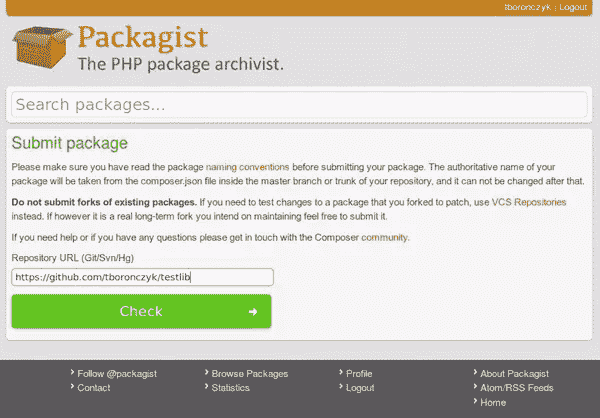
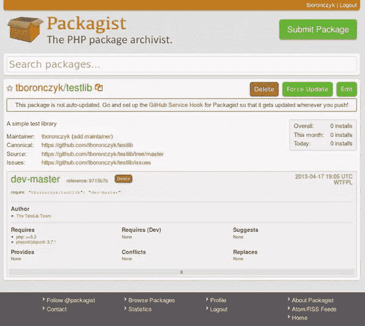
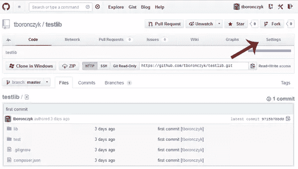
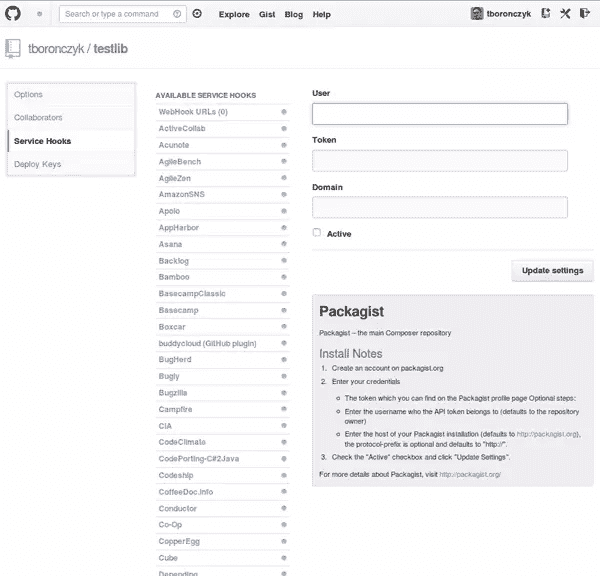

# 在 Packagist for Composer 上列出软件包

> 原文：<https://www.sitepoint.com/listing-packages-on-packagist-for-composer/>

到目前为止，我相信您已经亲眼看到了 Composer 如何帮助管理依赖关系；我自己也越来越喜欢它，在 GitHub 上为我们的文章下载代码示例时使用了它。如果读者愿意，他们可以在 GitHub 上仔细阅读相关的源代码，快速的`git clone`和`composer install`可以让他们获得代码以及在本地使用代码所需的所有依赖项。但是更上一层楼呢？

您已经创建了一个非常棒的库，现在您准备开源它并与世界共享。希望其他人可以从你的工作中受益，也许你甚至会收到一个错误报告或补丁来使库变得更好。但是，除非人们能找到它，否则这一切都不会发生……现代方式正越来越多地通过作曲家和包装家来实现。

在本文中，我将向您展示在您的`composer.json`文件中需要什么信息，以及如何在 Packagist 上列出您的库，以便其他人可以很容易地找到它。

## composer.json 文件

[Composer 的文档](http://getcomposer.org/doc/02-libraries.md#libraries "Composer")声明每个项目都是一个包。的确，你的项目在 Composer 眼里只是一个匿名的包，不管是库，成熟的应用，还是介于两者之间的其他东西。

> 一旦目录中有了 composer.json，该目录就是一个包。[…]您的项目和库之间的唯一区别是您的项目是一个没有名称的包。

因此，重要的第一步是为您的包设置一个名称。包名由厂商名和项目名组合而成，例如 *psr/log* 或 *laravel/framework* 。您应该使用什么作为您的供应商名称？一个不错的选择是你的 GitHub 用户名。

虽然这是您真正需要的，但是在您的库的`composer.json`文件中指定一些附加信息是一个好主意，比如包的简要描述、它的主页、许可证和作者信息。

```
"name": "tboronczyk/testlib",
"description": "A simple test library",
"homepage": "https://github.com/tboronczyk/testlib",
"license": "WTFPL",
"authors": [
    {
        "name": "The TestLib Team",
        "homepage": "https://github.com/tboronczyk/testlib/graphs/contributors"
    }
]
```

我见过许多项目为每个作者列出多个单独的条目，可能是因为这就是文档中的[作为一个例子，但我更喜欢上面的做法，将名称作为一个团队列出，并提供一个到 GitHub 上贡献者图表的链接，这样每个人都可以获得荣誉，你也不必经常更新你的`composer.json`文件。](http://getcomposer.org/doc/04-schema.md#authors "Composer")

为您的库指定需求也很重要。我们熟悉的`require`部分列出了我们代码所依赖的其他包，显然，如果你的库有第三方依赖，这也不会改变。但是它也可以用于指定“平台包”。

平台包不是可通过 Composer 安装的实际包，而是指定执行环境要求的一种方式，例如所需的 PHP 最低版本或所需的任何 PHP 扩展。

```
"require": {
    "php": ">=5.3",
    "ext-zip": "*",
    "ext-fileinfo": "*",
    "phpunit/phpunit": "3.1.*"
}
```

## Packagist 上的列表

一旦你把你的库代码提交给 GitHub，你会想把它列在 Packagist 上，这样其他人就可以找到它并轻松下载。幸运的是，Packagist 使得宣传您的库变得非常容易。
 [前往 packagist.org](http://packagist.org "Packagist")，点击右上角巨大的绿色提交包按钮。如果您还没有登录，您将首先被带到一个登录表单，但是最终您将到达包提交页面。



在 GitHub 上输入您的项目的 URL，然后单击 Check 按钮。Packagist 将验证地址，然后提供一个巨大的提交按钮供您点击。瞧啊。就这么简单。

Packagist 在 GitHub 存储库中搜索分支和`composer.json`文件，并在库的包页面上显示信息。



请允许我提醒您注意软件包页面上的通知，该通知警告您软件包不会自动更新，因为您没有在 GitHub 上启用 Packagist 挂钩。自动更新是一件好事，因为当你更新代码并提交给 GitHub 时，Packagist 会提供最新的版本。所以，让我们把这个搞定。

首先，点击 Pacakgist 右上角的用户名链接，进入您的帐户页面。在那里，您将找到您的 API 令牌，以及关于设置服务挂钩的简要说明。

其次，在 GitHub 上打开你的库页面，点击 Settings 菜单项。



从侧面菜单中选择服务挂钩，从挂钩列表中选择 Packagist，然后在表单中提供您的信息。您肯定需要提供列在您的 Packagist 帐户页面上的 API 令牌，以及您在 Packagist 上的用户名(如果它与您的 GitHub 用户名不同),但是您可以将域字段留空。然后点击“激活”复选框并提交详细信息。



## 结论

在 Packagist 上列出您的包，以便其他开发人员可以通过 Composer 轻松下载它是很容易的，尽管许多人可能认为这很难，因为他们以前从未这样做过。希望这篇文章能够帮助您将 Composer 的使用提升到一个新的水平，因为它实际上只不过是为包提供一个名称并单击一个巨大的绿色按钮。现在，请继续与全世界分享您一直努力编写的伟大代码吧！

<small>图片 via[Fotolia](http://us.fotolia.com/?utm_source=sitepoint&utm_medium=website_link&utm=campaign=sitepoint "Royalty Free Stock Photos at Fotolia.com")</small>

## 分享这篇文章