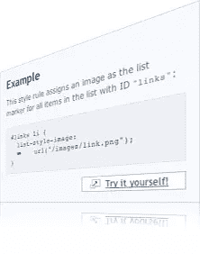

# 现场演示:SitePoint CSS 参考是交互式的

> 原文：<https://www.sitepoint.com/live-demos-the-sitepoint-css-reference-goes-interactive/>

 广受欢迎的 [SitePoint CSS 参考](https://reference.sitepoint.com/css/)今天在其已经令人印象深刻的列表中增加了一个令人兴奋的功能——**现场演示**。

这是我们最近的读者调查中最常要求的功能之一。众所周知，许多初学 web 开发的人通过*做*学得最好。现在，网络上最全面的 CSS 参考资料附带了一个沙箱，您可以在其中实时进行实验和学习。

才华横溢又极具争议的[詹姆斯·爱德华兹](https://www.sitepoint.com/blog/)不仅是代码背后的大脑，也是示例标记中包含的一些古怪内容的大脑(如果你理解所有晦涩难懂的歌词、书籍引用或科幻电影中的俏皮话，那么你比我做得更好！).

我们今天刚刚推出这款产品，所以可能还有一些问题需要解决。请在这篇文章的评论中告诉我们(或者，如果它与某个特定的页面相关，请在参考网站的页面上告诉我们)。

[自己试试吧！](https://reference.sitepoint.com/css/text-transform/demo)

## 分享这篇文章