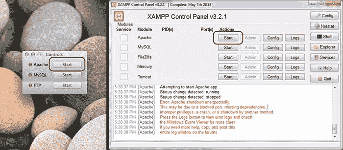
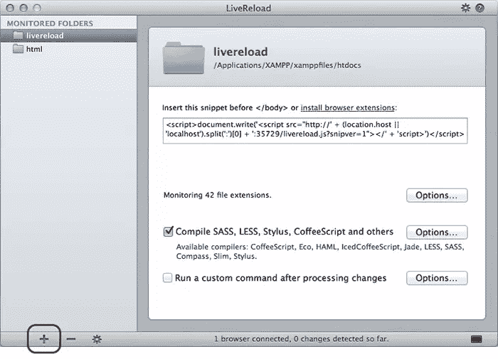
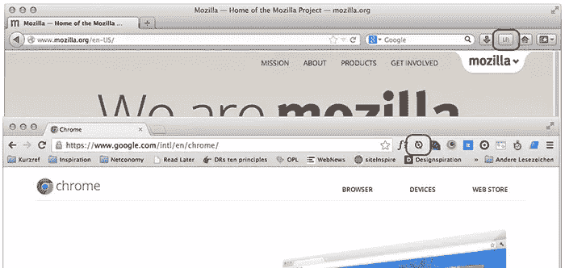
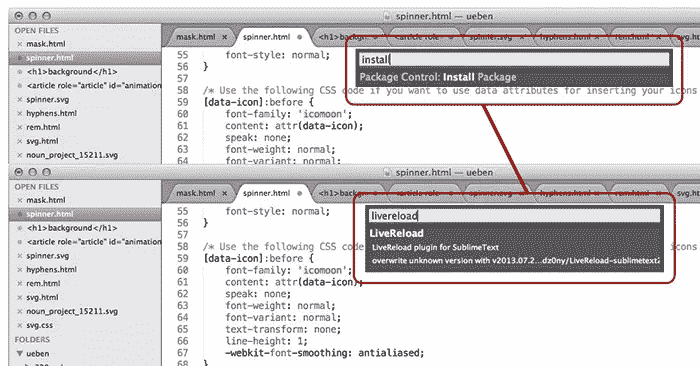
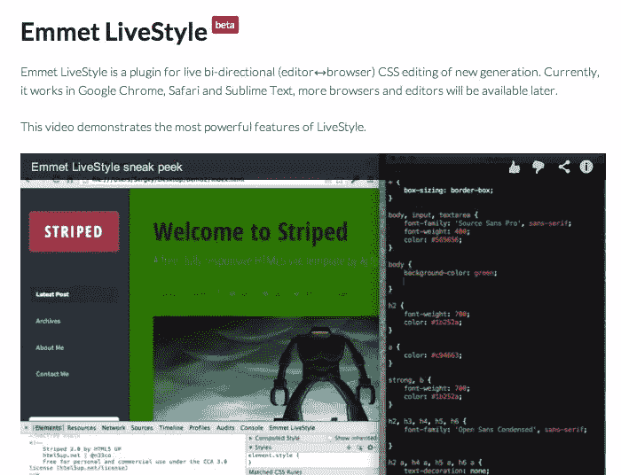

# 肝负荷

> 原文：<https://www.sitepoint.com/livereload/>

回想一下:你有多经常手动重新加载一个网站来查看代码编辑器中刚刚做出的更改？数百次，也许数千次，如果你进入网络业务时间长一点的话。

这种行为似乎是我们与生俱来的，我们不会对此提出质疑。然而，这可能很容易。有一个叫 LiveReload 的小工具，只要我们一保存它，它就会神奇地为我们重新加载一个网页。您可能听说过它，但从未尝试过，因为该设置可能会有一些陷阱。下面的指南将展示如何启动和运行 LiveReload，并最终让 CMD + R(分别是我们的 Windows 朋友的 F5)休息一下。

## 这是简单的事情

最简单的缓解方法是在 Mac App Store 中找到的同名应用程序，这里强调的是“Mac ”,因为该程序在最终版本中仅适用于该操作系统。你也可以在网站上找到 Windows 的 alpha 版本，但我从未测试过。然而，下面描述的工作流程应该或多或少是相同的。此外，奢侈的 LiveReload 应用程序确实有它的价格，因为它的价格为 8.99 欧元(6.99/9.99 美元)。

幸运的是，正如生活中经常发生的那样，有一种替代方式——也许没有那么奢侈，还需要一点汗水，但完全像付费应用程序一样有效。LiveReload 也可以直接在每个人最喜欢的代码编辑器 Sublime Text 2 和其他一些编辑器中使用(所有支持的编辑器列表可以在这里找到，但是我将代表前者向您展示如何使用该插件。

## 需要 web 服务器

无论你选择哪种应用，在日常工作流程中一般有两种方式使用 LiveReload。他们每个人都需要一些准备，但他们并不困难。最有效的方法——尽管对初学者来说听起来很复杂——是建立一个网络服务器。这样，您不需要修改项目文件来添加 LiveReload 行为。最简单的方法是抓取一份 XAMPP ( [Mac](http://www.apachefriends.org/en/xampp-macosx.html#849) ， [Windows](http://www.apachefriends.org/en/xampp-windows.html#641) )并运行安装程序。

之后，找到“htdocs”目录，通常可以在 Mac 上的“/Applications/XAMPP/xampp files/htdocs”和 Windows 上的“xampp\htdocs”中找到，在那里创建一个新文件夹，并将网站的文件放入其中。现在你只需要在控制面板上点击 Apache 的“开始”按钮来启动 web 服务器。您的网站现在应该可以在 http://localhost/ <foldername>访问，其中</foldername> <foldername>代表您刚刚创建的文件夹的名称。</foldername>


*xamp 控制面板。Mac(左)，Windows(右)*

## 别忘了你的分机

相信我，从现在开始事情会变得容易得多。接下来你需要安装的是 LiveReload 浏览器扩展，你可以在这里找到 Chrome 浏览器的和 Firefox 浏览器的(没错，没有 IE)。现在只需点击窗口左下角的加号，将 LiveReload 应用指向安装 XAMPP 后你放文件的文件夹。


*点击+号添加项目。*

然后从上面打开 web 服务器的 localhost URL，并通过单击相关的符号启用 LiveReload 扩展(如下面的截图所示)。回到 LiveReload 应用程序，它现在应该在底部显示类似于“1 个浏览器连接，目前检测到 0 个变化”的内容。一旦你改变了你网站的一个文件——不管它是 HTML、CSS 还是 JavaScript——这些改变应该立即在浏览器中反映出来。


*火狐(上)和 Chrome(下)中 LiveReload 扩展的按钮。*

## 请接代码编辑器

如果您更愿意呆在您习惯的代码编辑器环境中——在这种情况下是 Sublime Text 2，我将在这里使用它作为示例——实现会有一点不同。首先你需要安装基本的软件包管理器软件包控件，它只需要在控制台中输入一些代码(Sublime Text 2 菜单栏中的“查看>显示控制台”)。确切的安装过程可以在[这里](https://sublime.wbond.net/installation#st2)找到。

重新启动编辑器后，按 CMD + Shift + P(对于 Windows 为 CTRL + Shift + P)打开一个包控制提示符，键入“Install”,“Package Control:Install Package”应该立即突出显示。然后点击回车，等待几秒钟加载，写“LiveReload”，选择出现的条目，再次点击“回车”，插件就安装好了。现在再次重新启动 Sublime Text 2，就像在原生应用程序中一样，你只需要从上面输入本地主机 URL 到你的浏览器中，通过点击它启用 LiveReload 插件，从现在开始你的项目文件的每一个改变都直接反映在你的浏览器中，而不需要重新加载。


*在包控制命令提示符下键入什么。*

## 简单多了

如果所有这些对你来说太复杂了，还有第二种使用 LiveReload 的方法，我在上面承诺过。设置起来要简单得多，但缺点是需要在项目的每个 HTML(或 PHP 或其他)页面中插入一个小脚本(浏览器插件会在第一个方法中为您处理)。看起来是这样的:

```
<script>document.write('<script src="http://' + (location.host || 'localhost').split(':')[0] + ':35729/livereload.js?snipver=1"></'
+ 'script>')</script>
```

如果您的网站运行在另一台服务器上，您需要指定本地计算机的 IP 地址。例如:

```
<script src="http://192.168.0.1:35729/livereload.js? snipver=1"></script>
```

将它插入到结束的`标签之前，就万事俱备了。是的，都准备好了。你可能会想“比 web 服务器和浏览器扩展的麻烦要容易得多”，但是并不是每个项目都允许在每个页面上插入一些不需要的东西。但是哪里有阴影，哪里就有光明(或者反之亦然？).如果你喜欢 LiveReload 的脚本方法，你有一个很大的好处:除了你的开发机器之外，其他设备也可以进行实时修改——然而，这可能又需要一个 web 服务器。很想知道怎么做吗？找出你的电脑的 IP 地址，并将其输入到你的设备中，包括你的项目的(网络服务器)路径。现在，如果你改变一个文件，差异也会神奇地出现在你的(移动)设备上。很甜蜜，是吧？`

 `script 方法适用于 LiveReload 应用程序以及 Sublime Text 2(或任何其他支持的编辑器)。为了完整起见，我还想提一下，它可以与浏览器扩展结合，尽管这没有多大意义，因为脚本已经注意到 LiveReload 可以在任何环境下工作。

## 预处理器魔术

但是 LiveReload 还能提供更多。它是 SASS 的完美伴侣，似乎每个人都在使用的最受欢迎的 CSS 预处理器。编译器不仅在您保存主 SCSS 文件时被触发，而且在您编辑部分文件(包含文件)时也被触发。设置可能有点复杂，取决于你想要使用的 LiveReload 的类型，因为`config.rb`文件需要驻留在应用程序项目的主目录中，如果你使用 Sublime Text 2 插件，则驻留在 SASS 目录中。除此之外，你还可以用它来编译 CoffeeScript，Eco，HAML，IcedCoffeeScript，Jade，LESS，Compass，Slim 和 Stylus。

如果这些还不能说服你，我可能还有东西给你。最近发布了一个非常可爱的叫做 LiveStyle 的包，它支持双向编辑。这不仅意味着你在编辑器中所做的更改可以在浏览器中立即看到，反之亦然。

使用开发人员工具所做的更改也会在您的编辑器中更新。你甚至不需要保存文件。看这个，惊叹。

[//www.youtube.com/embed/iQLhGbkupS4](//www.youtube.com/embed/iQLhGbkupS4)

不幸的是，LiveStyle 只支持普通的 CSS(没有 SASS 之类的)，并且只支持 Google Chrome、Safari 和 Sublime Text(更多的浏览器和编辑器即将推出)。但它是免费的(到目前为止)。


*LiveStyle 插件。*

正如你所看到的，有几种方法可以让浏览器的重载键休息一下。起初，LiveReload 的设置可能看起来令人生畏，但一旦一切运行起来，你就不会回头了。这只是一个小工具，但会大大提高你的生产力。

## 分享这篇文章`