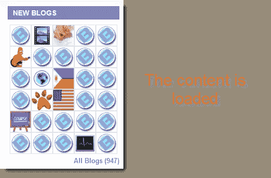

# 使用 AJAX 动态加载框内容

> 原文：<https://www.sitepoint.com/load-box-content-dynamically-ajax/>

这就是如何创建页面框元素的方法，页面框元素通过 AJAX 加载，无需重新加载整个页面就可以立即刷新。它结合使用了 jQuery 和 JavaScript 代码。这有点像 facebook 内容框加载器，但我自己从头开始编码。

## 使用这种 AJAX 方法的优点

*   页面加载速度更快，因为它在 DOM 准备好之后加载内容框
*   框中的内容可以在不重新加载整个页面的情况下重新加载
*   所有的网站都在朝这个方向努力，比如 facebook，twitter，odesk 等等
*   无需任何进一步的 CSS 或 JavaScript 编码就可以添加新的框

## 它是如何工作的




*   网页加载后，jQuery 为每个要加载的框调用一个 AJAX 函数
*   将显示加载消息
*   服务器端脚本(如 PHP)文件返回框的 HTML
*   内容被加载到网页上的框中
*   当用户悬停在框上时，内容可以很容易地重新加载，刷新图像将出现，一旦单击，内容将刷新

[看现场演示](http://blogoola.com)
[下载源文件](https://www.sitepoint.com/wp-content/uploads/jquery4u/2011/01/ajax-demo.zip)

## 它是怎样一种动力？

每个框都是一个 div，包含唯一标识该框的 id 属性。这个 div 中每个元素都是用 div 的 id 命名的。jQuery 获取这个 id，并使用它来匹配服务器端脚本(如 PHP ),匹配盒子的 id 并被加载。这使得它是动态的，因为所有变量都是基于盒子的 id 创建的。

## jQuery 代码

该函数在网页加载后加载，并初始化附加事件使用的框。

```
jQuery(document).ready(function($) {
	//event to show the box controls when the mouse hovers the box
	//applies to all elements with class="box"
	$('.box').mouseover(function(){
		//replace string "box" with "controls"
		var dyn_var = "#" + this.id.replace("box","controls");
		$(dyn_var).show();
	});

	//initialize box controls
	$('.box .controls').hide(); //hide all box controls

//hide box when mouse exits box
	$('.box').mouseout(function(){
		$('.box .controls').hide();
	});

	//load box content (loads after page loads)
	loadboxcontent('box-id1');
	loadboxcontent('box-id2');
	//etc...
});
```

该函数获取 div 的 id，并使用 id = box_id 参数将内容加载到子 div 中。它可以应用于任何 box 控件，因为它动态地创建 js 变量来拾取对象。

div 容器 id = box_id
php 脚本名称= box_id.php

```
function loadboxcontent(box_id){
	//perform an initial check to see if box_id has been supplied
	if (box_id == '') { return false; }

//show loading image
	var loading_imageimg/loader.gif"; //Full URL to "loading" image.
	var loading_text = '

正在加载'+box_id.replace(/-/g，" " "+'...

';
	var script_path = "../php/"; //path to server side script
	var box_container = document.getElementById(box_id);
	box_container.innerHTML = loading_text;

	//record the result of the AJAX request
	//(async = false) they load in order and wait until the previous is finished
	//(async = true) they all load at the same time
	var result = false;
    $.ajax({
      url: script_path+box_id+".php",
      type: 'POST',
      async: true,
      data: {blogs: 30},
      success: function(data) {
      	 result = true;
      	 document.getElementById(box_id).innerHTML = data;
      }
    });
    if (result == false) { document.getElementById(box_id).innerHTML = '

无法刷新数据，请尝试刷新页面

'; }
    else {  alert("Content refreshed successfully!");   }
}
```

## HTML 代码

## 盒子名称

```
 `[](javascript:loadboxcontent('new-blogs'))

## 新博客` 

## CSS 代码

```
.box { text-align:left; min-height:50px; margin:0px 0px 0px 0px; padding:0px 0px 0px 0px; border:1px #FFFFFF groove; }
.box:hover { background-color:#F2F2F2; border:1px #E4DFF4 groove; }
.box h2 { margin:0; padding:5px 0px 5px 10px; background-color:#8973C8; color:white; text-shadow:1px 1px 1px #A999D7; }
.box h2 a img { vertical-align:middle; }

/* BOX CONTROLS */
.box .controls { float:right; position:relative; top:5px; right:5px; }
.box .controls a { opacity:0.8; }
.box .controls a:hover { opacity:1.0; }
```

## 形象

*   Loader.gif

*   Refresh.png


```

## 分享这篇文章