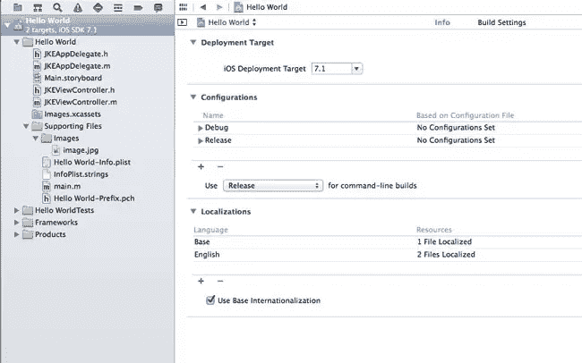
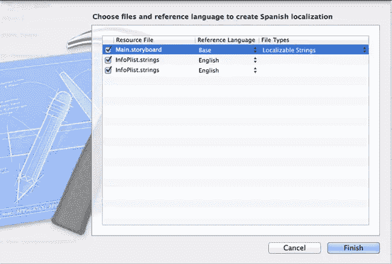
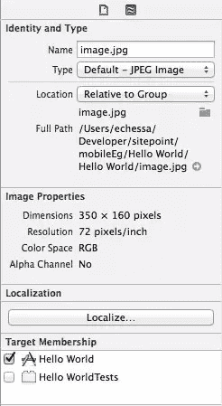
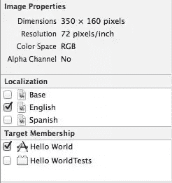
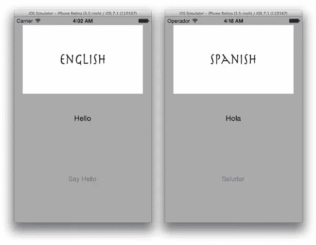
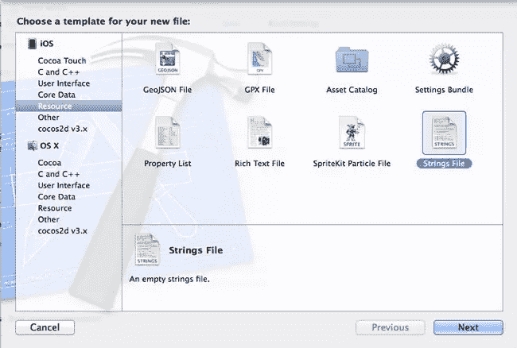
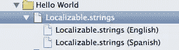
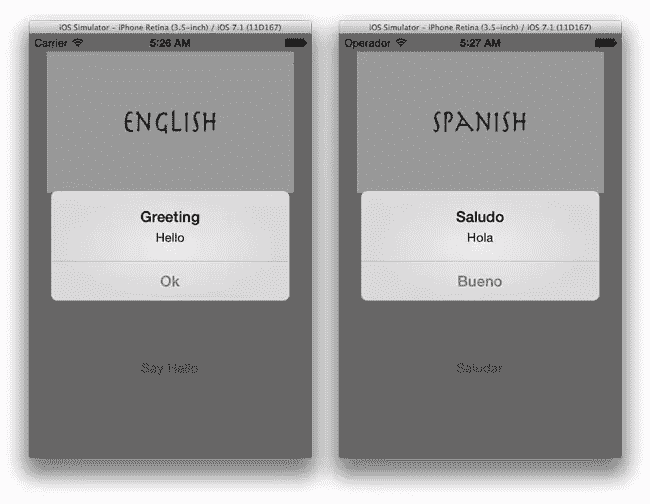

# 本地化 iOS 应用程序

> 原文：<https://www.sitepoint.com/localizing-ios-app/>

App Store 是一个全球市场。将国际用户纳入考虑范围，开发一款适应他们的应用，可以极大地提高你的市场影响力和/或你的业务增长。

不要强迫用户使用默认语言，你可以给他们一个应用程序，用他们的语言展示信息。有了这么多可以用来代替你的应用程序，适应国际受众可以在留住用户方面大有作为。

这是通过国际化和本地化实现的，这两个术语经常互换使用，其含义也经常混淆。

国际化是指通过不对任何特定于国家或文化的信息(如日期、货币、数字)进行硬编码来构建支持本地化内容的应用程序。

这是通过每当输出这种信息时利用系统提供的 API 来完成的，从而使应用程序适应不同的地区，而不需要任何额外的代码改变。

本地化是根据用户的语言设置在应用程序中提供适当的数据和资源的过程。

它不仅涉及将应用程序的文本翻译成不同的支持语言，还涉及为不同的支持语言和文化提供不同的资源，如音频文件、图像和 nib 文件。

这两项活动相辅相成。国际化提供了支持和促进本地化所需的基础设施。我们将看看如何在 iOS 应用程序中实现这两者。

## 国际化

国际化应用程序的第一步是识别它显示的所有特定于文化的信息。这包括货币、日期、数字等。

苹果提供了应该用来代替 harcoding 的类，这样如果你决定把你的应用发布到其他市场，你就不需要改变基础代码了。

通常建议从一开始就将你的应用国际化，即使你不打算本地化。构建一个国际化的应用程序并不需要太多额外的努力，但是国际化的回报是巨大的。

如果你的公司发展壮大，需要一个面向更多市场的本地化应用，你将很难本地化一个一开始就没有国际化的应用。

大量的代码更改和测试将是必要的，以确保没有特定于文化的信息被硬编码。如果应用程序已经国际化，将会有更少的代码重写和额外测试。

要国际化您的应用程序，您应该在输出日期、数字、字符串和文本时使用以下类和函数。

### NSDateFormatter

每当要显示日期时，就会使用`NSDateFormatter`。它有一个`locale`属性，该属性被设置为设备的当前区域设置。当使用`NSDateFormatter`创建日期时，它检查其`locale`属性并以适当的格式显示日期。

下面是展示如何使用`NSDateFormatter`的代码片段。我们在这里设置区域设置，但对于你的应用程序来说，这不是必需的，因为它将使用设备的区域设置。

```
NSDateFormatter *dateFormatter = [[NSDateFormatter alloc] init];
dateFormatter.dateStyle = NSDateFormatterMediumStyle;
dateFormatter.timeStyle = NSDateFormatterNoStyle;

NSDate *date = [NSDate date];

[dateFormatter setLocale:[[NSLocale alloc] initWithLocaleIdentifier:@"en_US"]];
NSLog(@"Date for locale %@: %@", [[dateFormatter locale] localeIdentifier], [dateFormatter stringFromDate:date]);

[dateFormatter setLocale:[[NSLocale alloc] initWithLocaleIdentifier:@"fr_FR"]];
NSLog(@"Date for locale %@: %@", [[dateFormatter locale] localeIdentifier], [dateFormatter stringFromDate:date]);

[dateFormatter setLocale:[[NSLocale alloc] initWithLocaleIdentifier:@"en_UK"]];
NSLog(@"Date for locale %@: %@", [[dateFormatter locale] localeIdentifier], [dateFormatter stringFromDate:date]);

[dateFormatter setLocale:[[NSLocale alloc] initWithLocaleIdentifier:@"de_DE"]];
NSLog(@"Date for locale %@: %@", [[dateFormatter locale] localeIdentifier], [dateFormatter stringFromDate:date]); 
```

下面是上面代码的输出。

```
Date for locale en_US: May 15, 2014
Date for locale fr_FR: 15 mai 2014
Date for locale en_GB: 15 May 2014
Date for locale de_DE: 15.05.2014 
```

在上面的例子中，我们手动设置了`NSDateFormatter`使用的语言环境。在实际应用中，您让设备的设置来决定这一点。在这种情况下，您可以通过更改手机设置中的区域格式来测试输出。转到`Settings -> General -> International -> Region Format -> [Select Region]`

### NSNumberFormatter

`NSNumberFormatter`用于货币值和数字格式的国际化。在不同的国家，数字和货币的格式通常不同。不要硬编码这些数字的格式，而是使用`NSNumberFormatter`，它将根据设备的地区显示这些数字。

下面的例子使用`NSNumberFormatter`根据不同的地区输出一个值。

```
NSNumberFormatter *numberFormatter = [[NSNumberFormatter alloc] init];
numberFormatter.numberStyle = NSNumberFormatterDecimalStyle;

[numberFormatter setLocale:[[NSLocale alloc] initWithLocaleIdentifier:@"en_US"]];
NSLog(@"Number format for locale %@: %@", [[numberFormatter locale] localeIdentifier], [numberFormatter stringFromNumber:@123456.789]);

[numberFormatter setLocale:[[NSLocale alloc] initWithLocaleIdentifier:@"fr_FR"]];
NSLog(@"Number format for locale %@: %@", [[numberFormatter locale] localeIdentifier], [numberFormatter stringFromNumber:@123456.789]);

[numberFormatter setLocale:[[NSLocale alloc] initWithLocaleIdentifier:@"en_UK"]];
NSLog(@"Number format for locale %@: %@", [[numberFormatter locale] localeIdentifier], [numberFormatter stringFromNumber:@123456.789]);

[numberFormatter setLocale:[[NSLocale alloc] initWithLocaleIdentifier:@"de_DE"]];
NSLog(@"Number format for locale %@: %@", [[numberFormatter locale] localeIdentifier], [numberFormatter stringFromNumber:@123456.789]); 
```

以下是上述代码的输出。

```
Number format for locale en_US: 123,456.789
Number format for locale fr_FR: 123 456,789
Number format for locale en_GB: 123,456.789
Number format for locale de_DE: 123.456,789 
```

除了格式化数字之外，`NSNumberFormatter`还格式化货币值。如果它的`numberStyle`属性被设置为`NSNumberFormatterCurrencyStyle`，它将输出带有适当的十进制分隔符(一个点或逗号)、千位分隔符(一个逗号或点)和货币符号的货币，这些符号将被正确放置(在一些国家，符号在值之前，而在另一些国家，符号在值之后)。

下面的代码片段使用`NSNumberFormatter`输出不同地区的货币值。

```
NSNumberFormatter *currencyFormatter = [[NSNumberFormatter alloc] init];
currencyFormatter.numberStyle = NSNumberFormatterCurrencyStyle;

[currencyFormatter setLocale:[[NSLocale alloc] initWithLocaleIdentifier:@"en_US"]];
NSLog(@"Currency format for locale %@: %@", [[currencyFormatter locale] localeIdentifier], [currencyFormatter stringFromNumber:@100000]);

[currencyFormatter setLocale:[[NSLocale alloc] initWithLocaleIdentifier:@"fr_FR"]];
NSLog(@"Currency format for locale %@: %@", [[currencyFormatter locale] localeIdentifier], [currencyFormatter stringFromNumber:@100000]);

[currencyFormatter setLocale:[[NSLocale alloc] initWithLocaleIdentifier:@"en_UK"]];
NSLog(@"Currency format for locale %@: %@", [[currencyFormatter locale] localeIdentifier], [currencyFormatter stringFromNumber:@100000]);

[currencyFormatter setLocale:[[NSLocale alloc] initWithLocaleIdentifier:@"de_DE"]];
NSLog(@"Currency format for locale %@: %@", [[currencyFormatter locale] localeIdentifier], [currencyFormatter stringFromNumber:@100000]); 
```

上面的代码将有如下输出。

```
Currency format for locale en_US: $100,000.00
Currency format for locale fr_FR: 100 000,00 €
Currency format for locale en_GB: £100,000.00
Currency format for locale de_DE: 100.000,00 € 
```

### NSLocalizedString

您应该将文本放入一个字符串文件(称为字符串文件是因为它的。strings 扩展名)并更新您的代码，以便从这些文件中加载所需的数据。如果您以后决定本地化应用程序，只需要翻译字符串，而不需要更改接口(并不总是这样，因为有些语言差异很大，所以您也需要本地化您的 nib 文件)。

为了从字符串文件中加载文本，我们使用`NSLocalizedString`。

`NSLocalizedString`是一个基础宏，用于获取字符串的本地化版本。它有两个参数——key 和 comment。该键唯一标识要本地化的字符串，注释指示使用该字符串的上下文。注释可以设置为`nil`，但是您可能希望包含一个描述性的注释，以供自己参考并帮助翻译。

要国际化代码中的字符串，请用`NSLocalizedString`函数替换文字字符串。例如代替下面的

```
NSString *string = @"Hello World"; 
```

你应该用

```
NSString *string = NSLocalizedString(@"HELLO", nil); 
```

在这里，您将得到一个包含以下内容的字符串文件

```
"HELLO" = "Hello World"; 
```

## 本地化

一旦我们有了一个适当的国际化应用程序，就很容易将其资源和用户界面翻译成我们想要的不同语言。这就是本地化。我们为每种语言提供适当的资源(文本、音频、图像、nib 文件等)。

为了了解他的工作原理，我们将本地化一个简单的应用程序。[下载](https://github.com/sitepoint-examples/Localizing-iOS---Hello-World)我们将在本教程中使用的 starter 项目。

下载的项目文件夹包含主项目 Hello World 和一个名为 image 的图像，我们稍后会用到。该应用程序有一个单一的视图，如下所示，带有一个图像，标签和一个按钮。


项目中的任何资源都可以本地化，无论是图像、音频文件、xib 文件还是故事板。当资源被本地化时，本地化的副本被添加到应用程序包中。资源放在特定于语言的目录中，称为 lproj 目录。这些目录被赋予以 lproj 为后缀的本地化名称。例如，英语的`en.lproj`和西班牙语的`es.lproj`。

本地化代码是语言代码和可选区域代码的组合。对于语言代码，您可以使用 ISO 639-1 或 ISO 639-2 公约。ISO 639-1 是识别语言的首选方式。然而，如果 ISO 639-1 码不适用于特定的语言，则可以使用由 ISO 639-2 规范定义的三个字母的代码。

对于区域代码，您可以使用 ISO 3166-1 公约。该规范使用两个字母的大写代码来标识特定的国家。这是可选的。[点击此处](http://www.loc.gov/standards/iso639-2/php/English_list.php)查看语言代码的完整列表。

我们将首先本地化我们的界面，Main.storyboard 文件。Xcode 有一个称为基本国际化的特性，它简化了本地化 XIB 和故事板文件的过程。Xcode 不是为你想支持的每种语言创建故事板或 XIB 文件，而是创建一个包含主要故事板或 XIB 文件的`Base.lproj`目录。

这样，就可以通过创建 Localizable.strings 文件来进行本地化。对于那些视图不能通过仅本地化字符串来更改的语言，您可以创建完整的 XIB 或故事板文件。

首先，单击左侧面板上的 Hello World 项目文件夹，选择下一个面板上的 Hello World 项目，然后单击 Info 选项卡。请注意，默认情况下，基本国际已启用。



在本地化部分，单击+并选择西班牙语。在弹出的窗口中单击 Finish 按钮，选择如下所示。



在 project navigator 中，您会注意到`Main.storyboard`和`InfoPlist.strings`现在可以展开了。展开故事板文件，您会发现基本故事板和一个西班牙语字符串文件。

`Main.strings (Spanish)`文件包含一个键/值对的字符串列表。Xcode 从界面上的文本元素生成这些字符串。键与 UI 项的对象 id 相关，值是应该翻译的字符串。

我们的`Main.strings (Spanish)`文件包含以下内容:

```
/* Class = "IBUILabel"; text = "Hello"; ObjectID = "Fg0-t0-XFF"; */
"Fg0-t0-XFF.text" = "Hello";

/* Class = "IBUIButton"; normalTitle = "Say Hello"; ObjectID = "pr4-OE-zWY"; */
"pr4-OE-zWY.normalTitle" = "Say Hello"; 
```

编辑文件，如下所示

```
/* Class = "IBUILabel"; text = "Hello"; ObjectID = "Fg0-t0-XFF"; */
"Fg0-t0-XFF.text" = "Hola";

/* Class = "IBUIButton"; normalTitle = "Say Hello"; ObjectID = "pr4-OE-zWY"; */
"pr4-OE-zWY.normalTitle" = "Saludar"; 
```

这就是我们定位视图文本的目的。要本地化图像，在项目导航器`Supporting Files -> Images -> image.jpg`中选择图像文件。在右边的文件检查器中，点击本地化按钮。



在出现的对话框中，选择英语。确认后，文件检查器上的本地化部分将显示英语为选中状态。选中西班牙语复选框。



现在，您应该在项目导航器上看到英语和西班牙语版本。目前，西班牙形象是英国形象的完全相同的副本。

要更改这一点，在 Finder 中，找到您为本教程下载的 starter 项目中名为 image 的图像文件。将它复制到项目的`Hello World/es.lproj`目录中，替换那里的图像。

您应该注意到，不同 lproj 目录的资源应该与它们的对应资源具有相同的名称。

运行应用程序，将设备语言更改为西班牙语后，您将看到视图语言已翻译，图像也已更改。更改语言设置的路径:`General -> International -> Language -> Espanol`。



要查看更改，您可能需要重置模拟器并进行一次干净的构建。要重置模拟器，导航至菜单栏中的`iOS Simulator -> Reset Content and Settings`。要进行全新构建，请导航到 Xcode 菜单栏中的`Product -> Clean`。

我们已经在应用程序中本地化了静态资源。我们现在来看看如何本地化动态文本。我们将使用前面看到的`NSLocalizedString`宏从字符串文件中加载文本。

转到`File -> New -> File`。选择资源子部分下的`Strings File`。



点击`Next`，将文件命名为`Localizable.strings`，然后保存。

默认情况下，`NSLocalizedString`会查找名为`Localizable.strings`的文件。因此，坚持这种命名约定很重要，否则您将不得不键入。每次引用本地化的字符串时，都会生成字符串文件。

本地化这个文件将类似于我们如何本地化图像文件。在项目导航器中选择`Localizable.strings`,在文件检查器中点击本地化按钮。

在出现的对话框中选择英语。

在字符串文件仍处于选中状态的情况下，选中文件检查器的“本地化”部分中的“西班牙语”复选框。

你现在应该有两个版本的`Localizable.strings`文件。



将以下内容放入英文字符串文件中。

```
"TITLE" = "Greeting";
"GREETING" = "Hello";
"OK" = "Ok"; 
```

在西班牙语字符串文件中，将。

```
"TITLE" = "Saludo";
"GREETING" = "Hola";
"OK" = "Bueno"; 
```

我们希望在按下 Say Hello 按钮时出现上述消息。为按钮创建一个名为`sayHello`的动作。(我假设读者知道如何做到这一点。如果不是[看这个指南](https://developer.apple.com/library/ios/recipes/xcode_help-interface_builder/articles-connections_bindings/CreatingAction.html)。如下所示编辑`JKEViewController.m`文件。

```
- (IBAction)sayHello:(UIButton *)sender {

    [[[UIAlertView alloc] initWithTitle:NSLocalizedString(@"TITLE", nil)
                                message:NSLocalizedString(@"GREETING", nil)
                               delegate:nil
                      cancelButtonTitle:NSLocalizedString(@"OK", nil)
                      otherButtonTitles:nil] show];
} 
```

运行应用程序并测试它。您应该会看到类似下图的结果。(如果您在运行项目时没有看到预期的变化，请重置模拟器并按照前面的描述进行干净的构建)。



要本地化应用程序名称，请将以下字符串添加到`InfoPlist.string (Spanish)`文件中:

```
"CFBundleDisplayName" = "Hola Mundo"; 
```

### 自动布局

自动布局是在 iOS 6 中引入的，是本地化应用程序时使用的一项重要功能。在自动布局之前，开发人员使用坐标和边界来设置应用程序的用户界面，界面是静态的，不可更改的。

使用自动布局，您可以在 UI 视图上设置约束，这些视图描述了它们之间的关系。在运行期间，自动布局系统确定如何使用设置的约束来布局每个视图。这创建了适应不同屏幕尺寸(例如，3.5 '或 4.0 ' iPhone)、方向和文本尺寸(由于动态类型，文本尺寸现在是可变的)的灵活布局。

这对于国际化很重要，因为不同语言的文本长度是不同的。如果您对显示文本的视图进行布局，它们可能会大大扩展以容纳其他语言的文本(或者它们可能会比基本语言占用更少的空间)。如果使用自动布局，其他视图将根据您如何设置约束来适应这种变化。

我们不会在这里详细讨论自动布局，但是一定要查看文档。

## 结论

我们已经研究了应用程序本地化的方法，从而使它对不同地区的用户可用并有吸引力。app store 为开发者提供了进入全球市场的途径。在开发你的应用时考虑国际市场可以极大地增加你的市场覆盖面。关于本地化的更多信息，[查看苹果指南](https://developer.apple.com/library/ios/documentation/MacOSX/Conceptual/BPInternational/BPInternational.html#//apple_ref/doc/uid/10000171-SW1)。

## 分享这篇文章