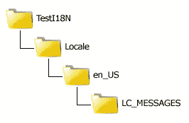
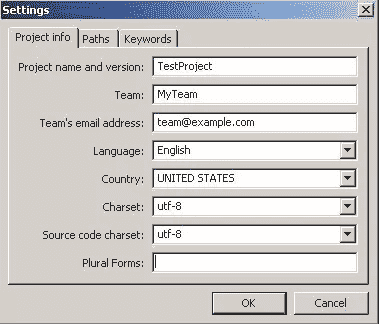

# 本地化 PHP 应用程序“正确的方法”，第 1 部分

> 原文：<https://www.sitepoint.com/localizing-php-applications-1/>

世界各地的新观众每秒都在访问互联网，他们中的大多数人会很高兴地发现你的内容是用他们的母语写的。你可能认为你只需要一个好的翻译来翻译你网站的用户界面，这是一个简单的任务，因为现在很容易找到一个，但更大的挑战不是翻译或编写多语言内容…而是在幕后编写代码。

通常，本地化软件应用程序是一项繁琐且容易出错的任务，会产生大量杂乱的代码。一些开发人员甚至为同一应用程序使用不同版本的代码，但是用于不同的地区，这使得管理代码库实际上是不可能的。进入 gettext，这是一个非常棒的开源工具，通过让您专注于代码，它会让您的生活变得更加轻松。本地化变成了为目标语言编写单独的翻译文件，这可以由翻译人员使用 Poedit 轻松完成。如果你精通 gettext for PHP，你会发现扩展你的应用程序的全球范围真的只是一个翻译的问题！

在这一系列文章中，您将学习如何获取文本来本地化您的 PHP 应用程序。第 1 部分将简要介绍 gettext。每个后续部分都将建立在前面的部分之上，教您如何处理多个翻译域、复数形式，甚至如何自动化一些本地化过程。

## 准备环境

在我开始学习新东西之前，我更喜欢确保我的环境设置正确，因为正确设置和运行一切可以更容易地一步一步测试我学到的东西。下面是您在继续下一步之前需要安装的东西的清单:

*   Apache 上的 PHP 5.x(或任何您喜欢的 web 服务器)，启用 gettext 扩展。你可以在 www.php.net 的[获得你平台的最新 PHP。](http://www.php.net/ "PHP: Hypertext Preprocessor")
*   Poedit，gettext 目录的跨平台编辑器。这是一个非常好的工具，可以让你把翻译和应用程序代码分开。你可以从 www.poedit.net 那里得到一份拷贝

不管您使用什么平台，要使用 PHP 中的 gettext，您需要安装 gettext 库和与该库挂钩的 PHP 扩展。

Ubuntu/Debian 用户可以使用`apt-get`，Fedora/CentOS/Redhat 用户可以使用`yum`安装 gettext 库。如果你使用的是另一个类似 unix 的系统，去 www.gnu.org/s/gettext 的[下载一份与你的平台兼容的 gettext。Windows 用户可以从 gnuwin32.sourceforge.net/packages/gettext.htm 的](http://www.gnu.org/s/gettext "gettext - GNU Project - Free Software Foundation (FSF)")[下载并安装最新的可执行文件。](http://gnuwin32.sourceforge.net/packages/gettext.htm "GetText for Windows")

安装完这个库之后，您需要通过编辑`php.ini`并添加一行代码来启用 gettext 的 PHP 扩展:

```
# for Windows users
extension=php_gettext.dll
# for *nix users
extension=gettext.so
```

然后，安装稍后会用到的 Poedit。你可以从 www.poedit.net 下载一份。

## 带 gettext 的 Hello World

在你的 web 根目录下，创建一个用于玩 gettext 的沙盒目录，名为`TestI18N` (I18N 代表国际化)。在`TestI18N`目录中，创建以下层次结构:



在未来的项目中，你可以随意命名父目录和`Locale`目录，但是`en_US`和`LC_MESSAGES`是 gettext 使用的标准名称。`en_US`代表地区的名称，由两部分组成。根据 ISO 639-1 规范，第一部分是该语言的两个字母的小写缩写。根据 ISO 3166-1 alpha-2 规范，下划线后的第二部分是两个字母的大写国家代码。`en_US`因此意味着这种语言是美国所说的英语。

接下来，确保 Poedit 在您的平台上正常工作。启动程序，从顶部菜单栏选择`File` > `New Catalog`。在设置窗口中，填写下面的信息，暂时跳过复数形式字段:



点击`OK`，然后在你之前创建的`LC_MESSAGES`目录下将文件保存为`messages.po`。

现在关闭 Poedit，用自己喜欢的文本编辑器打开`messages.po` …没错，就是一个普通的文本文件！你可以手工编辑它，但是为了省事，我们让 Poedit 为我们创建主要的定义。在文件中已经存在的行之后保留一个空行，并添加以下内容:

```
#Test token 1
msgid "HELLO_WORLD"
msgstr "Hello World!"

#Test token 2
msgid "TEST_TRANSLATION"
msgstr "Testing translation..."
```

保存`messages.po`并关闭，然后在 Poedit 中重新打开。

在 Poedit 中，选择`File` > `Save`或点击图标栏中的保存目录条目。我们将 PO 文件保存在 Poedit 中的原因是因为它们需要被编译成 gettext 可用的特殊格式。在你把它保存到 Poedit 之后，你会看到一个新的文件已经在同一个目录下创建了，文件名相同，但是扩展名为`.mo`。如果您继续用常规文本编辑器修改和保存 PO 文件，您将需要使用`pocompile`命令来编译它。如果您使用 Poedit，额外的编译步骤是不必要的，因为它会在您保存文件时自动编译文件。

回到`TestI18N`目录，用下面的代码创建一个名为`test-locale.php`的文件:

```
<?php
// I18N support information here
$language = "en_US";
putenv("LANG=" . $language); 
setlocale(LC_ALL, $language);

// Set the text domain as "messages"
$domain = "messages";
bindtextdomain($domain, "Locale"); 
bind_textdomain_codeset($domain, 'UTF-8');

textdomain($domain);

echo _("HELLO_WORLD");
```

在浏览器中打开`TestI18N/test-locale.php`。如果一切安装正确，工作正常，你会看到页面上显示 *Hello World* 。

## 摘要

当谈到本地化您的 PHP 应用程序时，您可能有很多选择。我们选择使用 GNU gettext 库及其 PHP 扩展，这是一种强大而简单的方法，可以“以正确的方式”本地化应用程序在这一期中，您看到了安装 gettext 和 PHP 扩展需要什么，简单地使用了 Poedit，并用一个简单的 Hello World 脚本吊起了您的胃口。[第 2 部分](https://www.sitepoint.com/localizing-php-applications-2/ "Localizing PHP Applications “The Right Way”, Part 2")将以此为基础学习更多关于 gettext 的知识；我将解释 Hello World 脚本中引入的每个函数以及 gettext 库是如何工作的。

<small>图片 via[sgame](http://www.shutterstock.com/gallery-62870p1.html "Stock Photos | Shutterstock: Royalty-Free Subscription Stock Photography & Vector Art")/[Shutterstock](http://www.shutterstock.com "Stock Photos and Royalty-Free Images by Subscription")</small>

## 分享这篇文章