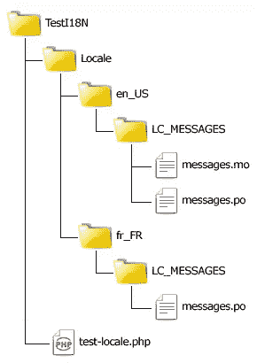
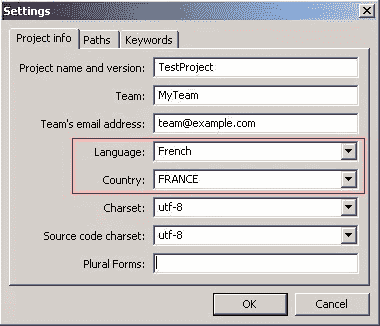

# 以“正确的方式”本地化 PHP 应用程序，第 2 部分

> 原文：<https://www.sitepoint.com/localizing-php-applications-2/>

欢迎回到本系列文章，它将教你如何使用 gettext 和它的 PHP 扩展来本地化你的 PHP 应用程序。在第 1 部分中，你已经朝着这个方向迈出了第一步，安装了 gettext 和 Poedit，创建了一个翻译文件，并编写了 Hello World 脚本。在这一部分中，您将了解脚本中使用的每个函数，并深入了解 gettext 库及其用法。

## “Hello World”脚本

回顾一下，第 1 部分向您展示了下面的脚本`TestI18N/test-locale.php`:

```
&lt;?php
// I18N support information here
$language = &quot;en_US&quot;;
putenv(&quot;LANG=&quot; . $language); 
setlocale(LC_ALL, $language);

// Set the text domain as &quot;messages&quot; to 
// use Locale/en_US/LC_MESSAGES/messages.mo
$domain = &quot;messages&quot;;
bindtextdomain($domain, &quot;Locale&quot;); 
bind_textdomain_codeset($domain, &quot;UTF-8&quot;);

// Use the messages domain
textdomain($domain);

echo _(&quot;HELLO_WORLD&quot;);
```

调用`putenv()`并设置`LANG`环境变量会指示 gettext 在这个会话中使用哪个语言环境。`en_US`是在美国使用的英语的标识符。根据 ISO 639-1 规范，区域设置的第一部分是两个字母的小写缩写，根据 ISO 3166-1 alpha-2 规范，第二部分是两个字母的大写国家代码。`setlocale()`指定应用程序中使用的语言环境，并影响 PHP 如何对字符串排序、理解日期和时间格式以及格式化数值。

gettext 将用于存储翻译消息的目录文件(MO 文件)称为*域*。`bindtextdomain()`函数告诉 gettext 在哪里找到要使用的域；第一个参数是不带`.mo`扩展名的目录名，第二个参数是到父目录的路径，父目录中有`en_US/LC_MESSAGES`子路径(这也是翻译文件所在的位置)。如果您想知道子路径`en_US/LC_MESSAGES`来自哪里，它是由 gettext 使用您使用`putenv()`和区域类别`LC_MESSAGES`指定的`LANG`变量的值构建的。如果您已经将翻译分成多个文件，您可以多次调用`bindtextdomain()`来绑定任意多个域。

调用`bind_textdomain_codeset()`非常重要，因为如果不这样做，在使用非 ASCII 字母时会导致输出中出现意外字符。由于目录消息是用 UTF-8 编码的，这就是示例代码设置的代码集。我总是推荐使用 UTF-8，因为它是最广泛支持的 Unicode 编码。不要使用其他鲜为人知的编码，除非你确切地知道你在做什么；你会遇到严重的问题，尤其是在网络上。

调用`textdomain()`告诉 gettext 哪个域用于对`gettext()`的任何后续调用，或者它的简写别名`_()`，或者它的复数形式查找方法`ngettext()`。我将在下一期讨论如何处理复数形式，但是现在你应该知道这三种方法都在用`textdomain()`指定的当前域中查找消息。

最后，脚本调用`_()`，它在`messages.mo`文件中查找 msgid `HELLO_WORLD`并返回与之相关的 msgstr，文本 *Hello World！*

## 缺少翻译字符串

现在，您已经对这个简单的脚本如何查找翻译的替换有了基本的了解，请尝试更改域。

```
&lt;?php
$language = &quot;en_US&quot;;
putenv(&quot;LANG=&quot; . $language); 
setlocale(LC_ALL, $language);

$domain = &quot;foo&quot;;
bindtextdomain($domain, &quot;Locale&quot;); 
bind_textdomain_codeset($domain, &quot;UTF-8&quot;);
// ...
```

gettext 将尝试查找不应该存在的目录`Locale/en_US/LC_MESSAGES/foo.mo`。

当你查看脚本的输出时，你会看到 *HELLO_WORLD* 而不是 *Hello World！* gettext 无法执行转换，因为没有有效的目录，尽管另一种情况可能是给定的 msgid 可能不存在于向 gettext 注册的任何目录中，并且它足够智能地使用您提供的原始字符串。

## 针对多个地区

在真实的应用程序中，您通常会在整个代码中使用目标语言的字符串作为 id。这使得代码更加清晰，翻译失败的回退也更加用户友好。例如，如果您的应用程序使用英语和法语作为目标语言，您可以使用英语作为 ID 字符串，然后创建法语目录来替换英语。

在同一个`TestI18N/Locale`目录中，创建一个名为`fr_FR`的新目录，其中包含另一个`LC_MESSAGES`目录，并使用第 1 部分中概述的过程为法语创建一个新目录。完成后，您应该有以下层次结构:



当您在 Poedit 中指定目录设置时，请记住将法语设置为语言，将法国设置为国家。



我的法语`messages.po`在文本编辑器中打开时会是这样的:

```
msgid ""
msgstr ""
"Project-Id-Version: TestProjectn"
"POT-Creation-Date: n"
"PO-Revision-Date: n"
"Last-Translator: FIRSTNAME LASTNAME <email@example.com>n"
"Language-Team: MyTeam <team@example.com>n"
"MIME-Version: 1.0n"
"Content-Type: text/plain; charset=utf-8n"
"Content-Transfer-Encoding: 8bitn"
"X-Poedit-Language: Frenchn"
"X-Poedit-Country: FRANCEn"
"X-Poedit-SourceCharset: utf-8n"

#Test token 1
msgid "HELLO_WORLD"
msgstr "Bonjour tout le monde!"

#Test token 2
msgid "TEST_TRANSLATION"
msgstr "Test de traduction..."
```

文件的大部分标题行都是不言自明的，所以我将直接跳到实际的翻译行，从标题后的第一个 msgid 开始。请注意，每个要翻译的短语有两个字符串，msgid 是代码 gettext 中将查找的 id 字符串，msgstr 是 gettext 将替换 ID 的已翻译消息。第一个定义指示 gettext 使用 *Bonjour tout le monde！*每当它看到`HELLO_WORLD`。第二个命令 gettext 对`TEST_TRANSLATION`使用 *Test de traduction…* 。

在 Poedit 中再次打开目录文件，单击图标栏中的 Save Catalog 条目保存并编译它。然后修改 PHP 脚本，用`fr_FR`代替`en_US`。当您运行它时，您会看到浏览器中的输出现在是法语！

## 摘要

在这一部分中，您了解了第 1 部分介绍的 Hello World 脚本中每个函数调用的作用。就其 API 而言，gettext 并不是一个真正的大型库。只有少数几个函数，其中大部分在整个应用程序中只使用一次。最常用的是`gettext()`，或者它的简写别名`_()`，以及它的复数形式等价物`ngettext()`。您还了解了如何定位多个地区(在我们的例子中是`en_US`和`fr_FR`)，以及 gettext 在缺少翻译时如何回退到 msgid。

在下一部分中，您将看到如何通过组织目录、在语言之间切换、选择备用语言和覆盖当前选定的消息域来开始进行真实世界的本地化。

图片 via[sgame](http://www.shutterstock.com/gallery-62870p1.html "Stock Photos | Shutterstock: Royalty-Free Subscription Stock Photography & Vector Art")/[Shutterstock](http://www.shutterstock.com "Stock Photos and Royalty-Free Images by Subscription")

## 分享这篇文章