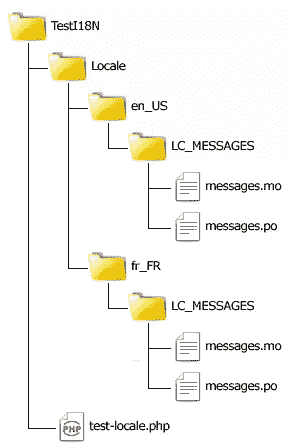
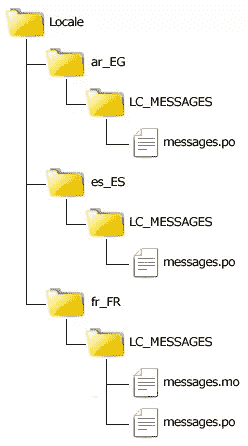

# 以“正确的方式”本地化 PHP 应用程序，第 3 部分

> 原文：<https://www.sitepoint.com/localizing-php-applications-3/>

在第 2 部分中，通过学习该扩展最重要的功能，您对使用 gettext 库有了更多的了解。在这一部分中，您将学习如何最好地使用后备语言环境，在语言环境之间切换，以及覆盖当前选择的消息域。所以事不宜迟，让我们开始吧！

## 目录结构和备用区域设置

如果您已经阅读了前面的文章，那么您应该有下面的目录结构来测试 gettext 库。虽然它是典型的，但它不是为实现最佳性能而设计的。



一般来说，您应该在深入本地化过程之前定义应用程序的默认语言/地区，因为这个决定将影响您如何创建核心域文件。例如，如果您决定使用美式英语作为默认语言环境——大多数人都这样做——那么您可能根本不会创建`en_US`目录！最好用 msgidss 创建每个目标域，这些 msgid 是在默认语言环境中找到的实际字符串。因此，您应该使用实际的英文字符串，而不是使用标识符“HELLO_WORLD”。

```
#Test token 1
msgid "Hello World!"
msgstr "Bonjour tout le monde!"
```

记住，如果 gettext 找不到翻译域，它将显示 msgid。所以这不是关于`en_US`目录本身，而是关于当用户请求默认区域设置时避免不必要的翻译。像这样使用真实的文本字符串可以节省执行时间和内存，因为不需要将英文翻译成英文，将“HELLO_WORLD”翻译成“Hello World！”。

虽然有些开发人员喜欢保留英语到英语的翻译，所以应用程序字符串(“HELLO_WORLD”)和界面文本(“Hello World！”之间有明显的区别)，我更喜欢这种后备方法。当然，你可以自由选择最符合你的需求和个人风格的。

删除了`en_US`目录后，我将添加应用程序可以定位的另外两个地区:西班牙语(`es_ES`)和埃及阿拉伯语(`ar_EG`)。这就是`Locale`目录现在的样子:



不要忘记使用[第 1 部分](https://www.sitepoint.com/localizing-php-applications-1)中概述的相同过程为每个域创建必要的翻译域。

法国域包含:

```
#Test token 1
msgid "Hello World!"
msgstr "Bonjour tout le monde!"

#Test token 2
msgid "Testing Translation..."
msgstr "Test de traduction..."
```

西班牙语域包含:

```
#Test token 1
msgid "Hello World!"
msgstr "¡Hola mundo!"

#Test token 2
msgid "Testing Translation..."
msgstr "Prueba de traducción..."
```

阿拉伯域包含:

```
#Test token 1
msgid "Hello World!"
msgstr "!أهلا بالعالم"

#Test token 2
msgid "Testing Translation..."
msgstr "...اختبار الترجمة"
```

看看所有目标域中的 msgids 实际上是来自`en_US`地区的字符串，因为您现在使用它作为默认设置，所以该地区被删除了。现在您有了一个包含翻译域的真实目录结构！

## 切换区域设置

在各种语言环境之间切换就像告诉 gettext 使用另一个域一样简单。通常情况下，您可以在应用程序文件的顶部实现这一点，或者将它放在一个公共文件中，该文件将包含在向浏览器发送输出的每个脚本中。

创建一个名为`locale.php`的新文件，内容如下:

```
<?php
// use sessions
session_start();

// get language preference
if (isset($_GET["lang"])) {
    $language = $_GET["lang"];
}
else if (isset($_SESSION["lang"])) {
    $language  = $_SESSION["lang"];
}
else {
    $language = "en_US";
}

// save language preference for future page requests
$_SESSION["Language"]  = $language;

$folder = "Locale";
$domain = "messages";
$encoding = "UTF-8";

putenv("LANG=" . $language); 
setlocale(LC_ALL, $language);

bindtextdomain($domain, $folder); 
bind_textdomain_codeset($domain, $encoding);

textdomain($domain);
```

然后打开`test-locale.php`脚本；删除域设置代码并包含新的`locale.php`文件。您的代码现在应该如下所示:

```
<?php
// Include I18N support
require_once "locale.php";

echo _("Hello World!"), "<br>";
echo _("Testing Translation...");
```

现在你已经准备好享受乐趣了！转到您的浏览器，您将获得以下输出:

```
Hello World!
Testing Translation...
```

更改 URL 以传入之前创建的一个语言环境，例如:`test-locale.php?lang=fr_FR`。gettext 将以法语或阿拉伯语显示输出，这取决于您为参数提供的内容。切换语言就是这么简单！

```
Bonjour tout le monde!
Test de traduction...

```

`locale.php`文件使用会话，因此您只需传递一次`lang`参数，它将用于用户的后续请求。如果你正在执行 URL 重写，另一种可能是让语言成为 URL 的一部分，并从那里提取出来，就像在`www.example.com/en_US/test-locale.php`中一样。

## 覆盖当前域

假设您想从一个文本域切换到另一个文本域。如果您使用单独的域来存储核心翻译和系统错误消息，这可能是需要的，例如，messages 将是主应用程序域，errors 将是错误字符串的域。您会发现函数`dgettext()`对于这种类型的设置非常有用。

`dgettext()`本质上与`gettext()`和`_()`相同，除了它接受域名作为查找翻译的第一个参数。这不影响由`textdomain()`设置的默认域；对`gettext()`的后续调用仍将使用默认值。

根据法语地区的错误名称(`TestI18N/Locale/fr_FR/LC_MESSAGES/errors.po`)创建一个新的翻译域。确保使用 Poedit 创建文件，然后使用文本编辑器打开它，并添加以下翻译:

```
Test Error 1
msgid "Error getting content"
msgstr "Erreur de l'obtention du contenu"

#Test Error 2
msgid "Error saving data"
msgstr "Erreur de sauvegarde des données"
```

保存`errors.po`，在 Poedit 中重新打开，编译到`errors.mo`。然后在`test-locale.php`的结尾加上以下几行:

```
<?php
echo "<br>";
echo _("Error getting content"), "<br>";
echo _("Error saving data");
```

当您运行`test-locale.php`脚本时，您将看到英文字符串，即使您将`lang=fr_FR`作为参数传递。这是因为您将这些消息添加到了不同的域中(`_()`正在使用消息域来查找翻译，因为这是用`textdomain()`设置的)。为了通知 gettext 在哪里可以找到新的翻译字符串，更新代码以使用`dgettext()`:

```
<?php
echo dgettext("errors", "Error getting content"), "<br>";
echo dgettext("errors", "Error saving data");
```

现在当你运行脚本时，你仍然可以看到英文信息！Hrm…为什么他们没有被取代？

事实上，我们刚刚犯了一个人们在使用 gettext 时经常犯的错误。如果您还记得，在第 1 部分中，我谈到了两个非常重要的方法，`bindtextdomain()`和`bind_textdomain_codeset()`，并提到您可以多次调用它们来绑定任意多的域。每当你需要使用一个域时，你必须先使用`bindtextdomain()`显式绑定它。gettext 只允许加载一个“主”域，它是使用`textdomain()`指定的域，也是由`gettext()`和`_()`使用的域。只有在其他域首先被绑定的情况下，你才可以使用`dgettext()`在这些域中查找消息。

更新`locale.php` include 文件以绑定错误域:

```
<?php
...
bindtextdomain($domain, $folder); 
bind_textdomain_codeset($domain, $encoding);

bindtextdomain("errors", "Locale"); 
bind_textdomain_codeset("errors", "UTF-8");

textdomain($domain);
```

现在，当您运行您的脚本时，您将看到错误消息被正确地翻译成法语。

## 摘要

在这一部分中，您了解了如何在目标域中使用默认区域设置的字符串作为 msgids 来提高性能和组织，以及如何根据用户的偏好在区域设置之间进行切换。您还了解了虽然 gettext 只允许一个默认的查找域，但是您可以使用多个域和`dgettext()`，前提是您已经先绑定了它们。

在下一部分中，我将向您展示 gettext 在处理语言最苛刻的方面之一——复数形式时是多么强大。

图片 via[sgame](http://www.shutterstock.com/gallery-62870p1.html "Stock Photos | Shutterstock: Royalty-Free Subscription Stock Photography & Vector Art")/[Shutterstock](http://www.shutterstock.com "Stock Photos and Royalty-Free Images by Subscription")

## 分享这篇文章