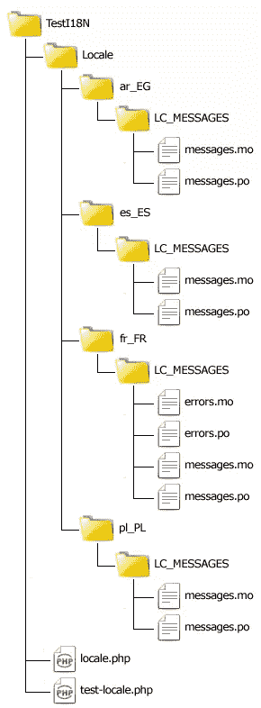
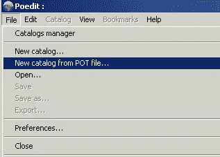
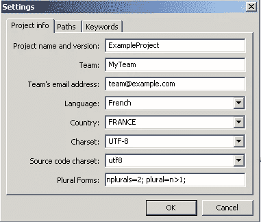
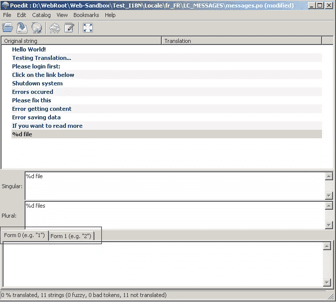

# 本地化 PHP 应用程序“正确的方法”，第 5 部分

> 原文：<https://www.sitepoint.com/localizing-php-applications-5/>

在[第 4 部分](https://www.sitepoint.com/localizing-php-applications-4)中，您学习了如何使用 gettext 处理开发人员可能面临的最复杂的本地化问题之一，复数形式。在这个五部分系列的最后一部分中，我将教您如何通过从应用程序的 PHP 代码中提取 msgids 并生成 PO 模板文件(`.pot`)来自动化部分本地化过程。让我们开始吧！

## 从源代码中提取字符串

您已经看到了 gettext 是多么强大，将本地化集成到您的应用程序中是多么容易。但是持续的维护呢？随着应用程序的成熟，文本字符串肯定会被添加、更新和删除。提取字符串用作 msgids 并手工组织它们是一项艰巨的任务，即使只有很小的代码库。这就是 xgettext 可以提供帮助的地方。

xgettext 是一个命令行工具，是您在第 1 部分中下载并安装的 gettext 库的一部分……确实是一个非常有用的工具！它的目的是简化从源代码中提取字符串并生成一个域模板，从而节省您的时间和精力。xgettext 不是特定于 PHP 的；您可以使用它从超过 15 种流行编程语言编写的代码中提取字符串，包括 C、C++、C#、Java、Perl、PHP 和 Python 等等。

在开始之前，确保您的 Test18N 目录是最新的，具有在本系列的前几部分中创建的以下结构。



打开`test_locale.php`并用以下代码替换其内容:

```
<?php
require_once "locale.php";

echo _("Hello World!") . "<br>";
echo _("Testing Translation...") . "<br>";
echo _("Please login first:") . "<br>";
echo _("Click on the link below") . "<br>";
echo _("Shutdown system") . "<br>";

echo '<a href="test_page_1.php">' . _("Go To Page 1") . "</a>";
```

然后，创建一个名为`test_page_1.php`的新文件，内容如下:

```
<?php
require_once "locale.php";

echo _("Errors occurred") . "<br>";
echo _("Please fix this") . "<br>";
echo _("Click on the link below") . "<br>";

echo dgettext("errors", "Error getting content") . "<br>";
echo dgettext("errors", "Error saving data") . "<br>";

echo '<a href="test_locale.php">' . _("Back To Home") . '</a>&nbsp;|&nbsp;<a href="test_page_2.php">' . _("Go To Page 2") . "</a>";
```

最后，创建一个名为`test_page_2.php`的新文件，内容如下:

```
<?php
require_once "locale.php";

echo _("If you want to read more") . "<br>";
echo _("Please login first:") . "<br>";

echo sprintf(ngettext("%d file", "%d files", 1), 1) . "<br>";
echo sprintf(ngettext("%d file", "%d files", 2), 2) . "<br>";
echo sprintf(ngettext("%d file", "%d files", 5), 5) . "<br>";

echo '<a href="test_locale.php">' . _("Back To Home") . '</a>&nbsp;|&nbsp;<a href="test_page_1.php">' . _("Go To Page 1") . "</a>";
```

现在，您应该有三个文件来模拟一个稍大的应用程序。就像现实世界中的应用程序一样，您会注意到一些消息在多个文件中重复出现。如果您要手动提取字符串，那么在创建翻译文件时，您必须对它们进行排序并删除任何重复的内容。

现在来看看自动化的魔力。打开终端窗口，转到`Test18N`目录，运行以下命令:

```
abouzekry@sandbox:~/htdocs/Test18N$ xgettext --from-code=UTF-8 -o messages.pot *.php
```

这指示 xgettext 从当前目录下的所有 PHP 文件中提取消息。默认情况下，xgettext 假设任何文件都是 ASCII，如果源字符串包含任何非 ASCII 字符，其输出可能会包含意外的结果。为了安全起见，我用`--from-code`选项覆盖了 UTF-8 的假设。`-o`选项指示 xgettext 将其输出写到一个名为`messages.pot`的文件中，这个文件是您不久将在所有翻译中使用的基础文件。

在继续之前，值得注意的是 xgettext 有一些限制。最明显的是，它将所有的字符串写入一个文件中(例如，`test_page_1.php`使用`dgettext()`在错误域中查找一些翻译，但是所有的字符串都被放入了`messages.pot`)。您可以只使用一个域，也可以将`messages.pot`分割成适当的文件。我真的喜欢有专门的翻译领域来组织一切，所以这是我在这里鼓励的方法。

将文件`messages.pot`复制为`errors.pot`并编辑`errors.pot`以删除所有消息，与错误域相关的消息除外。您应该只保留以下消息:

```
#: test_page_1.php:9
msgid "Error getting content"
msgstr ""

#: test_page_1.php:10
msgid "Error saving data"
msgstr ""
```

然后，编辑`messages.pot`从该文件中删除错误相关消息。

## 使用模板

现在您有了两个模板，一个用于消息域(`messages.pot`)，另一个用于错误域(`domain.pot`)。启动 Poedit，选择`File` > `New catalog from POT file`，打开`messages.pot`。



填写之前在[第 2 部分](https://www.sitepoint.com/localizing-php-applications-2)中概述的必要参数。我将创建一个使用 UTF-8 编码的法语目录。指定适当的复数形式表达式也很重要。对于法语，它是“n plurals = 2；复数= n>1；”。单击 OK 后，会要求您保存从模板创建的新 PO 文件。保存为相应的`Locale/fr_FR/LC_MESSAGES/messages.po`文件。



Poedit 然后打开 PO 文件并显示原始字符串及其翻译。您可以直接在 Poedit 中添加您的翻译，或者将文件发送给翻译人员，让他们在您专注于应用程序的 PHP 代码时继续工作。

顺便提一下，在 Poedit 的界面中处理复数形式很容易。当你点击翻译列表中的单数形式时，你会在每个形式的底部看到标签，你可以在其中输入适当的翻译。



为每个 msgid 提供翻译后，选择`File` > `Save`或点击图标栏中的`Save Catalog`条目，保存并生成所需的 MO 文件。然后对`errors.pot`做同样的程序，保存到`Locale/fr_FR/LC_MESSAGES/errors.po`。您需要为每种语言的每个模板重复这个过程。

当至少法语语言环境的 MO 文件就绪后，测试`test-locale.php`脚本以确保一切正常。

## 摘要

在本系列的最后一部分中，您学习了如何使用 xgettext 工具从 PHP 源文件中自动提取翻译字符串，生成 PO 模板文件。然后，该模板可以用于生成您需要的任何目标域目录，从而将繁琐的邮件提取过程留给计算机。

通过这五个部分，您已经了解了本地化如何仅仅是为目标语言环境编写单独的翻译文件，然后使用`gettext()`、它的简写别名`_()`和它的复数对应物`ngettext()`进行引用。您还看到了如何利用 gettext 的回退行为产生更可读的代码和翻译目录，以及如何将翻译整齐地组织到各自的域中(一般消息用`messages.po`，错误字符串用`errors.po`，等等)。).

我很喜欢写这个系列，感谢您花时间学习如何用 gettext“正确地”本地化您的 PHP 应用程序。gettext 真的是一个很棒的开源工具，它让你专注于代码，让你的生活变得更轻松。

<small>图片 via[sgame](http://www.shutterstock.com/gallery-62870p1.html "Stock Photos | Shutterstock: Royalty-Free Subscription Stock Photography & Vector Art")/[Shutterstock](http://www.shutterstock.com "Stock Photos and Royalty-Free Images by Subscription")</small>

## 分享这篇文章