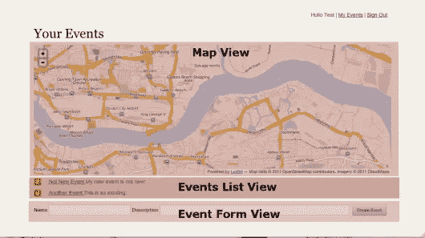

# 赌场:给活动一个支柱

> 原文：<https://www.sitepoint.com/loccasions-giving-events-a-backbone/>

[上次](https://www.sitepoint.com/loccasions-going-client-side-with-leaflet-backbone-and-jasmine/)我们设置了客户端代码并制作了地图。在本文中，我们将把事件集成到基于主干的客户机代码中，显示用户事件的集合。

## 事件视图

下面的截图来自上一篇文章，展示了我们如何将 events#index 视图分成多个主干视图:



脊梁看到了什么

我们已经处理了 MapView。让我们从 Events List 视图开始，它(您可能已经猜到了)只是列出事件的地方。事实上，这是我们的第一个测试:

```
describe("EventsListView", function() {

  describe("Rendering events", function() {
    beforeEach(function() {
      loadFixtures("eventList.html")
      this.eventView = new Backbone.View();
      this.eventViewStub = sinon.stub(App, "EventView")
        .returns(this.eventView);
      this.eventViewSpy = sinon.spy(this.eventView, "render");
      this.event1 = new Backbone.Model({id:1});
      this.event2 = new Backbone.Model({id:2});
      this.event3 = new Backbone.Model({id:3});
      this.view = new App.EventListView({collection:
        new Backbone.Collection([
          this.event1,
          this.event2,
          this.event3
        ])
      });
    });

    it("should add a list item for each event", function() {
      //Arrange
      // happening in beforeEach
      //Act
      this.view.render();
      //Assert
      expect(this.eventViewSpy).toHaveBeenCalledThrice();
    });
  });
});
```

为了测试我们的视图是否列出了事件，我们需要一个 DOM 元素来显示我们的视图和要列出的事件。fixture 文件(`eventList.html`)添加了我们的 DOM 元素，这是一个简单的无序列表(ul#eventsList)。EventListView 的职责是呈现事件列表，而不是呈现事件本身。

经验表明，EventView 可以处理单个事件的呈现。从这个测试的角度来看，我们并不真正关心 EventView 做什么，所以`window.EventView`被剔除了。在这一点上，我们可以监视存根的渲染方法，并确保每个事件调用一次。

习语的另一个主要观点是，一个视图既可以有一个集合，也可以有一个模型。在 EventListView 的情况下，我们传入一组假事件。

最后，我们可以实际测试视图。在我们的视图上调用`render()`函数，并确保每个事件项调用一次`eventView.render()`来完成测试。让它过去吧。

```
# app/assets/javascripts/views/eventListView.js.coffee
App.EventListView = Backbone.View.extend
  el: "#eventsList"
  initialize: () ->
  render: ->
    @clearList()
    @collection.each(@addEvent, @)
  clearList: ->
    $(@el).empty()
  addEvent: (ev) ->
      view = new App.EventView({model: ev})
      $(@el ).append(view.render().el)
```

视图代码很简单(如您所知，您在上面看到的是经过一点重构的)。`render`函数清除列表并将事件添加到视图的 DOM 元素中。

大概值得一提的是一个主心骨。集合(也就是`@collection`是什么)也是一个[下划线](http://documentcloud.github.com/underscore/)集合。因此，该系列现在有许多方便的功能，如上面的`each`。时髦。

## 深入查看事件视图

即使我们的测试通过了，列表视图代码中对 EventView 的引用也需要解决。让我们编写一个测试来创建这个视图。下面的测试是几个红绿重构会议的结果，它暴露了一个有点大的问题。

```
describe("EventView", function() {
  describe("render", function() {
    beforeEach(function() {
      //Arrange
      this.templateProviderStub = sinon.stub(App.TemplateProvider, "applyTemplate");
    });
    afterEach(function() {
      this.templateProviderStub.restore();
    });
    it("should call for the list_item template", function() {
      //Arrange
      var ev =  new Backbone.Model();
      var view = new App.EventView({model:ev})

      //Act
      var el = view.render();

      //Assert
      expect(this.templateProviderStub).toHaveBeenCalled();
    });
  });
});
```

## 有点像 Madlibs，但是对于 Javascript 生成的 HTML

看看这个测试，你会发现我正在测试视图是否调用了`applyTemplate`来调用 *App。模板提供者*。因为在 javascript 中包含大量 HTML 是不可行的，所以大多数主干应用程序最终都使用模板。本质上，它就像 ERB 或 HAML，但对于 javascript。

目前有几十亿个模板框架，但我在这里只列举几个:

*   [小胡子](http://mustache.github.com/)，似乎很流行。
*   jQuery 模板为狂热的 jQuery 爱好者准备的。
*   下划线也有一个模板框架。

我走了一条不同的路线。我在服务器上为我的 Rails 视图模板使用 HAML，所以我不想引入另一种模板语言。我认为某处某个人已经为 javascript 创建了一个 HAML 模板方法。事实证明，我(有点)是对的。

请允许我介绍，[哈默-咖啡](https://github.com/9elements/haml-coffee)。haml-coffee 允许您使用 haml 创建 javascript 模板，这些模板放在客户端的一个`HAML.templates`对象中。

(注:haml-coffee 似乎已经被 [haml-coffee-assets](https://github.com/netzpirat/haml_coffee_assets) 取代。直到这篇文章的草稿完成后，我才知道这一点。虽然我以后可能会回来使用 haml-coffee-assets，但在本文发布之前，我并没有进行修改。)

简而言之，我为我的模板创建了一个**app/assets/JavaScript s/templates**目录。在**模板**目录下，我创建了一个**事件**文件夹，在该目录下放置了一个 **line_item.js.haml-coffee** ，内容如下:

```
%span.del_form
  %div
    %form.button_to{:method => "post", :action => "/events/#{@id}"}
      %input{:name => "_method", :type => "hidden", :value => "delete"}
      %input{:data-confirm => "Are you sure?", :type => "submit", :value => "X" }
  %div.clear
%span.event_name
  %a{:href => "/events/#{@id}/edit"}= @name
%span.event_details
  %a{:href => "/events/#{@id}"}"Show Details"
%span.event_descript
```

为了将该模板应用到客户机上的主干模型，您需要执行以下操作:

```
window.HAML.templates.events.line_item(model.attributes);
```

我觉得那很漂亮，很危险。

我需要解释的 EventView 测试的下一点是`App.TemplateProvider`存根。这个对象的诞生是为了处理模板对模型的应用，我并不认为这是模型的责任。此外，将模板应用程序抽象为另一个对象允许我干净地测试我的视图代码。

目前，该应用程序。TemplateProvider 代码再简单不过了:

```
# app/assets/javascripts/lib/templateProvider.js.coffee
App.TemplateProvider =
  applyTemplate: (object_type, template_name, object) ->
    window.HAML.templates[object_type][template_name](object.attributes)
```

这可能会在以后被重构，但是现在就可以了。我们的规格通过，但如果我们运行服务器，我们看不到任何现有的事件。

## 模特合集(注:听起来比实际更性感)

在我们的视图测试中，我们已经发现了我们对业务对象的依赖性。然而，我们需要找出这些依赖背后的真实对象。让我们从事件模型开始。

在规范中，我测试了我们的属性(名称和描述)、一些验证以及 url 属性可以改变的方式:

```
# spec/javascripts/models/event_spec.js
describe("Event model", function() {
  beforeEach(function() {
      this.event = new App.Event({
        name: "New Event",
        description: "My Jasmine Event"
      });
  });
  describe("when instantiated with attributes", function() {
    it("should have a name and description", function() {
      expect(this.event.get("name")).toEqual("New Event");
      expect(this.event.get("description")).toEqual("My Jasmine Event");
    });
  });
  describe("when saving", function() {
    it("should not save when name is empty", function() {
      var eventSpy = sinon.spy();
      this.event.bind("error", eventSpy);
      this.event.save({"name":""});
      expect(eventSpy.calledOnce).toBeTruthy();
      // Make sure it passes in the event
      expect(eventSpy.args[0][0].cid).toEqual(this.event.cid);
      expect(eventSpy.args[0][1]).toEqual("must have a valid name.");
    });
  });
  describe("url", function() {
    it("should have a value if model is not part of a collection", function() {
      expect(this.event.url()).toEqual("/events");
    });
    it ("should reflect the collection url if part of a collection", function() {
      var collection = {
        url: "/loccasions"
      };
      this.event.collection = collection;
      expect(this.event.url()).toEqual("/loccasions");
    });
  });
});
```

有了规格，让我们让它们通过:

```
# app/assets/javascripts/models/event.js.coffee

__super = Backbone.Model.prototype

App.Event = Backbone.Model.extend
  url: ->
    if (this.collection)
      return __super.url.call(@)
    else
      if this.id? != undefined then "/events" else "/events/" + @id
  validate: (attrs)->
    if !attrs.name
      "must have a valid name."
```

这里最有趣的一点是如何处理 url，如果模型在集合中，就委托给`__super`。

## 实际馆藏建设

跳回 EventsListView，它期待一个集合。在我们的事件模型测试中，我们只是模拟了一个集合，但是当我们查看真实的站点时，我们需要一个真实事件的真实集合(真的)。在 Backbone 中，这意味着我们需要一个 EventsListView 将消费的 EventsCollection。测试:

```
describe("EventsCollection", function() {
  beforeEach(function() {
    this.eventStub = sinon.stub(App, "Event");

    this.model = new (Backbone.Model.extend({
      idAttribute: "_id"
    }))
    ({
      _id: 5,
      name: "Test Event"
    });
    this.eventCollection = new App.EventsCollection();
    this.eventCollection.add(this.model);
  });

  afterEach(function() {
    this.eventStub.restore();
  });

  it("should add a model", function() {
    expect(this.eventCollection.length).toEqual(1);
  });

  it("should find a model by id", function(){
    expect(this.eventCollection.get(5).id).toEqual(5);
  });
});
```

如果你读过 Jim Newberry 关于测试主干的系列文章(我之前已经链接过了)，这个测试看起来和他的集合测试一模一样，除了一个小细节。

明眼人可能已经注意到，我们的 *id* 属性实际上是 *_id* 。MongoDB 使用 *_id* 作为它的标识符，所以这就是我们将在 json 中看到的。你可以告诉一个主干模型为标识符使用不同的属性，在你的模型上使用`idAttribute`属性，我在上面的`beforeEach`中就是这么做的。我还将其添加到事件模型中，如下所示:

```
App.Event = Backbone.Model.extend
  idAttribute: "_id"
  url: ->
    if (this.collection)
  ... elided ...
```

为了完整起见，我在我的*spec/JavaScript/models/event _ spec . js*中添加了下面的`describe`块

```
describe("id", function() {
  it("should use _id for the id attribute", function() {
    var ev = new App.Event({_id:44, name: "MongoEvent"});
    expect(ev.id).toEqual(44);
  });
});
```

从事件模型中移除`idAttribute`会导致规范失败，将它放回给我们一个通过的规范。我们有一个工作聚会。

## 关于路线的一切(r)

在引导客户端代码之前，我们需要做的最后一件事是路由器。对于我们目前的需求来说，路由器很简单。我们将拥有的只是一条""路线，它需要创建我们的三视图，以及我们的事件集合。按照标准做法，我们将有一个到名为`index`的函数的“路线图”。

```
// spec/javascripts/routers/router_spec.js

describe("App.Router", function() {
  describe("routes", function() {
    beforeEach(function() {
      this.router = new App.Router();
      this.routeSpy = sinon.spy();
      try {
        Backbone.history.start({silent: true});
      } catch(e) {
        console.dir(e);
      }
      this.router.navigate("away");
    });
    it("should map the blank route to index", function() {
      this.router.bind("route:index", this.routeSpy);
      this.router.navigate("", true);
      expect(this.routeSpy).toHaveBeenCalledOnce();
      expect(this.routeSpy).toHaveBeenCalledWith();
    });
  });
});
```

我们的路由器测试(也非常类似于 Newberry 先生的路由器测试)通过了，代码如下:

```
# app/assets/javascripts/router.js.coffee
App or= {}
App.Router = Backbone.Router.extend
  routes:
    ""      : "index"
  index: ->
```

路由器需要创建我们的三视图。

```
describe("index", function() {
  beforeEach(function() {
    this.router = new App.Router();
    this.eventListView = new Backbone.View({});
    this.eventListViewSpy = sinon.stub(App, "EventListView").returns(this.eventListView);
  });

  afterEach(function() {
    App.EventListView.restore();
  });

  it("should create the EventListView", function() {
    this.router.index();
    expect(this.eventListViewSpy).toHaveBeenCalled();
  });
});
```

让它过去:

```
index: ->
    @eventListView = new App.EventListView({collection: window.eventCollection or= new App.EventsCollection()})
    @eventListView.render()
```

创建 EventListView，并传入 window.eventCollection(如果存在)。

这些客户端测试的流程应该开始变得熟悉了。在这种情况下，我们存根要创建的视图，然后确保其构造函数被调用。当然，我们通过恢复存根来清理自己。我还为地图视图添加了一个测试，但是这留给您自己去做。(注:地图视图测试有点不一样…知道为什么吗？)

## 你被踢过脸吗，用的是铁靴带？

此时，用于显示事件的大部分视图/模型/集合代码已经就绪。然而，当我们在浏览器中加载页面时，我们仍然看不到这些事件。我们需要引导我们的主干代码。在顶层应用程序对象(本例中为`App`)上创建一个名为`start`的函数，并将引导代码放在那里，这是相当常见的主干习语。

对于主干应用程序，引导意味着创建路由器，确保所有需要的集合都在适当的位置，并启动 *Backbone.history* 对象。Loccasions 与我见过的大多数主干应用程序之间的一个微小区别是，我们的“根”路径不是“/”，而是“/事件”，这需要我们进行配置。

知道了所有这些，`App.start`函数看起来像:

```
window.App =
  start: ->
    window.eventCollection = new App.EventsCollection(bootstrapEvents)
    new App.Router()
    Backbone.history.start
      root: "/events"
```

我们唯一没有讨论的是`bootstrapEvents`。处理集合时的一个决策点是，是否将它们与页面一起加载，或者加载页面并启动一个`fetch`来充实集合。在这里，我做的是前者，这意味着我必须改变我的`events#index`观点来创造和水合`bootstrapEvents`。变化很简单:

```
/ app/views/events/index.html.haml

%script
  var bootstrapEvents = [];
%h2 Your Events
#map.sixteen_columns
%ul#eventsList
  - for event in @events
    %script
      bootstrapEvents.push(new App.Event({ name: "#{event.name}", description: "#{event.description}:", id: "#{event._id}", }));
    %li{:class => @event == event ? :selected : nil}
      = render :partial => "event", :locals => {:event => event}
      %div.clear
%div#edit_event
  = form_for @event || Event.new do |f|
    = f.label :name
    = f.text_field :name
    = f.label :description
    = f.text_field :description
    = f.submit
```

简而言之，我添加了两个`%script`标签来创建`bootstrapEvents`对象。

我不确定我是否喜欢以这种方式将这些东西混合到视图中，但是我确实喜欢节省一次到服务器的旅程。我猜我稍后会回到这段代码中。

最后，我将对`App.start`的调用添加到我的应用程序中:

```
// app/assets/javascripts/application.js
// Last line of the file
$(App.start)
```

## 太好了，但我还是不能添加活动

这些关于主干/客户端代码的帖子似乎比我预期的要长得多。下一篇文章将讨论添加和编辑事件。我希望也能涵盖各种场合的客户端。

## 分享这篇文章