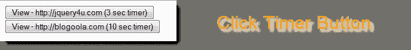
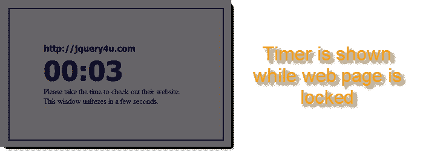

# 使用 jQuery 锁定/冻结网页

> 原文：<https://www.sitepoint.com/lock-freeze-web-page-jquery/>

本教程向您展示了如何为您的 web 页面设置一个 jQuery 定时器，以便在指定的时间长度内锁定界面。





在这个例子中，当用户点击打开网站时，它在另一个窗口/标签中打开，并且原始网页被冻结指定的时间长度。这是因为我希望用户在新窗口/标签中查看网站，锁定源网页意味着他们被迫等待，可能更倾向于查看打开的窗口。

[下载源文件](https://www.sitepoint.com/wp-content/uploads/jquery4u/2011/01/demo.zip)
下载网址:https://www . site point . com/WP-content/uploads/jquery 4u/2011/01/demo . zip

## 为什么要锁定网页？

您可以阻止用户点按任何网页按钮

*   直到网页完成加载
*   直到 AJAX 脚本完成加载
*   直到弹出窗口完成加载

## 如何冻结网页？

1.  包括 jquery 文件:jquery.min.js、jquery.uilock.js
2.  包括下面的 jQuery 代码
3.  编辑 jQuery 以获得您想要的锁定效果
4.  编辑 html 以包含代码(下面将详细解释)
5.  自定义 css 样式以获得您想要的外观

## jQuery 代码

```
//function to open url a new window/tab
function load_url(url) {
	var load = window.open(url);
}
```

```
//function to show the countdown in seconds until the web page is unfrozen (active) again
function do_countdown(duration) {
	//10 seconds fix
	start_num = duration;
	var countdown_output = document.getElementById('countdown_div');
	if (start_num &gt; 0) {
		countdown_output.innerHTML = format_as_time(start_num);
		var t=setTimeout("update_clock("countdown_div", "+start_num+")", 1000);
	}
	return false;
}
```

```
//helper function to update the timer on the web page this is frozen
function update_clock(countdown_div, new_value) {
	var countdown_output = document.getElementById(countdown_div);
	var new_value = new_value - 1;

	if (new_value &gt; 0) {
		new_formatted_value = format_as_time(new_value);
		countdown_output.innerHTML = new_formatted_value;

		var t=setTimeout("update_clock("countdown_div", "+new_value+")", 1000);
	} else {
		//finish!
		countdown_output.innerHTML = "";
		$('#countdown_box').hide();

		//unlock UI
		$.uiUnlock();

		//perform anything here after the web page is unfrozen
	}
}
```

```
//helper function to calculate the time (seconds) remaining as minutes and seconds
function format_as_time(seconds) {
	var minutes = parseInt(seconds/60);
	var seconds = seconds - (minutes*60);

	if (minutes &lt; 10) {
		minutes = "0"+minutes;
	}

	if (seconds &lt; 10) {
		seconds = "0"+seconds;
	}

	var return_var = minutes+':'+seconds;
	return return_var;
}
```

```
//main function to load the new website and start the countdown
function view_blog_countdown(blog_url, duration) {
	load_url(blog_url);
	$('#countdown_box').show(); //countdown
	$('#countdown_title').html(blog_url);
	$.uiLock('');
	do_countdown(duration); //performs countdown then unlocks
}
```

## jQuery UI 锁定代码

在这段代码中，你可以自定义冻结网页的外观。

```
(function($) {
	$.extend({
uiLock: function(content){
			if(content == 'undefined') content = '';
			$('&lt;div&gt;&lt;/div&gt;').attr('id', 'uiLockId').css({
				'position': 'absolute',
				'top': 0,
				'left': 0,
				'z-index': 1000,
				'opacity': 0.6,
				'width':'100%',
				'height':'100%',
				'color':'white',
				'background-color':'black'
			}).html(content).appendTo('body');
		},
uiUnlock: function(){
			$('#uiLockId').remove();
		}
	});
})(jQuery);
```

```
//funciton to initialise a click event for the webpage buttons
$(document).ready(function() {
	$('#lock').click(function(){
		//show content
		$('#countdown_box').show(); //countdown

		//lock interface
		$.uiLock('');

		//start the countdown (unlocks interface at end)
		do_countdown();
	});

	//Initial settings
	$('#countdown_box').hide();
});
```

## HTML 代码

```
 &nbsp;
	&nbsp;
	Please take the time to check out their website. This window unfrezes in a few seconds.

<input type="button" onclick="javascript:view_blog_countdown('http://jquery4u.com','3')" value="View Blog - http://jquery4u.com (3 second timer)">

<input type="button" onclick="javascript:view_blog_countdown('http://blogoola.com','10')" value="View Blog - http://blogoola.com (10 second timer)"> 
```

## CSS 代码

```
#countdown_box {
position:absolute;
top:32%;
left:32%;
width:300px;
border:3px solid blue;
padding:70px;

overflow: hidden;
text-overflow: ellipsis;
}
#countdown_title {
font-family: tahoma;
font-weight: bold;
colour: blue;
font-size: 18px;
}
#countdown_div {
font-family: tahoma;
font-weight: bold;
font-size: 56px;
}
```

## 分享这篇文章